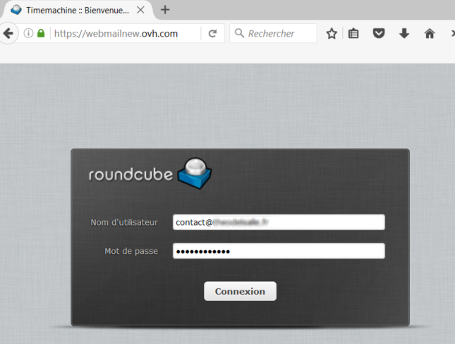
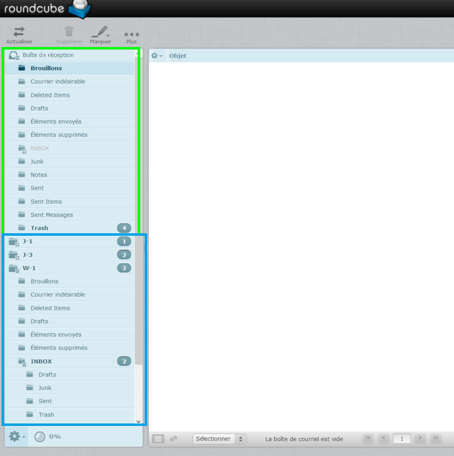
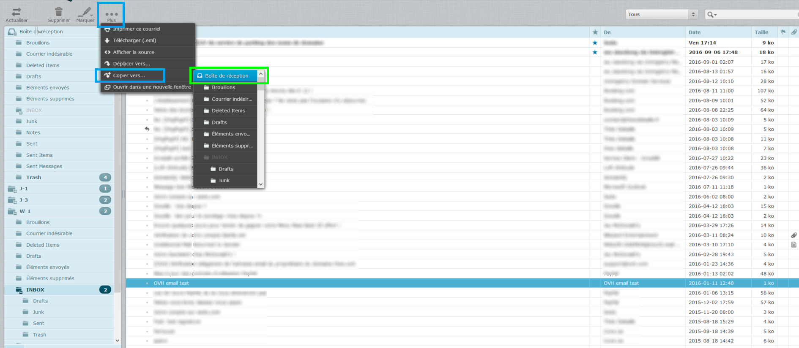

## Généralités

### Prérequis

- Un compte e-mail actif.
- Accès à la [Time Machine OVH](http://webmailnew.ovh.com/){.external} .

### Description

La [Time Machine OVH](http://webmailnew.ovh.com/){.external} vous permet d'accéder à une sauvegarde de votre boîte e-mail mutualisé à 3 dates différentes :

- J-1
- J-3
- Semaine -1

> [!warning]
>
> La Time Machine n'est pas disponible sur le datacenter de Gravelines. Si vos mails sont sur ce datacenter la récupération ne sera pas possible.
> 

## Utilisation

### Connexion a la Time Machine
- Rendez-vous sur la Time Machine OVH à l'adresse [http://webmailnew.ovh.com](http://webmailnew.ovh.com/){.external} .
- Indiquez votre adresse e-mail et votre mot de passe , puis cliquez sur "**Connexion**".

{.thumbnail}

### Acces aux sauvegardes
Une fois la page complètement chargée, il vous sera possible de visualiser dans le menu de gauche votre boîte e-mail actuelle, ainsi que les sauvegardes (J-1, J-3, W-1).

{.thumbnail}

### Recuperation d'un e-mail supprime
- Choisissez ensuite le jour de la sauvegarde voulue, afin d'accéder à l'e-mail désiré. Dans notre cas nous voulons restaurer l'e-mail intitulé "**OVH email test**" du **2016-01-11** présent dans le dossier "**INBOX**" de la sauvegarde **W-1**.
- Il vous suffit de cliquer sur l'e-mail à restaurer. Puis, cliquez en haut sur "**... Plus**" puis sur "**Copier vers...**" et cliquez sur votre boîte de réception actuelle.

{.thumbnail}

### Verification
- Une fois l'e-mail déplacé, nous pouvons constater qu'une copie de l'e-mail est mis en place dans le dossier voulu.

{.thumbnail}

> [!success]
>
> Il vous est également possible d'en déplacer plusieurs en même temps si
> vous en sélectionnez plusieurs avec la touche CTRL.
> 