L'aventure mypersonaldomain.ovh est sur le point de commencer. Les équipes de développement sont au travail pour réaliser le site de petites annonces. En attendant que le site soit prêt, l'équipe de communication a décidé d’ouvrir un blog pour parler du projet.

Sur ce blog, l’équipe parlera des coulisses du développement du site, ainsi que des actualités plus marketing ; présence sur des événements, révélation des nouvelles fonctionnalités, etc.

Après la lecture du [jour 2](../day02/){.ref}, l’équipe a décidé d’ouvrir le blog sur le sous-domaine blog.mypersonaldomain.ovh, mais aussi d’enregistrer le domaine rondcoin.tech  et de le rediriger vers le blog.

> [!warning]
>
> Ce tutoriel vous présente l’utilisation d’une ou de plusieurs solutions OVH avec des outils externes et vous décrit des manipulations réalisées dans un contexte précis. Pensez à les adapter en fonction de votre situation !
>
> Si vous rencontrez des difficultés lors de ces manipulations, nous vous invitons à faire appel à un prestataire spécialisé et/ou à poser vos questions à notre communauté sur <https://community.ovh.com/>. OVH ne sera pas en mesure de vous fournir une assistance.
>

## Quelle technologie de blog choisir ?
L’équipe de Rondcoin a longuement débattu de la technologie de blog à utiliser. Il en existe beaucoup en open source que les équipes peuvent installer sur un hébergement web OVH.

Parmi ces choix, il y a la plateforme de blog la plus utilisée au monde : WordPress ([https://wordpress.org/](https://wordpress.org/){.external}). Ce logiciel (appelé CMS pour système de gestion de contenu en anglais) est open source : c’est-à-dire que vous pouvez l’installer librement, sans frais, mais aussi participer à la communauté pour en améliorer le code source. WordPress représente près de 60 % du marché des logiciels dédié la réalisation de site web.

Cela lui fournit un avantage de taille : la communauté qui travaille autour de ce moteur de blog est très importante, la documentation disponible est très riche, et de nombreux thèmes graphiques (habillages du site) et extensions (pour ajouter des fonctionnalités à votre site) sont disponibles sur Internet, gratuitement ou contre quelques euros. Attention toutefois à certaines extensions, qui contiennent de grosses failles de sécurité et rendent vos sites vulnérables. Avant de choisir une extension, faites quelques recherches sur Internet et dans le doute, optez pour les extensions les plus populaires (les plus téléchargées), elles sont en général mieux sécurisées.

L’équipe a choisi WordPress pour les raisons que nous avons évoquées ci-dessus, mais aussi parce que personne dans l’équipe de développeurs ne veut consacrer de temps à déployer et maintenir un moteur de blog, ce qui a beaucoup moins d’intérêt pour l’entreprise que de rassembler tous les efforts sur le développement du site lui-même et des fonctionnalités exclusives qui vont faire la différence avec les concurrents. Sur un blog, ce sont avant tout les contenus qui présentent un intérêt.

## Comment installer un blog avec OVH ?
Sur les hébergements web d’OVH, il est possible de demander [l’installation automatique de WordPress](https://www.ovhcloud.com/fr/web-hosting/uc-wordpress-website/){.external}. C’est la fonctionnalité appelée **module en 1 clic**. D’ailleurs, si vous souhaitez ouvrir uniquement un blog, vous pouvez demander à ce que votre hébergement web soit livré directement avec WordPress lors de la commande initiale.

OVH propose aussi d’autres modules en 1 clic :

- **Prestashop**, qui est une plateforme de e-commerce. Si vous souhaitez ouvrir votre boutique en ligne, il suffit de demander l’installation de Prestashop et vous pourrez directement configurer votre site avec vos produits, et les vendre seulement quelques heures après la commande de l’hébergement web ;
- **Joomla**, qui est l’un des CMS les plus utilisés après WordPress ;
- **Drupal**,  qui est un CMS utilisé pour des projets web un peu complexes, car il présente l’avantage d’être en grande partie programmable.

Vous retrouverez plus d’informations sur ces différents modules sur la page : [https://www.ovhcloud.com/fr/web-hosting/uc-website/](https://www.ovhcloud.com/fr/web-hosting/uc-website/){.external}

Revenons quelques instants à notre site de petites annonces. Il nous faut maintenant configurer le sous-domaine *blog.mypersonaldomain.ovh* qui va pointer vers notre futur blog. Pour cela, il faut configurer un nouveau **multisite**, c’est-à-dire un nouveau site web sur notre hébergement.

### Configurer le multisite blog.mypersonaldomain.ovh
Tout se passe au sein de l’espace client d’OVH :

- Connectez-vous avec vos identifiant et mot de passe sur l'[espace client OVHcloud](https://www.ovh.com/auth/?action=gotomanager&from=https://www.ovh.com/fr/&ovhSubsidiary=fr)
- Dans le menu, vous retrouverez votre hébergement web dans la rubrique **Hébergements**, avec le domaine que vous avez commandé simultanément. Pour nous, il s’agit de **mypersonaldomain.ovh**

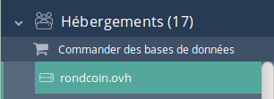{.thumbnail}

- Rendez-vous ensuite dans l’onglet **Multisite** afin de configurer ce nouveau site web. Puis cliquez sur **Ajouter un domaine ou un sous-domaine**

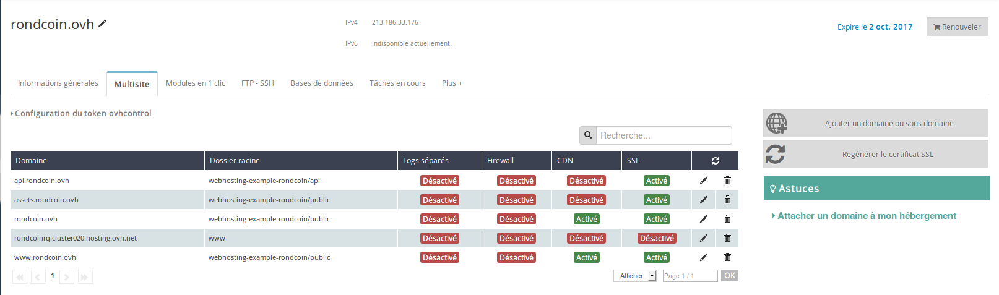{.thumbnail}

- Dans la première étape, indiquez le nom de domaine utilisé pour le nouveau site web. Ici, il s’agit de mypersonaldomain.ovh

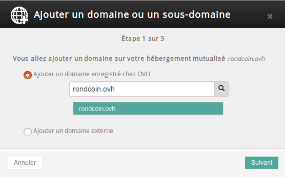{.thumbnail}

- Dans la seconde étape, indiquez le sous-domaine que vous souhaitez utiliser. Ne renseignez rien s’il s’agit d’un site avec un nom de domaine différent. Nous indiquons le dossier racine **./blog/** afin que les codes de notre blog n’entrent pas en conflit avec les codes de notre site de petites annonces. Pour les options, nous reviendrons plus en détail sur chacune d’entre elles dans les jours à venir.

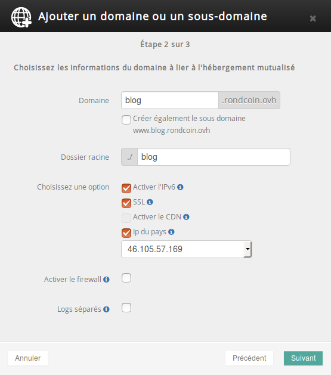{.thumbnail}

- Vérifiez les informations récapitulées à l’étape 3, puis validez. Ensuite, il faut entre 15 minutes et deux heures pour que les configurations soient propagées sur nos serveurs web et les serveurs DNS du monde entier. Après quoi tous les internautes pourront se connecter à votre blog.

[http://blog.mypersonaldomain.ovh/](http://blog.mypersonaldomain.ovh/){.external} est prêt, mais ne contient rien. Il est temps de déployer WordPress automatiquement.

### Installer le blog en 1-clic
Tout se fait encore une fois depuis l’espace client des hébergements web dans **mypersonaldomain.ovh**.

- Rendez-vous dans l’onglet **Modules en 1 clic**. Vous y retrouvez tous les modules déjà installés.

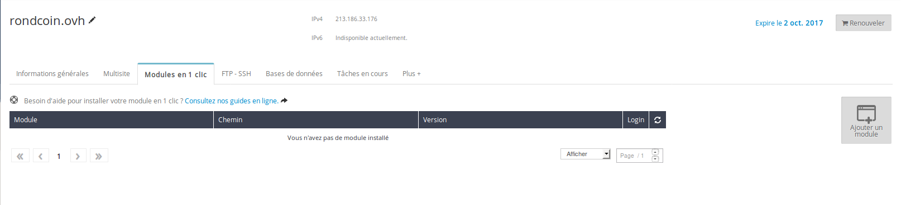{.thumbnail}

- Cliquez sur **Ajouter un module**, puis sélectionnez **WordPress** et le multisite **blog.mypersonaldomain.ovh**. Cliquez sur **Valider**, l’installation se fera automatiquement.

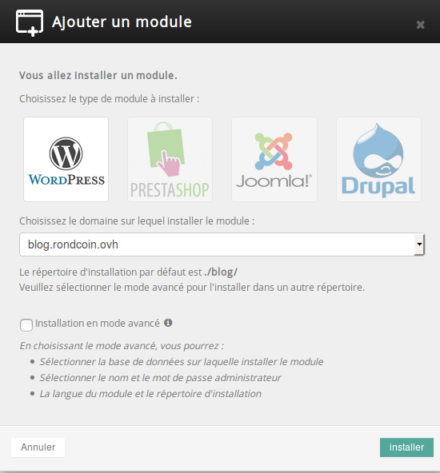{.thumbnail}

- Lorsque l’installation est terminée, vous recevez un e-mail contenant vos identifiants de connexion. C’est au tour de l’équipe de communication de rédiger le premier article !

### Ecrire le premier article
NB : cet article n’a pas vocation à expliquer le fonctionnement global de WordPress. Nous en donnons juste un très rapide aperçu. Vous trouverez une documentation de qualité sur le site : [https://codex.wordpress.org/fr:Accueil](https://codex.wordpress.org/fr:Accueil){.external}

- Pour écrire un article, connectez-vous sur l’interface de WordPress avec vos identifiants.

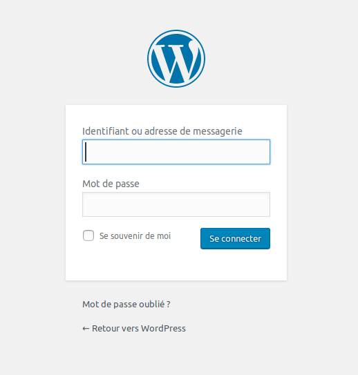{.thumbnail}

- Allez dans **Articles**, puis cliquez sur **Ajouter**. L’interface d’édition d’article s’ouvre. Rédigez votre article puis cliquez sur **Publier**.

{.thumbnail}

- Félicitations, votre premier article est en ligne ! N’oubliez pas de personnaliser la configuration de votre blog.

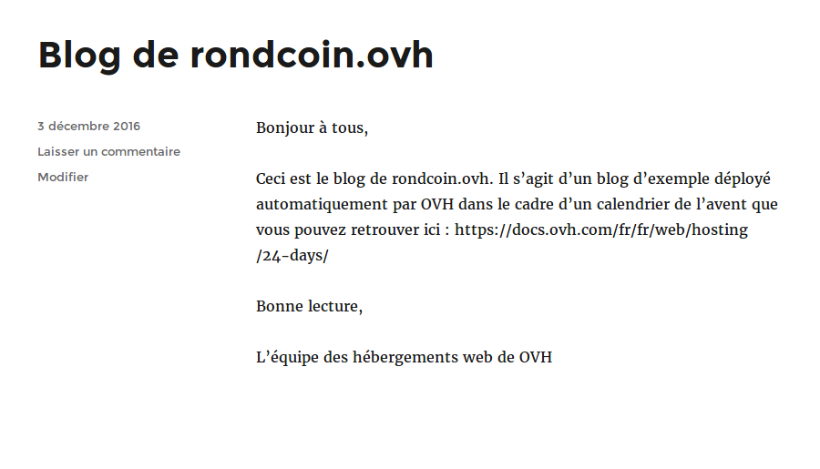{.thumbnail}

## Configurer la redirection depuis rondcoin.tech
Maintenant que notre blog est en ligne, il ne nous reste plus que la redirection depuis **rondcoin.tech** à mettre en place.

Nous allons utiliser une redirection permanente. Ce type de redirection permet aux moteurs de recherche et aux navigateurs de garder en mémoire qu’il y a une redirection, et ainsi, d’accélérer le chargement des sites web.

Ce type de redirection est défini dans le procotole HTTP, qui est le protocole permettant l’échange des pages web entre le navigateur et le serveur. Afin de signaler ce type de redirection, le serveur retourne un code précis : 301.

OVH gère tout cela à votre place, et vous pouvez configurer une redirection 301 directement depuis votre espace client.

- Pour cela, rendez-vous dans **rondcoin.tech** dans la rubrique “Domaines” du menu, puis cliquez sur l’onglet **Redirections**.

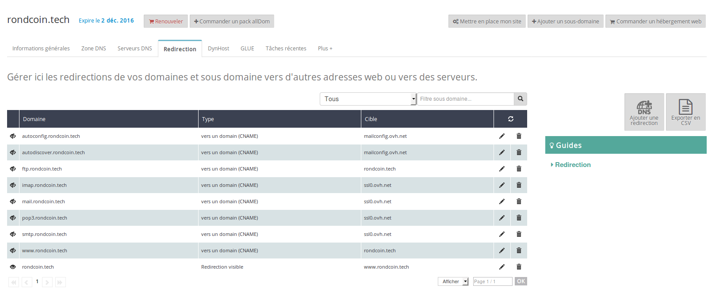{.thumbnail}

- Cliquez sur **Ajouter une redirection**, puis sélectionnez **Rediriger aussi www.rondcoin.tech**.

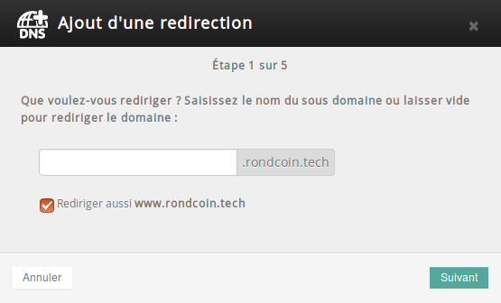{.thumbnail}

- Sélectionnez **vers une adresse web** puis passez à l’étape suivante.

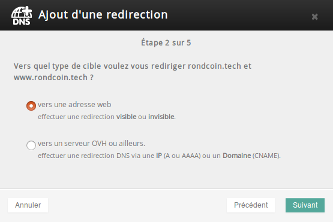{.thumbnail}

- Sélectionnez **avec une redirection visible** puis passez à l’étape suivante.

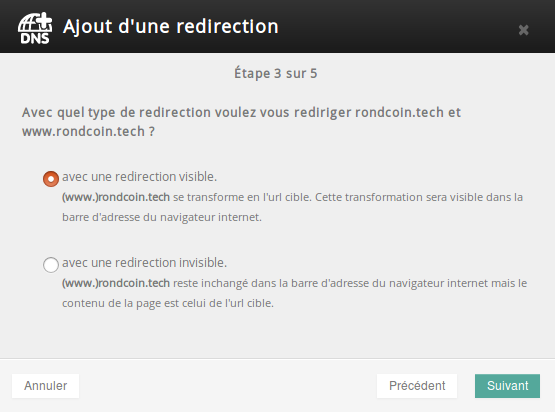{.thumbnail}

- Sélectionnez la **redirection permanente** puis entrez l’adresse du blog **http://blog.mypersonaldomain.ovh**. Puis passez à l’étape suivante.

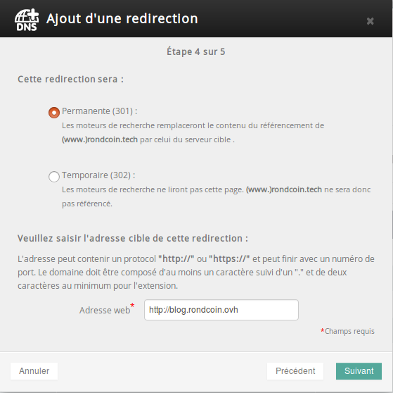{.thumbnail}

- Validez les changements. Ces derniers écrasent la configuration par défaut du nom de domaine. Sélectionnez la case pour confirmer puis passez à l’étape suivante.

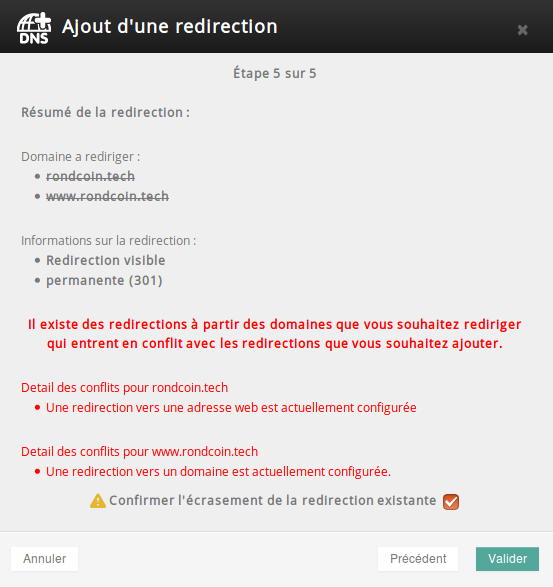{.thumbnail}

La propagation de la configuration DNS peut prendre entre cinq minutes et quelques heures en fonction du cache DNS des différents fournisseurs d’accès à Internet. Une fois que ceux-ci seront à jour, l’adresse [http://rondcoin.tech](http://rondcoin.tech){.external} redirigera vers [http://blog.mypersonaldomain.ovh](http://blog.mypersonaldomain.ovh){.external}

L’équipe de communication du Rondcoin est plutôt fière d’avoir terminé la mise en place du blog et travaille désormais à la rédaction de contenu. Cependant, le site n’est pas encore en ligne et mypersonaldomain.ovh redirige toujours vers une page par défaut de OVH. Nous verrons demain comment [mettre en ligne le site](../day05/){.ref} que l’on a développé en utilisant FTP.

À demain

| Article précédent | Article suivant |
|---|---|
| [Choisir un hébergement web qui me correspond](https://docs.ovh.com/fr/hosting/24-days/day03/) | [Mettre en ligne son site avec FTP](https://docs.ovh.com/fr/hosting/24-days/day05/) |