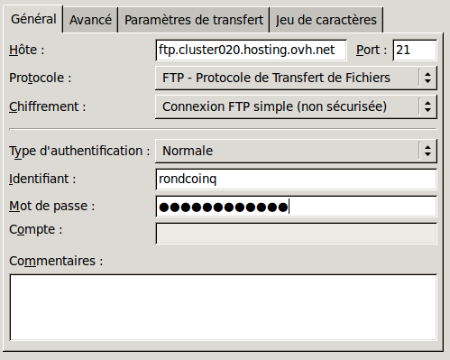
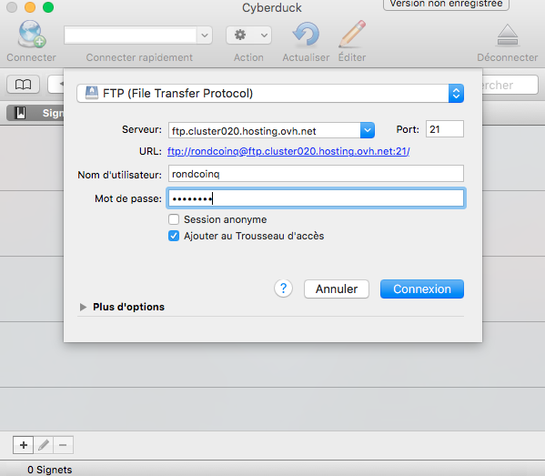

Le blog de mypersonaldomain.ovh est en place, les équipes communication ont rédigé le premier billet du blog et il va parler de la révolution à venir dans les sites de petites annonces... Sauf que la page d'accueil de mypersonaldomain.ovh n'est pas encore prête. Il est temps de mettre en ligne notre page d'attente !

Lorsque vous achetez un nom de domaine avec un hébergement web chez OVH, une page temporaire est mise en place tant que vous n’avez pas publié votre site. Bien entendu, promouvoir son site avant même de le mettre en ligne et de le personnaliser ne paraît pas très professionnel... C’est pour cela que mypersonaldomain.ovh a décidé de mettre en ligne une page d’accueil temporaire en attendant sa sortie officielle.

> [!warning]
>
> Ce tutoriel vous présente l’utilisation d’une ou de plusieurs solutions OVH avec des outils externes et vous décrit des manipulations réalisées dans un contexte précis. Pensez à les adapter en fonction de votre situation !
>
> Si vous rencontrez des difficultés lors de ces manipulations, nous vous invitons à faire appel à un prestataire spécialisé et/ou à poser vos questions à notre communauté sur <https://community.ovh.com/>. OVH ne sera pas en mesure de vous fournir une assistance.
>

## Créer sa premiere page web
Lors du [premier jour](../day01/){.ref} de ce calendrier, nous avons vu que le serveur retourne des documents que le navigateur est en mesure d’interpréter. Généralement, il utilise trois langages :

- **Le HTML** qui est un langage de description du contenu. Il permet de différencier les titres, les images, les liens, les textes, les listes à puces entre eux. C’est le format historique du Web ; à la base, ce langage est dépourvu tout élément graphique. Si vous n’affichez que du HTML, votre contenu sera brut !
- **Le CSS** est un langage permettant d’appliquer des styles sur le code HTML. C’est ce langage qui permet aux développeurs de sites web de rendre vos sites jolis (et de mettre en application les souhaits des graphistes).
- **Le javascript**. Ce langage est optionnel lors de la [réalisation d’un site web](https://www.ovhcloud.com/fr/web-hosting/uc-website/){.external} : il peut très bien fonctionner sans. Il permet d’ajouter de l’interactivité dans une page web. Historiquement, il était surtout utilisé pour valider les contenus des formulaires sans nécessiter de faire une nouvelle requête auprès du serveur. Désormais, il est bien plus utilisé : que ce soit pour récupérer de nouvelles informations auprès du serveur (rafraichissement automatique de la page par exemple), ou bien pour exploiter de nouvelles fonctionnalités des navigateurs (utilisation de la webcam par exemple).

Nous aurions très bien pu rédiger un calendrier de l’avent complet sur ces technologies tant le sujet est vaste. Mais il existe de très bons cours en ligne pour de se former rapidement, et de manière autonome, sur le sujet.

Ainsi, nous avons choisi de vous fournir le code créé pour la page d’accueil temporaire de mypersonaldomain.ovh. Il est téléchargeable à cette adresse: [https://download.mypersonaldomain.ovh/day05.zip](https://download.mypersonaldomain.ovh/day05.zip){.external}

Cette archive comprend deux fichiers :

- Un HTML qui contient une structure très simple de site comprenant le nom « Le rond coin » et un message d’attente. En ouvrant ce fichier directement dans un navigateur, vous aurez un aperçu d’un fichier HTML sans style graphique.
- Un CSS qui contient tout le style graphique de la page d’attente. Ce fichier est chargé par le HTML, vous trouverez d’ailleurs son nom à l’intérieur.

Maintenant que nous avons notre page d’accueil temporaire, il est temps de la déployer sur l’infrastructure. Pour cela, il existe une méthode de transfert de fichiers nommée FTP qui permet de se connecter directement sur le serveur pour y déposer ses fichiers.

## Mettre en ligne son site par FTP
Lorsque vous avez commandé votre hébergement web, vous avez reçu par email des **identifiants FTP**, composés d’un nom d’hôte, d’un identifiant et d’un mot de passe. Conservez-les près de vous, ils seront nécessaires pour envoyer vos fichiers.

Dans le cadre de notre exemple, nous avons envoyé nos fichiers dans le sous-domaine **wait.mypersonaldomain.ovh**. Il est relié à un multi-site de notre hébergement qui redirige vers le dossier **wait**.

### FTP sous Windows &#58; Filezilla
L’outil le plus répandu pour échanger des données en FTP sous Windows est **Filezilla**. Vous pouvez le télécharger librement sur le site officiel : [https://filezilla-project.org/download.php?type=client](https://filezilla-project.org/download.php?type=client){.external}

- Une fois installé et lancé, rendez-vous dans **Fichier** > **Gestionnaire de sites**, puis cliquez sur **Nouveau site**.
- Remplissez le formulaire avec les informations reçues par email. Vous devez choisir pour Chiffrement : **connexion FTP simple** et pour Type d’authentification : **normale**.

{.thumbnail}

- Cliquez sur **Connexion**. Si vous observez des dossiers dans la partie **Site distant**, c’est que vous êtes connectés au serveur de l’hébergement web. Sur la gauche, vous trouverez les fichiers de votre ordinateur.
- Pour publier les fichiers de votre ordinateur vers le sous-domaine **wait.mypersonaldomain.ovh**, rendez-vous dans le dossier **wait** sur le site distant.
- Téléchargez et décompressez les fichiers du site web : [https://download.mypersonaldomain.ovh/day05.zip](https://download.mypersonaldomain.ovh/day05.zip){.external}
- Sélectionnez les deux fichiers **index.html** et **rondcoin.css** et envoyez-les en effectuant un clic droit > **Envoyer**.

Une fois la liste d’attente de nouveau vide, tous vos fichiers sont en ligne.

### FTP sous MAC &#58; Cyberduck
Le logiciel le plus répandu sur Mac OS pour transférer des fichiers en FTP est Cyberduck. Vous pouvez le télécharger sur le site officiel [https://cyberduck.io/](https://cyberduck.io/){.external}

- Une fois installé et lancé, cliquez sur **Connecter**. Entrez les identifiants FTP que vous avez reçus par e-mail.

{.thumbnail}

- Rendez-vous dans le dossier **wait** afin de publier le site sur le multi-site **wait.mypersonaldomain.ovh**.
- Téléchargez et décompressez les fichiers du site web : [https://download.mypersonaldomain.ovh/day05.zip](https://download.mypersonaldomain.ovh/day05.zip){.external}
- Glissez les fichiers **index.html** et **rondcoin.css** dans le dossier **wait**.

Une fois les fichiers envoyés, votre site est prêt.

## Testez votre site
Maintenant que les fichiers se trouvent sur le serveur, vous pouvez vous rendre directement sur le site web pour constater le remplacement de la page par défaut par celle de Rondcoin. Félicitations, vous venez de déployer votre première page statique.

Nous verrons demain que ces pages peuvent être personnalisées en fonction de vos clients, et donc dynamiques. Pour cela, il faut stocker des informations dans des [base de données](../day06/){.ref}, qui sont incluses à votre offre d’hébergement web.

À demain

| Article précédent | Article suivant |
|---|---|
| [Créer le blog d’entreprise](https://docs.ovh.com/fr/hosting/24-days/day04/) | [Configurer et utiliser une base de données](https://docs.ovh.com/fr/hosting/24-days/day06/) |