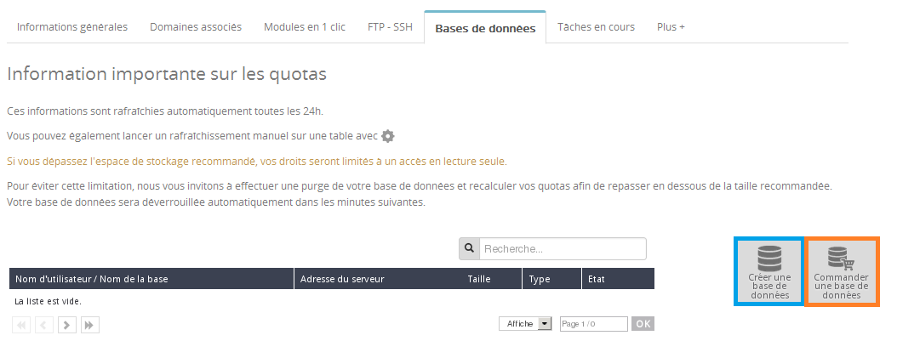
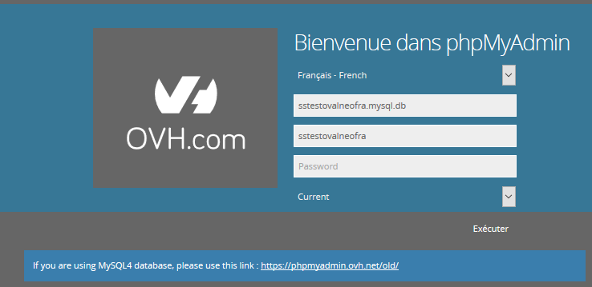

Pour générer des pages de manière dynamique et sans qu'un humain ne mette à jour le site en FTP à chaque nouvelle publication, nous avons besoin d'une base de données afin d'y stocker les annonces.

Hier, nous avons appris [comment déployer une page d’attente en FTP](https://docs.ovh.com/fr/hosting/24-days/day05/). Cette page était statique et impersonnelle : pas d’espace utilisateur, pas de possibilité pour le visiteur d’y apporter du contenu (en y postant une annonce par exemple).

> [!warning]
>
> Ce tutoriel vous présente l’utilisation d’une ou de plusieurs solutions OVH avec des outils externes et vous décrit des manipulations réalisées dans un contexte précis. Pensez à les adapter en fonction de votre situation !
>
> Si vous rencontrez des difficultés lors de ces manipulations, nous vous invitons à faire appel à un prestataire spécialisé et/ou à poser vos questions à notre communauté sur <https://community.ovh.com/>. OVH ne sera pas en mesure de vous fournir une assistance.
>

## Generation de page dynamique
Le navigateur a besoin d’un contenu en HTML qu’il interprétera pour retranscrire les éléments sous la forme d’un site web. C’est donc ce que le serveur lui renvoie.

Cependant, il n’est pas nécessaire que le serveur possède toutes les pages web possibles pour les envoyer au navigateur : il peut les générer en fonction de l’utilisateur qui le contacte. Pour y arriver, nous allons aborder un nouveau langage de développement : le PHP.

Ce langage permet, du côté du serveur, de générer des contenus rapidement suite à la requête d’un utilisateur. Le PHP compose une grande partie des pages web dans le monde : il reste encore aujourd’hui le langage le plus utilisé dans la construction d’un site. Des plateformes comme Facebook ou Wikipédia ont débuté sur celui-ci.

L’un des avantages du PHP (bien qu’il y en ait beaucoup d’autres : [https://www.ovh.com/fr/news/articles/a1859.non-langage-php-pas-mort](https://www.ovh.com/fr/news/articles/a1859.non-langage-php-pas-mort){.external}) est qu’il permet facilement de se connecter à des bases de données.

## Quest-ce quune base de donnees ?
Les bases de données sont des systèmes de stockage de fichiers qui permettent de conserver, de rechercher et de manipuler de grandes quantités de données. Ce sont les pièces essentielles de tous les sites Internet que vous visitez aujourd’hui : contenu du catalogue des produits, enregistrement des ventes, liste des utilisateurs…

Par exemple, le blog WordPress (déployé en [jour 4](https://docs.ovh.com/fr/hosting/24-days/day04/)) utilise une base de données pour stocker les articles et les commentaires.

Des bases de données sont incluses dans toutes nos offres d’hébergement web : on les appelle **bases de données mutualisées**. Attention : selon l’utilisation, la limite de données contenue dans une base peut être atteinte à vitesse grand V !

## La premiere base de donnees de mypersonaldomain.ovh
Avant d’attaquer tout le système d’enregistrement de petites annonces, nous allons vous montrer comment réaliser un compteur de visites qui stocke la liste des visiteurs uniques sur la page d’attente. Ce système basé sur la visite d’une adresse IP précise n’est pas le meilleur qui existe, mais il permet d’illustrer le fonctionnement d’une base de données.

Pour cela, il faut tout d’abord créer cette base.

## Création d'une base de donnees mutualisee
Connectez-vous à votre espace client ([https://www.ovh.com/manager/web](https://www.ovh.com/manager/web){.external}) avec vos identifiants OVH.

L’offre **Performance** sélectionnée précédemment inclut plusieurs bases de données de tailles différentes. Nous allons créer une base du type MySQL (le plus répandu).

- Sélectionnez votre hébergement dans la section **Hébergements** puis l’onglet **Bases de données**.

{.thumbnail}

- Cliquez sur **Créer une base de données**. Notez que si vous avez atteint votre nombre limite de bases, vous pouvez soit changer d’offre, soit commander des bases de données supplémentaires.

{.thumbnail}

- Dans le formulaire, renseignez la version et le type de votre nouvelle base de données (en fonction de votre offre), puis cliquez sur **Suivant**.

{.thumbnail}

- Renseignez un nom d’utilisateur et un mot de passe, puis cliquez sur **Suivant**. Conservez précieusement ces informations, elles seront nécessaires lors de la réalisation du compteur de visite.

{.thumbnail}

- Si vous ne constatez aucune erreur dans le résumé de configuration, vous pouvez **valider**.

{.thumbnail}

La création de votre base de données peut prendre quelques minutes ; vous recevrez un e-mail lorsque celle-ci sera disponible.

{.thumbnail}

## Connexion du compteur de visites a la base
Tout comme pour le HTML et le CSS, nous n’avons pas assez de 24 articles pour vous faire découvrir tout l’univers du PHP et des bases de données. Une fois n’est pas coutume, vous trouverez de très bons **MOOC** sur Internet autour de ces sujets. Il existe même des tutoriels associant le PHP au HTML pour vous former plus rapidement.

Vous trouverez le code du compteur de visites ici : [https://download.mypersonaldomain.ovh/day06.zip](https://download.mypersonaldomain.ovh/day06.zip){.external}. Il contient un fichier **index.php** (qui remplace l’élément index.html d’hier) et toujours le même fichier rondcoin.css

Si vous ouvrez le fichier **index.php**, vous pouvez remarquer de grandes similitudes avec le fichier index.html précédent. En effet, il contient le même code HTML enrichi avec de nouvelles lignes qui correspondent à notre code PHP. Ce dernier discute avec la base de données afin de stocker la liste des adresses IP qui se sont connectées à votre site web.

Si vous souhaitez que ce code fonctionne, vous devez remplacer les trois lignes suivant le commentaire avec les informations de votre base de données : nom de la base reçue par e-mail, ainsi que le nom d’utilisateur et le mot de passe que vous avez définis. Une fois le fichier index.php transféré sur le serveur par FTP, il faut encore créer la structure de données dans la base de données. Pour cela, nous allons utiliser phpMyAdmin.

### Acceder a phpMyAdmin
Vous pouvez parcourir le contenu de votre base de données via l’interface graphique de **phpMyAdmin**. Cet outil est hébergé par OVH et vous pouvez y accéder depuis votre espace client, onglet **Base de données**.

- Pour vous connecter à phpMyAdmin, cliquez sur **Accéder à phpMyAdmin**.

{.thumbnail}

- Vous devez renseigner uniquement le mot de passe de votre base de données. Les autres champs seront automatiquement pré-remplis.

{.thumbnail}

- Cliquez sur le nom de votre base de données, l’onglet **SQL** puis entrez le code suivant :

CREATE TABLE IF NOT EXISTS visitor (id int(11) NOT NULL, ip varchar(15) NOT NULL) ENGINE=InnoDB AUTO_INCREMENT=2 DEFAULT CHARSET=latin1;

- Cliquez sur **Exécuter**. Votre base peut maintenant recevoir des visiteurs.

## Quelles fonctionnalites a connaitre &#58;

### Importer et exporter une base de donnees externe (dump)
Qu’il s’agisse d’importer une base de données créée sur votre poste de travail en local ou de restaurer une sauvegarde, retrouvez toutes les explications sur l’import d’une base de données dans notre guide : [Import de base de données](https://docs.ovh.com/fr/hosting/mutualise-guide-importation-dune-base-de-donnees-mysql/).

Il est tout à fait possible de réaliser l’opération inverse : exporter une base de données (pour travailler en local ou procéder à une sauvegarde). La démarche à suivre est développée dans ce [guide](https://docs.ovh.com/fr/hosting/exportation-bases-donnees/).

Vous maîtrisez désormais tous les fondamentaux pour construire vos propres sites web. Ces manipulations mises bout à bout représentent la naissance de tous les grands sites qui existent aujourd’hui : des pages web statiques, des pages dynamiques, et des bases de données.

Les développeurs à l’origine de la technologie de mypersonaldomain.ovh sont maintenant prêts à entrer en scène. Nous nous pencherons demain sur [le déploiement d’une application complexe en Laravel](https://docs.ovh.com/fr/hosting/24-days/day07/), un framework de développement PHP.

| Article précédent | Article suivant |
|---|---|
| [Mettre en ligne son site avec FTP](https://docs.ovh.com/fr/hosting/24-days/day05/) | [Déploiement avancé avec SSH, Git et Composer](https://docs.ovh.com/fr/hosting/24-days/day07/) |