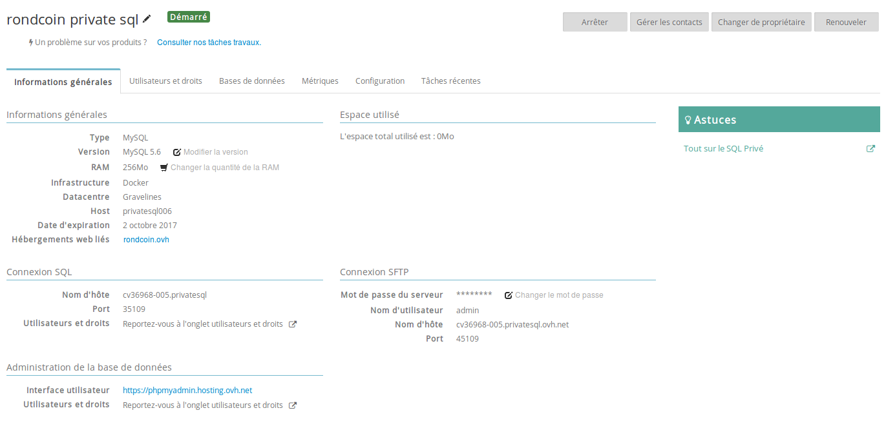
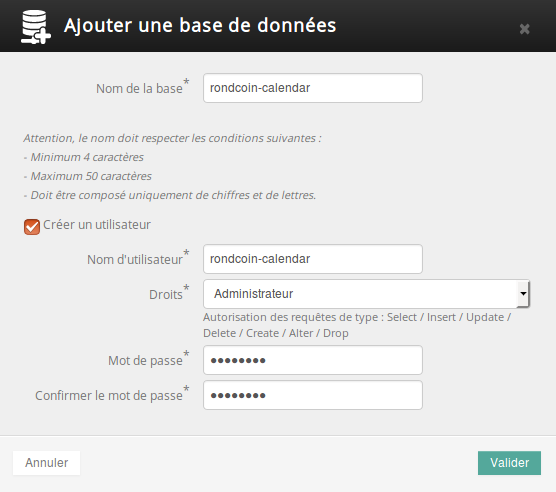

> [!warning]
>
> Ce tutoriel vous présente l’utilisation d’une ou de plusieurs solutions OVH avec des outils externes et vous décrit des manipulations réalisées dans un contexte précis. Pensez à les adapter en fonction de votre situation !
>
> Si vous rencontrez des difficultés lors de ces manipulations, nous vous invitons à faire appel à un prestataire spécialisé et/ou à poser vos questions à notre communauté sur <https://community.ovh.com/>. OVH ne sera pas en mesure de vous fournir une assistance.
>

Pour déployer mypersonaldomain.ovh, nous nous sommes basés sur des bases de données mutualisées incluses dans notre offre d’hébergement web. Cependant, ces bases de données possèdent des limites en termes de nombre de connexions simultanées, que les pics de charges prévus sur mypersonaldomain.ovh risquent d’outrepasser.


 Très souvent, lorsqu’une application web utilise beaucoup sa base de données, elle se retrouve limitée par le nombre de connexions simultanées possibles.

La première étape pour surmonter cette difficulté est de configurer un système de cache : souvent, les utilisateurs de l’application font les mêmes manipulations sur le site, qui se traduisent par de nombreuses requêtes identiques, allant rechercher dans la base de données les mêmes informations. Il est alors plus intelligent de conserver en cache le résultat de la première requête, pour économiser les requêtes identiques suivantes.

Cependant, la mise en cache n’est pas quelque chose de simple : il faut correctement configurer l’invalidation de cache lorsque les données sont modifiées au sein de la base.

Les offres Hébergement Web **Performance** incluent une base de données **SQL privée**. Si vous êtes sur une autre offre, vous pouvez bien entendu commander cette option indépendamment. Vous trouverez toutes les informations au sujet des bases SQL privées sur cette page : [https://www.ovhcloud.com/fr/web-hosting/options/start-sql/](https://www.ovhcloud.com/fr/web-hosting/options/start-sql/){.external}

Nous allons donc utiliser la base SQL privée dont bénéficie mypersonaldomain.ovh avec l’offre Performance souscrite précédemment.


## Activer son serveur SQL privé
Pour activer le serveur SQL privé inclus dans l’offre Hébergement Web **Performance** :

- Rendez-vous au sein de votre espace client : [https://www.ovh.com/manager/](https://www.ovh.com/manager/){.external}, dans la partie **Hébergement web** de mypersonaldomain.ovh
- Sur la ligne **Base de données privée**, cliquez sur **Activer**


{.thumbnail}

- Sélectionnez la version souhaitée de votre base de données. Ici, nous sélectionnons une version récente de **MySQL**. Puis validez.


{.thumbnail}

- Une fois la base de données installée, vous recevrez un e-mail vous confirmant sa disponibilité et contenant des informations comme son nom. L’e-mail peut prendre quelques minutes avant d’arriver.


## Configurer son serveur SQL privé
Maintenant que votre base de données privée est prête, nous devons créer une base de données, ainsi qu’un utilisateur SQL afin de pouvoir l’utiliser

Pour configurer votre serveur SQL privé :

- Rendez-vous dans l’espace client, rubrique **Hébergements**. Vous y trouverez votre serveur SQL.


{.thumbnail}

- Dans l’onglet **Bases de données**, cliquez sur **Ajouter une base de données**.


{.thumbnail}

- Indiquez un nom pour votre base de données, ainsi qu’un nom et un mot de passe pour l’utilisateur de votre base. Ici, nous sélectionnons Administrateur afin de permettre le déploiement de la structure de la base de données avec Laravel. Vous pouvez bien entendu être plus restrictif afin d’éviter les abus ou de limiter les risques en cas de vol de vos accès.
- Votre base et l’utilisateur nouvellement créé seront prêts en quelques minutes. Il est temps de déployer mypersonaldomain.ovh sur cette nouvelle base de données.


## Modifier les parametres de mypersonaldomain.ovh
Nous allons simplement déployer la base de données de mypersonaldomain.ovh comme nous l’avons fait avec la base de données mutualisée. Cela signifie que la base de données sera vide au démarrage. Si vous devez migrer une base existante avec des données, vous pouvez bien entendu exporter les données de la base historique puis les importer de nouveau dans votre base SQL privée.

Pour créer notre base de données, il faut tout d’abord changer le fichier **$HOME/webhosting-example-rondcoin/.env** avec les informations relatives à votre nouvelle base de données. Certaines données se trouvent sur la page principale de votre SQL privé : le **nom d’hôte**, ainsi que le **port** de la base de données. Il faut aussi changer le **nom de la base**, le **nom de l’utilisateur** et le **mot de passe** en renseignant ceux fournis lors de la création de la base.

Une fois ces informations modifiées, il faut lancer la création de cette base avec la commande suivante :


```bash
cd $HOME/webhosting-example-rondcoin
php artisan migrate
```

Bien joué ! Rondcoin utilise désormais une base de données privée ! Bien entendu, vous pouvez personnaliser davantage la configuration de votre base. Vous pouvez d’ailleurs retrouver toutes les fonctionnalités de votre base SQL privée en consultant le [guide dédié aux SQL privés](https://docs.ovh.com/fr/hosting/tout-sur-le-sql-prive/).

Demain, puisque que rondcoin est maintenant prêt pour tenir face à l’afflux de visiteurs, nous verrons comment [lire des logs et graphes d’utilisation](https://docs.ovh.com/fr/hosting/24-days/day09/), et améliorer son site en conséquence.

À demain !

| Article précédent | Article suivant |
|---|---|
| [Déploiement avancé avec SSH, Git et Composer](https://docs.ovh.com/fr/hosting/24-days/day07/) | [Comprendre les statistiques et logs](https://docs.ovh.com/fr/hosting/24-days/day09/) |