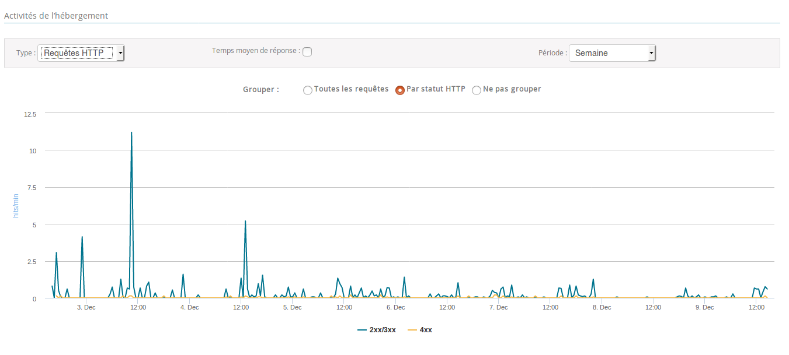
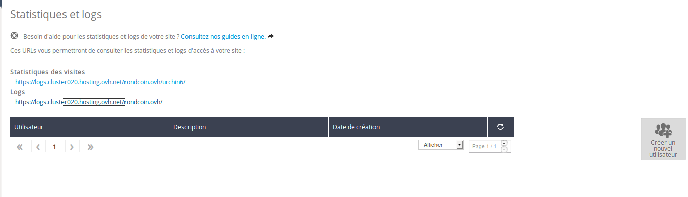
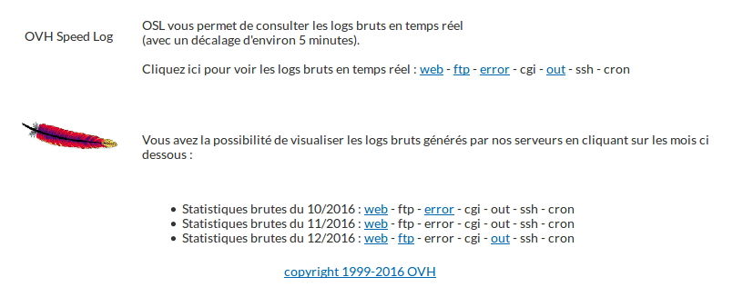

> [!warning]
>
> Ce tutoriel vous présente l’utilisation d’une ou de plusieurs solutions OVH avec des outils externes et vous décrit des manipulations réalisées dans un contexte précis. Pensez à les adapter en fonction de votre situation !
>
> Si vous rencontrez des difficultés lors de ces manipulations, nous vous invitons à faire appel à un prestataire spécialisé et/ou à poser vos questions à notre communauté sur <https://community.ovh.com/>. OVH ne sera pas en mesure de vous fournir une assistance.
>

mypersonaldomain.ovh est en ligne et les premières annonces sont désormais postées par des visiteurs externes. Comment surveiller et s’assurer que le site fonctionne correctement ?

Lorsque l’on installe son propre serveur web, on dispose de rapports concernant l’activité de la machine : ce sont des **logs**. Ces logs remontent souvent la liste des pages visités, les erreurs rencontrées sur l’infrastructure, etc.

Lorsque l’on est sur un hébergement web, on ne peut pas accéder directement à ces logs. Nous les fournissons au travers de notre espace client, et les complétons par diverses statistiques permettant de suivre l’activité et l’état de mypersonaldomain.ovh


## Analyse des statistiques de son site
Pour observer les statistiques des hébergements web, vous devez vous rendre dans l’espace client, en sélectionnant l’hébergement dont vous souhaitez suivre l’activité.

- Dans l’onglet **Informations générales**, vous trouverez en bas une rubrique **Activité de l’hébergement**. Cette partie contient les différents graphes disponibles. Les périodes d’analyse sont configurables ; elles vont de la semaine à l’année.


{.thumbnail}

Vous avez accès à plusieurs types de statistiques :


### Les requetes HTTP
Il s’agit du nombre total de requêtes reçues par votre hébergement web. Cela ne correspond pas précisément aux pages vues, puisque plusieurs requêtes sont réalisées par le navigateur internet pour afficher une page : CSS, Javascript, images…

Cela vous fournit une idée du trafic généré par votre site web. Ce graphe inclut aussi les résultats des requêtes :

- 2xx/3xx signifie que la requête a bien été retournée. Il n’y a eu aucun problème.
- 4xx signifie que la requête a abouti à une erreur côté client. Par exemple, si l’internaute demande une page qui n’existe pas, le serveur retourne une erreur 404. Cela signifie sûrement que des pages de votre site ont été supprimées, mais qu’il existe encore des liens pointant sur ces dernières. Pour les identifier, il faut se rendre dans les logs.
- 5xx signifie que le serveur n’a pas réussi à générer le contenu demandé. Il s’agit souvent d’erreurs dans le code source. De la même manière que pour les erreurs 4xx, l’origine du problème peut être identifié dans les logs.


### Les commandes FTP
Il s’agit de l’activité de votre site en FTP. Ainsi, si vous observez des accès FTP à un moment où vous ne l’avez pas utilisé, changez vos identifiants FTP : ils ont peut-être été compromis.


### Les connexions sortantes
Il s’agit de l’ensemble des connexions effectuées depuis votre code source. Souvent, il s’agit de connexions aux réseaux sociaux, effectués afin de partager des articles sur les profils de vos visiteurs.

Si vous observez un nombre de connexion sortantes trop important, il se peut que votre site ait été compromis. Quelqu’un a peut-être inséré dans votre code un script qui se connecte à un serveur distant pour participer à des activités malicieuses (spamming, phishing, etc.). Les logs contiennent les informations concernant ce type de connexion vers l’extérieur.


### L'utilisation du CPU
L’utilisation du CPU peut varier en fonction du code de votre site web. Si vous effectez des traitements sur de grosses quantités de données, ou bien sur des images, il se peut que le temps processeur utilisé soit important.

L’utilisation du CPU est un paramètre important à surveiller car il est limité sur les hébergements web, avec différent paliers suivant l’offre choisie. Il se peut que vous dépassiez parfois ou régulièrement la limite d’utilisation du CPU. Les requêtes de vos clients sont alors placées en attente, et en conséquence les pages de votre site sont plus longues à s’afficher.


### Depassement du plafond de ressources
Lorsque vous dépassez votre temps CPU, l’accès aux ressources se fait en **best effort**. Cela signifie que si des ressources sont disponibles, elles vous seront allouées. Sinon, votre site est ralenti.

Des dépassements de ressources trop réguliers signifient que vous devriez probablement opter pour l’offre supérieure, sans quoi les internautes visitant votre site risque de fuir à cause d’un temps de chargement des pages excessif.


### Requetes SQL
Hier, nous avons vu qu’il est intéressant de prendre une base SQL privée afin de bénéficier de plus hautes limitations en terme de volume de requêtes SQL. Cependant, il n’est pas toujours facile de surveiller ce volume de requêtes. Ce graphe vous permet de suivre le nombre simultané de requêtes SQL reçues par votre base de données.


### Temps de reponse SQL
A première vue, vous pourriez penser qu’il s’agit de la même information que pour le graphe requêtes SQL. Cependant, le temps de réponse SQL varie surtout en fonction du contenu de votre base de données. En effet, si le nombre de données demandées est grand, ou bien si votre table n’est pas correctement indexée, il se peut que le temps nécessaire pour accéder aux données soit long. Et cela a un impact sur le temps de réponse de votre site !

Si vous avez des temps de réponse importants, cherchez à optimiser votre base de données en réduisant le nombre de données demandées, ou bien en ajoutant des index bien placés.


## Analyse des logs de son site
La lecture des statistiques permet de suivre l’activité de votre site et d’observer son état sur une période donnée. Cependant, pour trouver l’origine des éventuels problèmes, il faut souvent se tourner vers les logs.

Pour accéder à vos logs, il faut se rendre dans l’espace client, rubrique **Hébergements**. Dans l’onglet **Plus +** > **Statistiques et logs**, vous trouvez l’accès à des statistiques sur vos visiteurs, et l’accès à vos logs.


{.thumbnail}

- Cliquez sur le lien menant aux logs. Vous y trouverez l’accès à vos logs du jour dans la rubrique **OVH Speed Log** et les accès aux logs des mois passés en dessous.


{.thumbnail}

Vous trouverez 7 types de logs différents :


### Les logs web
Ce sont les logs d’accès au site web, retournés par le serveur web directement. Toutes les requêtes y sont consignées et chaque ligne correspond à une requête.

Les lignes sont composées de la façon suivante :

<adresse IP> <nom de domaine> [<date>] "<methode> <ressource appelée> HTTP/1.1" <code HTTP> <taille> "<adresse référente>" "<user agent>"

ce qui s'explique ainsi :


> [!faq]
>
> <adresse IP>
>> 
>> l'adresse IP du visiteur (exemple : 213.251.182.116)
>> 
>> 
> <nom de domaine>
>> 
>> le nom de domaine de votre site (exemple : mypersonaldomain.ovh)
>> 
>> 
> <date>
>> 
>> la date de la visite (exemple: 09/Dec/2016:13:26:57 +0100)
>> 
>> 
> <ressource appelée>
>> 
>> la ressource précisement appelée, tel qu'un fichier ou un point d'entrée de votre API (exemple : /images/mon-logo.png)
>> 
>> 
> <code HTTP>
>> 
>> le code que le serveur a retourné (exemple : 200, si tout s'est bien passé)
>> 
>> 
> <taille>
>> 
>> la taille en octets de la réponse (exemple : 43200 pour 43200 octets)
>> 
>> 
> <adresse référente>
>> 
>> l’adresse depuis laquelle le visiteur est arrivé sur la page (exemple : http://roncoin.ovh/contact.php)
>> 
>> 
> <user agent>
>> 
>> une référence indiquant le système d'exploitation et le navigateur utilisés (exemple: Mozilla/5.0 (X11; Ubuntu; Linux x86_64; rv:50.0) Gecko/20100101 Firefox/50.0)
>> 
>> 
>
Par exemple, nous avons pour mypersonaldomain.ovh ce 9 décembre une ligne comme :


```bash
213.251.182.116 mypersonaldomain.ovh - [09/Dec/2016:13:26:57 +0100] "GET /offer/6 HTTP/1.1" 200 967 "http://mypersonaldomain.ovh/offer" "Mozilla/5.0 (X11; Ubuntu; Linux x86_64; rv:50.0) Gecko/20100101 Firefox/50.0"
```

Cela indique qu’un visiteur a regardé l’annonce 6 (/offer/6) en utilisant Linux et Firefox 50.

Ces logs peuvent permettre de faire le suivi des visites, mais ils permettent surtout de repérer l’origine des erreurs 404 par exemple (et ainsi de mettre  en place des pages web à ces endroits pour rediriger le visiteur sur votre site).


### Les logs FTP
Les logs **FTP** consignent toutes les actions réalisées sur votre FTP. Si votre accès FTP a été compromis, ces logs FTP peuvent vous permettre de comprendre ce que l’intrus a effectué sur votre site web.


### Les logs error
Les logs d’erreur permettent de comprendre pourquoi le serveur n’a pas réussi à produire la page web demandée. Bien souvent, il s’agit d’erreurs dans le code.

Par exemple, dans les logs de roncoin.ovh, nous avons retrouvé la ligne suivante :


```bash
[Fri Oct 07 15:55:05 2016] [alert] [client 213.186.33.64] [host mypersonaldomain.ovh] /homez.xx/xxx/webhosting-example-rondcoin/public/.htaccess: /homez.xx/xxx/webhosting-example-rondcoin/public/.htaccess:28: <FilesMatch> was not closed.
```

Cette ligne indique qu’une erreur se produit dans le fichier **webhosting-example-rondcoin/public/.htaccess**, ligne 28, avec quelques informations sur le problème.

Il n’existe pas de ligne d’erreur type car de nombreux acteurs de la création de la page web peuvent consigner leurs erreurs dans ce fichier. Vous y retrouverez par exemple vos erreurs PHP.


### Les autres logs
Enfin, les dernières catégories permettent d’identifier des soucis sur :

- **out**: liste toutes les connexions vers l’extérieur de votre hébergement web. Dans les logs de mypersonaldomain.ovh, nous retrouvons les connexions de notre blog WordPress à un serveur afin de savoir s’il doit être mis à jour.
- **ssh**: liste les commandes lancées depuis vos accès SSH
- **cron**: liste les retours des tâches planifiées exécutées. Nous reviendrons sur le sujet dans quelques jours.
- **cgi** : si votre site est configuré en CGI, le résultat de ces derniers se trouvent dans cette catégorie.

Les logs permettent de suivre l’activité d’un site, et bien souvent de diagnostiquer l’origine d’éventuels problèmes. Et il arrive régulièrement que ces problèmes soient causées par des tentative de piratage. Nous reviendrons demain sur les bonnes pratiques permettant d’améliorer la sécurité de votre site web.

À demain

| Article précédent | Article suivant |
|---|---|
| [Utiliser les SQL Privé](https://docs.ovh.com/fr/hosting/24-days/day08/) | [Comment sécuriser mon site web ?](https://docs.ovh.com/fr/hosting/24-days/day10/) |