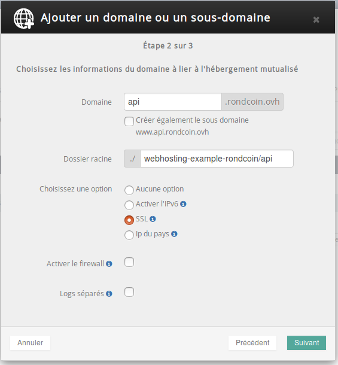

> [!warning]
>
> Ce tutoriel vous présente l’utilisation d’une ou de plusieurs solutions OVH avec des outils externes et vous décrit des manipulations réalisées dans un contexte précis. Pensez à les adapter en fonction de votre situation !
>
> Si vous rencontrez des difficultés lors de ces manipulations, nous vous invitons à faire appel à un prestataire spécialisé et/ou à poser vos questions à notre communauté sur <https://community.ovh.com/>. OVH ne sera pas en mesure de vous fournir une assistance.
>

De nombreuses plateformes en ligne proposent des API pour interagir avec leurs applications. Les avantages liés à la mise à disposition d’une API pour les développeurs tiers sont nombreux : intégration des services sur d’autres sites et applications mobiles, échanges de données, ajout de fonctionnalités à valeur ajoutée par l’intermédiaire de services complémentaires... Rondcoin a décidé d'ouvrir son API pour créer des applications mobiles exploitant la même base de données que celle du site.

L’équipe de rondcoin a choisi d’ouvrir une API REST, c’est-à-dire utilisant le protocole HTTP afin de fournir des accès simplifiés aux développeurs d’applications tierces souhaitant s’interconnecter.

Cependant, ils n’ont pas encore les capacités de maintenir leur propre infrastructure et souhaitent donc rester sur un hébergement web. Nous allons voir comment, en utilisant le multisite, il est possible d’utiliser la même base de données et le même code de base, pour fournir un site web et une API en parallèle.

## Construire une API dans Laravel
Lorsque nous avons parlé de Laravel pour la première fois, nous avons vu que seule une toute petite partie du code de Laravel est exposé par le serveur web afin d’éviter les attaques : le dossier **public**. C’est ce que l’on nomme un **endpoint**.

Il est tout à fait possible de construire plusieurs endpoints. Il suffit de dupliquer le dossier **public** en **api** pour créer un endpoint pour notre API. Le même site sera alors accessible sur les deux endpoints.

Cependant, le dossier **API** contient beaucoup moins de données que **public**. En effet, les API ne nécessitent pas de modifier leur affichage ; les parties CSS et JavaScript ont été supprimées purement et simplement. Il ne reste que le fichier **.htaccess**, en charge des redirections des URL vers le code, et le fichier **index.php**, en charge d’exécuter la requête dans le code Laravel non accessible depuis l’extérieur.

Pour cela, nous avons défini deux domaines distincts dans la configuration de notre application Laravel :

- **mypersonaldomain.ovh** qui se charge d’afficher le site web ;
- **api.mypersonaldomain.ovh** qui se charge d’exécuter la partie API du site web.

Cette configuration s’effectue au niveau de la définition des **routes**, dans le dossier routes. Il faut tout d’abord limiter l’affichage du site web sur le domaine **mypersonaldomain.ovh** uniquement. Pour cela, on englobe les routes existantes pour un domaine unique :


```php
1. Route::group( array( 'domain' => 'mypersonaldomain.ovh'), function(){
2. 
3.     // Define your routes here
4. 
5. });
```

Nous avons défini un second fichier **routes/api.php** qui se charge uniquement des routes dédiées à l’API. En l’occurrence, nous avons ajouté un controller dédié à l’API, car les données retournées ne sont pas tout à fait identiques. L’avantage est que l’accès aux données en base, ainsi que toute la structure de l’application, sont identiques. Seul leur format de retour est différencié.

Ce fichier contient donc :


```php
1. Route::group(array('domain' => 'api.mypersonaldomain.ovh'), function(){
2. 
3.     Route::resource('offer', 'OfferApiController');
4. 
5. });
```

Ensuite, en ce qui concerne les systèmes d’authentification en Oauth2 via l’API, ainsi que le système de formatage, tout est expliqué dans la documentation Laravel et n’a pris que quelques minutes pour être pleinement fonctionnel : [https://laravel.com/docs/5.3/passport](https://laravel.com/docs/5.3/passport){.external}

Lorsque le code de rondcoin est prêt, l’équipe n’a plus qu’à l’envoyer sur son GIT afin qu’il soit déployé automatiquement en production.


## Configuration du multisite
Nous avons déjà vu à plusieurs reprises la configuration d’un multisite. Ce qui est intéressant ici est que, grâce à la capacité de Laravel de gérer plusieurs endpoints, il est possible de faire tourner plusieurs applications web différentes avec la même base de code.

Pour configurer ce multisite, il vous suffit de :

- vous rendre dans votre espace client, dans la rubrique de votre hébergement, puis d’aller dans l’onglet **Multisite** ;
- cliquez sur **Ajouter un domaine ou un sous-domaine**;
- sélectionnez le nom de domaine **mypersonaldomain.ovh**, puis validez ;
- indiquer le sous-domaine **api**, de décochez la création de **www.api.mypersonaldomain.ovh** qui n’a pas de sens pour une API, puis d’indiquer le dossier où se trouve le endpoint de l’API. Nous activons aussi le SSL sur ce multisite, afin de sécuriser les échanges entre les développeurs et notre API ;


{.thumbnail}

- validez les changements, puis attendez quelques minutes que le déploiement soit effectué sur l’ensemble de l’infrastructure. Votre API sera disponible dans [https://api.mypersonaldomain.ovh/api](https://api.mypersonaldomain.ovh/api){.external}
- Si vous voulez essayer votre API, rendez-vous sur [https://api.mypersonaldomain.ovh/api/offer](https://api.mypersonaldomain.ovh/api/offer){.external} qui liste l’ensemble des petites annonces disponibles sur le site. Vous pouvez aussi vous connecter en Oauth2 afin de supprimer vos annonces si vous le souhaitez. Vous pouvez, pour cela, vous créer un token temporaire ou vous connecter en respectant le standard Oauth auprès de l’API.

Rondcoin commence désormais à avoir de l’audience grâce aux applications créées par les développeurs utilisant l’API. Maintenant que le projet prend de l’ampleur, il est temps de penser aux [solutions de backup](../day12/guide.fr-fr.md){.ref}, pour préserver le service en cas d’incident. Nous verrons demain les solutions offertes par l’hébergement web.

À demain !

| Article précédent | Article suivant |
|---|---|
| [Comment sécuriser mon site web ?](https://docs.ovh.com/fr/hosting/24-days/day10/) | [Et les backups ?](https://docs.ovh.com/fr/hosting/24-days/day12/) |