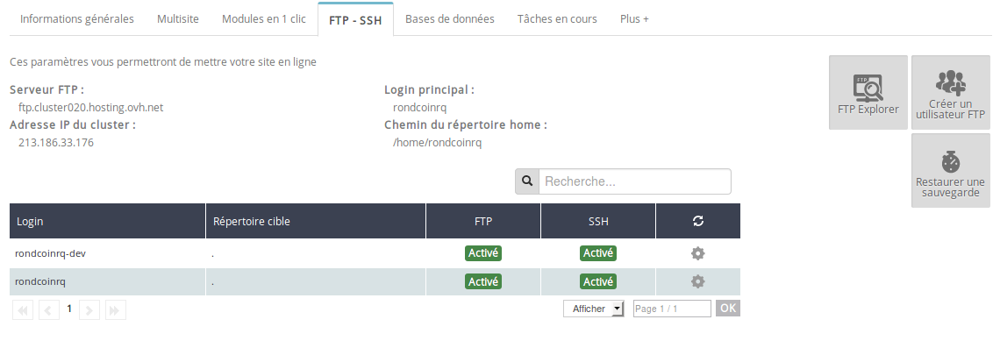
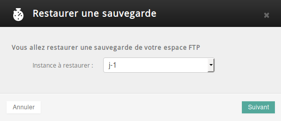
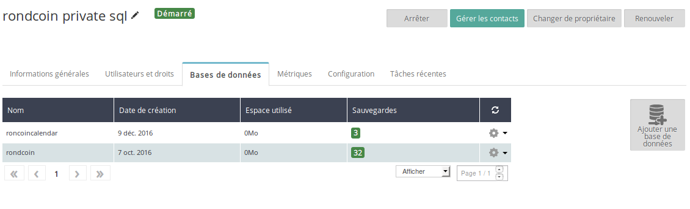
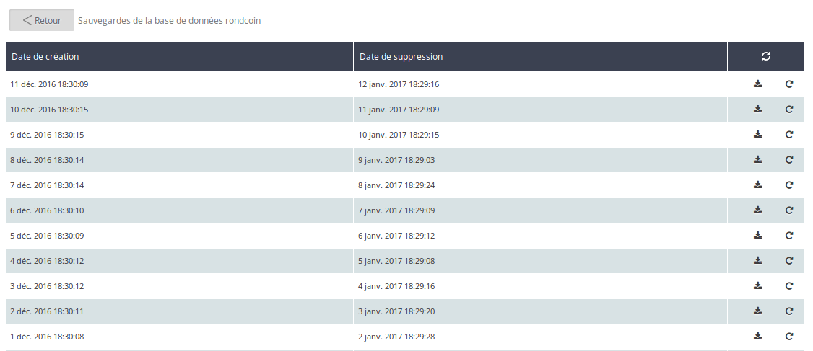

> [!warning]
>
> Ce tutoriel vous présente l’utilisation d’une ou de plusieurs solutions OVH avec des outils externes et vous décrit des manipulations réalisées dans un contexte précis. Pensez à les adapter en fonction de votre situation !
>
> Si vous rencontrez des difficultés lors de ces manipulations, nous vous invitons à faire appel à un prestataire spécialisé et/ou à poser vos questions à notre communauté sur <https://community.ovh.com/>. OVH ne sera pas en mesure de vous fournir une assistance.
>

Notre site web est en production et les petites annonces affluent. Cela laisse désormais un peu de temps à nos équipes techniques afin de se préparer au pire : remettre le site en marche après un incident. En effet, des attaques visant à effacer le site, ou encore des erreurs humaines peuvent toujours arriver.

Pour bâtir le plan de reprise d’activité (PRA) adéquat face à ce type de menaces, la première étape est de faire l’inventaire des actions à mettre en place pour revenir à un état normal. Il faut également penser à la communication à mener en cas de crise.

Pour la communication, l’équipe de Rondcoin a développé une page web html temporaire, qui permet de rediriger les clients en cas d’incident vers un message les invitant à patienter pendant que les équipes résolvent le problème.

L’équipe a observé que pour remettre le site sur pied, il était nécessaire de :

- Restaurer le code de l’application rondcoin sur l’hébergement web. Pour cela, l’équipe possède le git et peut redéployer le code source à tout moment ;
- Renvoyer les photos des petites annonces des clients. L’équipe a identifié un besoin de backup pour ces données ;
- Réinjecter les données de la base qui contient l’ensemble des utilisateurs, des petites annonces et des accès API. L’équipe a identifié le besoin de backup de cette base de données.

Les offres d’hébergements web d’OVH incluent par défaut des backups des fichiers de votre site, mais aussi de vos bases de données mutualisées et bases de données SQL privées.

## Les backups des fichiers de rondcoin
Les hébergements web d’OVH incluent un backup des fichiers de votre site. Tous les fichiers de votre hébergement sont pris en compte. L’équipe de rondcoin pourra donc récupérer les photos miniatures, mais aussi le code source de l’application. Elle doit alors restaurer le code source dans son état le plus récent, ainsi que les images. Bien entendu, pour éviter les résultats étranges, l’équipe renverra les clients vers une page temporaire de maintenance le temps de la restauration des données.

Ces sauvegardes permettent de rétablir le site dans un état antérieur : jour précédent, J-2, J-3, une semaine avant ou deux semaines avant.

Pour restaurer votre hébergement depuis une sauvegarde :

- Rendez-vous au sein de votre espace client OVH, rubrique **Hébergements** mypersonaldomain.ovh, onglet **FTP/SSH** ;
- Cliquez sur **Restaurer une sauvegarde** ;

{.thumbnail}

- Sélectionnez la sauvegarde souhaitée, confirmez votre choix.

{.thumbnail}

En fonction du poids de votre site web, l’opération peut prendre plus ou moins longtemps. Vous recevrez un e-mail lorsque celle-ci se sera terminée. Vous pourrez à nouveau utiliser vos fichiers restaurés et vous aurez récupéré les photos illustrant les petites annonces.

## Les sauvegardes de bases de donnees
Les bases de données mutualisées et SQL privées proposent le même niveau de sauvegarde : une sauvegarde par jour durant un mois flottant. C’est-à-dire que vous pouvez restaurer la base dans l’état où elle se trouvait, depuis la veille jusqu’à 1 mois en arrière.

Notez que vous pouvez télécharger ces sauvegardes afin de soit les conserver localement, soit les utiliser pour que vos développeurs bénéficient de données réelles lorsqu’ils développent ou testent une nouvelle fonctionnalité.

Ces sauvegardes sont accessibles depuis l’espace client d’OVH, dans la partie dédiée à votre base de données :

- Dans le cas d’une base mutualisée, dans l’onglet Hébergements dans votre hébergement web **mypersonaldomain.ovh**, onglet **Bases de données** ;
- Dans le cas d’une base SQL privée, dans **Hébergements** dans votre SQL privé, onglet **Bases de données** ;

{.thumbnail}

- Pour visualiser l’ensemble de vos sauvegardes, cliquez sur le nombre de sauvegardes disponibles pour la base de données que vous souhaitez restaurer ;

{.thumbnail}

- Dans les boutons d’action sur la droite, vous pouvez soit **télécharger** la sauvegarde, soit la **restaurer**. Attention, lors de la restauration, la base de données est restaurée dans l’état de cette dernière au moment de la sauvegarde, effaçant ainsi toutes les données enregistrées depuis.

Félicitations, vous savez maintenant comment récupérer vos données en cas de force majeure. Bien entendu, cela ne vous empêche pas d’effectuer vous aussi des sauvegardes de votre côté et, surtout, de vous préparer pour le jour où vous devrez restaurer vos sites web au beau milieu de la nuit.

Les sauvegardes ne sont que l’un des éléments à prévoir en cas d’attaque. De très nombreux sites sont infectés bien avant que l’attaque ne soit visible sur le site web, et il arrive que les backups ne puissent pas totalement supprimer une infection, car le code infecté se trouvait déjà sur le site depuis plusieurs semaines.

Dans ce cas, il est préférable d’effectuer une réinstallation complète du site web et de renvoyer les données de la base, ainsi que les fichiers générés et uploadés par les clients. Dans le cas de rondcoin, cela reviendrait à redéployer le code source de l’application depuis zéro, puis de renvoyer les images des petites annonces afin de redéployer la base de données avec les informations des clients. Bien entendu, il s’agit de stratégies qui varient fortement en fonction de chaque site web.

Demain, nous reviendrons aux fonctionnalités de rondcoin et nous verrons [comment envoyer des e-mails](../day13/guide.fr-fr.md){.ref} à ses clients de manière efficace avec les hébergements web d’OVH.

À demain !

| Article précédent | Article suivant |
|---|---|
| [Comment deployer une API ?](https://docs.ovh.com/fr/hosting/24-days/day11/) | [Envoyer des e-mails à vos utilisateurs](https://docs.ovh.com/fr/hosting/24-days/day13/) |