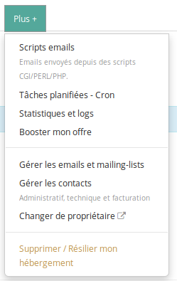
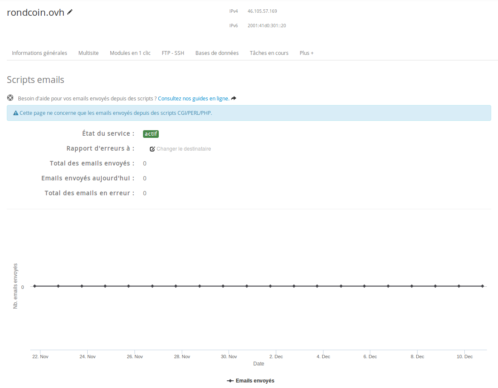

> [!warning]
>
> Ce tutoriel vous présente l’utilisation d’une ou de plusieurs solutions OVH avec des outils externes et vous décrit des manipulations réalisées dans un contexte précis. Pensez à les adapter en fonction de votre situation !
>
> Si vous rencontrez des difficultés lors de ces manipulations, nous vous invitons à faire appel à un prestataire spécialisé et/ou à poser vos questions à notre communauté sur <https://community.ovh.com/>. OVH ne sera pas en mesure de vous fournir une assistance.
>

Toute application a besoin d’envoyer des e-mails : pour notifier ses utilisateurs d’un événement, leur adresser des messages promotionnels ou encore les aider à récupérer leur mot de passe s’ils l’ont égaré… Configurer son site web pour que les e-mails arrivent correctement à leurs destinataires ?

L’envoi d’e-mails depuis un site web est une pratique rentrée dans les mœurs depuis de nombreuses années. Ainsi, les hébergements web de OVH permettent l’envoi d’e-mails depuis vos sites web en utilisant la fonction **mail()** de PHP. Pour arriver jusqu’à son destinataire, votre e-mail va passer par une infrastructure mutualisée de serveurs e-mail.

Le SPAM est l’abus le plus répandu de ressources informatiques. C’est pour éviter ce type d’usage malveillant qu’OVH a mis en place des contrôles et protections. Les envois de SPAM sont ainsi bloqués dès leur détection, de sorte à ne pas pénaliser les envois légitimes transitant par les mêmes serveurs.

De la même manière, si de trop nombreux e-mails n’arrivent pas à destination et reviennent sur nos serveurs (ce que l’on nomme des bounces), nous pouvons désactiver vos envois jusqu’à ce que vous ayez effectué un nettoyage de vos bases de destinataires.

Les offres d’hébergement web permettent principalement d’envoyer des e-mails transactionnels, tels que :

- E-mail de création de compte
- E-mail de récupération de mot de passe
- Accusé de réception d’une commande
- Envoi de facture électronique


## Lenvoi de-mail depuis lhebergement web
En PHP, la fonction *mail()* est un classique du langage depuis de très nombreuses années. Cette fonction est par défaut très simple :


```php
1. <?php
2. mail("destinataire@ledomaine.tld", "Sujet de votre email", "Le contenu de votre premier email");
3. ?>
```

Si vous parcourez la documentation de cette fonction ([http://php.net/manual/fr/function.mail.php](http://php.net/manual/fr/function.mail.php){.external}), vous trouverez de nombreuses options permettant d’améliorer la délivrabilité de vos e-mails.

Ces fonctions n’étant pas toujours simples à configurer, les frameworks modernes de PHP tels que Laravel, proposent des outils pour envoyer des e-mails bien configurés en quelques lignes. Laravel va même plus loin en générant automatiquement toute la partie correspondant au renouvellement d’un mot de passe perdu.

Il suffit en fait de préciser à Laravel que vous souhaitez utiliser la fonction **mail()** et non un serveur SMTP. Cela se réalise dans le fichier de configuration **.env** :


```bash
MAIL_DRIVER=mail
```

Vous trouverez plus de documentation sur l’envoi des e-mails dans la documentation de Laravel : [https://laravel.com/docs/5.3/mail](https://laravel.com/docs/5.3/mail){.external}

Notez aussi que l’envoi d’un e-mail depuis une requête HTTP est une opération coûteuse en temps d’exécution dans votre code PHP. Si vous envoyez de nombreux e-mails depuis la même page, cela peut donc ralentir le chargement de votre site.

Nous verrons prochainement comment maintenir une vitesse de chargement optimale des pages, tout en envoyant des e-mails.


## Comment savoir si mes e-mails partent correctement ?
L’espace client contient une partie concernant les e-mails que vous envoyez avec votre site internet ou les scripts qui fonctionnent sur votre hébergement.

- Pour s’y rendre, connectez-vous au sein de votre espace client, dans la page liée à votre hébergement.
- Cliquez sur **Plus+** afin d'accéder à l'onglet **Scripts emails**


{.thumbnail}

- Cette page contient le suivi des e-mails envoyés, ainsi que de ceux qui sont bloqués.


{.thumbnail}

- Si vous avez des e-mails marqués comme en erreur, vous pouvez cliquer sur **E-mails en erreur** afin d’en récupérer la liste. Cette liste vous permettra d’identifier les erreurs auxquelles vous êtes confronté. Il se peut que vous tentiez d’envoyer des e-mails à des adresses e-mail qui n’existent pas. Dans ce cas, l’e-mail va revenir en erreur. Si vous générez trop d’erreurs, vous pouvez être bloqués. Nous vous conseillons dans ce cas de nettoyer les adresses n’existant pas ou plus de votre base de données.
- Vous pouvez aussi **Bloquer l’envoi** afin d’arrêter un envoi erroné. Lorsque vous bloquez vos e-mails, vous pouvez alors purger les e-mails en attente et repartir sur de nouvelles bases.
- Enfin, vous pouvez configurer l’envoi de d’un e-mail quotidien vous informant de l’état de vos envois d’e-mail.


## Et les campagnes de-mailing dans tout ca ?
Vous l’aurez compris, si vous souhaitez lancer une campagne d’e-mailing, comme l’envoi d’une newsletter à des milliers de destinataires, l’usage de la fonction **mail()** n’est pas le plus adapté.

Nous vous recommandons d’utiliser d’autres types de services, spécialisés dans [l’envoi massif d’e-mails](../day14/guide.fr-fr.md){.ref}, et dont le métier est de maximiser la délivrabilité de vos messages, la lisibilité sur tout type de plateformes et d’en augmenter l’efficacité, grâce à des statistiques avancées sur leur consultation (taux d’ouverture, taux de clic, etc.)

Mais nous en reparlons plus précisément demain !

À demain !

| Article précédent | Article suivant |
|---|---|
| [Et les backups ?](https://docs.ovh.com/fr/hosting/24-days/day12/) | [Envoyer des newsletters avec Mailjet](https://docs.ovh.com/fr/hosting/24-days/day14/) |