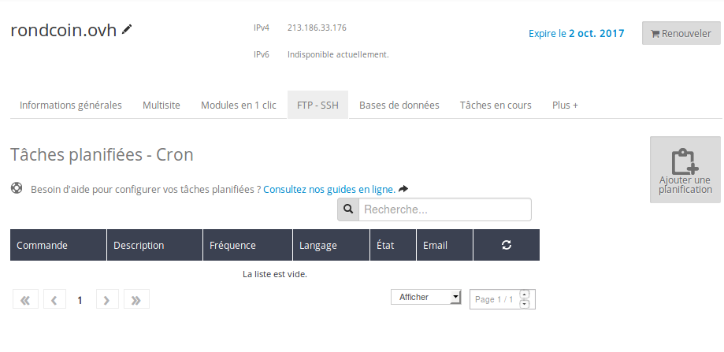

> [!warning]
>
> Ce tutoriel vous présente l’utilisation d’une ou de plusieurs solutions OVH avec des outils externes et vous décrit des manipulations réalisées dans un contexte précis. Pensez à les adapter en fonction de votre situation !
>
> Si vous rencontrez des difficultés lors de ces manipulations, nous vous invitons à faire appel à un prestataire spécialisé et/ou à poser vos questions à notre communauté sur <https://community.ovh.com/>. OVH ne sera pas en mesure de vous fournir une assistance.
>

Certaines opérations requises par votre site web peuvent prendre du temps et être gourmandes en ressources : envoi d’e-mail à plusieurs destinataires, nettoyage de la base de données, ou génération de catalogue par exemple. Pour ces opérations, l'idéal est de configurer des tâches planifiées (ou cron), afin de ne pas impacter la vitesse de chargement des pages de votre site.

La vitesse d’exécution d’une page web est un point important des sites internet : plus le site est rapide et plus l’internaute aura un sentiment de confiance envers le site : il ne va pas tomber en panne lorsque je vais cliquer sur payer ! Si les pages sont trop longues à charger, le visiteur aura tendance à fuir et à visiter le site d’un concurrent.

Pour cette raison, il est important de détecter quelles opérations prennent du temps afin de les optimiser. Mais, dans certains cas, ce n’est pas possible de les éliminer : envoi d’un e-mail à toutes les personnes qui se sont inscrites pour suivre une annonce, nettoyage quotidien de la base de données… Il faut alors envisager d’effectuer ces opérations de façon asynchrone !

Réaliser ces opérations en asynchrone, cela signifie ne pas les exécuter immédiatement, mais les lancer lorsque le système aura du temps pour les traiter. Ainsi la tâche est effectuée au meilleur moment, sans gêner le confort de navigation du visiteur.

Pour cela, les hébergements web d’OVH vous proposent un mécanisme de tâches planifiées, aussi nommées cron. Ce mécanisme permet de lancer de manière régulière des scripts. Ces derniers peuvent prendre plus de temps qu’une requête classique et n’ont pas de conséquence en termes de performance sur les requêtes en cours.

Pour la version de démonstration de mypersonaldomain.ovh, nous allons mettre en place une tâche planifiée qui réinitialise tous les jours la base de données.


## Creer une tache planifiee dans Laravel &#58;
Laravel dispose d’un mécanisme permettant d’écrire des tâches planifiées qui permet d'accéder à la base de données en réutilisant les autres briques de notre application.

La documentation de Laravel est assez exhaustive sur ce sujet. La bonne pratique consiste à créer une nouvelle commande **Artisan**. C’est-à-dire un script qui peut s’appeler en ligne de commande en exécutant :


```bash
php artisan mycommand:sogood
```

Cette commande doit ensuite être ajoutée dans la méthode schedule de AppConsoleKernel afin d’être exécutée de manière automatique. Vous trouverez plus de détails dans la documentation officielle de Laravel : [https://laravel.com/docs/5.3/scheduling](https://laravel.com/docs/5.3/scheduling){.external}.

S’agissant uniquement d’un script utilisé pour la version de démonstration, nous avons fait le choix de ne pas créer de commande, mais de coder le nettoyage des tables directement dans Kernel.

Voici le code que nous avons déployé pour vider la base de données des annonces et des utilisateurs dans le fichier App/Console/Kernel.php:


```php
1. protected function schedule(Schedule $schedule)
2. {
3.     $schedule->call( function() {
4.         DB::table('users')->delete();
5.         DB::table('offers')->delete();
6.     })->daily();
7. }
```

Maintenant, Laravel est prêt à nettoyer notre base tous les jours. Mais il faut tout de même lancer le système de tâche planifiée avec une ligne de commande :


```bash
php artisan schedule:run >> /dev/null 2>&1
```

Si vous la lancez à la main, l’opération de nettoyage se fera uniquement si elle n’a pas encore eu lieu dans la journée. Mais bien entendu, vous n’allez pas l’activer tous les jours à la main !


## Activation de la tache planifiee OVH
Vous pouvez configurer avec vos hébergements web des tâches planifiées qui seront lancées automatiquement sur votre hébergement. Vous recevez un message d’erreur en cas de soucis.

Pour cela, il faut créer un script qui lance notre ligne de commande. Nous allons créer cron.sh :


```bash
#!/bin/bash
1. php artisan schedule:run >> /dev/null 2>&1
2. exit 0
```

- Ensuite, il faut se rendre dans l’espace client, rubrique **Hébergements**, dans l’onglet **Tâches planifiées**.


{.thumbnail}

- Cliquez sur **Ajouter une planification** et indiquez le nom de la commande à exécuter. Le langage est **autre** puisque défini dans le script cron.sh. Vous pouvez envisager des scripts PHP lancé dans différentes versions de PHP.


{.thumbnail}

- Sélectionnez la récurrence de votre tâche planifiée. Vous pouvez ici la mettre au plus bas, c’est-à-dire toutes les heures, puis Laravel s’occupe d’exécuter ces tâches plus finement.
- Validez le récapitulatif

Nous avons maintenant un système automatisé qui vide la base de données tous les jours. Vous pouvez désormais imaginer tous les scripts que vous pouvez déporter en tâches planifiées afin d’améliorer les performances de chargement de votre site web. Des CMS comme WordPress et Prestashop bénéficient aussi de mise en cache à effectuer en cron, afin d’accélérer le chargement des pages. Renseignez-vous dans à ce sujet dans les documentations respectives de ces CMS.

Demain, nous verrons un autre point important des sites et applications web en 2016 : [l’activation du protocole HTTPS](../day16/guide.fr-fr.md){.ref}, que est possible gratuitement chez OVH grâce à Let’s encrypt.

À demain !

| Article précédent | Article suivant |
|---|---|
| [Envoyer des newsletters avec Mailjet](https://docs.ovh.com/fr/hosting/24-days/day14/) | [Activer HTTPS](https://docs.ovh.com/fr/hosting/24-days/day16/) |