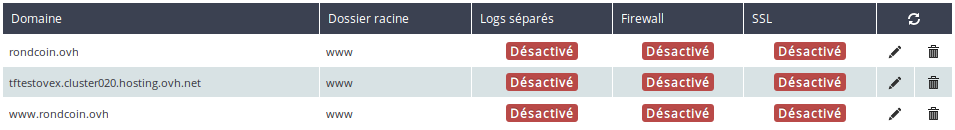
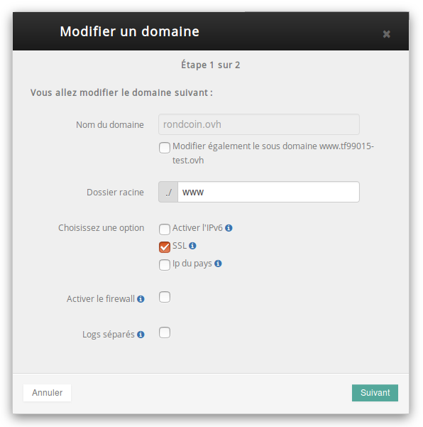
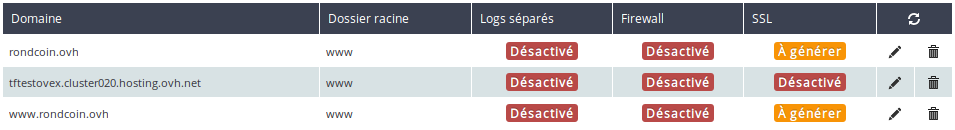
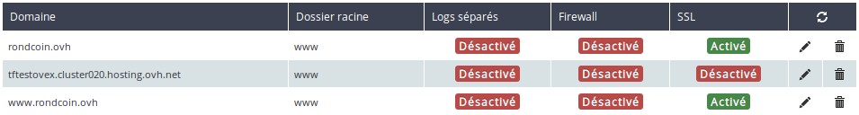
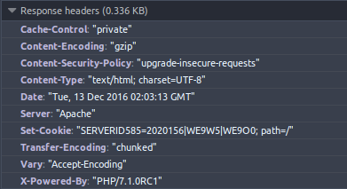
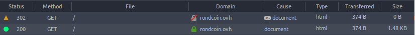

> [!warning]
>
> Ce tutoriel vous présente l’utilisation d’une ou de plusieurs solutions OVH avec des outils externes et vous décrit des manipulations réalisées dans un contexte précis. Pensez à les adapter en fonction de votre situation !
>
> Si vous rencontrez des difficultés lors de ces manipulations, nous vous invitons à faire appel à un prestataire spécialisé et/ou à poser vos questions à notre communauté sur <https://community.ovh.com/>. OVH ne sera pas en mesure de vous fournir une assistance.
>

Depuis le début de l'année 2016 et l'arrivée de Let's Encrypt, qui fournit des certificats cryptographiques gratuitement, le HTTPS est devenu la nouvelle norme. C'est pourquoi OVH a choisi de s'associer avec Let's Encrypt et de proposer par défaut le HTTPS sur tous les sites hébergés sur l’hébergement web.

Nous avons vu hier [l’utilisation des tâches planifiées](../day15/guide.fr-fr.md){.ref}. Nous allons étudier aujourd’hui comment rendre son site totalement compatible avec le protocole HTTPS.

## C'est quoi HTTPS ?
Pour les non technophiles, le HTTPS est ce qui permet d’avoir le petit cadenas vert affiché à côté de l’adresse du site Internet dans votre navigateur. C’est un élément destiné à rassurer les visiteurs à propos de la confiance qu’ils peuvent avoir dans le site consulté.

On parle aussi souvent de certificat SSL, qui est l’acronyme anglophone de Secure Sockets Layer. Il s’agit d’un ensemble de protocoles de chiffrement permettant d’établir un canal de communication sécurisé entre le navigateur et le serveur web. C’est la technologie utilisée lorsque le HTTPS a été créé. Il est désormais remplacé par TLS. Mais dans le langage commun, nous parlons toujours de certificat SSL (vous savez, c’est comme l’histoire de la marque de réfrigérateur devenu un nom commun).

HTTPS est donc le protocole qui ajoute, à l’aide de SSL/TLS, une couche de chiffrement sur les connexions HTTP. Le but est de s’assurer que personne ne puisse écouter le trafic réseau entre votre navigateur et le serveur (ce que l’on apprécie lorsque l’on renseigne des mots de passe ou des numéros de carte bancaire !).

Avant que le navigateur valide la connexion avec un serveur en HTTPS, il vérifie préalablement que le certificat SSL a bien été approuvé par l’une des autorités de certification existantes. Let’s encrypt est l’une de ces autorités de certification. Ces organismes sont en charge de vérifier que le demandeur d’un certificat SSL pour un nom de domaine en est bien le propriétaire. Bien entendu, cette partie est totalement gérée par OVH.


## Configurer son certificat SSL
Lorsque vous commandez un nouvel hébergement, le certificat SSL est automatiquement créé quelques dizaines de minutes après que votre nom de domaine est devenu valide.

Mais si vous le souhaitez, vous pouvez inclure plusieurs sites (multisite) au sein de votre certificat. Cela se définit lorsque vous configurez le multisite :

- Il suffit de vous rendre dans votre espace client OVH, section **Hébergements** puis dans l’onglet **Multisite**. Nous avons déjà vu cette interface à plusieurs reprises depuis le départ de cette série de tutoriaux.


{.thumbnail}

- Dans notre cas, nous souhaitons activer HTTPS sur les domaines **mypersonaldomain.ovh** et **www.mypersonaldomain.ovh**. Pour ce faire, cliquez sur l’icône *stylo* à droite du tableau pour éditer le multisite. Pour activer le protocole HTTPS, cliquez sur SSL dans la fenêtre d’édition de multisite, puis validez.


{.thumbnail}

Une fois le multisite édité, il est en état **à générer**. Cela signifie que vous devez régénérer votre certificat SSL pour qu’il soit pris en compte. Ce système permet de modifier de nombreux multisites avant de lancer une génération de certificat qui prend près d’une heure.


{.thumbnail}

- Il reste donc à lancer la régénération du certificat en cliquant sur **Régénérer le certificat SSL**


{.thumbnail}

Une fois la génération de certificat effectuée, les deux entrées sont marquées **Activé**. Et voilà ! Les domaines sont désormais accessibles via HTTP et HTTPS !


{.thumbnail}

Félicitations ! Tous vos sites sont en HTTPS. Cependant, il faut faire attention à quelques pièges qui peuvent rendre votre site incompatible avec HTTPS.


## Mixed-Content&#58; on ne melange pas tout !
Vous l’avez peut-être remarqué, un site accessible via HTTP peut comporter des éléments chargés via HTTPS. C’est complètement transparent pour l’utilisateur et ne pose pas de soucis. Par exemple, le chargement de police de caractères depuis un serveur Google se fait uniquement via HTTPS :


```html
1. https://fonts.googleapis.com/css?family=Raleway:300,400,600
```

Les problèmes surviennent dans le scénario inverse : le chargement de ressources via HTTP à partir d’un site visité en HTTPS. En effet, les navigateurs bloquent les contenus chargés en HTTP qui présentent un risque d’être intercepté par des pirates. C’est ce que l’on nomme le **Mixed-Content**.

Les navigateurs bloquent totalement le chargement des fichiers dit actifs : CSS et JavaScript qui sont exécutés dans la page. Les fichiers dit inactifs, récupérés via HTTP, comme les images ou les vidéos empêchent simplement l’affichage du cadenas vert dans la barre d’adresse du navigateur.

Par conséquent, imaginons que notre site mypersonaldomain.ovh appelle une librairie JavaScript comme ceci :


```html
1. <script src="http://mypersonaldomain.ovh/js/main.js" />
```

Ce JavaScript ne sera pas chargé et ce qu’il doit lancer ne fonctionnera donc pas.

Dans ce cas, le plus simple pour nous serait de réviser notre code et s’assurer que tous les appels de fichiers se font bien via HTTPS. L’usage de **liens relatifs** permet d’assurer une transition en douceur d’un protocole à l’autre.

Exemple:


```html
1. <script src="/js/main.js" />
```

Il s’agit du même lien, à l’exception près qu’ici le protocole et le domaine ne sont pas spécifiés, rendant ainsi l’appel du fichier indépendant de ces derniers.


## Content-Security-Policy&#58; Les regles a suivre
Imaginons maintenant que le site mypersonaldomain.ovh soit composé de dizaines de pages, appelant des centaines de fichiers différents (images, feuilles de style, scripts, vidéos, etc.) et que nous souhaitions migrer rapidement vers HTTPS.

Pour diverses raisons (coûts, délais, etc.), nous ne pouvons pas envisager de passer en revue l’ensemble des liens sur chacune des pages. Les navigateurs proposent une solution : **Content-Security-Policy**.

Envoyé par le serveur, l’en-tête Content-Security-Policy se compose de plusieurs directives visant à indiquer au navigateur quel comportement adopter pour le chargement de certaines ressources (scripts, images, etc.).

Dans notre cas, nous voulons forcer le navigateur de nos clients à charger les fichiers via HTTPS **exclusivement**. Cela veut dire que, dès qu’il aura un lien en HTTP, il tentera la connexion en HTTPS.

Pour se faire, il suffit de positionner un fichier **.htaccess** dans le dossier racine de l’hébergement, et d’y placer cette ligne :


```text
1. # SET CSP HEADER
2. <IfModule mod_headers.c>
3.     Header set Content-Security-Policy "upgrade-insecure-requests"
4. </IfModule>
```

Pour valider la bonne prise en compte de cette règle, nous pouvons accéder au site mypersonaldomain.ovh et inspecter les en-têtes HTTP reçus par le navigateur via la console de développement (ctrl + maj + q dans Firefox, F12 puis onglet “Réseau” dans Chrome):


{.thumbnail}

C’est bon ! Notre serveur web a bien pris en compte nos directives et est prêt à communiquer ses instructions à nos visiteurs.


> [!warning]
>
> Il est possible de configurer les en-têtes CSP de manière à ne pas appliquer les directives, mais seulement de simuler l’application de celles-ci dans le navigateur. Cela permet par exemple d’auditer le comportement d’un site via la console du navigateur.
> Il est également possible de demander au navigateur de vos visiteurs de vous notifier si l’un d’eux rencontrait une violation de vos règles de CSP.
> 


## Redirection 302&#58; HTTPS ? Cest par la...
Avec la mise en place de **Content-Security-Policy**, tous nos visiteurs essaieront désormais de naviguer sur mypersonaldomain.ovh en HTTPS en priorité. La prochaine étape pour nous serait de proposer un accès exclusivement par HTTPS.

Pour cela, il nous faut paramétrer notre serveur web pour l’obliger à rediriger les requêtes HTTP vers HTTPS. La modification se fait dans le fichier .htaccess évoqué précédemment :


```text
1. # REDIRECTION TO HTTPS
2. # https://wiki.apache.org/httpd/RewriteHTTPToHTTPS
3. RewriteEngine On
4. RewriteCond %{HTTPS} !=on
5. RewriteRule ^/?(.*) https://%{SERVER_NAME}/$1 [R,L]
```

Autrement dit, toute requête arrivant en HTTP est réécrite en HTTPS (tout en conservant les éventuels paramètres). Côté client, cela se traduit par une redirection (transparente) via un code HTTP 302:


{.thumbnail}


## HSTS&#58; Je ne parle que HTTPS !
Vous avez appliqué tous les conseils ci-dessus ? Alors cela signifie que :

- Votre site répond en HTTPS avec un certificat SSL valide ;
- Vous n’avez pas de mixed content car vous avez modifié votre code source ou bien que vous avez forcé les navigateurs à faire leurs appels en HTTPS ;
- Vous avez redirigé toutes les requêtes HTTP en HTTPS.

Comment peut-on encore faire mieux ? Comment forcer les clients visitant mypersonaldomain.ovh à interroger directement notre serveur en HTTPS, sans passer par la redirection décrite plus haut.

Pour cela, nous utilisons un nouvel en-tête nommé : **HTTP-Strict-Transport-Security**

Comme les autres il s’implémente au sein du fichier .htaccess de la manière suivante :


```text
1. # HSTS HEADER
2. # Recommanded value: 15778800 (half a year)
3. # Public deployment: https://hstspreload.appspot.com/
4. Header always set Strict-Transport-Security "max-age=60"
```

Lors de la première visite, l’en-tête indique au navigateur que celui-ci devra, à partir de maintenant, communiquer **exclusivement** via HTTPS, et ce, durant tout la durée de validité de l’en-tête (6 mois dans l’exemple ci-dessus). Une fois l’en-tête reçu, il sera **impossible** pour un client d’initier une connexion HTTP vers mypersonaldomain.ovh.

Le seul moyen d’annuler cette règle est de paramétrer le serveur avec une valeur “max-age” à zéro. Cela aura pour effet d’annuler la valeur précédemment enregistrée, mais uniquement pour un visiteur présent au moment de la modification.

Dans le cadre de mypersonaldomain.ovh, nous sommes convaincus de l’intérêt de HTTPS et décidons de l’appliquer à tous les sous-domaines (existants ou non) :


```text
1. # HSTS HEADER
2. # Recommanded value: 15778800 (half a year)
3. # Public deployment: https://hstspreload.appspot.com/
4. Header always set Strict-Transport-Security "max-age=60; includeSubDomains"
```

La directive **includeSubDomains** forcera ainsi toutes les connexions sur “test.mypersonaldomain.ovh” ou “dev.mypersonaldomain.ovh” à passer par HTTPS uniquement. Par conséquent il sera nécessaire de régénérer un certificat SSL à chaque création d’un nouveau sous-domaine.

Il faut être prudent dans le choix de la valeur de la durée de l’en-tête. Une bonne idée est d’opérer les premiers tests avec une valeur faible (1h par exemple) puis de l’incrémenter graduellement à quelques jours, puis plusieurs mois et enfin 1 an.


## Bonus&#58; Declarer son amour pour HTTPS publiquement
Comme nous l’avons vu précédemment, la récupération de l’en-tête HSTS nécessite une (et une seule) connexion initiale au serveur. Il est aussi possible de sauter cette étape en ajoutant mypersonaldomain.ovh à la liste publique des sites supportant HSTS (nécessite une longue durée de validité).

Pour ce faire, il faut apporter une légère modification à l'en-tête HSTS pour y ajouter la directive "preload":


```text
1. # HSTS HEADER
2. # Recommanded value: 15778800 (half a year)
3. # Public deployment: https://hstspreload.appspot.com/
4. Header always set Strict-Transport-Security "max-age=31557600; includeSubDomains; preload"
```

Dans un second temps, il faut se rendre sur le site [HSTS Preload](https://hstspreload.appspot.com){.external} et y soumettre le domaine souhaité. Un crawler (robot d’indexation) de Google se chargera ensuite d’évaluer le paramétrage HSTS du domaine et, s’il est jugé conforme, de l’ajouter à la liste.

Cette liste publique est partagée avec l’ensemble des navigateurs récents. Attention cependant, l’ajout d’un domaine sur cette liste vous oblige à abandonner définitivement HTTP.

Nous n’avons pas parlé de l’attrait de HTTPS pour le référencement et c’est pourtant l’une des plus importantes raisons de l’activer. Cela tombe bien, le référencement est le thème de demain.

| Article précédent | Article suivant |
|---|---|
| [Mettre en place des tâches planifiées](https://docs.ovh.com/fr/hosting/24-days/day15/) | - |