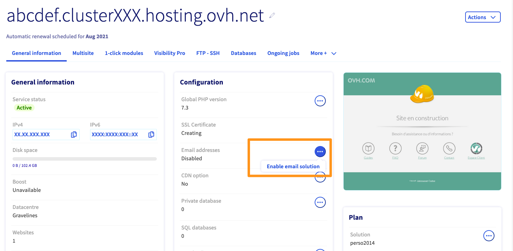
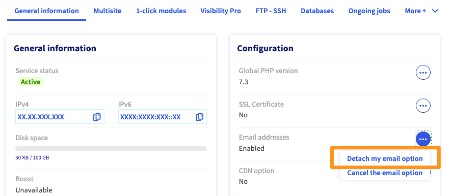

**Last updated 17th August 2020**

## Objective

If you have ordered a Web Hosting plan without directly linking it to a domain name, the email solution included with your Web Hosting plan must be enabled manually. You can link it to the domain name of your choice.

**Find out how to activate the email addresses included in your Web Hosting plan.**

## Requirements

- a [domain name](https://www.ovhcloud.com/en-au/domains/){.external} registered with OVHcloud
- an [OVHcloud Web Hosting plan](https://www.ovhcloud.com/en-au/web-hosting/)
- access to the [OVHcloud Control Panel](https://ca.ovh.com/auth/?action=gotomanager&from=https://www.ovh.com.au/&ovhSubsidiary=au) with the necessary permissions to manage the Web Hosting plan

## Instructions

### Activating your email solution

Log in to your [OVHcloud Control Panel](https://ca.ovh.com/auth/?action=gotomanager&from=https://www.ovh.com.au/&ovhSubsidiary=au) and select `Web Cloud`{.action} in the top navigation bar. Click `Hosting plans`{.action}, then choose the Web Hosting plan that has the email solution.

In the `Configuration` box, you will see `Email addresses`. Click the `...`{.action} button on the right, then `Enable email solution`{.action}.

{.thumbnail}

The activation window appears. Choose the domain name you would like to link your email addresses to, then confirm your choice.

{.thumbnail}

### Keeping your email addresses before your Web Hosting plan expires

When your Web Hosting plan expires or needs to be deleted, you can keep your email addresses.

Log in to your [OVHcloud Control Panel](https://ca.ovh.com/auth/?action=gotomanager&from=https://www.ovh.com.au/&ovhSubsidiary=au) and select `Web Cloud`{.action} in the top navigation bar. Click `Hosting plans`{.action}, then choose the Web Hosting plan that has the email solution.

In the `Configuration` box, click the `...`{.action} button to the right of the `Email addresses` entry, then click the `Detach my email option`{.action} button

{.thumbnail}

An MX solution will be offered for purchase. Once the order has been settled, your emails will continue to work after the Web Hosting plan is suspended.
 
### Deleting the email solution linked to your Web Hosting plan

You can permanently delete the email solution linked to your Web Hosting plan.

> [!warning]
>
>This action cannot be undone. You will not be able to reactivate the email solution after it has been cancelled.

Log in to your [OVHcloud Control Panel](https://ca.ovh.com/auth/?action=gotomanager&from=https://www.ovh.com.au/&ovhSubsidiary=au) and select `Web Cloud`{.action} in the top navigation bar. Click `Hosting plans`{.action}, then choose the Web Hosting plan that has the email solution.

In the `Configuration` box, click the `...`{.action} button to the right of the `Email addresses` entry, then click the `Cancel the email option`{.action} button.

{.thumbnail}

> [!warning]
>
> To confirm the deletion of the email solution linked to your Web Hosting plan, you will receive a confirmation link via email. You must click this link to start the delete operation.

## Go further

Join our community of users on <https://community.ovh.com/en/>
