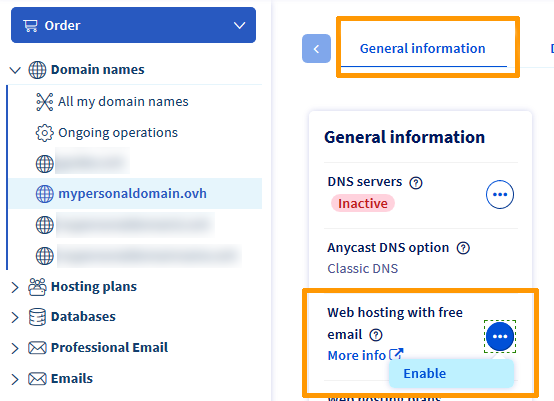
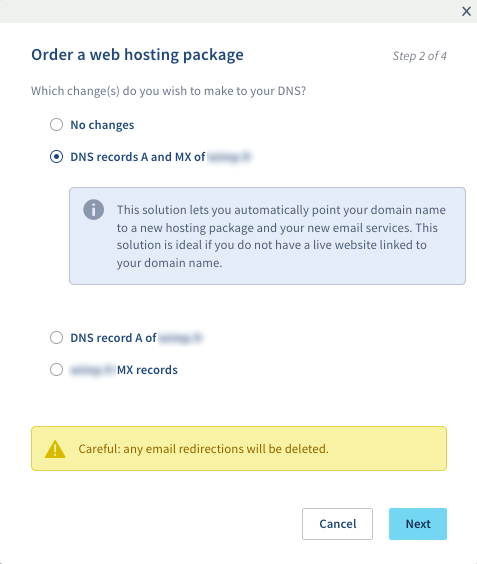

**Última atualização: 09/04/2020**

## Objetivo

Com o [Start 10M](https://www.ovh.pt/dominios/oferta_alojamento_start10m.xml){.external}, a OVHcloud oferece-lhe um alojamento web de 10 MB e uma conta de e-mail com 5 GB de capacidade de armazenamento. Este guia explica como pode ativar o alojamento Start 10M no seu [domínio](https://www.ovh.pt/dominios/){.external}.

<b>Saiba como ativar o alojamento gratuito Start 10M.</b>

## Requisitos

- Dispor, na Área de Cliente OVHcloud, de um [domínio](https://www.ovh.pt/dominios/){.external} não associado a um alojamento web.
- Ter acesso à [Área de Cliente OVHcloud](https://www.ovh.com/auth/?action=gotomanager){.external}.

## Instruções

Aceda à [Área de Cliente OVHcloud](https://www.ovh.com/auth/?action=gotomanager){.external}, clique em `Domínios`{.action}(**1**) na barra à esquerda e escolha o domínio em causa.

No menu **Informações gerais**(**2**), encontrará *Alojamento web e e-mail gratuito*. À direita, clique no botão `...`{.action} e, a seguir, em `Ativar`{.action}(**3**).

{.thumbnail}

Aparecerá a janela de ativação. A **etapa 1** faz menção ao serviço e ao seu custo. Clique em `Seguinte`{.action}. Na **etapa 2**, escolha as alterações a fazer à sua zona DNS:

{.thumbnail}

| Escolha                                       	| Descrição                                                                                                               								|
|--------------------------------------------	|-----------------------------------------------------------------------------------------------------------------------------------------------------------|
| Nenhuma alteração                           	| Nenhuma alteração de zona DNS e nenhum impacto sobre o site e os e-mails.                                               								|
| Os registos A e MX de *exemplo.com* 	| O domínio ficará associado ao endereço IP do alojamento Start 10M. Os servidores de e-mail OVHcloud também ficarão associados ao domínio. 	|
| O registo A de *exemplo.com*          	| O domínio ficará associado ao alojamento Start 10M sem que haja alterações relativamente aos servidores de e-mail.                             								|
| Os registos MX de *exemplo.com*      	| O domínio ficará associado aos servidores de e-mail OVHcloud sem que haja alterações ao nível do alojamento.  								|

> [!primary]
> O alojamento gratuito Start 10M não vem acompanhado de uma base de dados. Se o seu projeto requer uma base de dados, consulte os nossos [serviços de alojamento web](https://www.ovh.pt/alojamento-partilhado/).

Na **etapa 3**, leia e valide os termos e condições do serviço. Por fim, na **etapa 4**, clique em `Validar`{.action}.

Depois de validar o pedido, receberá um e-mail com as informações de [conexão FTP](../aceder-espaco-de-armazenamento-ftp-alojamento-web/){.external} ao seu alojamento Start 10M.

Consulte o guia de [criação de um endereço de e-mail com a oferta MX Plan](../../emails/e-mail_partilhado_guia_de_criacao_de_um_endereco_de_e-mail/){.external} para beneficiar do endereço de e-mail incluído no seu alojamento Start 10M.

## Quer saber mais?

[Aceder ao espaço de armazenamento do alojamento web](../aceder-espaco-de-armazenamento-ftp-alojamento-web/){.external}

[Criar um endereço de e-mail com a oferta MX Plan](../../emails/e-mail_partilhado_guia_de_criacao_de_um_endereco_de_e-mail/){.external}

Fale com a nossa comunidade de utilizadores em <https://community.ovh.com/en>

