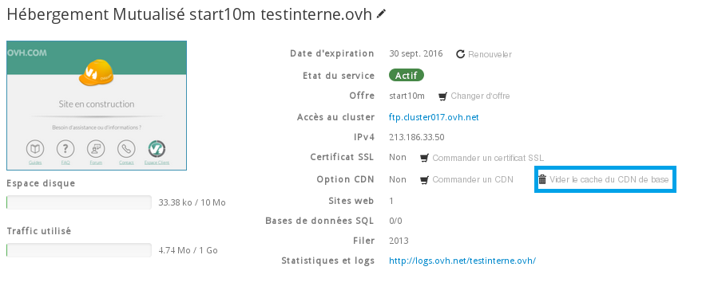
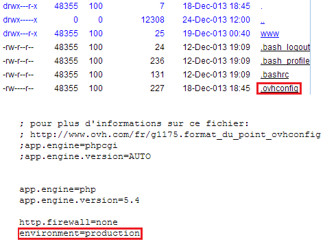

## 
Sign in to the [control panel](https://www.ovh.com/manager/web) using your OVH username (NIC) and password. 

Select your web hosting platform in the "Hosting" section.

{.thumbnail}


## Clearing the GeoCache Accelerator cache
The TTL (Time to Live - the time that a cached file remains on a PoP) goes from 5 to 60 minutes (which is managed by our servers for optimisation purposes). After this time has passed, the cached file is deleted. A new visitor will then have to request the file before it will be re-cached on the related PoP.

To replace a file cached on the PoPs after updating your website, you will need to clear the existing cache so that visitors will see the updated content. The files will be re-cached on each PoP when they are requested by visitors in the relevant zones.

To manually clear your cache on the PoPs of the OVH network, you just have to click on "Clear CDN cache"

{.thumbnail}


## Disable your GeoCache Accelerator
If you don't want to use the GeoCache included with your hosting package, there are various ways to disable it:


- Do not use the IP address (A record) associated with your hosting package. 
- Modify the rules file in the root folder of your hosting system (see next section).


Here we will explain how to change the IP address used by your hosting system.

To do this, go to the "Domain & DNS" section of the domain associated with your hosting service which uses th GeoCache. Then go to "DNS Zone."

Look for the "A record" under the list of DNS records, with an IP address in 213.xxx.xxxx.xxx * format.

* This is the IP address of the GeoCache Accelerator linked to your hosting service. To restore the GeoCache it must be re-entered here. The list of IPs can be found below or you can also request it from the support team.
Please make a note of this IP address so that you have it in the future when you need it.

Then click on "Edit" (the page with a pencil icon) next to the 'A' record to modify it.

You will be taken to a page with a form, where you will find the following fields:


- Sub-domain: 'A' record selected by default (do not change it)
- Select IP: select "Hosting"
- Select a hosting service: choose the domain name linked to your hosting service
- Select a country: you can geolocate your IP in the country of your choice


Then confirm your selection by clicking on "OK" at the bottom. The IP of your hosting system will then be changed and the update will be applied shortly.

Note: List of IPs related to the 3 PoPs/17 PoPs GeoCache

You can find out which cluster corresponds to your Web Hosting in your Control Panel under "Hosting" > "FTP" option, or in the installation email that was sent to you on activating your offer.

|Cluster|without Geocache|3 PoPs (Basic)|17 PoPs (Business)|
|002|37.187.184.2|213.186.33.2 or 213.186.33.68|213.186.33.69|
|003|37.187.184.4|213.186.33.4 or 213.186.33.84|213.186.33.85|
|005|37.187.184.16|213.186.33.16 or 213.186.33.94|213.186.33.95|
|006|37.187.184.17|213.186.33.17 or 213.186.33.96|213.186.33.97|
|007|37.187.184.18|213.186.33.18 or 213.186.33.104|213.186.33.105|
|010|37.187.184.19|213.186.33.19 or 213.186.33.106|213.186.33.107|
|011|37.187.184.40|213.186.33.40 or 213.186.33.150|213.186.33.151|
|012|37.187.184.48|213.186.33.48 or 213.186.33.152|213.186.33.153|
|013|37.187.184.24|213.186.33.24 or 213.186.33.82|213.186.33.83|
|014|37.187.184.87|213.186.33.87 or 213.186.33.168|213.186.33.169|

|015|37.187.184.3|213.186.33.3 or
213.186.33.170|213.186.33.171|
|017|37.187.184.50|213.186.33.50 or 213.186.33.172|213.186.33.173|


## 
To access this file you will need to connect to your hosting space via FTP. 

You can use the 'FileZilla' FTP client for this.


## Enable/Disable the GeoCache Accelerator
Once you have logged into your hosting system via FTP, you will automatically reach the root directory. Several files and folders should be located here, including the ".ovhconfig" file.

Download this file to your PC (by double clicking) and open using a text editor. Rename the file as 'ovhconfig.txt' if necessary.

In the lines beginning with "environment" replace "production" with "development". 

Rename the file as '.ovhconfig' again and return it to the FTP root, replacing the existing file. 

To renable the GeoCache, simply replace environment" with "production" again.

{.thumbnail}
You can also add the following ling to your .htaccess file:

```
Header set Cache-Control "no-cache"
```


