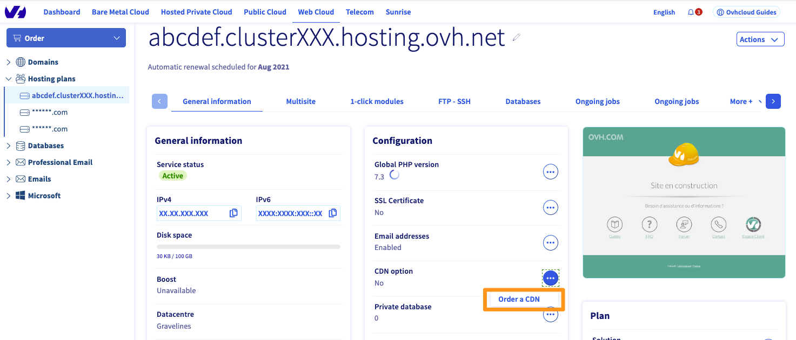
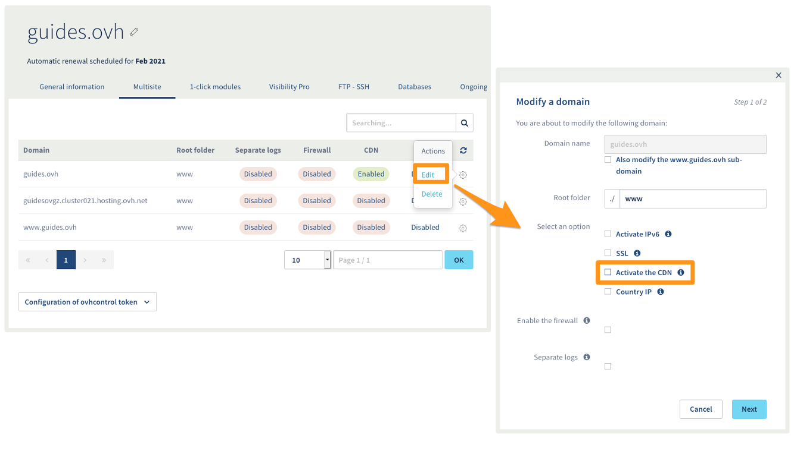
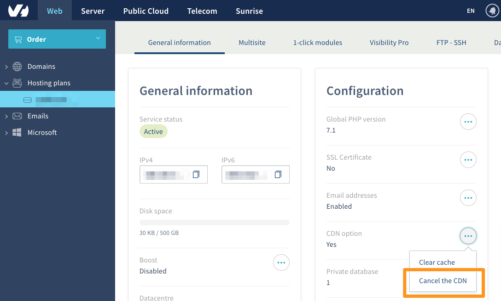

**Dernière mise à jour le 05/05/2020**

## Objectif

Si vous souhaitez améliorer l'expérience de vos utilisateurs en accélérant votre site web, la technique la plus efficace est d'activer un CDN (Content Delivery Network). Ce dernier permet de mettre en cache les fichiers statiques tels que les images, les css et les javascript, dans des serveurs plus proches de vos clients.

**Découvrez comment gérer l'option CDN de votre hébergement web.**

## Définition

**Comment fonctionne un CDN ?**

Le CDN (Content Delivery Network) est littéralement un réseau dédié à la livraison de contenu. Il utilise plusieurs serveurs déployés autour du monde pour afficher votre site web. Plus ces serveurs sont proches de vos utilisateurs, plus votre site web est rapide pour eux.

Pour fonctionner, chaque serveur garde en mémoire cache une partie de votre site web. Généralement, il est conseillé d'y inclure les fichiers dits statiques : les images, les fichiers javascript et css qui permettent le bon fonctionnement de votre site mais qui ne sont que très rarement modifiés.

## Prérequis

- Être connecté à votre [espace client OVHcloud](https://www.ovh.com/auth/?action=gotomanager){.external}.
- Posséder une [offre d'hébergement web](https://www.ovh.com/ca/fr/hebergement-web/){.external}.

## En pratique

###  Activer l'option CDN

> [!primary]
> 
> L'option CDN est déjà incluse dans les offres d'hébergement web Performance.

####  Si vous n'avez pas de CDN sur votre hébergement Web

Connectez-vous à votre [espace client](https://www.ovh.com/auth/?action=gotomanager){.external} puis sélectionnez `Web`{.action}. Cliquez sur `Hébergements`{.action} dans la barre de services située à gauche et choisissez l'offre concernée. Cliquez sur `...`{.action} à droite de « Option CDN » puis sur `Commander un CDN`{.action}.

{.thumbnail}

Vous serez redirigé vers la génération du bon de commande. Une fois la commande payée, votre service sera disponible en quelques minutes.

#### Si le CDN est déjà activé sur votre hébergement Web

Connectez-vous à votre [espace client](https://www.ovh.com/auth/?action=gotomanager){.external} puis sélectionnez `Web`{.action}. Cliquez sur `Hébergements`{.action} dans la barre de services située à gauche et choisissez l'offre concernée. Dans l'onglet `Multisite`{.action}, cliquez sur la roue crantée à droite de l'entrée multisite puis cliquez sur `Modifier`{.action}.

Cochez la mention « Activer le CDN », cliquez sur `Suivant`{.action} puis sur `Valider`{.action}.

{.thumbnail}

> [!warning]
> 
> Dans le cas d'un nom de domaine externe à OVHcloud ajouté en multisite sur l'hébergement web, vous devez mentionner l'adresse IP du CDN de votre hébergement dans la zone DNS du nom de domaine.<br>
> Consultez la [liste des adresses IP des clusters et hébergement web](../liste-des-adresses-ip-des-clusters-et-hebergements-web/){.external} pour retrouver l'adresse IP spécifique du CDN de votre cluster.

 
**Pourquoi ne puis-je pas beneficier de l'IP géolocalisée avec l'option CDN ?** <br>
<br>
Le CDN utilise le principe des IP anycast. Vous n'interrogerez pas le même serveur en fonction de votre géolocalisation, ce qui est très efficace pour réduire le temps de chargement de vos fichiers statiques. La géolocalisation d'adresse IP est donc inutile. <br>
Concernant le SEO (référencement sur les moteurs de recherche), la vitesse d'affichage de votre site web a plus d'importance que la géolocalisation de l'adresses IP de votre hébergement.


### Comment mettre en cache mes fichiers dans le CDN ?

**En utilisant un CMS**

Les principaux CMS distribuent de nombreux plugins permettant de configurer la mise en cache des fichiers statiques afin qu'ils soient pris en compte automatiquement par le CDN. D'autres permettent la configuration automatique des fichiers statiques en activant la mise en cache intégrée au CMS. Pour plus d'informations, référez-vous à la documentation officielle du CMS que vous utilisez ou de l'éditeur du plugin.

**Sans utiliser de CMS**

Si vous n'utilisez pas de CMS, vous pouvez aussi bénéficier du cache du CDN. Pour cela, vous devez ajouter des headers sur les requêtes HTTP. Il existe plusieurs techniques permettant d'ajouter ces headers. L'une des plus simples est de définir des régles au sein d'un fichier .htaccess en fonction des extensions de fichiers.

```htaccess
1. # Cache des images durant 1 semaine
2. <FilesMatch "\.(jpg|jpeg|png|gif)$">
3. Header set Cache-Control "max-age=604800, public"
4. </FilesMatch>
5. 
6. # Cache des javascript et CSS durant 1 mois
7. <FilesMatch "\.(js|css)$">
8. Header set Cache-Control "max-age=2592000"
9. </FilesMatch>
```
> [!warning]
>
> La mise en cache via les headers HTTP permet la mise en cache au sein du CDN mais aussi au sein du navigateur de vos utilisateurs. Ainsi, pour éviter que vos visiteurs ne visualisent une version en cache trop ancienne, il est recommandé de modifier les noms des fichiers à chaque nouvelle version.
> 


### Vider le cache du CDN

Il est parfois utile de vider le cache du CDN, notamment lorsque vous modifiez vos fichiers statiques. Par exemple lors de la mise en production d'une nouvelle version de votre site. Dans ce cas, vous pouvez vider totalement le cache du CDN.

Connectez-vous à votre [espace client](https://www.ovh.com/auth/?action=gotomanager){.external} puis sélectionnez `Web`{.action}. Cliquez sur `Hébergements`{.action} dans la barre de services située à gauche et choisissez l'offre concernée. Cliquez sur `...`{.action} à droite de « Option CDN » puis sur `Vider le cache`{.action}.

{.thumbnail}

### Desactiver l'option CDN

Cette action permet de désactiver le CDN pour une ou plusieurs de vos entrées multisite sans supprimer l'option CDN de votre hébergement Web.

Rendez-vous dans votre [espace client](https://www.ovh.com/auth/?action=gotomanager){.external} puis sélectionnez `Web`{.action}. Cliquez sur `Hébergements`{.action} dans la barre de services située à gauche et choisissez l'offre concernée. Dans l'onglet `Multisite`{.action}, cliquez sur la roue crantée à droite de l'entrée multisite puis `Modifier`{.action}.

Décochez la mention « Activer le CDN », cliquez sur `Suivant`{.action} puis sur `Valider`{.action}.

{.thumbnail}

### Supprimer l'option CDN

Cette action a pour but de supprimer l'option CDN pour l'ensemble de votre hébergement Web.

Rendez-vous dans votre [espace client](https://www.ovh.com/auth/?action=gotomanager){.external} puis sélectionnez `Web`{.action}. Cliquez sur `Hébergements`{.action} dans la barre de services située à gauche et choisissez l'offre concernée. Cliquez sur `...`{.action} à droite de « Option CDN » puis sur `Résilier le CDN`{.action}.

{.thumbnail}

Cliquez sur `Valider`{.action} pour confirmer la résiliation.

> [!warning]
>
> Un e-mail contenant la procédure de fermeture de votre CDN vous sera envoyé, il est nécessaire de suivre les instructions de celui-ci afin de confirmer ou annuler la demande. 
> 


### Vérifier que votre CDN est en service

Pour vous assurer que le CDN est bien actif sur votre nom de domaine, il est possible d'effectuer une vérification via un terminal avec la commande suivante :

```
curl -i http://yourpersonnaldomain.ovh/
```

Si votre nom de domaine est bien pris en charge par le CDN, vous obtiendrez un résultat comme ci-dessous :

```
HTTP/1.1 200 OK
Date: Mon, 01 Jan 2020 00:00:00 GMT
Content-Type: text/html; charset=UTF-8
Set-Cookie: SERVERID12345=123456; path=/; max-age=900
Vary: Accept-Encoding
X-Request-ID: 123456789
X-CDN-Pop: rbx1
X-CDN-Pop-IP: 00.111.22.333/44
X-Cacheable: Cacheable
Accept-Ranges: bytes
Transfer-Encoding: chunked
X-IPLB-Instance: 12345
```
Les mentions « *X-CDN* » permettent de confirmer que vous passez bien par le CDN.

Dans le cas où le nom de domaine ne passe pas par le CDN, vous obtenez un résultat comme ci-dessous :

```
HTTP/1.1 200 OK
Date: Mon, 01 Jan 2020 00:00:00 GMT
Content-Type: text/html; charset=UTF-8
Set-Cookie: SERVERID12345=123456; path=/; max-age=900
Server: Apache
X-Powered-By: PHP/7.1
Vary: Accept-Encoding
X-IPLB-Instance: 12345
```

L'absence de la mention « *X-CDN* » indique que vous ne passez pas à travers le CDN.

## Aller plus loin

Échangez avec notre communauté d’utilisateurs sur [https://community.ovh.com/](https://community.ovh.com/){.external}.
