> [!primary]
> Tłumaczenie zostało wygenerowane automatycznie przez system naszego partnera SYSTRAN. W niektórych przypadkach mogą wystąpić nieprecyzyjne sformułowania, na przykład w tłumaczeniu nazw przycisków lub szczegółów technicznych. W przypadku jakichkolwiek wątpliwości zalecamy zapoznanie się z angielską/francuską wersją przewodnika. Jeśli chcesz przyczynić się do ulepszenia tłumaczenia, kliknij przycisk „Zaproponuj zmianę” na tej stronie.
>

**Ostatnia aktualizacja z dnia 23-12-2021**

## Wprowadzenie

Jeśli chcesz poprawić doświadczenia użytkowników Twojej witryny, przyspieszając jej działanie, najskuteczniejszym sposobem będzie aktywacja usługi GeoCache. Umożliwia ona przeniesienie do pamięci podręcznej plików statycznych, takich jak obrazy, pliki CSS i JavaScript, na serwerach znajdujących się najbliżej klientów.

**Odkryj, jak zarządzać opcją GeoCache w Twoim hostingu WWW.**

## Definicja

**Jak działa GeoCache?**

GeoCache to sieć serwerów służąca do optymalizacji dostarczania treści. Wykorzystuje liczne serwery rozsiane po całym świecie, by wyświetlać Twoją witrynę WWW. Im bliżej te serwery znajdują się Twoich użytkowników, tym większa będzie szybkość ładowania Twojej witryny.

Każdy serwer przechowuje w pamięci podręcznej (cache) część Twojej witryny. Ogólnie zaleca się, by przechowywać tam tzw. pliki statyczne, czyli obrazy, pliki JavaScript i CSS, które umożliwiają prawidłowe działanie witryny, ale bardzo rzadko są modyfikowane.

## Wymagania początkowe

- Dostęp do [Panelu klienta OVHcloud](https://www.ovh.com/auth/?action=gotomanager&from=https://www.ovh.pl/&ovhSubsidiary=pl).
- Posiadanie [hostingu WWW](https://www.ovhcloud.com/pl/web-hosting/).

## W praktyce

###  Wdrożenie opcji CDN

> [!primary]
> 
> Opcja GeoCache jest zawarta w ofertach hostingowych Performance.

####  Jeśli opcja CDN nie jest zamówiona lub włączona na Twoim hostingu

Zaloguj się do Panelu [klienta OVHcloud](https://www.ovh.com/auth/?action=gotomanager&from=https://www.ovh.pl/&ovhSubsidiary=pl) i wybierz `Web Cloud`{.action}. Kliknij przycisk `Hostingi`{.action} i wybierz odpowiednie rozwiązanie. Kliknij `...`{.action} po prawej stronie "Opcji GeoCache", a następnie `Zamów CDN`{.action} lub `Włącz opcję`{.action}, jeśli opcja GeoCache jest już zawarta w Twoim hostingu.

> [!primary]
> 
> Jeśli posiadasz opcję CDN sprzed 19/11/2020, możesz zamówić nową usługę Shared CDN klikając na `Aktualizuj CDN do wyższej`{.action} wersji.

{.thumbnail}

Zostaniesz przekierowany do formularza zamówienia. Usługa zostanie aktywowana kilka minut po jej opłaceniu.

#### Jeśli opcja CDN jest już włączona na Twoim hostingu

Zaloguj się do Panelu [klienta OVHcloud](https://www.ovh.com/auth/?action=gotomanager&from=https://www.ovh.pl/&ovhSubsidiary=pl) i wybierz `Web Cloud`{.action}. Kliknij przycisk `Hostingi`{.action} i wybierz odpowiednie rozwiązanie. W karcie `Multisite`{.action} kliknij ikonę koła zębatego po prawej stronie, a następnie wybierz `Zmień`{.action}.

Zaznacz opcję „Aktywuj GeoCache”, kliknij przycisk `Dalej`{.action}, a następnie `Zatwierdź`{.action}.

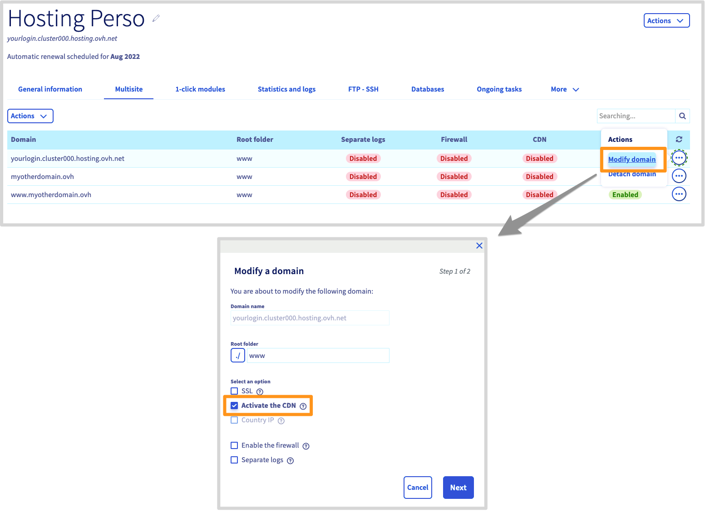{.thumbnail}

> [!warning]
> 
> W przypadku nazwy domeny wykupionej poza OVHcloud i dodanej w opcji Multisite w hostingu WWW, należy podać adres IP Twojego hostingu w strefie DNS dla nazwy domeny.<br>
> Zapoznaj się z [listą adresów IP klastrów i hostingów WWW](https://docs.ovh.com/pl/hosting/lista-adresow-ip-klastrow-i-hostingow-www/), aby znaleźć adres IP wykorzystywany przez usługę GeoCache w Twoim klastrze.

 
**Dlaczego nie mogę korzystać z geolokalizowanego adresu IP z opcją CDN?** <br>
<br>
Funkcja GeoCache wykorzystuje zasadę działania IP Anycast. Użytkownik nie łączy się z tym samym serwerem z każdej lokalizacji, lecz z najbliższym, co pozwala bardzo skutecznie skrócić czas ładowania plików statycznych. Geolokalizacja adresu IP jest więc zbędna. <br>
Jeśli chodzi o SEO (pozycjonowanie w wyszukiwarkach), szybkość wyświetlania strony ma większe znaczenie niż geolokalizacja adresu IP hostingu.

### Zarządzaj usługą Shared CDN 

> [!primary]
> 
> Opcja shared CDN jest już zawarta w ofercie hostingu Performance lub dostępna w zamówieniu od 19/11/20. W przypadku starszych wersji, skorzystaj z punktu [Zarządzanie usługą CDN (wersja historyczna)](#cdnbusiness).

#### Wyczyść cache usługi Shared CDN

Czasem konieczne może okazać się usunięcie pamięci podręcznej z GeoCache, zwłaszcza po wprowadzeniu zmian w plikach statycznych. Na przykład przy publikowaniu nowej wersji swojej witryny. Możesz wyczyścić cache dla każdego wpisu w opcji MultiSite.

Przejdź do karty `MultiSite`{.action} Twojego hostingu, kliknij `...`{.action} po prawej stronie wpisu MultiSite, a następnie `Wyczyść CDN`{.action}.

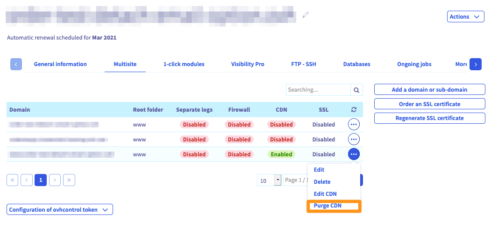{.thumbnail}

#### Konfiguracja opcji usługi Shared CDN

Przejdź do karty `MultiSite`{.action} hostingu, kliknij `...`{.action} po prawej stronie MultiSite, a następnie  `Zmień CDN`{.action}. 

> [!warning]
> 
> Niektóre opcje są zablokowane dla oferty Basic i wymagają zamówienia usługi [CDN security](https://www.ovhcloud.com/pl/web-hosting/options/cdn/) lub [CDN Advanced](https://www.ovhcloud.com/pl/web-hosting/options/cdn/)

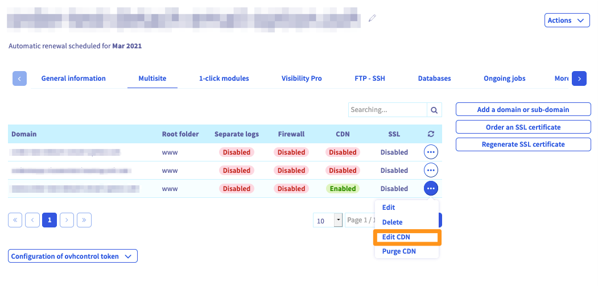{.thumbnail}

- **Zawsze online**: Umożliwia przechowywanie danych CDN online w przypadku awarii serwera.

- **HTTP/2**: Protokół umożliwiający zwiększenie wydajności strony www pod względem bezpieczeństwa i czasu odpowiedzi.

- **Dev-mode**: pozwala na wyłączenie cache podczas tworzenia strony.

- **Brotli**: rodzaj kompresji pozwalającej na optymalizację rozmiaru plików w pamięci cache.

- **Zasada cache**: Utwórz do 5 reguł. Określają one częstotliwość odświeżania bufora dla określonych zasobów na Twojej stronie. ([postępuj zgodnie z kolejnymi krokami](#cacherules)). 

Po wybraniu opcji kliknij `Zastosuj konfigurację`{.action}, a następnie `Zatwierdź konfigurację`{.action} w następnym oknie.

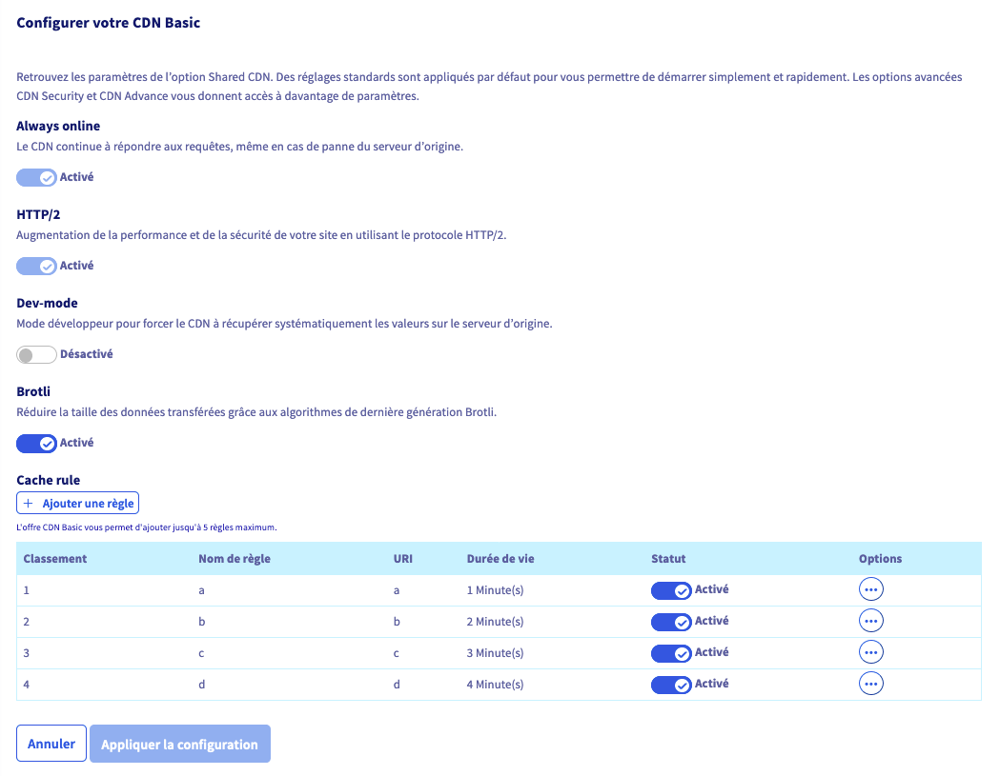{.thumbnail}

##### **Utwórz regułę cache** <a name="cacherules"></a>

Aby dodać regułę cache do jednego z elementów Twojej strony, przejdź do karty `MultiSite`{.action} hostingu, kliknij `...`{.action} po prawej stronie wpisu MultiSite, a następnie `Skonfiguruj CDN`{.action}.

W pozycji **Reguły cache** kliknij przycisk `Dodaj regułę`{.action}.

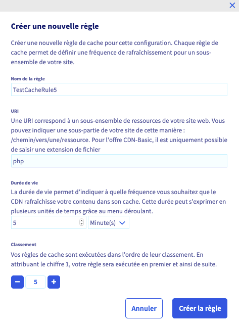{.thumbnail}

- **Nazwa reguły**: Nadaj nazwę swojej regule.

- **URI**: Wpisz podzbiór zasobów Twojej strony WWW, korzystając z jej ścieżki do URL. W przypadku ofert CDN-Basic i CDN-Security można podać tylko rozszerzenie pliku.

- **Czas**: wskaż czas przechowywania wybranego zasobu w pamięci cache.

- **Klasyfikacja**: Ustaw kolejność wykonywania reguł (od najniższej do najwyższej).

Po dokonaniu wyboru kliknij przycisk `Utwórz regułę`{.action}.

Reguły znajdują się na liście. Możesz zmienić regułę klikając na `...`{.action} po prawej stronie, a następnie na `Zmień regułę`{.action}; lub usunąć ją, klikając `Usuń regułę`{.action}.

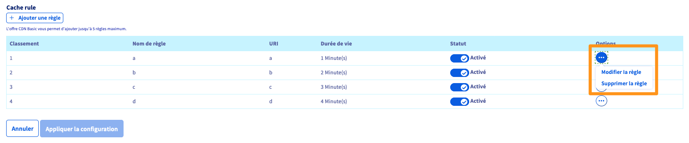{.thumbnail}

Po skonfigurowaniu reguł i wybraniu opcji kliknij `Zastosuj konfigurację`{.action}, a następnie `Zatwierdź konfigurację`{.action} w następnym oknie.

> [!warning]
>
> Aby korzystać z wyższego limitu reguł i dodatkowych parametrów podczas tworzenia reguły cache, możesz wybrać opcję [CDN Advanced](https://www.ovhcloud.com/pl/web-hosting/options/cdn/).

#### Konfiguracja opcji CDN Security

Przejdź do karty `MultiSite`{.action} hostingu, kliknij `...`{.action} po prawej stronie MultiSite, a następnie `Zmień CDN`{.action}. 

> [!primary]
>
> Poniższe opcje wymagają zamówienia na [CDN security](https://www.ovhcloud.com/pl/web-hosting/options/cdn/) lub [CDN Advanced](https://www.ovhcloud.com/pl/web-hosting/options/cdn/)

- **Cross-Origin Resource Sharing (CORS)**: Wpisz na liście nazwy domen zewnętrznych, które będą mogły uzyskać dostęp do zasobów Twojej strony WWW, aby je udostępnić. 

	Po włączeniu funkcji kliknij `Edytuj listę zewnętrznych`{.action} zasobów, aby dodać domeny, które mogą współdzielić Twoje zasoby.

	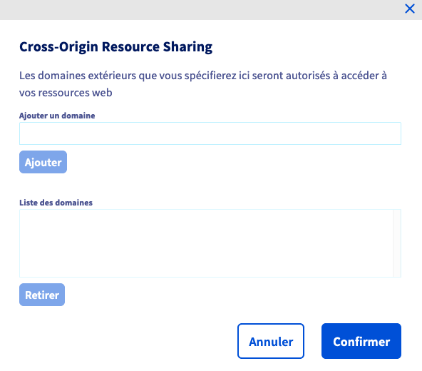{.thumbnail}

	Po uzupełnieniu listy kliknij `Zatwierdź`{.action}.

> [!primary]
>
> Kiedy aktywujesz opcję CORS bez podawania nazw domen na liście, oznacza to, że wszystkie domeny mogą używać zasobów Twojej strony WWW.

- **HTTPS-redirect**: Chroń cały ruch na Twojej stronie WWW poprzez przekierowanie go na protokół HTTPS tymczasowo lub na stałe.

	Po włączeniu funkcji kliknij rozwijane menu, aby wybrać między stałym `przekierowaniem (301)` lub tymczasowym `przekierowaniem (302)`.

	{.thumbnail}

- **HTTP Strict Transport Security (HSTS)**: Zarządzaj dostępem do Twojej strony WWW za pomocą protokołu HTTPS. Rozwiązanie WWW jest więc zabezpieczone przed atakami przez retrogradację (lub ataki typu repli).

	Po aktywacji funkcji określ okres, w którym przeglądarka zastosuje funkcję HSTS na Twojej stronie WWW. 

	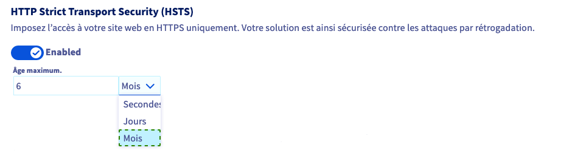{.thumbnail}

> [!primary]
>
> Po włączeniu funkcji HSTS na Twojej stronie, zmusi ona protokół HTTPS do Twojej przeglądarki aż do końca tzw. "wieku maksymalnego", nawet po wyłączeniu funkcji w Panelu klienta. Jeśli pamięć podręczna jest usuwana z przeglądarki, która już przeprowadziła wizytę na Twojej stronie WWW, strona ta zastosuje nowy stan funkcji HSTS.

- **Mixed content**: Wymuś załadowanie całej zawartości stron www w bezpieczny sposób, przyczyniając się tym samym do optymalnego doświadczenia użytkownika. Wszystkie zasoby Twojej strony WWW, zarówno wewnętrzne, jak i zewnętrzne, muszą być dostępne za pomocą protokołu HTTPS, aby uniknąć błędu w zakresie bezpieczeństwa przeglądarki.

- **Firewall aplikacyjny**: Sieć **W**eb **A**pplication **F**irewall (WAF) chroni Twoją stronę WWW przed oszukańczymi atakami, takimi jak wprowadzanie kodu, nieuprawnione zapytania lub kradzież danych. Pokrywa on główne znane luki w sieci, filtrując przekazane zapytania i pakiety (lista luk jest zarządzana przez OVHcloud i regularnie aktualizowana, aby rozszerzyć Twoją ochronę).  

> [!warning]
>
> Aby instalacja [modułu za pomocą 1 kliknięcia OVHcloud](../hosting_www_przewodniki_dotyczace_modulow_na_hostingu_www/) mogła zostać wyłączona, należy wyłączyć WAF.

> [!primary]
>  
> WAF jest w pełni administrowany przez OVHcloud. Lista luk jest regularnie aktualizowana.

#### Konfiguracja opcji CDN Advanced

Przejdź do karty `MultiSite`{.action} hostingu, kliknij `...`{.action} po prawej stronie MultiSite, a następnie `Zmień CDN`{.action}. 

> [!primary]
>
> Poniższe opcje wymagają zamówienia usługi [CDN Advanced](https://www.ovhcloud.com/pl/web-hosting/options/cdn/).

- **Header HTTP z geolokalizacją**: Określ kraj odwiedzającego, aby spersonalizować proponowane doświadczenie. Kod kraju jest automatycznie dodawany do nagłówka każdego zapytania, aby mógł być zarządzany przez Twój serwer. Elementy identyfikacyjne w nagłówku są oznaczone `Geo-Country-Code`, `Geo-Country-Name`, `Geo-Region`, `Geo-City`.

- **Prefetch**: Przewiduj załadowanie tego zasobu. Prześlij ją automatycznie do pamięci cache CDN za pomocą *header link* Twojej strony WWW. Mechanizm ten jest używany przede wszystkim do ładowania CSS, JavaScript, zdjęć, plików wideo lub czcionek www, które są wymagane przez motyw strony internetowej. 

	W poniższym przykładzie, gdy jesteś na bieżącej stronie wyświetlającej "Hello", zapytanie podrzędne uruchamia wstępne załadowanie zasobów `/cache/style.css`.  

	```	
	<?php
	header("Link: </cache/style.css>; rel=prefetch");
	print Hello
	?> 
	```

- **Telefon komórkowy**:  Przekieruj automatycznie użytkowników "Mobile" na zoptymalizowaną stronę www. Do wyboru: systematycznie przekierowywać stronę główną innej strony lub zachować adres URL, zastępując tylko domenę (lub subdomenę).

- **Czyszczenie zaawansowane**: Spersonalizuj wyczyszczenie, wybierając elementy pamięci cache, które chcesz opróżnić: cała strona, folder, URI, rozszerzenie plików lub za pomocą regularnych ustawień. 

	W zakładce MultiSite kliknij przycisk `...`{.action} po prawej stronie wpisu MultiSite, a następnie `Wyczyść CDN`{.action}. 

	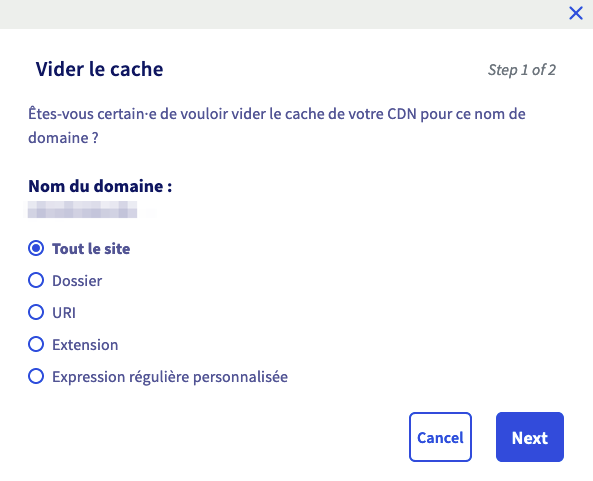{.thumbnail}

- **Query String**: Zarządzanie umieszczeniem w pamięci cache treści, w oparciu o parametry (zwane również *Query String*) zapytania URL. W zależności od konfiguracji wybierz zachowanie pamięci cache CDN:
	- *Wyłączone*: Zasoby są umieszczane w pamięci cache z ustawieniami bez sortowania. Co spowoduje na przykład utworzenie 2 iteracji w pamięci cache CDN dla 2 URL o tych samych parametrach w innej kolejności.
	- *Aktywny - Sortuj parametry*: Zasób jest umieszczany w pamięci cache, sortując jego parametry. Przed zapisaniem adresu URL w pamięci cache CDN zostanie wykonany sortowanie. Na przykład tylko jedna iteracja będzie przechowywana dla 2 adresów URL o tych samych parametrach w innej kolejności.
	- *Aktywny - Pomiń parametry*: Zasoby są umieszczane w pamięci cache bez żadnych parametrów. Pamięć podręczna CDN nie będzie uwzględniała parametrów wpisanych w adresie URL. Będzie więc przechowywała URL bez ustawień w cache.

- **Prewarm**: Wymuś stałe przechowywanie Twoich pierwotnych zasobów. CDN automatycznie przewiduje i odświeża cache, nie czekając na zapytanie użytkownika. Funkcja ta ma zastosowanie wyłącznie do treści statycznych o TTL powyżej 0, a zasoby nie mogą przekraczać 1GB. Przyrząd określi poziom zużycia zasobów w *Prewarm*, w zależności od listy Twoich URL. Łączne zasoby wywoływane przez te adresy URL nie mogą przekraczać 1GB.

	Aby określić listę adresów URL, które mają być skonfigurowane w *programie Prewarm*, kliknij `Edytuj listę adresów URL`{.action}.

	Za pomocą pól `Protokół`, `Domena` i `Ścieżka zasobu`, wpisz jeden z linków do zasobu, który chcesz dodać do funkcji **Prewarm**, a następnie kliknij `Dodaj`{.action}.

	Listę tworzy się w dolnej części, wraz ze wszystkimi linkami, które masz na liście, możesz usunąć jeden z wybranych przez Ciebie, a następnie klikając `Usuń`{.action}.

	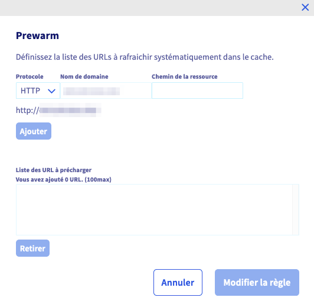{.thumbnail}

- **Cache rule**: Utwórz do 100 reguł. Określają one częstotliwość odświeżania bufora dla określonych zasobów na Twojej stronie. Aby uzyskać więcej informacji, zapoznaj się [z przewodnikiem](#cacherulesadv).

Po wybraniu opcji kliknij `Zastosuj konfigurację`{.action}, a następnie `Zatwierdź konfigurację`{.action} w następnym oknie.

##### **Tworzenie reguły zaawansowanego cache** <a name="cacherulesadv"></a>

Aby dodać regułę cache do jednego z elementów Twojej strony, przejdź do karty `MultiSite`{.action} hostingu, kliknij `...`{.action} po prawej stronie wpisu MultiSite, a następnie `Skonfiguruj CDN `{.action}.

W pozycji **Reguły cache** kliknij przycisk `Dodaj regułę`{.action}.

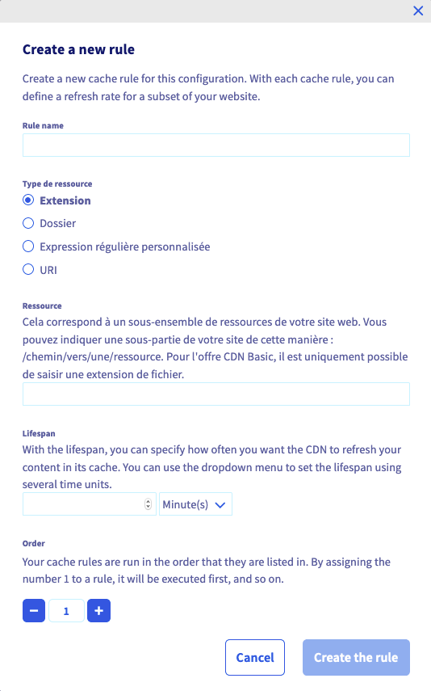{.thumbnail}


* **Nazwa reguły**: Nadaj nazwę swojej regule.
* **Rodzaj zasobów**: Wybierz spośród poniższych opcji:
    * **Rozszerzenie**: Wprowadź poprawne rozszerzenie plików, na przykład css
    * **Dokumentacja**:  Wprowadź prawidłową ścieżkę dla jednego z katalogów znajdujących się w katalogu głównym Twojej strony WWW.
    * **Regularne spersonalizowane**: wyrażenie: Dotyczy ona wszystkich URI Twojej strony WWW.
    * **URI**: Wpisz podzbiór zasobów Twojej strony WWW, korzystając z jej ścieżki do URL.
* **Zasoby**: definiuj atrybuty według wybranego typu zasobów.
* **Czas trwania**: Wskaż czas przechowywania wybranego zasobu w pamięci cache.
* **Klasyfikacja**:  Ustaw kolejność wykonywania reguł (od najniższej do najwyższej).

Po dokonaniu wyboru kliknij przycisk `Utwórz regułę`{.action}.

Reguły znajdują się na liście. Możesz zmienić regułę klikając `...`{.action} po prawej stronie, po czym kliknij `Zmień regułę`{.action}. Możesz ją usunąć, klikając `Usuń regułę`{.action}.

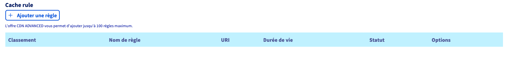{.thumbnail}

Po skonfigurowaniu reguł i wybraniu opcji kliknij `Zastosuj konfigurację`{.action}, a następnie `Zatwierdź konfigurację`{.action} w następnym oknie.

### Wyświetl statystyki usługi CDN

W zakładce `MultiSite`{.action} Twojego hostingu, w tabeli możesz wyświetlić statystyki usługi CDN, wskazując liczbę zapytań na minutę zmierzonych w tym CDN.

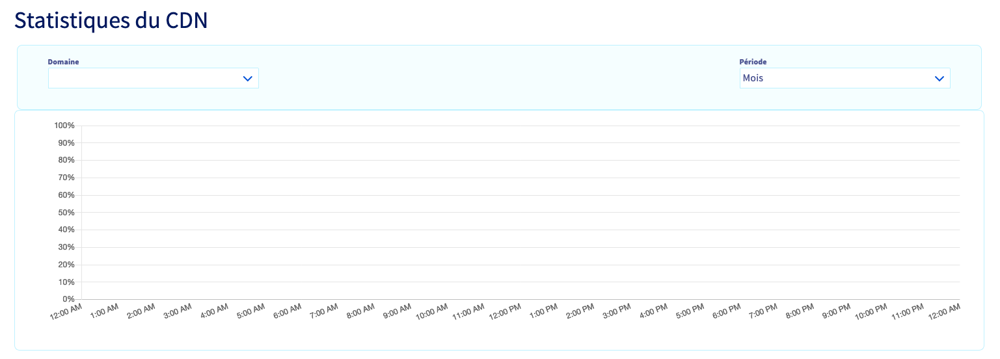{.thumbnail}

### Zarządzaj usługą CDN Business <a name="cdnbusiness"></a>

> [!primary]
> 
> Opcja CDN jest już zawarta w ofertach hostingu Performance lub w ofertach zamówionych przed 19/11/2020.

#### Czyszczenie pamięci cache w GeoCache

Czasem konieczne może okazać się usunięcie pamięci podręcznej z GeoCache, zwłaszcza po wprowadzeniu zmian w plikach statycznych. Na przykład przy publikowaniu nowej wersji swojej witryny. Należy wówczas całkowicie wyczyścić pamięć podręczną w GeoCache.

Zaloguj się do Panelu [klienta OVHcloud](https://www.ovh.com/auth/?action=gotomanager&from=https://www.ovh.pl/&ovhSubsidiary=pl) i wybierz `Web Cloud`{.action}. Kliknij przycisk `Hostingi`{.action} i wybierz odpowiednie rozwiązanie. Kliknij `...`{.action} po prawej stronie "Opcji GeoCache", a następnie `Wyczyść pamięć cache`{.action}.

{.thumbnail}

### Jak przenieść pliki do pamięci cache w usłudze GeoCache?

**Za pomocą systemu CMS**

Główne systemy CMS proponują wiele wtyczek umożliwiających konfigurację pamięci cache plików statycznych, aby były one automatycznie uwzględniane przez CDN. Inne z kolei pozwalają automatycznie skonfigurować pliki statyczne, aktywując zintegrowaną z CMS-em funkcję przenoszenia plików do pamięci podręcznej. Aby uzyskać więcej informacji, zapoznaj się z oficjalną dokumentacją używanego systemu CMS lub skontaktuj się z autorem wtyczki.

**Bez używania systemu CMS**

Jeśli nie korzystasz z CMS-a, również możesz korzystać z usługi GeoCache. W tym celu należy dodać nagłówki do żądań HTTP. Istnieje wiele sposobów na ich dodanie. Jednym z najprostszych jest zdefiniowanie reguł w pliku .htaccess, w zależności od rozszerzeń plików.

```htaccess
1. # Przechowywanie obrazów w pamięci cache przez okres 1 tygodnia
2. <FilesMatch "\.(jpg|jpeg|png|gif)$">
3. Header set Cache-Control "max-age=604800, public"
4. </FilesMatch>
5. 
6. # Przechowywanie plików JavaScript i CSS przez 1 miesiąc
7. <FilesMatch "\.(js|css)$">
8. Header set Cache-Control "max-age=2592000"
9. </FilesMatch>
```
> [!warning]
>
> Przeniesienie do pamięci cache za pomocą nagłówków HTTP umożliwia przechowywanie plików nie tylko w GeoCache, ale też w przeglądarkach Twoich użytkowników. Dlatego też zaleca się zmienianie nazw plików po każdym ich uaktualnieniu, aby internauci nie oglądali nieaktualnych wersji plików znajdujących się w pamięci cache.
> 

### Wyłącz opcję CDN dla strony www

Operacja ta pozwala wyłączyć CDN dla jednej lub kilku pozycji podpiętych w opcji MultiSite, bez usuwania opcji GeoCache z Twojego hostingu WWW.

Przejdź do Panelu [klienta OVHcloud](https://www.ovh.com/auth/?action=gotomanager&from=https://www.ovh.pl/&ovhSubsidiary=pl) i wybierz `Web Cloud`{.action}. Kliknij przycisk `Hostingi`{.action} i wybierz odpowiednie rozwiązanie. W zakładce `MultiSite`{.action} kliknij `...`{.action} po prawej stronie pozycji MultiSite, a następnie `Zmień`{.action}.

Usuń zaznaczenie opcji "Aktywuj GeoCache", kliknij przycisk `Dalej`{.action}, a następnie `Zatwierdź`{.action}.

{.thumbnail}

### Usuń opcję CDN na Twoim hostingu

Celem tego działania jest usunięcie opcji GeoCache dla całego hostingu WWW.

Przejdź do Panelu [klienta OVHcloud](https://www.ovh.com/auth/?action=gotomanager&from=https://www.ovh.pl/&ovhSubsidiary=pl) i wybierz `Web Cloud`{.action}. Kliknij przycisk `Hostingi`{.action} i wybierz odpowiednie rozwiązanie. Kliknij `...`{.action} po prawej stronie "Opcji GeoCache", a następnie `Rezygnacja z GeoCache`{.action}.

{.thumbnail}

Kliknij `Zatwierdź`{.action}, aby potwierdzić rezygnację.

> [!warning]
>
> Otrzymasz wiadomość e-mail z procedurą rezygnacji z GeoCache. Należy postępować zgodnie z podanymi instrukcjami, aby potwierdzić lub anulować swój wniosek. 
>

### Sprawdzenie, czy GeoCache działa

Aby upewnić się, że usługa GeoCache jest włączona dla Twojej nazwy domeny, można to sprawdzić z poziomu terminala, wpisując następujące polecenie:

```
curl -i http://yourpersonnaldomain.ovh/
```

Jeśli usługa GeoCache jest włączona dla Twojej nazwy domeny, otrzymasz wynik podobny do przedstawionego poniżej:

```
HTTP/1.1 200 OK
Date: Mon, 01 Jan 2020 00:00:00 GMT
Content-Type: text/html; charset=UTF-8
Set-Cookie: SERVERID12345=123456; path=/; max-age=900
Vary: Accept-Encoding
X-Request-ID: 123456789
X-CDN-Pop: rbx1
X-CDN-Pop-IP: 00.111.22.333/44
X-Cacheable: Cacheable
Accept-Ranges: bytes
Transfer-Encoding: chunked
X-IPLB-Instance: 12345
```

Pozycje "*X-CDN*" stanowią potwierdzenie, że korzystasz z GeoCache.

Jeśli nazwa domeny nie wykorzystuje GeoCache, otrzymasz wynik podobny do przedstawionego poniżej:

```
HTTP/1.1 200 OK
Date: Mon, 01 Jan 2020 00:00:00 GMT
Content-Type: text/html; charset=UTF-8
Set-Cookie: SERVERID12345=123456; path=/; max-age=900
Server: Apache
X-Powered-By: PHP/7.1
Vary: Accept-Encoding
X-IPLB-Instance: 12345
```

Brak pozycji "*X-CDN*" oznacza, że domena nie korzysta z GeoCache.

## Sprawdź również

Dołącz do społeczności naszych użytkowników na stronie <https://community.ovh.com/en/>
