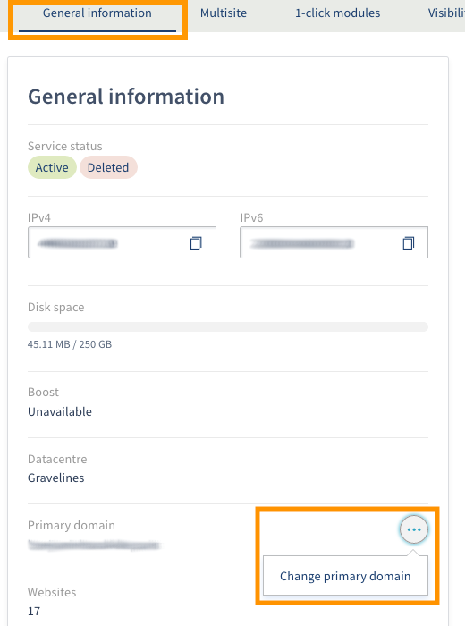
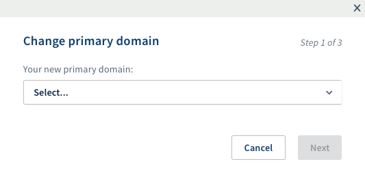
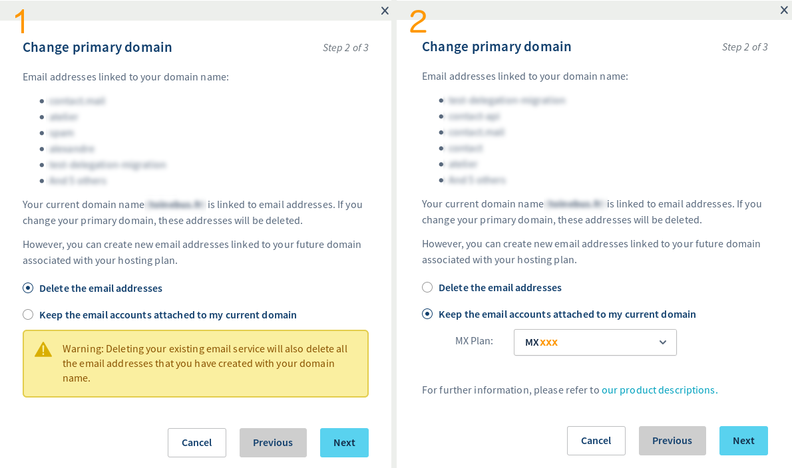

**Dernière mise à jour le 17/01/2020**

## Objectif

Votre hébergement peut être attaché à un nom de domaine, appelé «domaine principal». Ce guide vous explique comment remplacer celui-ci par un autre nom de domaine.

**Découvrez comment effectuer un changement de domaine principal sur votre offre d'hébergement web.**

## Prérequis

- Posséder une [offre d'hébergement web](https://www.ovh.com/fr/hebergement-web/){.external} compatible.
- Disposer d'un [nom de domaine](https://www.ovh.com/fr/domaines/){.external}, détaché de tout hébergement web, dans votre espace client OVHcloud.
- Être connecté à votre [espace client OVHcloud](https://www.ovh.com/auth/?action=gotomanager){.external}.

## En pratique

### Étape 1 : préparer votre changement de domaine principal (facultative)

> [!primary]
>
> Cette étape est facultative si aucun site internet n'est actuellement lié au domaine principal de votre hébergement web.
> 

Si vous devez changer de domaine principal en conservant le contenu actuel de votre site, modifiez les URL pour vous assurer que le site fonctionnera bien avec le nouveau nom de domaine.

Pour cela, consultez notre guide sur [la réécriture d'URL grâce au mod_rewrite](../htaccess-reecriture-url-mod-rewrite/){.external}.

### Étape 2 : effectuer le changement de domaine principal

Connectez-vous à votre [espace client](https://www.ovh.com/auth/?action=gotomanager){.external} puis sélectionnez `Web`{.action}. Cliquez sur `Hébergements`{.action} dans la barre de services située à gauche et choisissez l'offre concernée. Cliquez sur `...`{.action} à droite de **Domaine principal** puis sur `Changer de domaine principal`{.action}.

{.thumbnail}

- **Étape 1 sur 3**: sélectionnez le nouveau nom de domaine que vous souhaitez attribuer à l'hébergement web.

{.thumbnail}

- **Étape 2 sur 3**: précisez si vous ne souhaitez pas conserver les adresses e-mail associées au nom de domaine actuel (*image 1 ci-dessous*) ou les conserver en commandant un MX Plan (*image 2 ci-dessous*). En effet, l'offre e-mail associée à votre hébergement sera réattribuée au nouveau nom de domaine.

{.thumbnail}

- **Étape 3 sur 3**: vérifiez les informations du bon de commande puis cliquez sur le bouton `Valider`{.action}.

Le changement de domaine principal sera effectif une fois le paiement validé.

## Aller plus loin

[La réécriture d'URL grâce au mod_rewrite](../htaccess-reecriture-url-mod-rewrite/){.external}.

Échangez avec notre communauté d’utilisateurs sur [https://community.ovh.com/](https://community.ovh.com/){.external}.
