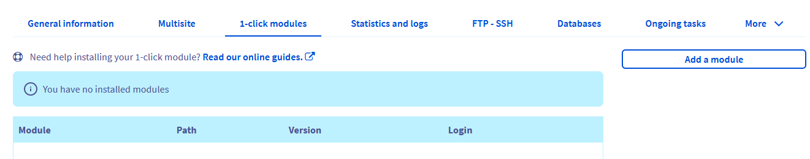

**Last updated 15th January 2018**

## Objective

1-click modules are designed to help you set up a website quickly and easily, without needing any technical knowledge. You can choose from the most popular CMSs: WordPress, PrestaShop, Drupal and Joomla!.

**Find out how to set up your website using our 1-click modules.**

<iframe width="560" height="315" src="https://www.youtube.com/embed/lZYRKYuh2xE?rel=0&amp;showinfo=0" frameborder="0" allow="autoplay; encrypted-media" allowfullscreen></iframe>

## Requirements

- an [OVH Web Hosting plan](https://www.ovh.co.uk/web-hosting/)
- access to the [OVH Control Panel](https://www.ovh.com/auth/?action=gotomanager)
- no files stored in the directory that your module will be installed in
- The website’s domain (with a subdomain, if applicable) must be declared as a multisite.

## Instructions

### Step 1: choose the right CMS

You can use a CMS (Content Management System) to build your website via an easy-to-use interface. There are several types, each designed to suit certain projects. By using a CMS, you will get a ready-to-use website template that you can customise with a variety of themes, texts, and much more.

OVH offers a selection of 4 CMSs as 1-click modules. By using this solution, you will need to choose from this list. If you have already chosen a CMS from the list, you can start following the steps in this tutorial. If have not yet chosen which CMS to use, this [CMS comparison page](https://www.ovh.co.uk/web-hosting/website/cms-comparison/) can help you decide which one would best suit your project.

If you would like to install a CMS that isn’t offered as an OVH 1-click module, you can install it manually on your web hosting plan, provided that the CMS is compatible with your plan (see our web hosting plans [here](https://www.ovh.co.uk/web-hosting/).

{.thumbnail}

### Step 2: access the 1-click module manager

In the services bar on the left-hand side of your OVH Control Panel, go to the `Web hosting`{.action} section, then click on the web hosting plan that you have just ordered. Then click the `1-click modules`{.action} tab.

Here, you can look at the 1-click modules you have already installed, manage them and install new ones.

{.thumbnail}

### Step 3: add a module

You can launch the installation of a 1-click module by clicking `Add a module`{.action}.

In the window that opens, select the CMS you would like to use, and the domain you would like to set up your website on:

{.thumbnail}

If the domain you want to use does not appear in the list, go to the `Multi-site`{.action} tab to add it, then try adding a module again.

You can also refer to the guide [Hosting multiple websites on your Web Hosting plan](https://docs.ovh.com/gb/en/hosting/multisites-configuring-multiple-websites/).

Once you have selected your domain, you must choose between basic or advanced installation:

- **For basic installation (selected by default):** we will install your CMS, and send you the admin credentials. This is the simplest, quickest way to install a module.
- **For advanced installation:** you can customise the configuration applied to your CMS installation. For this, you will need to enter information that is essential for your CMS to work properly on your database: login details, installation directory, language, admin credentials, etc.

#### Basic module installation

To carry out this installation, check that the `Installation in advanced mode`{.action} box is not ticked, then click `Install`{.action}.

> [!warning]
>
> Your module’s installation directory must be empty, and you must have a database available for the installation to be successful.
> 

{.thumbnail}

Once the installation process is complete, you will receive an email containing the information you need to log in to the CMS admin interface. You can now log in to the admin interface, and start customising your website.

#### Advanced module installation

To complete this installation, check that the `Installation in advanced mode`{.action} box is ticked, then click `Next`{.action}.

{.thumbnail}

##### Choose a database

You must now enter the information required to connect to your database. There are several options:

- **If you have already created a database on your web hosting plan:** select it from the list, and enter the information requested.
- **If you have not yet created a database on your web hosting plan:** follow the instructions for creating one, then try again.
- **If you have created a database on your Private SQL or CloudDB instance:** select it from the `Databases outside of your web hosting plan`{.action} list, and enter the information requested. The instance and web hosting plan must be hosted in the same datacentre.
- **If you have created a database on another OVH web hosting plan:** select it from the `Databases outside of your web hosting plan`{.action} list, and enter the information requested. The database and web hosting plan must be hosted in the same datacentre.

Once you have entered this information, click `Next`{.action}.

> [!warning]
>
> If the information you enter is incorrect, the installation process will not complete successfully. To avoid this issue, we recommend that you test the connection to your database.
> 

{.thumbnail}

##### Configure the module

Now, you will need to enter the following information to configure the module:

- **Admin name or email address:** the username you will use to log in to your CMS admin interface.
- **Password:** the password you will use to log in to your CMS admin interface.
- **Domain:** the domain you wish to install your website on.
You can also refer to the guide [Hosting multiple websites on your Web Hosting plan](https://docs.ovh.com/gb/en/hosting/multisites-configuring-multiple-websites/).
- **Language:** the language that the CMS will be installed in.
- **Installation path:** this is automatically entered when you select your domain. You can also add subdirectories to it.

Once you have entered this information, click `Next`{.action}:

> [!warning]
>
> The installation path entered must not contain any content, for the installation process to complete successfully.
> 

{.thumbnail}

##### Confirm the installation

For the final step of advanced configuration, please check that the information you have displayed is correct, then click `Confirm`{.action}:

{.thumbnail}

### Step 4: customise your website

You will receive an email confirming that your CMS module has been successfully installed, and you will be prompted to log in to your admin interface. You can then edit your website’s theme, and publish your first pieces of content on it.

If you need help with your website’s features, we would recommend that you go to the CMS publisher’s official website, which will contain documentation to help you with your project.

Below, we've included some links from these CMS publishers, to help you get started.

|CMS|Official documentation|
|---|---|
|WordPress|[First steps with WordPress](https://codex.wordpress.org/First_Steps_With_WordPress){.external}|
|PrestaShop|[Getting started with PrestaShop](http://doc.prestashop.com/display/PS17/Getting+Started){.external}|
|Joomla!|[Getting started with Joomla!](https://www.joomla.org/about-joomla/getting-started.html){.external}|
|Drupal|[Understanding Drupal](https://www.drupal.org/docs/7/understanding-drupal/overview){.external}|

## Go further

[Choosing a CMS for building your website](https://www.ovh.co.uk/web-hosting/website/cms-comparison/){.external}

[Hosting multiple websites on your Web Hosting plan](https://docs.ovh.com/gb/en/hosting/multisites-configuring-multiple-websites/)

See our [Private SQL services](https://www.ovh.co.uk/web-hosting/sql-options.xml){.external}

See our [CloudDB solutions](https://www.ovh.co.uk/cloud/cloud-databases/){.external}

Join our community of users on [https://community.ovh.com/en/](https://community.ovh.com/en/){.external}