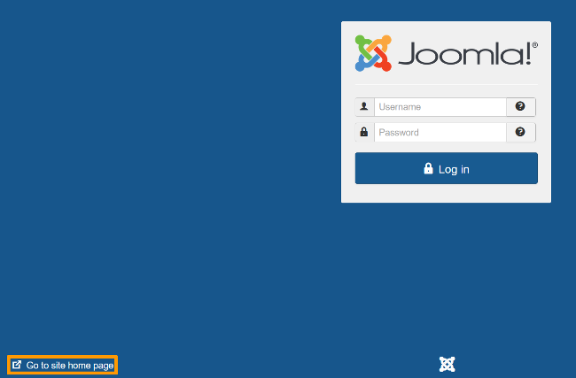
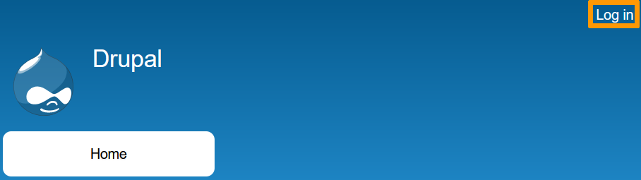
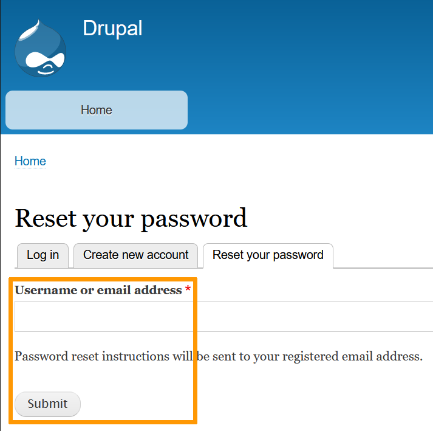

**Dernière mise à jour le 14/10/2021**

## Objectif

Les modules en 1 clic permettent l’installation facile et rapide d’un logiciel en ligne d'assistance à la création de site Internet (communément appelés « CMS »). OVHcloud vous propose les plus connus de ces logiciels : WordPress, PrestaShop, Drupal et Joomla.

**Découvrez comment gérer votre module en 1 clic depuis votre espace client OVHcloud.**

> [!warning]
>
> OVHcloud met à votre disposition des services dont la configuration, la gestion et la responsabilité vous incombent. Il vous revient de ce fait d'en assurer le bon fonctionnement.
>
> Nous mettons à votre disposition ce guide afin de vous accompagner au mieux sur des tâches courantes. Néanmoins, nous vous recommandons de faire appel à un prestataire spécialisé et/ou de contacter l'éditeur du service si vous éprouvez des difficultés. En effet, nous ne serons pas en mesure de vous fournir une assistance. Plus d'informations dans la section [Aller plus loin](#aller-plus-loin) de ce guide.
>

## Prérequis

- Disposer d'une [offre d'hébergement Web Cloud](https://www.ovh.com/fr/hebergement-web/) permettant l'installation d'un module en 1 clic (seule l'offre gratuite [Start10M](../activer-start10m/) n'est pas concernée).
- Avoir créé un module en 1 clic sur cet hébergement (Si vous n'avez pas encore effectué cette installation, suivez les instructions de ce [guide](../modules-en-1-clic/)).
- Être connecté à votre [espace client OVHcloud](https://www.ovh.com/auth/?action=gotomanager&from=https://www.ovh.com/fr/&ovhSubsidiary=fr).

## En pratique

### Accéder à votre site

Pour accéder à la partie publique de votre site suite à l'installation de votre module en 1 clic, rendez-vous dans votre [espace client OVHcloud](https://www.ovh.com/auth/?action=gotomanager&from=https://www.ovh.com/fr/&ovhSubsidiary=fr), cliquez sur `Web Cloud`{.action}, `Hébergements`{.action}, sur l'hébergement concerné puis sur `Modules en 1 clic`{.action}.

Cliquez ensuite sur le bouton `...`{.action} à droite de la ligne concernant votre module puis sur `Accéder au module`{.action}.

> [!primary]
>
> Si votre site ne s'affiche pas correctement suite à cette manipulation, consultez les guides OVHCLOUD de la section [Diagnostic](../).
>

### Accéder à l'interface administrateur

Pour accéder à la partie de votre site réservée aux administrateurs, rendez-vous dans votre [espace client OVHcloud](https://www.ovh.com/auth/?action=gotomanager&from=https://www.ovh.com/fr/&ovhSubsidiary=fr), cliquez sur `Web Cloud`{.action}, `Hébergements`{.action}, sur l'hébergement concerné puis sur `Modules en 1 clic`{.action}.

Cliquez ensuite sur le bouton `...`{.action} à droite de la ligne concernant votre module puis sur `Accéder à l'interface d'administration du module`{.action}.

### Retrouver l'identifiant administrateur

Pour retrouver cet identifiant, vous pouvez tout d'abord rechercher l'e-mail reçu lors de la création de votre module depuis votre [espace client OVHcloud](https://www.ovh.com/auth/?action=gotomanager&from=https://www.ovh.com/fr/&ovhSubsidiary=fr) : cliquez sur votre nom en haut à droite de votre écran puis, dans le menu qui apparaît, cliquez sur vos initiales (Bouton `Gérer mon compte`{.action}) puis sur l'onglet `Emails reçus`{.action}).

Vous pouvez également passer par l'onglet `Modules en 1 clic`{.action} depuis la partie `Hébergements`{.action} de votre espace client. L'identifiant administrateur de votre module apparaît dans la colonne `Login`.

### Modifier le mot de passe de votre module

Pour modifier le mot de passe d'accès à l'interface d'administration de votre site, rendez-vous dans votre [espace client OVHcloud](https://www.ovh.com/auth/?action=gotomanager&from=https://www.ovh.com/fr/&ovhSubsidiary=fr), cliquez sur `Web Cloud`{.action}, `Hébergements`{.action}, sur l'hébergement concerné puis sur `Modules en 1 clic`{.action}.

Cliquez ensuite sur le bouton `...`{.action} à droite de la ligne concernant votre module puis sur `Modifier le mot de passe`{.action}. Cliquez sur `Valider`{.action}. Vous recevrez sous quelques minutes un nouveau mot de passe par e-mail.

Vous pouvez également modifier ce mot de passe en vous rendant directement sur la page de connexion à l'espace réservé aux administrateurs :

|CMS|Page de connexion|
|---|---|
|Wordpress|Cliquez sur {.thumbnail}|
|Joomla|Sur cette page, cliquez sur `Go to site home page`{.action} {.thumbnail} puis sur `Forgot your password?`{.action} [admin_joomla2](images/admin_joomla2.png){.thumbnail}|
|Prestashop|{.thumbnail}|
|Drupal|Sur cette page, cliquez sur `Log in`{.action} {.thumbnail} puis sur `Reset your password`{.action} [admin_joomla2](images/admin_drupal2.png){.thumbnail}  et enfin indiquez votre nom d'utilisateur ou votre adresse e-mail de contact et cliquez sur `Soumettre`{.action} {.thumbnail}|

> [!primary]
>
> Que faire si vous n'avez pas reçu l'e-mail de réinitialisation du mot de passe administrateur de votre site ? 
>
> Vérifiez tout d'abord l'adresse e-mail associée à votre compte OVHcloud depuis votre [espace client](https://www.ovh.com/auth/?action=gotomanager&from=https://www.ovh.com/fr/&ovhSubsidiary=fr) : cliquez sur votre nom en haut à droite de votre écran puis, dans le menu contextuel à droite de l'écran, cliquez sur vos initiales (Bouton `Gérer mon compte`{.action}) puis sur l'onglet `Emails reçus`{.action}.
>
> Sur la boîte e-mail concernée, vérifiez ensuite les dossiers `Spams`{.action} et `Corbeille`{.action}.
>

### Supprimer votre module

> [!warning]
>
> La sauvegarde de vos données fait partie des opérations essentielles à la [sécurisation de vos sites](../connexion-espace-stockage-ftp-hebergement-web/). Nous vous conseillons d'importer régulièrement des sauvegardes de l'ensemble de vos données sur un support local, tel qu'une clé USB ou un disque dur externe, en suivant les instructions de ce [guide](../exporter-son-site-web/).
>

#### Étape 1 : identifier la base de données lié à votre module

Pour supprimer votre module en 1 clic, vous devez commencer par identifier sa base de données de façon certaine. Rendez-vous pour cela dans votre [espace client OVHcloud](https://www.ovh.com/auth/?action=gotomanager&from=https://www.ovh.com/fr/&ovhSubsidiary=fr). Cliquez sur `Web Cloud`{.action}, `Hébergements`{.action}, sur l'hébergement concerné puis sur l'onglet `Bases de données`{.action} 

Si vous disposez d'une seule base de données dans cette partie de votre espace client et que vous ne possédez pas de solutions [SQL privé](https://www.ovhcloud.com/fr/web-hosting/options/private-sql/) ou [Cloud Database](https://www.ovh.com/fr/cloud-databases/), vous pouvez considérer qu'il s'agit de celle de votre site.

Dans le cas contraire, rendez-vous dans [l'espace FTP de votre hébergement](../connexion-espace-stockage-ftp-hebergement-web/) puis retrouvez son fichier de configuration en fonction du CMS utilisé dans le dossier où se trouve votre site (par défaut, le dossier « www ») :

- Pour Wordpress : Dans le fichier **« wp-config.php »**, le nom de la base de votre module apparaît sous la mention **« DB_NAME »**.
- Pour Joomla : Dans le fichier **« configuration.php »**, le nom de la base de votre module apparaît sous la mention **« public $db »**.
- Pour Drupal : Dans le fichier **« settings.php »** (Pour le retrouver, rendez-vous dans le dossier « sites » puis « default »), le nom de la base de votre module apparaît sous la mention **« 'database' »**.
- Pour Prestashop : Dans le fichier **« parameters.php »** (Pour le retrouver, rendez-vous dans le dossier « app » puis « config »), le nom de la base de votre module apparaît sous la mention **« 'database_name' »**.

#### Étape 2 : sauvegarder votre module (facultatif)

Pour sauvegarder votre site, suivez les instructions de ce [guide](../exporter-son-site-web/), afin de récupérer à la fois ses fichiers sur l'espace FTP de votre hébergement et sa base de données.

#### Étape 3 : supprimer votre module

> [!warning]
>
> La suppression de votre module en 1 clic entraînera automatiquement celle de l'ensemble des sauvegardes de ses fichiers et dossiers FTP, ainsi que de sa base de données. Ces suppressions sont définitives et aucune récupération des données concernées ne sera possible ensuite.
>

Pour supprimer votre module en 1 clic, rendez-vous dans votre [espace client OVHcloud](https://www.ovh.com/auth/?action=gotomanager&from=https://www.ovh.com/fr/&ovhSubsidiary=fr). Cliquez sur `Web Cloud`{.action}, `Hébergements`{.action}, sur l'hébergement concerné puis sur `Modules en 1 clic`{.action}.

Cliquez ensuite sur le bouton `...`{.action} à droite de la ligne désignant votre module puis sur la commande `Supprimer le module`{.action}.

> [!warning]
>
> Lancer la suppression de votre module 1 clic **ne va pas effacer automatiquement sa base de données**. De ce fait, si votre hébergement ne permet pas la création d'une autre base, utiliser ensuite la commande `Ajouter un module`{.action} pour créer un autre module client entraînera l'apparition du message « [Une erreur s’est produite lors du chargement des informations (You need at least one free database)](../erreurs-frequentes-modules-en-1-clic/#une-erreur-sest-produite-lors-du-chargement-des-informations-you-need-at-least-one-free-database) ».
>
> Si vous disposez d'un abonnement [Kimsufi](https://www.kimsufi.com/fr/hosting.xml) ou [Perso](https://www.ovhcloud.com/fr/web-hosting/personal-offer/) ou si vous avez déjà créé quatre bases de données sur votre hébergement [Pro](https://www.ovhcloud.com/fr/web-hosting/professional-offer/) ou [Performance](https://www.ovhcloud.com/fr/web-hosting/performance-offer/), vous devrez donc supprimer la base de données de votre module **AVANT** de pouvoir en créer un nouveau.
>

Pour finaliser la suppression de votre module, vous devrez donc aussi vous rendre dans l'onglet `Bases de données`{.action}, toujours dans la partie `Web cloud`{.action}, `Hébergements`{.action} et dans l'hébergement concerné sur votre [espace client OVHcloud](https://www.ovh.com/auth/?action=gotomanager&from=https://www.ovh.com/fr/&ovhSubsidiary=fr) puis cliquer sur `...`{.action} à droite de la ligne désignant la base et sur le bouton `Supprimer la base de données`{.action}.

### Bonnes pratiques

Sécurisez votre site en suivant les instructions de ce [guide](../secure-website/)

Ajoutez des outils de test de type CAPTCHA sur les formulaires de votre site.

N'installez pas sur votre site de plugins ou de templates qui n'ont pas été recommandés par les communautés officielles de votre CMS : 

- [Wordpress](https://wpfr.net/){.external}
- [Joomla](https://forum.joomla.fr/){.external}
- [Drupal](https://drupalfrance.slack.com/){.external}
- [Prestashop](https://www.prestashop.com/forums/){.external}

Pour toute question concernant les modules en 1 clic qui ne serait pas traitée dans les différents [guides OVHcloud](../) (référencement, webmastering, etc), contactez la [communauté OVHcloud](https://community.ovh.com/) ou l'un des nos [partenaires](https://partner.ovhcloud.com/fr/).

## Aller plus loin 

[Résoudre les erreurs les plus fréquentes liées aux modules en 1 clic](../erreurs-frequentes-modules-en-1-clic/)