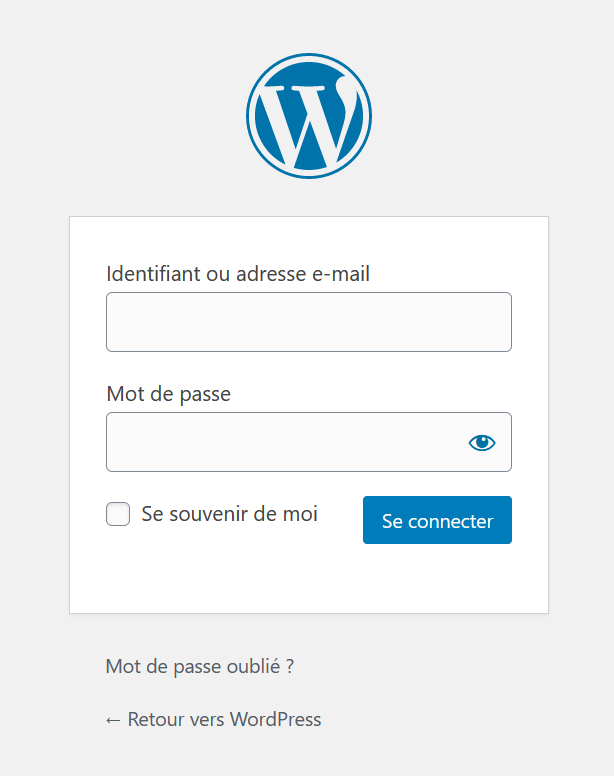

**Dernière mise à jour le 14/10/2021**

## Objectif

Les modules en 1 clic permettent l’installation facile et rapide d’un logiciel en ligne d'assistance à la création d'un site Internet (CMS). OVHcloud vous propose les CMS les plus connus : WordPress, PrestaShop, Drupal et Joomla.

**Découvrez comment gérer votre module en 1 clic depuis votre espace client OVHcloud.**

> [!warning]
>
> OVHcloud met à votre disposition des services dont la configuration, la gestion et la responsabilité vous incombent. Il vous revient de ce fait d'en assurer le bon fonctionnement.
>
> Nous mettons à votre disposition ce guide afin de vous accompagner au mieux sur des tâches courantes. Néanmoins, nous vous recommandons de faire appel à un prestataire spécialisé et/ou de contacter l'éditeur du service si vous éprouvez des difficultés. En effet, nous ne serons pas en mesure de vous fournir une assistance. Plus d'informations dans la section [Aller plus loin](#aller-plus-loin) de ce guide.
>

## Prérequis

- Disposer d'une [offre d'hébergement Web Cloud](https://www.ovh.com/fr/hebergement-web/) permettant l'installation d'un module en 1 clic (seule l'offre gratuite [Start10M](../activer-start10m/) n'est pas concernée)
- Avoir créé un module en 1 clic sur cet hébergement (Si vous n'avez pas encore effectué cette installation, suivez les instructions de ce [guide](../modules-en-1-clic/))
- Être connecté à votre [espace client OVHcloud](https://www.ovh.com/auth/?action=gotomanager&from=https://www.ovh.com/fr/&ovhSubsidiary=fr)

## En pratique

### Accéder à votre site

Pour accéder à la partie publique de votre site suite à l'installation de votre module, rendez-vous dans votre [espace client OVHcloud](https://www.ovh.com/auth/?action=gotomanager&from=https://www.ovh.com/fr/&ovhSubsidiary=fr). Cliquez sur `Web Cloud`{.action}, `Hébergements`{.action}, sur l'hébergement concerné puis sur `Modules en 1 clic`{.action}.

Cliquez ensuite sur le bouton `...`{.action} à droite de la ligne concernant votre module puis sur `Accéder au module`{.action}.

> [!primary]
>
> Si votre site ne s'affiche pas correctement suite à cette manipulation, consultez nos guides de [Diagnostic](../) :
>
> - [Que faire si mon site est inaccessible ?](../erreur-serveur-inaccessible/)
> - [Résoudre les erreurs les plus fréquentes liées aux modules en 1 clic](../erreurs-frequentes-modules-en-1-clic/)
> - [Que faire en cas d’erreur « Votre connexion n’est pas privée » ?](../erreur-site-non-securise/)
> - [Résoudre les erreurs les plus fréquentes liées aux bases de données](../erreurs-frequentes-bases-de-donnees/)
> - [Résoudre l’erreur « Site non installé »](../erreur-site-non-installe/)
> - [Que faire en cas d’erreur 500 Internal Server Error ?](../erreur-500-internal-server-error/)
> - [Que faire en cas de page « Index of » ?](../diagnostic-index-of/)
> - [Que faire en cas de page « 403 forbidden » ?](../diagnostic-403-forbidden/)
>

### Accéder à l'interface administrateur de votre site

Pour accéder à la partie de votre site réservée aux administrateurs, rendez-vous dans votre [espace client OVHcloud](https://www.ovh.com/auth/?action=gotomanager&from=https://www.ovh.com/fr/&ovhSubsidiary=fr). Cliquez sur `Web Cloud`{.action}, `Hébergements`{.action}, sur l'hébergement concerné puis sur `Modules en 1 clic`{.action}.

Cliquez ensuite sur le bouton `...`{.action} à droite de la ligne concernant votre module puis sur `Accéder à l'interface d'administration du module`{.action}.

### Modifier le mot de passe de votre module 1 clic

Pour modifier le mot de passe d'accès à l'interface d'administration de votre site, rendez-vous dans votre [espace client OVHcloud](https://www.ovh.com/auth/?action=gotomanager&from=https://www.ovh.com/fr/&ovhSubsidiary=fr). Cliquez sur `Web Cloud`{.action}, `Hébergements`{.action}, sur l'hébergement concerné puis sur `Modules en 1 clic`{.action}.

Cliquez ensuite sur le bouton `...`{.action} à droite de la ligne concernant votre module puis sur `Modifier le mot de passe`{.action}.

Vous pouvez également modifier ce mot de passe en vous rendant directement sur la page de connexion à l'espace réservé aux administrateurs :

|CMS|Page de connexion|
|---|---|
|Wordpress|{.thumbnail}|
|Joomla|{.thumbnail}|
|Prestashop|{.thumbnail}|
|Drupal|{.thumbnail}|

> [!primary]
>
> Après 
>
> Vérifiez tout d'abord l'adresse e-mail associée à votre compte OVHcloud depuis votre [espace client](https://www.ovh.com/auth/?action=gotomanager&from=https://www.ovh.com/fr/&ovhSubsidiary=fr) : Cliquez sur votre nom en haut à droite de votre écran puis, dans le menu contextuel à droite de l'écran, cliquez sur vos initiales (`Gérer mon compte`{.action}).

### Supprimer votre module en 1 clic

> [!primary]
>
> Avant toute suppression de données, récupérez la sauvegarde de votre site en suivant les instructions de ce [guide](../exporter-son-site-web/).
>

Pour supprimer votre module 1 clic, rendez-vous dans votre [espace client OVHcloud](https://www.ovh.com/auth/?action=gotomanager&from=https://www.ovh.com/fr/&ovhSubsidiary=fr). Cliquez sur `Web Cloud`{.action}, `Hébergements`{.action}, sur l'hébergement concerné puis sur `Modules en 1 clic`{.action}.

Cliquez ensuite sur le bouton `...`{.action} à droite de la ligne concernant votre module puis sur `Supprimer le module`{.action}.

Section "Supprimer votre module en 1 clic" : pour les clients qui ont une offre perso ou une autre offre avec toutes les bases de données créées, le fait de supprimer le module ne supprimera pas la base. La re-création d'un module ne fonctionnera donc pas en mode automatique.

### Retrouver les identifiants de connexion à votre module en 1 clic

(chemin dans l'esapce client)
Section "Retrouver les identifiants de connexion à votre module en 1 clic" : l'identifiant de connexion créé automatiquement lors de la mise en place du module ne permettra l'accès au backoffice qu'à la condition que cet identifiant n'ait pas été supprimé( par exemple dans la section Utilisateurs de wordpress).

### Bonnes pratiques

(liens vers guides bonne pratiques mdp manager)
(captcha sur les formulaires)
(ne pas installer n'importe quoi)
(faire des sauvegardes locales régulièrement)

## Aller plus loin 

(liens vers les docs / communauté des différents cms)

Pour des prestations spécialisées (référencement, développement, etc), contactez les [partenaires OVHcloud](https://partner.ovhcloud.com/fr/).

Si vous souhaitez bénéficier d'une assistance à l'usage et à la configuration de vos solutions OVHcloud, nous vous invitons à consulter nos différentes [offres de support](https://www.ovhcloud.com/fr/support-levels/).

Échangez avec notre communauté d'utilisateurs sur <https://community.ovh.com/>.