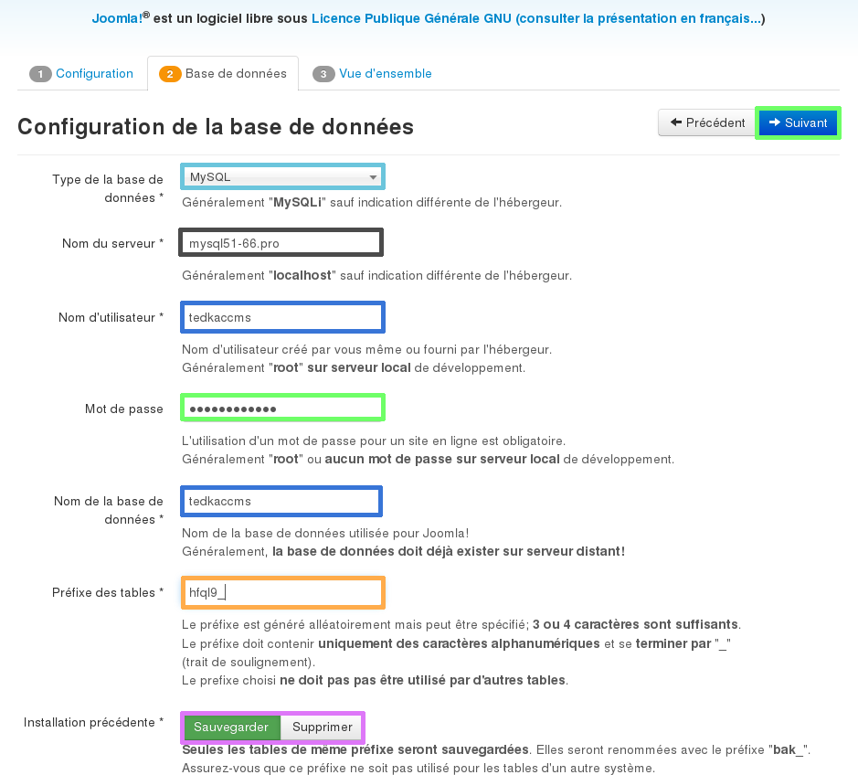

## Part 1: preparing for installation

## Necessary tools
To install the Joomla! platform on your shared hosting package, we advise your to get an FTP program such as  FileZilla (it's free).

## Necessary credentials
Make sure that you have your customer ID (nic-handle) and password so you can log in to your [OVH customer account](https://www.ovh.com/manager/web/login/) if necessary.

- Get your FTP ID and password so you can log in to your hosting package. 
There is an FTP credentials guide:

- You also need to have your SQL database ID and password so you can log in to the database.
There is a guide showing you how to get your SQL credentials: 

{.thumbnail}

## Part 2: get source files

- Go to the [Joomla!](https://downloads.joomla.org/) website to download the CMS. 

There should be a link that lets you download the latest stable version of the CMS

The file that you download will usually be compressed (zipped) so you have to be able to extract the files to your computer. There is lots of help available online.

{.thumbnail}

## Part 3: Upload your files to your hosting package via FTP

## - Unzip the file folder
Open the folder that contains the zipped folder you downloaded. 

Right-click on the folder, then select "Extract all...".

Select a destination in order to extract your files to a new folder.

There are a number of tutorials and types of decompression software available online to help with this.
Check them out if you are stuck at this stage.

The target folder will be called "Joomla!"

{.thumbnail}

## Log on to the web hosting package via FTP
To upload the Joomla! files to your hosting package, you first have to log on. 

Follow this guide on connecting to a hosting package in FTP:

{.thumbnail}

## Transfer files via FTP
Follow these steps to upload your files using FTP.

## Step 1
Once you are logged in to FileZilla. 

In the "Local site" section, which refers to the list of files on your computer, open the unzipped file entitled "Joomla!" where your CMS files will be located. 

In the "Remote site" section, which refers to your OVH shared hosting package, open the "www" folder. This is the folder that you need to upload your CMS files to. 

If this folder does not exist you can create it.

Your files must be uploaded to the "www" folder or you will not be able to access the installation procedure from your domain name.

{.thumbnail}

## Step 2
Once these folders are open:

In the "Local site" section, find all the files you need to install the Drupal CMS. 

To select them all just click CTRL+A.

Then drag and drop the files in to the "Remote site" section in the "www" folder. 

It is very likely that the "www" folder is not empty. You do not have to remove the files that are in it. We will go back to this point later on in the guide.

{.thumbnail}

## Step 3
The files have been transferred. 

All the files should be uploaded to the remote FTP server. This could take a few minutes. 

Once it is complete, make sure that the files and folders have transferred correctly.

This operation is the final step in uploading files via FTP.

{.thumbnail}

## Part 4: Linking to the database

- Before continuing with the installation, clear your browser's cache, to prevent any errors. 

In order to link your database to Joomla!, you have to follow the CMS install steps:

## Step 1
Go to your domain name. The installation wizard will run. 

First, enter the Joomla! configuration settings:

Select Language: select the language.

Website name: enter the website name, this could have an impact on your ranking. 

blue]Description: describe the website, this could have an impact on your ranking. 

Site offline: lets you block public access to the website.

Email: choose the ID to use to access the administration console. 

Password: enter the password for accessing the administrative part of the website.

Confirm the password: confirm the password that you entered. 

Click "Next"

{.thumbnail}

## Step 2
Get your database credentials (see the beginning of this guide)

Enter the information requested concerning the database

Database type: select MySQL database.

Server name: enter your database server's name, as stated in the setup email or in your customer account. 

Username: identical to the database name, you can find it in the database installation email. 

Password: you were sent it by email when you created the database - it may have changed since then. 

Database name: chosen when you created it in the customer account.

Table prefix: useful for installing Joomla! lots of times on the same database. In this case, you have to enter a different prefix each time your install. 

Previous installation: if there are tables in the database, those whose prefix is the same as those entered when it was installed will be renamed with the prefix "bak_".

Click "Next" to confirm the information requested.

{.thumbnail}

## Completion

## Completing the installation steps
In order to complete the Joomla! installation take the following steps.

## Step 1
A summary of selected settings will appear. 

Two pieces of information are requested:

- Type of website:

Select "Simple homepage in English".

- Sending configuration 

Indicate whether you want to receive the installation information by email, such as the access password to the administration section, defined above.

Click "Install" to continue.

{.thumbnail}

## Step 2
Wait a few minutes for it to install.

{.thumbnail}

## Step 3
For security reasons Joomla! please delete the installation directory.

To do this just click "delete the installation directory".

{.thumbnail}

## Step 4
You will get a message confirming that the directory has been deleted. 

You can now connect to the Joomla! administration section. Log in in the window that opens, where you can also view the homepage set up by Joomla!.

{.thumbnail}

## Joomla! administration section.
For an overview of the Joomla! admin panel, click on the image below.

{.thumbnail}

## Useful information
OVH support is not authorised to answer questions about Joomla! configuration.
However, there is a user guide available:  .

You can also view the forums dedicated to the Joomla! solution.

- Here is the link to the [Joomla!](https://forum.joomla.org/) support forum.

## Typical error: site under construction
You have set up your files on FTP, however the "site under construction" page is still displayed. 

When your hosting package was installed, OVH set up a "waiting" page while you were uploading files to your site. 

If you only upload your own files to the "www" folder and do not delete the OVH content first, then you may encounter this problem.

To fix this issue, you will need to remove or rename the "index.html" file that was created by OVH.

It may be useful to simply just rename the file so that you can re-enable it at any time, and use it as your own "waiting" page.

Something else to note: Your website's files must be uploaded to the "www" folder in order for them to display your website.

{.thumbnail}

## Typical error: PHP version
This error is to do with your server's PHP version. 

The cause is simple: the latest version of PHP is not enabled. 

A guide is available detailing how to modify the PHP version on your hosting package:[Modify hosting package PHP version]({legacy}1207)

{.thumbnail}

## Typical error: Magic Quotes
A variable which has not been properly defined is preventing Joomla! from installing. 

Magic Quotes must be Off and, therefore, set to 0 in your configuration file. 

On 2014 solutions, if PHP-FPM is enabled, the Magic Quote variable is disabled by default. For old web hosting packages, you can disable this variable in the .htaccess file. 

There is a guide available on changing PHP variable on the 2014 hosting packages:[Modify web hosting package's PHP version]({legacy}1207)

{.thumbnail}

