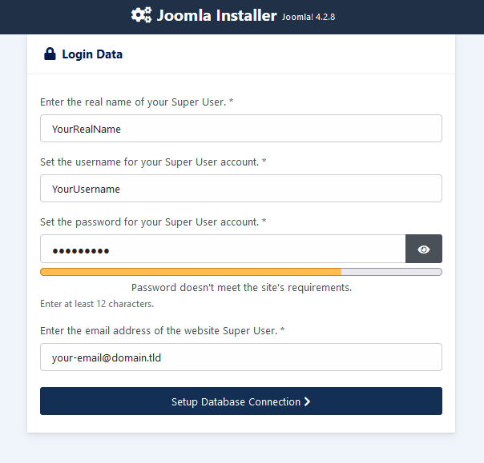
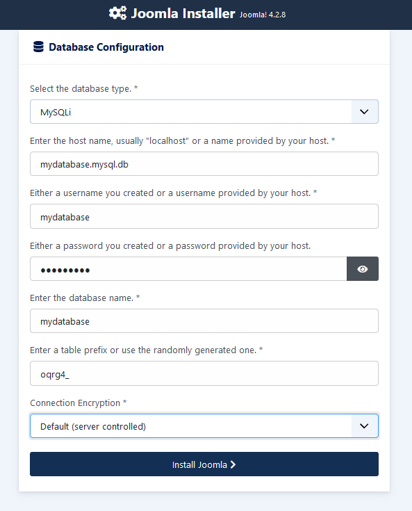
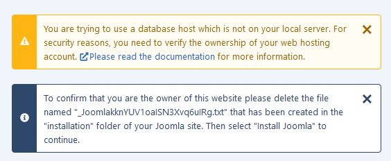

**Ostatnia aktualizacja z dnia 07-04-2023**

> [!primary]
> Tłumaczenie zostało wygenerowane automatycznie przez system naszego partnera SYSTRAN. W niektórych przypadkach mogą wystąpić nieprecyzyjne sformułowania, na przykład w tłumaczeniu nazw przycisków lub szczegółów technicznych. W przypadku jakichkolwiek wątpliwości zalecamy zapoznanie się z angielską/francuską wersją przewodnika. Jeśli chcesz przyczynić się do ulepszenia tłumaczenia, kliknij przycisk "Zgłóś propozycję modyfikacji" na tej stronie.
>
  
## Wprowadzenie

Znajdziesz tutaj wszystkie elementy do ręcznego zainstalowania systemu CMS (Content Management System) Joomla! w kilku krokach.

> [!warning]
>
> OVHcloud oddaje do Twojej dyspozycji usługi, których konfiguracja, zarządzanie i odpowiedzialność spoczywają na Ciebie. W związku z tym należy zapewnić ich prawidłowe funkcjonowanie.
> 
> Oddajemy do Twojej dyspozycji niniejszy tutorial, którego celem jest pomoc w jak najlepszym wykonywaniu bieżących zadań. W przypadku trudności zalecamy skorzystanie z pomocy [wyspecjalizowanego usługodawcy](https://partner.ovhcloud.com/pl/) lub [edytora CMS Joomla!](https://www.joomla.org/){.external}. Niestety firma OVHcloud nie będzie mogła udzielić wsparcia w tym zakresie. Więcej informacji znajduje się w sekcji [Sprawdź również"](#go-further) niniejszego tutoriala.
>

> [!success]
>
> Do zainstalowania Joomla! **automatycznie** w [Panelu klienta OVHcloud](https://www.ovh.com/auth/?action=gotomanager&from=https://www.ovh.pl/&ovhSubsidiary=pl) sprawdź naszą dokumentację dotyczącą [instalacji modułu "jednym kliknięciem"](https://docs.ovh.com/pl/hosting/hosting_www_przewodniki_dotyczace_modulow_na_hostingu_www/).
>
> Aby zainstalować **ręcznie inny CMS** (WordPress, Drupal, PrestaShop), zapoznaj się z naszą dokumentacją dotyczącą [ręczna instalacja CMS](https://docs.ovh.com/pl/hosting/hosting_www_reczna_instalacja_modulu_cms/).
>

**Dowiedz się, jak ręcznie zainstalować CMS Joomla!**
  
## Wymagania początkowe

- Posiadanie oferty [hostingu](https://www.ovhcloud.com/pl/web-hosting/), która zawiera co najmniej jedną bazę danych.
- Posiadanie [domeny](https://www.ovhcloud.com/pl/domains/)
- Dostęp do[Panelu klienta OVHcloud](https://www.ovh.com/auth/?action=gotomanager&from=https://www.ovh.pl/&ovhSubsidiary=pl){.external}
  
## W praktyce

### Etap 1 - przygotowanie instalacji 

Instalacja CMS **Joomla!** na Twoim [hostingu](https://www.ovhcloud.com/pl/web-hosting/) wymaga przygotowania.

Postępuj zgodnie z **wszystkie etapy** opisane w tutorialu dotyczącym [Ręczna instalacja CMS](https://docs.ovh.com/pl/hosting/hosting_www_reczna_instalacja_modulu_cms/) i przejdź do etapu 2 poniżej.

### Etap 2 - zakończenie ręcznej instalacji 

> [!success]
>
> Przed kontynuowaniem instalacji, usuń cache przeglądarki internetowej, aby uniknąć błędów.
>

#### 2.1 - Przejdź na stronę internetową Joomla! przez przeglądarkę

Wpisz nazwę domeny na pasku wyszukiwania przeglądarki internetowej.

Jeśli pliki źródłowe Joomla! zostały poprawnie umieszczone w katalogu głównym, na stronie wyboru języka dla Joomla! pojawia się:

{.thumbnail}

Wybierz język, wpisz nazwę swojej strony www i kliknij `Setup Login Data`{.action}.

#### 2.2 - Konfiguracja danych do połączenia z modułem Joomla!

Zdefiniuj dostęp do swojej przestrzeni administracyjnej (*Back Office*) Joomla! :

{.thumbnail}

> [!primary]
>
> "Super User" oznacza osobę, która administruje CMS.

- *Enter the real name of your Super User*: wpisz swoje prawdziwe nazwisko.
- *Set the username for your Super User account*: wybierz nazwę użytkownika, która pozwoli Ci zalogować się do Twojego panelu administracyjnego Joomla!.
- *Set password for your Super User account*: wybierz hasło z minimalną liczbą **12 znaków**.
- *Enter the email address of the website Super User*: wprowadź poprawny adres e-mail. Będzie ona wykorzystywana do otrzymywania powiadomień wysłanych przez Joomla!.

Sprawdź podane elementy i kliknij `Setup Database Connection`{.action}.

#### 2.3 - Połączenie bazy danych z usługą Joomla!

Wpisz wymagane informacje dotyczące bazy danych:

{.thumbnail}

W celu uzupełnienia poniższych pól należy zapoznać się z informacjami podanymi w **przewodniku nr 1.4** w przewodniku dotyczącym [ręczna instalacja CMS](https://docs.ovh.com/pl/hosting/hosting_www_reczna_instalacja_modulu_cms/):

- *Select the database type*: wybierz rodzaj bazy danych spośród dostępnych typów dla systemu Joomla! Jeśli korzystasz ze współdzielonej bazy danych OVHcloud, możesz zostawić domyślną wartość **MySQLi**.

- *Enter the host name, usually "localhost" or a name provided by your host*: wprowadź nazwę serwera Twojej bazy danych, zawartą w e-mailu instalacyjnym lub w Panelu klienta.

> [!primary]
> 
> - Nazwa serwera bazy danych zawartej w ofercie hostingu WWW ma zazwyczaj taką formę: `NameOfYourDatabase.mysql.db`. 
>
> - Nazwa serwera bazy danych Cloud Databases zaczyna się od Twojego identyfikatora klienta OVHcloud i ma następującą formę: `aa00000-XXX.eu.clouddb.ovh.net`, **"aa00000"** odnosi się do twojego identyfikatora OVHcloud bez **"-ovh"**, a **"X"** należy zastąpić pozostałą częścią odniesienia do usługi Web Cloud Databases.
>

- *Either a username you created or a username provided by your host*: nazwa bazy danych jest identyczna, jeśli korzystasz z bazy danych zawartej w Twoim hostingu.
W przypadku baz danych utworzonych w ramach usługi WWW Cloud Databases, zapoznaj się z informacjami podanymi w przewodniku [Ręczna instalacja CMS](https://docs.ovh.com/pl/hosting/hosting_www_reczna_instalacja_modulu_cms/) **etap 1.4** .

- *Either a password you created or a password provided by your host*: zdefiniowałeś ją podczas tworzenia bazy danych. Możliwe jest również, że w międzyczasie zmieniłeś hasło. Prosimy o jego sprawdzenie.

- *Enter the database name*: nazwa ta została zdefiniowana podczas tworzenia bazy danych w [Panelu klienta OVHcloud](https://www.ovh.com/auth/?action=gotomanager&from=https://www.ovh.pl/&ovhSubsidiary=pl). Jest on identyczny z nazwą użytkownika bazy danych, jeśli korzystasz z bazy danych zawartej w Twoim hostingu.

- *Enter a table prefix or use the randomly generated one*: jeśli instalacja jest wykonywana z nową bazą danych, wprowadź odpowiedni prefiks. Jeśli korzystasz z bazy danych wykorzystywanej już przez inną stronę WWW, zapoznaj się z **krokiem 1.4** w przewodniku dotyczącym [ręczna instalacja CMS](https://docs.ovh.com/pl/hosting/hosting_www_reczna_instalacja_modulu_cms/), aby nie wprowadzić prefiksu tabeli już używanego w Twojej bazie danych.

- **Connection Encryption**: pozostaw wartość **Default**.

Kliknij polecenie `Install Joomla`{.action}.

Pojawi się następujący komunikat:

{.thumbnail}

Jeśli używasz bazy danych poza hostingiem lokalnym, usuń losowo wygenerowany token* podczas instalacji modułu Joomla!.

Plik ten znajduje się w [przestrzeni dyskowej FTP](https://docs.ovh.com/pl/hosting/logowanie-przestrzen-dyskowa-ftp-hosting-web/).

Po zalogowaniu się do katalogu **instalacja** Twojego Joomla! następnie usuń tylko *token* wskazany w wiadomości alertu. Jest on obecny w formie pliku **.txt**.

Następnie przejdź do przeglądarki internetowej i kliknij ponownie przycisk `Install Joomla`{.action}.

#### 2.4 - Zakończ instalację

Po zakończeniu instalacji pojawi się następująca strona:

{.thumbnail}

Instalacja została zakończona, ale w razie potrzeby możesz dodać dodatkowe języki do CMS-a.

>[!success]
>
> Gratulacje, Joomla! jest gotowy do użycia i administrowania.
>
  
## Sprawdź również 

[Oficjalna strona Joomla!](https://joomla.org){.external}
 
W przypadku wyspecjalizowanych usług (pozycjonowanie, rozwój, etc.) skontaktuj się z [partnerami OVHcloud](https://partner.ovhcloud.com/pl/directory/).
 
Jeśli chcesz otrzymywać wsparcie w zakresie konfiguracji i użytkowania Twoich rozwiązań OVHcloud, zapoznaj się z naszymi [ofertami pomocy](https://www.ovhcloud.com/pl/support-levels/).
 
Dołącz do społeczności naszych użytkowników na stronie <https://community.ovh.com/en/>.