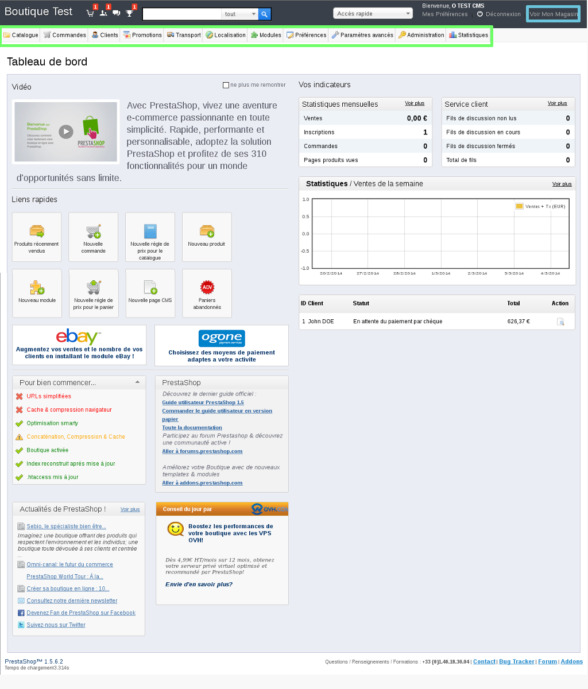

## Part 1: prepare to install

## Necessary tools
To install the PrestaShop platform on your web hosting package, we suggest that you get some FTP software such as FileZilla (it's free)

## The credentials you need
Make sure that you have your nic-handle and password, so that you can log in to your control panel if you need to.

- Retrieve your FTP ID and password so that you can connect to the server.
There is a guide showing you how to get your FTP details:

- You also need to have your SQL database ID and password so you can log on to the database.
There is a guide showing you how to get your SQL credentials: 

{.thumbnail}

## Part 2: get source files

- Go to the [PrestaShop](http://www.prestashop.com/) website. 

There should be a link that lets you download the last stable version of the CMS

The file will usually be compressed (zipped) so you have to be able to extract the files to your computer. There is lots of help available online.

{.thumbnail}

## Part 3: Set up files on your hosting package via FTP

## Open the folder which you want to download the zipped folder into.
Right-click on the folder, then select "Extract all...".

Indicate a destination in order to extract your files in a new folder. 

There are a number of tutorials and types of decompression software available on the internet to help you achieve this. 
Check them out if you are stuck at this stage.

The target folder will be called "PrestaShop"

{.thumbnail}

## Log on to the web hosting package via FTP
To get the WordPress files in to your hosting package, you first have to log on. 

Follow this guide on connecting to a hosting package in FTP:

{.thumbnail}

## Transfer the files via FTP
Follow this steps to upload your files using FTP

## Step 1
Once you are logged in to FileZilla. 

In the "Local site" section, which refers to the list of files on your computer, open the unzipped file entitled "PrestaShop" where your CMS files will be located. 

In the "Remote site" section, which refers to your OVH web hosting package, open the "www" folder. It is this folder that you need to upload your CMS files to. 

If this folder does not exist you can create it.

Your files must be uploaded to the "www" folder or you will not be able to access the installation procedure from your domain name.

{.thumbnail}

## Step 2
Once these folders are open:

In the "Local site" you will find all the files that you need to install your PrestaShop CMS.

To select them all, press CTRL+A.

Then drag and drop the files in to the "www" folder in the "Remote site" section. 

It is very likely that the "www". folder is not empty. You do not have to delete the files within it. We will go back to this point further on in the guide.

{.thumbnail}

## Step 3
The files are being transferred. 

Wait until all of the files are dropped in to the remote FTP server. This could take a few minutes.

Once the transfer is complete, make sure that all of the files and folders have been correctly transferred. 

This is the end of the section devoted to transferring files via FTP.

{.thumbnail}

## Part 4: Link with the database

## Follow the PrestaShop installation steps

- Before continuing with the installation, clear your browser's cash, to avoid any errors. 

In order to link your database to PrestaShop, you have to follow the CMS install steps.

## Step 1
Go to your domain name. 

Select the right language to install PrestaShop. 

Click "Next" to continue.

{.thumbnail}

## Step 2
Tick "I accept the terms and conditions below".

Click "Next".

{.thumbnail}

## Step 3
You will be prompted for further information on the store which you are about to create.
Fill in the following fields:

Shop name: the name that you choose can impact your SEO. 

Main activity: the main retail sector. 

Country: select your shop's country. 

"Name: the name of the administrator.

Email address: enter a valid email address so that you can access the shop administration.

Password: Enter the password for administrative access (minimum 8 characters).

Password confirmation: enter your password again. 

Subscribe to the PrestaShop newsletter: tick the box if you want to receive the PrestaShop newsletter.

Click "Next" to validate the information concerning PrestaShop.

{.thumbnail}

## Step 4
Get your database credentials (see the beginning of this guide)

Enter the information requested concerning the database:

Database server address: enter the name of your database's server, as indicated in the installation email or your customer account. 

Database: chosen when you created the database in the customer account. 

ID: database ID. 

Database password: you will have been sent this by email when you created the database - you may have modified this. 

Table prefix: useful for installing PrestaShop lots of times on the same database. In this case, you have to enter a different prefix for each installation.

Important: the database IDs are not automatically sent when installing the hosting package. To receive them, you have to enable the database in your customer account.

Once the details are complete, you can test the database login

Click "Next" to confirm login details.

- These are the final steps for creating a link between your database and PrestaShop. You now just have to complete the installation itself.

{.thumbnail}

## Completion

## Complete the istallation steps
Take the following steps to finish insallting the PrestaShop store.

## Step 1
Wait for the installation to finish. Once it is at 100% a new window will appear.

{.thumbnail}

## Step 2
Your PrestaShop store has now been installed!

You can now log in and start to work on your store. Click "Manage your store".

- Please note, for security reasons you have to manually delete the "install" folder on your hosting package in the "www" folder, in order to log in.

{.thumbnail}

## PrestaShop administration
A look at the PrestaShop administration panel.

{.thumbnail}

## Useful information
OVH support is not authorised to answer questions about PrestaShop configuration.

However, there is a user guide available: .

Please consult the forum dedicated to PrestaShop

- Here is the link to the [support forum](https://www.prestashop.com/forums/) dedicated to this CMS.

## Typical error: site under construction
You have set up your files on FTP, however the "site under construction" page is still displayed. 

When your hosting package was installed, OVH set up a "waiting" page while you were uploading files to your site. 

If you only upload your own files to the "www" folder and do not delete the OVH content first, then you may encounter this problem.

To fix this issue, you will need to remove or rename the "index.html" file that was created by OVH.

It may be useful to simply just rename the file so that you can re-enable it at any time, and use it as your own "waiting" page.

Something else to note: Your website's files must be uploaded to the "www" folder in order for them to display your website.

{.thumbnail}

## Typical error: forgot to delete the "install folder"

- Please note, for security reasons you have to manually delete the "install" folder on your hosting package in the "www" folder. Once you have done this you will be able to log in once installation is complete.

{.thumbnail}

