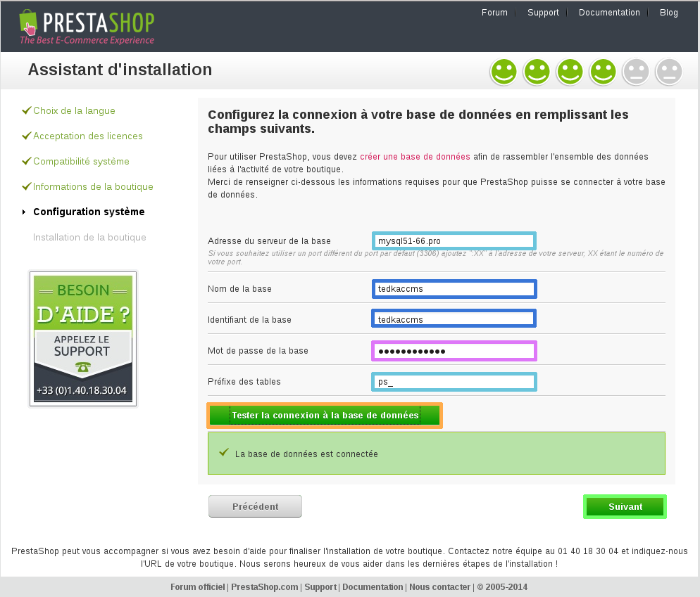
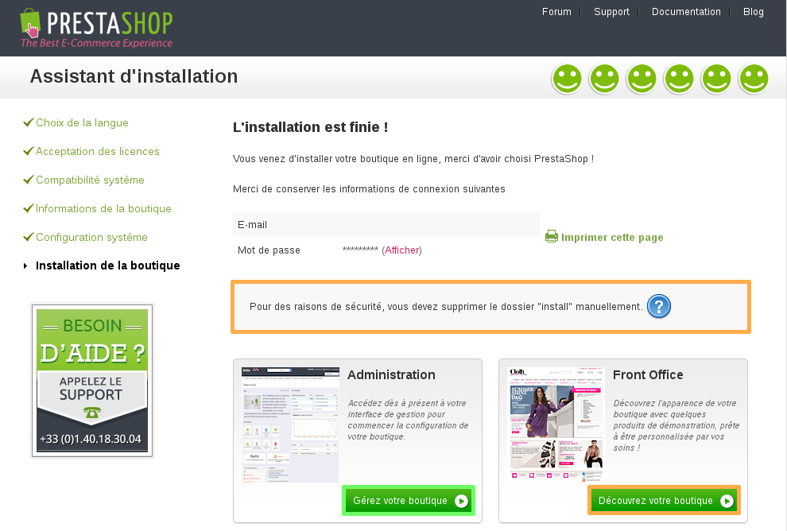
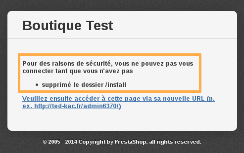

**Dernière mise à jour le 05/05/2020**

> [!warning]
>
> OVHcloud met à votre disposition des services dont la configuration, la gestion et la responsabilité vous incombent. Il vous revient de ce fait d'en assurer le bon fonctionnement.
> 
> Nous mettons à votre disposition ce guide afin de vous accompagner au mieux sur des tâches courantes. Néanmoins, nous vous recommandons de faire appel à un prestataire spécialisé et/ou de contacter l'éditeur du service si vous éprouvez des difficultés. En effet, nous ne serons pas en mesure de vous fournir une assistance. Plus d'informations dans la section « Aller plus loin » de ce guide.
> 

Prestashop. Pour vous aider, chacune des étapes est détaillée. Pour toute demande précise liée au CMS, nous vous invitons à vous rapprocher de l'éditeur du CMS, ou des communautés en rapport avec celui-ci.

Si vous souhaitez installer d'autres modules/CMS, consultez le guide [Installer manuellement mon CMS sur mon hebergement](../mutualise-installer-manuellement-mon-cms/){.ref}.

Les CMS sont des [systèmes de gestion de contenu](https://fr.wikipedia.org/wiki/Syst%C3%A8me_de_gestion_de_contenu){.external}, ils ont généralement besoin d'une plateforme d'hébergement comprenant un serveur FTP, une base de données, et un nom de domaine.

Vous pouvez trouver tous ces éléments dans [nos offres](https://www.ovh.com/ca/fr/hebergement-web/){.external}.

*Si vous souhaitez installer Prestashop de manière automatique depuis votre espace client, vous pouvez vous aider du guide suivant :* [Installer son site avec les modules en 1 clic](../modules-en-1-clic/){.ref}

## PrestaShop

### Partie 1 &#58; preparation de linstallation
Pour installer la plateforme  **PrestaShop**  sur votre offre d'hébergement mutualisé, nous vous conseillons de vous munir d'un logiciel  **FTP**  tel que **FileZilla**  (gratuit). *Assurez-vous d'être en possession de votre identifiant client (nic-handle) et de votre mot de passe, pour pouvoir vous connecter à votre espace client OVHcloud si nécessaire.*

- Récupérez votre identifiant et le mot de passe FTP qui vous permettent de vous connecter sur l'hébergement web.
- Il est aussi nécessaire d'avoir en votre possession votre identifiant et le mot de passe de la base de données SQL qui vous permettent de vous connecter dans la base de données.

{.thumbnail}

### Partie 2 &#58; recuperation des fichiers sources
- Rendez-vous sur le site du développeur de [PrestaShop](http://www.prestashop.com/){.external} .

**compressé**  (zippé), il faudra être en mesure de le  **décompresser**  (extraire) sur votre ordinateur. Vous trouverez sur Internet différentes aides à ce sujet.

{.thumbnail}

### Partie 3 &#58; mise en place des fichiers sur le FTP
Ouvrez le dossier dans lequel vous avez téléchargé le dossier compressé.

Réalisez un clic droit sur le dossier en question, puis sélectionnez "Extraire tout...".

Indiquez une destination afin d'extraire vos fichiers dans un nouveau dossier.

*De nombreux tutoriels et logiciels de décompression sont disponibles sur internet pour vous aider à réaliser ces manipulations. Consultez-les si vous êtes bloqués à cette étape.*

Le dossier cible sera intitulé " **prestashop** "

{.thumbnail}

Pour déposer les fichiers de  **PrestaShop**  sur votre hébergement, vous devez tout d'abord vous connecter à celui-ci.

*Consultez le guide concernant la connexion en FTP sur l'offre mutualisée :* [Se connecter à l’espace de stockage de son hébergement web](../connexion-espace-stockage-ftp-hebergement-web/){.ref}

{.thumbnail}

Suivez ces étapes pour déposer vos fichiers sur le FTP. Une fois connecté à FileZilla.

Dans la partie "Site local", qui correspond à la liste des fichiers présents sur votre ordinateur, ouvrez le dossier décompressé intitulé "prestashop" dans lequel sont présents les fichiers du CMS.

Dans la partie "Site distant" qui correspond dans ce cas à votre hébergement mutualisé OVHcloud, ouvrez le dossier "www". C'est dans ce dossier que tous les fichiers du CMS devront être déposés.

*Si ce dossier n'existe pas il vous est possible de le créer.*

*Vos fichiers doivent obligatoirement être déposés dans le dossier "www" sinon la procédure d'installation ne sera pas accessible depuis votre nom de domaine.*

{.thumbnail}

Une fois ces dossiers ouverts :

Dans la partie "Site local", vous retrouvez tous les fichiers nécessaires à l'installation du CMS PrestaShop.

Pour tous les sélectionner, réaliser la combinaison de touche  **CTRL+A** .

Réalisez ensuite le glisser-déposer des fichiers vers la partie "Site distant" dans le dossier "www".

*Il est fort probable que le dossier "www" ne soit pas vide. Il n'est pas obligatoire de supprimer les fichiers présents dedans. Nous reviendrons sur ce point dans la suite de ce guide.*

{.thumbnail}

Le transfert des fichiers est en cours.

Attendez que la totalité des fichiers soit déposés sur le serveur FTP distant. Cela peut prendre quelques minutes.

Une fois le transfert terminé, assurez-vous que tous les fichiers et les dossiers ont été correctement transférés.

Cette opération conclut la partie consacrée au dépôt des fichiers sur le FTP.

{.thumbnail}

### Partie 4 &#58; lien avec la base de donnees
- Avant de continuer l'installation, videz le cache de votre navigateur internet, afin d'éviter toute erreur.

Afin de réaliser le lien entre votre base de données et PrestaShop, nous devons suivre les étapes d'installation du CMS. Rendez-vous sur votre nom de domaine.

Sélectionnez la langue "Français (French)" pour l'installation de la boutique PrestaShop.

Cliquez sur "Suivant" pour continuer.

{.thumbnail}

Cochez "J'accepte les termes et conditions du contrat ci-dessus".

Cliquez ensuite sur "Suivant" pour accéder à l'étape suivante.

{.thumbnail}

Des informations complémentaires sur la boutique sur le point d'être créée vous sont demandées. Renseignez les champs suivants :

Nom de votre boutique : le nom désiré pour la boutique, cela peut impacter le référencement.

Activité principale : l'activité prédominante de la boutique.

Pays : sélectionnez le pays de votre boutique.

Prénom : le prénom de l'administrateur.

Nom : le nom de l'administrateur.

Adresse e-mail : renseignez une adresse e-mail valide pour l'accès à l'administration de la boutique.

Mot de passe : renseignez le mot de passe pour l'accès à l'administration (minimum 8 caractères).

Confirmation du mot de passe : entrez de nouveau votre mot de passe.

S'inscrire à la newsletter de PrestaShop : cochez la case si vous souhaitez recevoir les newsletters en provenance de l'équipe de PrestaShop.

Cliquez sur "Suivant" pour valider les informations concernant la boutique PrestaShop.

{.thumbnail}

Munissez-vous des identifiants de votre base de données (une aide à ce sujet est disponible dans le début de ce guide).

Renseignez les informations demandées concernant la base de données :

Adresse du serveur de la base : renseignez le nom du serveur de votre base de données, indiqué dans le mail d'installation ou dans votre espace client.

Nom de la base : choisi lors de sa création dans l'espace client.

Identifiant : identique au nom de la base de données.

Mot de passe de la base : vous a été envoyé par mail lors de la création de la base de données – il est possible que vous l'ayez modifié.

Préfixe des tables : utile pour réaliser plusieurs installations de PrestaShop sur la même base de données. Dans ce cas, il faudra renseigner un préfixe différent pour chacune des installations.

*Important : les identifiants de la base de données ne sont pas automatiquement envoyés lors de l'installation de l'hébergement. Pour les recevoir, vous devez activer la base de données dans votre espace client.*

Une fois ces informations complétées, vous pouvez tester la connexion à la base de données.

Cliquez sur "Suivant" pour valider les informations de connexion.

- Ces étapes finalisent la création du lien entre votre base de données et PrestaShop. Ne reste qu'à finaliser l'installation proprement dite.

{.thumbnail}

### Finalisation
Afin de terminer l'installation de la boutique PrestaShop, continuez les étapes d'installation. Laissez l'installation se terminer. Une fois à 100 % une nouvelle fenêtre apparaît.

{.thumbnail}

L'installation de la boutique PrestaShop est à présent terminée !

Vous pouvez à présent vous identifier et commencer à travailler sur votre boutique en cliquant sur "Gérez votre boutique".

- Attention pour des raisons de sécurité vous devrez supprimer manuellement le dossier "install" présent sur l'hébergement mutualisé dans le dossier "www" afin de pouvoir vous connecter.

{.thumbnail}

Vous trouverez ici un aperçu du panel d'administration de PrestaShop.

{.thumbnail}

### Informations utiles

**Le support d'OVHcloud ne sera pas habilité à vous répondre pour toute demande d'aide concernant la configuration de votre PrestaShop.**

Nous vous invitons à consulter les forums dédiés à la solution PrestaShop.

- Voici un lien vers un [forum d'entraide](http://www.prestashop.com/forums/forum/18-forum-francophone/){.external} dédié à ce CMS.

Vous avez mis en place vos fichiers sur le FTP, cependant la page "site en construction" est toujours affichée.

À l'installation de votre hébergement, OVHcloud met en place une page d'attente, le temps que vous déposiez les fichiers de votre site internet.

Si vous déposez simplement vos fichiers dans le dossier  **"www"**  sans supprimer le contenu déposé par OVHcloud, vous risquez de rencontrer ce souci.

Afin de corriger cela, vous devez supprimer ou renommer le fichier "index.html" mis en place par OVHcloud sur votre hébergement.

*Il peut être intéressant de simplement le renommer afin de vous permettre de le réactiver à tout moment et de vous en servir comme page d'attente.*

Autre information utile : les fichiers de votre site doivent être déposés dans le dossier "www" afin d'être pris en compte.

{.thumbnail}

- Attention, pour des raisons de sécurité vous devrez supprimer manuellement le dossier "install" présent sur l'hébergement mutualisé dans le dossier "www" . Vous pourrez ainsi vous connecter une fois l'installation finalisée.

{.thumbnail}

## Aller plus loin

Échangez avec notre communauté d'utilisateurs sur <https://community.ovh.com>.
