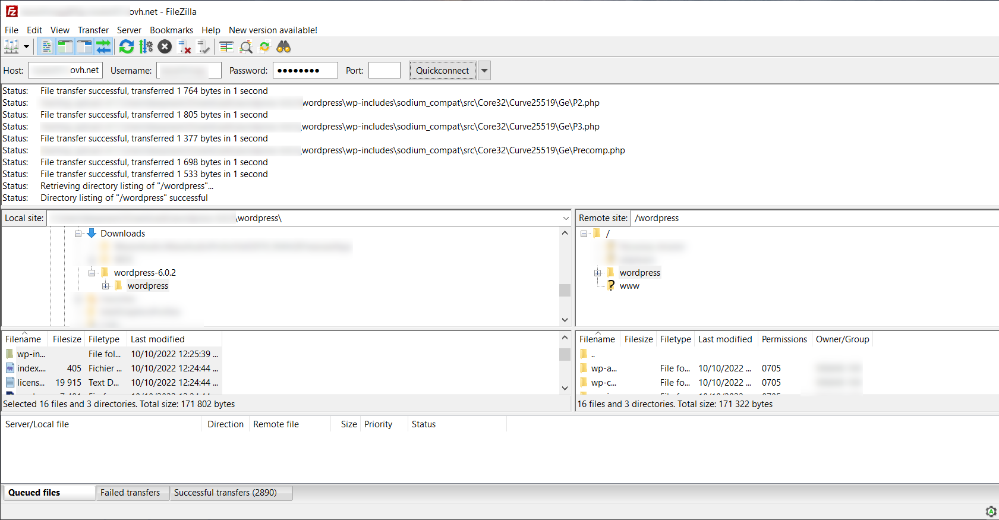

**Last updated 16th November 2022**

## Objective

This tutorial will help you install WordPress CMS (Content Management System) manually in just a few steps.

> [!warning]
>
> OVHcloud provides services that you are responsible for with regard to their configuration and management. It is therefore your responsibility to ensure that they function properly.
> 
> This guide is designed to help you with common tasks. Nevertheless, we recommend contacting a [specialist provider](https://partner.ovhcloud.com/fr/) or [the editor of the WordPress CMS](https://wordpress.com/fr/support/){.external} if you encounter any difficulties. We will not be able to assist you. You can find more information in the ["Go further"](#go-further) section of this guide.
>

> [!success]
>
> To install WordPress **automatically** from your [OVHcloud Control Panel](https://www.ovh.com/auth/?action=gotomanager&from=https://www.ovh.com/fr/&ovhSubsidiary=fr), please refer to our documentation on [installing a one-click module](https://docs.ovh.com/fr/hosting/modules-en-1-clic/).
>
> To manually **install another CMS** (Joomla!, Drupal, PrestaShop), please refer to our documentation on [installing a CMS manually](https://docs.ovh.com/fr/hosting/mutualise-installer-manuellement-mon-cms/).
>

## Requirements

- Have a [Web Hosting plan](https://www.ovhcloud.com/fr/web-hosting/) that contains at least one database.
- Have [domain name](https://www.ovhcloud.com/fr/domains/)
- Log in to [OVHcloud Control Panel](https://www.ovh.com/auth/?action=gotomanager&from=https://www.ovh.com/fr/&ovhSubsidiary=fr){.external}

## Instructions

### Step 1 - Prepare for installation <a name="step1"></a>

To install the CMS **WordPress** on your [web hosting plan](https://www.ovhcloud.com/fr/web-hosting/), you will need to make some preparations.

#### 1.1 - Check the “root folder” declaration

The “root folder” refers to the directory your future CMS will be installed in on your hosting plan. We recommend choosing an empty directory to avoid conflicts with your other multisite potentials.

Consult our documentation that describes [how to add a multisite on your web hosting plan](https://docs.ovh.com/fr/hosting/multisites-configurer-un-multisite-sur-mon-hebergement-web/), to define the root folder to use on your WordPress.

> [!primary]
>
> If you define a “root folder” name that does not exist on your Web Hosting plan, it will be automatically created in your Web Hosting plan’s FTP storage space.
>

#### 1.2 - Check the domain name pointing

- Make sure that the domain name you will use to access your WordPress, as well as its subdomain “www”, point to the IP address of your [web hosting plan](https://www.ovhcloud.com/fr/web-hosting/).

To retrieve the IP address of your Web Hosting plan, log in to your [OVHcloud Control Panel](https://www.ovh.com/auth/?action=gotomanager&from=https://www.ovh.com/fr/&ovhSubsidiary=fr) in the `Web Cloud`{.action} section, then select your Web Hosting plan in the `Hosting`{.action} section.<br>
In the `General information`{.action} box on your right, you will find the IP address of your web hosting plan in the `IPv4`{.action} form.

If your domain’s active DNS zone is managed in your [OVHcloud Control Panel](https://www.ovh.com/auth/?action=gotomanager&from=https://www.ovh.com/fr/&ovhSubsidiary=fr), compare your hosting plan’s IP address with the one in your domain’s DNS zone, using our [OVHcloud DNS zones](https://docs.ovh.com/fr/domains/editer-ma-zone-dns/) documentation.

> [!warning]
>
> If you have activated the `CDN`{.action} or `country IP`{.action} options with your domain, use the appropriate IP address by referring to our documentation listing [all shared hosting IP addresses](https://docs.ovh.com/fr/hosting/liste-des-adresses-ip-des-clusters-et-hebergements-web/).
>

If you are unable to perform these checks, contact the hosting provider for your active DNS zone to update the pointing of your domain name.

> [!warning]
>
> Any changes you make to your DNS zone can take between 4 and 24 hours to propagate.
>

- Get [the information you need to log in to your Web Hosting plan’s FTP space](https://docs.ovh.com/fr/hosting/connexion-espace-stockage-ftp-hebergement-web/#etape-1-recuperer-les-informations-necessaires-pour-se-connecter).
- Retrieve access to your Web Hosting plan’s database if it already exists, or create one using our [documentation](https://docs.ovh.com/fr/hosting/creer-base-de-donnees/).

#### 1.3 - Install the free FTP client "Filezilla"

You can find the free download link and a tutorial on how to use it in our documentation on [using Filezilla with your OVHcloud hosting plan](https://docs.ovh.com/fr/hosting/mutualise-guide-utilisation-filezilla/).

#### 1.4 - Prepare a database <a name="step1-4"></a>

CMSs need a database to work. Our [Web Hosting](https://www.ovhcloud.com/fr/web-hosting/) solutions include them, with the exception of [the free Start 10M hosting plan](https://www.ovhcloud.com/fr/domains/free-web-hosting/).

Use our documentation to [create a database from your web hosting plan](https://docs.ovh.com/fr/hosting/creer-base-de-donnees/).

If you have a CloudDB offer in MySQL or MariaDB and you want to use it to manually install your WordPress, please refer to our documentation on [creating a database on a CloudDB](https://docs.ovh.com/fr/clouddb/creer-bases-de-donnees-et-utilisateurs/#creer-une-base-de-donnees).

Once you have created the database, retrieve the connection settings (server, database name, user name, and password) and save them for [step 3](#step3) in this guide.

> [!primary]
>
> If you would like to install your WordPress CMS with an existing database, you can retrieve the connection settings for your database directly from the website files linked to it.
>
> If this is also a CMS like the one you need to install, you can use [this guide](https://docs.ovh.com/fr/hosting/modifier-mot-de-passe-base-de-donnees/#etape-3-modifier-le-mot-de-passe-de-la-base-de-donnees-de-votre-site-dans-son-fichier-de-configuration) to identify the configuration files in your [FTP storage space](https://docs.ovh.com/fr/hosting/connexion-espace-stockage-ftp-hebergement-web/).
>
> Then log in to your database to list the prefixes of the tables already inside. This is to avoid choosing a table "prefix" already used by another of your sites.
>
> - To connect to your database linked to your Web Hosting plan, see [this guide](https://docs.ovh.com/fr/hosting/creer-base-de-donnees/#acceder-a-linterface-phpmyadmin).
> - To connect to a database on a Cloud DB, see [this guide](https://docs.ovh.com/fr/clouddb/connexion-base-de-donnees-serveur-bdd/).
>

### Step 2 - start manual installation

#### 2.1 - Retrieve WordPress source files

Go to the publisher's [WordPress](https://wordpress.org/download/#download-install){.external} to download the CMS source files.

{.thumbnail}

> [!primary]
>
> On the download page, note the PHP version and the MySQL or MariaDB version required to run your WordPress.
>
> Then configure the PHP version on your web hosting plan by referring to our guide on [changing PHP versions of a web hosting plan](https://docs.ovh.com/fr/hosting/configurer-le-php-sur-son-hebergement-web-mutu-2014/).
>
> If you are already using a PHP version that is equal to or higher than the required PHP version, no changes are required.
>

> [!warning]
>
> If you have other websites hosted on your Web Hosting plan, check that they are compatible with the PHP version you choose for your WordPress.
>

#### 2.2 - Unzip downloaded source files to new folder

The downloaded file is in **compressed** (zipped) format. Create a folder named **WordPress** on your computer and then **unzip** the contents of the downloaded file into the **WordPress** folder.

To do this, open the folder in which you downloaded the compressed file, right-click on the file in question and then select “Extract all... ”.

Enter the destination **WordPress** folder to extract your files to that folder.

#### 2.3 - Move the source files from the "WordPress" folder to the "root folder" on your web hosting plan

Once you have unpacked the files in your **WordPress** folder, [log in to your storage space via FTP](https://docs.ovh.com/fr/hosting/connexion-espace-stockage-ftp-hebergement-web/) using [FTP Filezilla client](https://docs.ovh.com/fr/hosting/mutualise-guide-utilisation-filezilla/) then copy the files in the **WordPress** folder to the "root folder" you defined on your hosting in [step 1](#step1) of this guide.

{.thumbnail}

>[!warning]
>
> We strongly recommend that you use an empty "root folder" to avoid conflicts with another site. Ensure that the destination folder does not contain any items before moving the files.
>

>[!primary]
>
> If the root folder you defined was not created automatically during the actions described in [step 1](#step1), you can create it via Filezilla.
>
> It may take a few minutes to upload files to your web hosting plan.
>
> Once the transfer is complete, check that all the elements in the local **WordPress** folder have been correctly transferred to the root folder on your Web Hosting plan.
>

**Special Case**: If you have a limited internet speed and/or a hosting plan **Pro** or higher, you can use the **SSH** connection to put WordPress source files in your Web Hosting plan’s storage space. 

To log in to your hosting plan via SSH, please refer to our guide to [logging in via SSH from an OVHcloud shared hosting plan](https://docs.ovh.com/fr/hosting/mutualise-le-ssh-sur-les-hebergements-mutualises/).

Once you have logged in via **SSH**, run the following commands:

- Go to the "root folder" where you want to install WordPress on your web hosting plan:

```bash
cd NameOfYourTargetFolder
```

- Retrieve WordPress source files directly from your "root folder":

```bash
wget http://wordpress.org/latest.tar.gz
```

- Unzip the WordPress source files in your “root folder”:

```bash
tar xvf latest.tar.gz
```

- A **wordpress** folder is created in your "root folder". Move its contents to the base of your "root folder":

```bash
mv wordpress/* ./
```

- Delete the empty **wordpress** folder:

```bash
rmdir ./wordpress/
```

- Delete the compressed file **latest.tar.gz**:

```bash
rm -f latest.tar.gz
```

### Step 3 - Finalise manual installation <a name="step3"></a>

> [!success]
>
> Before you continue with the installation, clear your Internet browser cache to avoid any errors.
>

#### 3.1 - Access your WordPress website via your browser

Enter your domain in the search bar of your web browser.

If the WordPress source files have been correctly placed in your root folder, the WordPress page for selecting the language appears:

{.thumbnail}

Select the site language and click `Continue`{.action}.

#### 3.2 - Link your WordPress and your database

WordPress will ask you to retrieve the login details for your database:

{.thumbnail}

Get your database login details (if necessary, read [Step 1.4](#step1-4) in this guide) then click on `Let's go!`{.action} to continue.

The following page appears:

{.thumbnail}

Enter the information requested for the database:

- Database name: this name was defined when the database was created in the [OVHcloud Control Panel](https://www.ovh.com/auth/?action=gotomanager&from=https://www.ovh.com/fr/&ovhSubsidiary=fr).

- ID: it is identical to the database name if you are using a database included with your web hosting plan.
For databases created on CloudDB, please refer to the information in [Step 1.4](#step1-4) of this guide.

- Password: it was sent to you by email when the database was created. You may have modified it in the meantime.

- Database address: Enter the name of your database server, in the installation email or in your OVHcloud Control Panel. 

> [!primary]
> 
> - The server name of a database included with your web hosting plan usually has this form: `NameOfYourDatabase.mysql.db`. 
>
> - The server name of a CloudDB database starts with your OVHcloud NIC handle and is in the following form: `OVHID(without-ovh)-XXX.eu.clouddb.ovh.net` where the **"X"** are to be replaced by the reference of your CloudDB service.
>

- Table prefix: if you are installing with a brand new database, enter your preferred “prefix”. If you are using a database that is already in use by another website, please refer to [Step 1.4](#step1-4) of this guide to avoid entering a table "prefix" that is already in use in your database.

Click `Submit`{.action} to validate the database connection information.

If everything went well, the following page appears:

{.thumbnail}

Click `Launch Installation`{.action}.

#### 3.3 - Set administrator access to the back-office of your WordPress and your contact email

Once you have set it up, WordPress will ask you for information on your future website, including the creation of your WordPress admin username.

This will then give you access to the administration panel, commonly called “Back-office”, in your WordPress CMS.

{.thumbnail}

Enter the information requested:

- Site title: enter your website’s title.
- ID: define your CMS Administrator ID.
- Password: set a password for this Administrator ID.
- Your email address: enter a valid email address.
- Privacy: tick this box to have search engines reference your WordPress.

Click `Install WordPress`{.action} as soon as you have entered all of the information correctly.

#### 3.4 - Finalise manual installation and test "Administrator" access

Installation is complete if the following page is displayed:

{.thumbnail}

At this stage, simply click on the `Log in`{.action} button to test access to the Back-office of your new WordPress CMS using the administrator credentials that were created in step 3.3 just before.

> [!primary]
>
> OVHcloud teams do not offer support on third-party solutions such as WordPress. They cannot therefore assist you with using or configuring your WordPress CMS.
>
> For support of this type, please use the forums dedicated to the WordPress solution.
>

Once connected, the following page appears:

{.thumbnail}

> [!success]
>
> You can now start creating the content for your WordPress website!
>

## Go further <a name="go-further"></a>

[Official WordPress website](https://wordpress.org)

For specialised services (SEO, development, etc.), contact [OVHcloud partners](https://partner.ovhcloud.com/fr/).

If you would like assistance using and configuring your OVHcloud solutions, please refer to our [support offers](https://www.ovhcloud.com/fr/support-levels/).

Join our community of users on <https://community.ovh.com>.