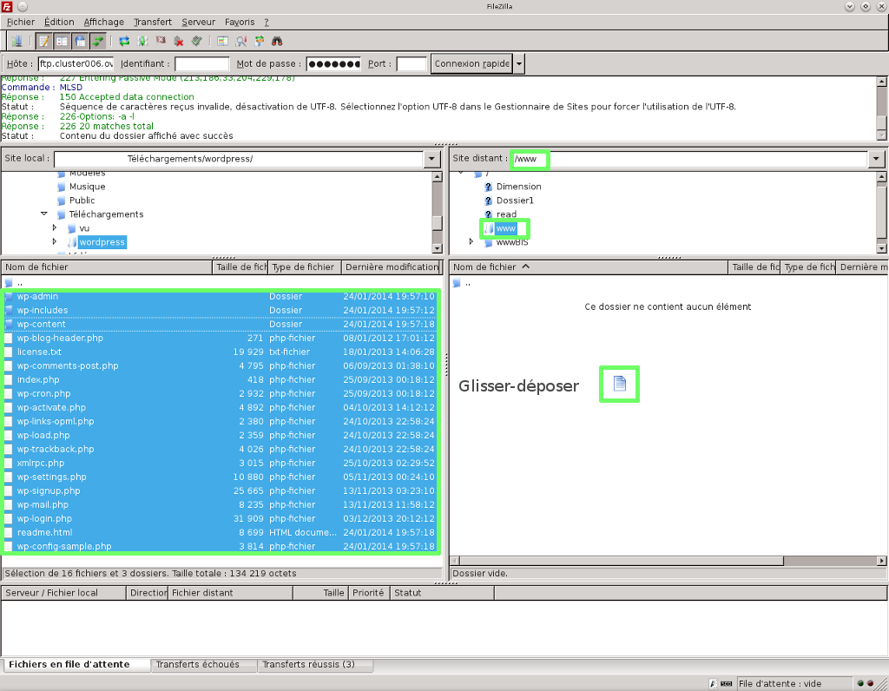
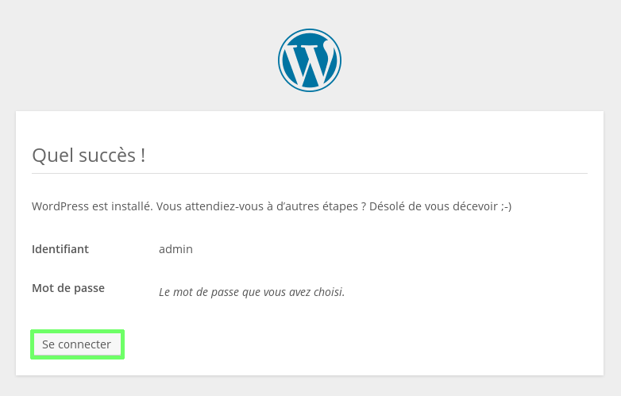
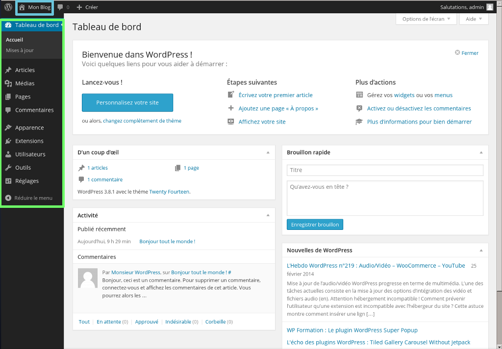

## Part 1: preparing for installation

## [b]Necessary tools[/b]
To install the WordPress platform on your shared hosting package, we advise you to get an FTP program such as FileZilla (free).

## Necessary credentials
Make sure that you have your customer ID (nic-handle) and password so you can log in to your OVH customer account if necessary.

- Get your FTP ID and password so you can log on to your hosting package. 
There is a guide showing you how to get your FTP details:

- You also need to have your SQL database ID and password so you can log on to the database.
There is a guide showing you how to get your SQL credentials: 

{.thumbnail}

## Part 2: get source files

- Go to the [WordPress](https://wordpress.com/learn-more/?v=discover) website. 

There should be a link that lets you download the latest stable version of the CMS

The file will usually be compressed (zipped) so you have to be able to extract the files to your computer. There is lots of help available online.

{.thumbnail}

## Part 3: Upload your files to your hosting package via FTP

## Unzip the file folder
Open the folder that contains the zipped folder you downloaded. 

Right-click on the folder, then select "Extract all...".

Indicate a destination in order to extract your files in a new folder. 

There are a number of tutorials and types of decompression software available on the internet to help you achieve this. 
Check them out if you are stuck at this stage.

The target folder will be called "WordPress"

{.thumbnail}

## Log on to the web hosting package via FTP
To upload the WordPress files to your hosting package, you first have to log on. 

Follow this guide on connecting to a hosting package in FTP:

{.thumbnail}

## Transfer files via FTP
Follow these steps to upload your files using FTP.

## Step 1
Once you are logged in to FileZilla. 

In the "Local site" section, which refers to the list of files on your computer, open the unzipped file entitled "WordPress" where your CMS files will be located. 

In the "Remote site" section, which refers to your OVH shared hosting package, open the "www" folder. It is this folder that you need to drop your CMS files into. 

If this folder does not exist you can create it.

Your files must be dropped in to the "www" folder or you will not be able to access the installation procedure from your domain name.

{.thumbnail}

## Step 2
Once these folders are open:

In the "Local site" section, find all the files you need to install the WordPress CMS. 

To select them all just click CTRL+A.

Then drag and drop the files in to the "Remote site" section in the "www" folder. 

It is very likely that the "www" folder is not empty. You do not have to remove the files that are in it. We will go back to this point later on in the guide.

{.thumbnail}

## Step 3
The files are being transferred. 

Wait until all of the files are dropped in to the remote FTP server. This could take a few minutes.

Once the transfer is complete, make sure that all of the files and folders have been correctly transferred. 

This is the end of the section devoted to transferring files via FTP.

{.thumbnail}

## Step 4: link with the database

## Follow WordPress installation steps

- Before continuing with the installation, clear your browser's cache, to prevent any errors. 

In order to link your database to WordPress, you have to follow the CMS install steps.

## Step 1
Go to your domain name

This message will appear. 

Click on "Create a configuration file to continue."

{.thumbnail}

## Step 2
Get your database credentials (see the beginning of this guide)

Click "We're off!" or equivalent to go to the next step.

{.thumbnail}

## Step 3
Enter the information requested concerning the database

Database name: chosen when it was created in the customer account. 

ID: database ID. 

Password: you were sent an email when you created the database - you might have changed it. 

Database address: enter the name of your database server, stated in the installation email or your customer account. 

Table prefix: useful for installing WordPress lots of times on the same database. In this case, you have to enter a different prefix for each installation. 

Important: the database IDs are not automatically sent when installing the hosting package. To receive them, you have to enable the database in your customer account.

Click "Send" to confirm login details for the database. 

- These are the final steps for creating a link between your database and WordPress. You now just have to complete the installation itself.

{.thumbnail}

## Completion

## Complete the installation steps
Take the following steps to finish installing the WordPress blog.

## Step 1
Click "Run install" or equivalent to continue.

{.thumbnail}

## Step 2
Enter the information requested concerning administration of your WordPress blog:

Website title: enter the title of your blog.

ID:choose the login ID to manage your blog. 

Password, two times: enter your chosen password two times to log in to your WordPress blog administration. 

Your email address: enter a valid email address. 

Private life: if this box is checked, the search engines will rank the blog. 

To launch the WordPress installation click on green]"Install WordPress".

{.thumbnail}

## Step 3
Your WordPress blog has now been installed!

You can now log in and start to work on your blog. Click "Log in".

{.thumbnail}

## WordPress administration
A look at the WordPress administration panel.

{.thumbnail}

## Useful information
OVH support is not authorised to answer questions about WordPress configuration.
However, there is a user guide available: .

Please consult the forum dedicated to WordPress.

- Here is the link to the [support forum](http://www.wordpress-fr.net/support/) dedicated to this CMS.

## Typical error: site under construction
You have set up your files on FTP, however the "site under construction" page is still displayed. 

When your hosting system was installed, OVH set up a "waiting" page while you were uploading files to your site. 

If you only drop your own files into the "www" folder and do not delete the OVH content first, then you may encounter this problem.

To correct/fix this issue, you will need to remove or rename the "index.html" file that was created by OVH.

It may be useful to simply just rename the file so that you can re-enable it at any time, and use it as your own "waiting" page.

Something else to note: Your website's files must be placed in the "www" folder in order for them to display your website.

{.thumbnail}

## Typical error: PHP version
This is an error to do with your server's PHP version. 

The cause is simple: the latest version of PHP is not enabled. 

A guide is available concerning how to modify the PHP version on your hosting package:[Modify hosting package PHP version]({legacy}1207)

{.thumbnail}

