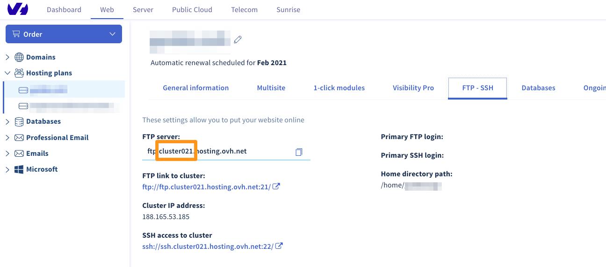

**Última actualización: 24/08/2020**

## Objetivo

Los servidores de bases de datos SQL Privado y Cloud Databases le ofrecen la posibilidad de modificar los parámetros globales de su servidor. También puede ver la actividad del servidor. 

**Esta guía explica cómo configurar y optimizar el servidor de bases de datos.**

## Requisitos

- Tener contratado un plan de [hosting SQL Privado](https://www.ovhcloud.es/hosting/opciones-sql.xml){.external} o [Cloud Databases](https://www.ovhcloud.es/cloud-databases/){.external}.
- Haber iniciado sesión en el [área de cliente de OVHcloudcloud](https://www.ovh.com/auth/?action=gotomanager&from=https://www.ovh.es/&ovhSubsidiary=es){.external}.

## Procedimiento

### Ver la información general del servidor de bases de datos

En la columna izquierda del [área de cliente de OVHcloud](https://www.ovh.com/auth/?action=gotomanager&from=https://www.ovh.es/&ovhSubsidiary=es){.external}, haga clic en `Bases de datos`{.action} y seleccione el servicio de bases de datos correspondiente. Por defecto, se abrirá la pestaña `Información general`{.action}.

En dicha pestaña podrá consultar la información más importante relativa al servicio de SQL. Le invitamos a tomarse unos momentos para asegurarse de que la información mostrada es correcta y se corresponde con las indicaciones que se ofrecen a continuación.

|Información|Detalles|
|---|---|
|Estado del servicio|Indica si el servicio está iniciado, se está reiniciando o está suspendido. El servicio debe estar iniciado para poder realizar cualquier tipo de acción.|
|Tipo|Muestra el sistema de bases de datos utilizado por el servidor. Si no sabe si el tipo utilizado es correcto, debe saber que el más frecuente es MySQL, aunque existen otros, como PostgreSQL o MariaDB. Por ejemplo, si su sitio web está basado en WordPress, MySQL es un sistema perfectamente adecuado.|
|Versión|Muestra la versión del sistema de bases de datos utilizado por el servidor. Asegúrese de que su sitio web es compatible con la versión elegida.|
|RAM|Muestra la memoria RAM disponible para la instancia e indica si se ha sobrepasado dicha cantidad de memoria. Su servidor de bases de datos dispone de recursos dedicados y garantizados: su memoria RAM. Si lo necesita, puede cambiar a un modelo superior, así como recibir alertas si consume todos los recursos de RAM de su servicio.|
|Infraestructura|Muestra la infraestructura utilizada por la instancia. Se trata de una información inherente a la infraestructura de OVHcloud.|
|Datacenter|Muestra el centro de datos en el que se ha creado la instancia Cloud Databases. Asegúrese de que el datacenter de su servicio sea el mismo que el del plan de hosting de OVHcloud en el que esté alojado su sitio web.|
|Host|Indica el servidor de OVHcloud en el que se ha creado la instancia. Se trata de una información inherente a la infraestructura de OVHcloud y se utiliza en nuestras comunicaciones relacionadas con [incidencias](https://web-cloud.status-ovhcloud.com/){.external}.|

{.thumbnail}

### Autorizar una dirección IP ( Solo en la solución Cloud Databases )

Para que sea posible acceder a la instancia Cloud Databases, deberá indicar las direcciones IP o rangos de IP autorizados a conectarse a la base de datos.

En la columna izquierda del [área de cliente de OVHcloud](https://www.ovh.com/auth/?action=gotomanager&from=https://www.ovh.es/&ovhSubsidiary=es){.external}, haga clic en `Bases de datos`{.action} y seleccione el servicio de bases de datos correspondiente. 

Para ello, abra la pestaña `IP autorizadas`{.action} y haga clic en el botón `Añadir una dirección IP/máscara`{.action}.

{.thumbnail}

En la nueva ventana, indique en `IP/máscara`{.action} la dirección IP o la máscara de red que quiera autorizar y, si lo desea, añada una descripción. Indique si quiere autorizar el acceso únicamente a las bases de datos o también al SFTP. Para terminar, haga clic en `Aceptar`{.action}.

{.thumbnail}

#### Autorizar la conexión a un alojamiento web de OVHcloud 

Para un alojamiento web de OVHcloud, debe autorizar la dirección IP "puerta de enlace" (gateway) de este último. 

Para acceder a la dirección IP **Puerta de enlace**, acceda al [área de cliente de OVHcloudcloud](https://www.ovh.com/auth/?action=gotomanager&from=https://www.ovh.es/&ovhSubsidiary=es){.external}. Haga clic en la pestaña `Web Cloud` y seleccione `Alojamiento`{.action} en la columna izquierda. Seleccione el alojamiento de la lista y abra la pestaña `FTP - SSH`.

Encontrará la mención **"Servidor FTP"**, que le indicará el número de cluster en el que está, como se indica a continuación.

{.thumbnail}

Una vez que haya obtenido el número del cluster en el que está situado el alojamiento, consulte la página ["Lista de direcciones IP de los clusters y alojamientos web"](https://docs.ovh.com/es/hosting/lista-de-direcciones-ip-de-los-clusters-y-alojamientos-web/){.external}. En él encontrará la dirección IP "**puerta de enlace**" de cada cluster.

> [!warning]
>
> **La dirección IP** del cluster no funcionará para autorizar la conexión al servidor Cloud DB. Hay que añadir **la dirección IP "puerta de enlace"**.
>


### Cambiar la oferta del servidor de bases de datos

Para cambiar el plan de hosting de su servidor de bases de datos, acceda al [área de cliente de OVHcloudcloud](https://www.ovh.com/auth/?action=gotomanager&from=https://www.ovh.es/&ovhSubsidiary=es){.external}. Haga clic en la pestaña `Web Cloud` y seleccione `Base de datos`{.action} en el panel izquierdo. Seleccione el nombre del servidor de bases de datos.
En la pestaña **"Información general"** que se muestra por defecto, haga clic en `...`{.action} a la derecha de la indicación "RAM" y luego en `Cambiar la cantidad de RAM`{.action} para acceder al pedido de esta modificación.

{.thumbnail}

Elija la cantidad de RAM deseada y haga clic en el botón `Siguiente`{.action}. A continuación, elija la duración deseada.

> [!primary]
>
> La parte proporcional se transferirá si solo tiene unos meses antes.
> Expiración Esta parte se basará en la fecha de expiración del servidor SQL.
> Privado, no de la orden de pedido.
> 

Tras la validación de los contratos, será redirigido a la orden de pedido, donde deberá abonar los cambios. La eliminación tardará unas horas en aplicarse.

> [!warning]
>
>  Si actualmente tiene un servidor SQL Privado gratuito con
> plan de hosting Performance, al cambiar la solución el servicio de SQL Privado pasará a tener un coste aparte.
> 

### Modificar la configuración de mi servidor de bases de datos

Acceda a su área de cliente (sección IP) Haga clic en la pestaña `Web Cloud` y seleccione `Base de datos`{.action} en el panel izquierdo. Seleccione el nombre de su servidor SQL privado. 

#### Instancia MySQL y MariaDB

- Abra la pestaña `Configuración`:

En el cuadro **"Configuración general de MySql"** encontrará la configuración actualmente establecida para su base de datos. Puede modificarla directamente y hacer clic en `Aplicar`{.action}.

{.thumbnail}

- **Tmpdir**: Directorio de archivos temporales. **/dev/shm** corresponde a la memoria RAM de la instancia. **/tmp** es el disco duro de la instancia.
- **MaxAllowedPacket**: Tamaño máximo de los envíos
- **max_user_connections**: Número de conexiones simultáneas autorizadas por usuario.
- **AutoCommit** : Define si las peticiones se validan automáticamente (committed) o no.
- **Interactive_timeout** : Tiempo (en segundos) que el servidor espera actividad en una conexión no interactiva antes de cerrarla.
- **InnodbBufferPoolSize** : Tamaño de la memoria intermedia (en megabytes).
- **MaxConnexions :** Número de conexiones simultáneas autorizadas en el SQL Privado.
- **Wait_timeout**: Tiempo (en segundos) que el servidor espera actividad en una conexión no interactiva antes de cerrarla.
- **Event_scheduler** : Permite activar la ejecución de consultas programadas directamente en el servidor MySQL.

> [!primary]
> Cuando se produce un error en el sitio web que indica **"Too many connections"**, se debe a que se han superado las conexiones simultáneas a su base de datos.
> Puede aumentar la variable **"MaxConnections"** si no está al máximo.
>

> [!primary]
>
> Tmpdir:
> - /dev/shm : El servidor de bases de datos asignará la mitad de su memoria RAM a este directorio para un mayor rendimiento.
> - /tmp/* El servidor asignará a su disco duro un espacio ilimitado para este repertorio, pero será mucho menos potente. Le recomendamos que utilice este directorio únicamente para operaciones ocasionales pesadas.
>

Realice los cambios necesarios y haga clic en `Confirmar`{.action}.

> [!warning]
>
> Cualquier modificación supondrá el reinicio del servidor de la base de datos de forma automática. 
> 

#### Instancia PostgreSQL

No es posible modificar la configuración de una instancia PostgreSQL. 

No obstante, puede activar extensiones en sus bases de datos. Para ello, abra la pestaña `Bases de datos` y haga clic en el icono de la tabla de la base de datos en la columna **"Extensiones"**

{.thumbnail}

### Cambiar la versión MySQL, PostgreSQL o MariaDB del servidor de bases de datos

Para conocer la versión de MySQL, PostgreSQL o MariaDB de su servidor de bases de datos, acceda a la pestaña **"Información general"** después de haber elegido su servidor de bases de datos.

La versión actual aparece en la línea **"Versión"**.

Para modificar esta versión, haga clic en `Editar la versión`{.action}.

{.thumbnail}


#### **¿Cómo puedo conocer la versión exacta de PostgreSQL que utilizo?**

Introduzca este comando en phpMyAdmin haciendo clic en la **base de datos**, en la sección **"SQL"**, y haciendo clic en `Ejecutar`{.action}:

```
select version();
```

####  **¿Cómo puedo conocer la versión exacta de mySQL o MariaDB que utilizo?**

Para ello, introduzca el comando en phpMyAdmin, en la sección **"SQL"** y haga clic en `Ejecutar`{.action}.

```
show variables like "version";
```

> [!primary]
>
> - Antes de migrar a una versión superior, asegúrese de que la base de datos es compatible con la versión seleccionada.
> - El cambio de contraseña tardará unos minutos en aplicarse.
>

> [!warning]
>
> No es posible pasar de una versión antigua a la última directamente. Es obligatorio pasar por todas las versiones intermedias.
> 

### Logs y Métricas

#### Estadísticas del tiempo de ejecución de las consultas

Para visualizar el tiempo de ejecución de las consultas en el servidor de bases de datos en las últimas 24 horas.

Acceda a su área de cliente (sección IP) Haga clic en la pestaña `Web Cloud` y seleccione `Base de datos`{.action} en el panel izquierdo. Seleccione el nombre del servidor de bases de datos. 

Acceda a la pestaña `Métricas` de su servidor de bases de datos. Puede consultar la gráfica **"Estadísticas del tiempo de ejecución de las consultas"**.

{.thumbnail}

#### Acceso a los logs "Slow Query"

> **Definición de "slow query log"**
> 
> Las peticiones tardan más en ejecutarse. El valor se define en 1 segundo en los servidores de bases de datos de la variable **"long_query_time"**.

Estos logs, denominados **"slow-query.log"**, pueden recuperarse en la raíz del espacio SFTP de su servidor de bases de datos. 

Acceda a su área de cliente (sección IP) Haga clic en la pestaña `Web Cloud` y seleccione `Base de datos`{.action} en el panel izquierdo. Seleccione el nombre del servidor de bases de datos. 

En la pestaña `Información general`, encontrará la sección **"SFTP"** en el recuadro **"Información de conexión".**

{.thumbnail}

Para conectarse por **SFTP**, puede hacerlo a través del programa Filezilla, siguiendo la guía Guía de uso de FileZilla

Si el archivo está vacío, no tiene una petición lenta.


#### Seguimiento de la RAM consumida

Acceda a su área de cliente (sección IP) Haga clic en la pestaña `Web Cloud` y seleccione `Base de datos`{.action} en el panel izquierdo. Seleccione el nombre del servidor de bases de datos. 

Acceda a la pestaña `Métricas` del área de cliente. Encontrará el gráfico **"Estadísticas de memoria RAM utilizada"**.

{.thumbnail}

#### Número de conexiones por minuto

Esta gráfica permite realizar un seguimiento, en las últimas 24 horas, de la carga de las conexiones por minuto al servidor de la base de datos.

Acceda a su área de cliente (sección IP) Haga clic en la pestaña `Web Cloud` y seleccione `Base de datos`{.action} en el panel izquierdo. Seleccione el nombre del servidor de bases de datos. 

Acceda a la pestaña `Métricas` del área de cliente. Puede consultar el gráfico **"Estadísticas del total de conexiones por minuto"**.

{.thumbnail}

### Gestionar las bases de datos

 Es recomendable mantener su base de datos para que sea potente. Lo que significa "alto rendimiento" es que la información contenida en la base de datos se devuelve lo antes posible al script que la solicita. Para ello, es necesaria una base de datos estructurada y optimizada.

#### Seleccionar la base de datos

Para aumentar la velocidad de búsqueda en una petición, es necesario poner un índice en los campos que se utilizan en las cláusulas WHERE.

Ejemplo: regularmente realiza una búsqueda de persona respecto a la ciudad. Introduzca el campo "ciudad" con la siguiente petición:

```bash
ALTER TABLE `test ADD INDEX ( `ville` );
```
#### Seleccionar la base de datos

¿Alguno de sus datos ya no está disponible? Archívelos, sus tabalas estarán optimizadas y las búsquedas irán más rápido.

#### **Limitación de visualización**

Limite la visualización de los registros a un número limitado (por ejemplo, 10 por página) con la parte LIMIT de su consulta SQL.

#### **Agrupar las consultas**

Reagrupe sus peticiones al inicio del script de esta forma :

```bash
Connexion SFTP
requete1
requete2
...
Desconexión
Visualización
traitement des données
Circulos...
Visualización
...
```
#### **Obtener sólo los datos útiles**

En sus consultas SQL, compruebe que solo seleccione lo que necesite, y sobre todo que no haya olvidado los enlaces entre tablas.

Por ejemplo:

```bash
(where table1.champs = table2.champs2)
```

#### **Evitar opciones que consuman demasiados recursos**

Evite usar **"HAVING"**, por ejemplo. Está consulta incrementará el número de peticiones a la base de datos. De la misma manera, evita usar **"GROUP BY"**, a menos que sea estrictamente necesario.

## Más información

[Lista de direcciones IP de los clusters y alojamientos web](https://docs.ovh.com/es/hosting/lista-de-direcciones-ip-de-los-clusters-y-alojamientos-web/){.external}

Interactúe con nuestra comunidad de usuarios en <https://community.ovh.com/en/>.


