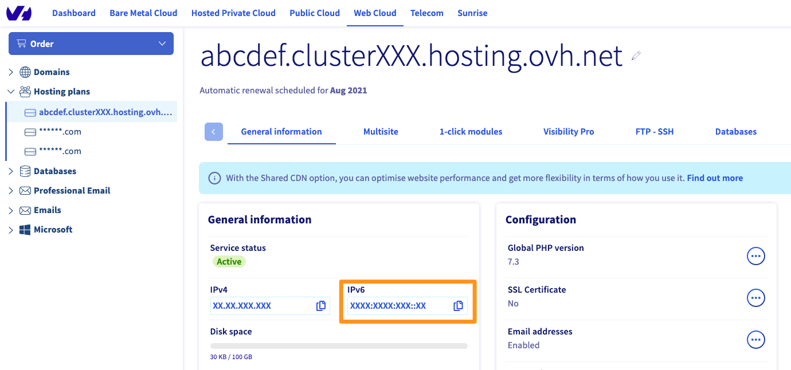

> [!primary]
> Diese Übersetzung wurde durch unseren Partner SYSTRAN automatisch erstellt. In manchen Fällen können ungenaue Formulierungen verwendet worden sein, z.B. bei der Beschriftung von Schaltflächen oder technischen Details. Bitte ziehen Sie beim geringsten Zweifel die englische oder französische Fassung der Anleitung zu Rate. Möchten Sie mithelfen, diese Übersetzung zu verbessern? Dann nutzen Sie dazu bitte den Button «Mitmachen» auf dieser Seite.
>

**Letzte Aktualisierung am 27.11.2020**

## Überblick

Das Internet läuft seit Anfang der 1990er Jahre auf IPv4. Mit diesem Standard wird jeder mit dem Internet-Netzwerk verbundenen Maschine eine IP-Adresse zugewiesen: Server, aber auch Computer, Smartphones, Tablets und andere mit dem Internet verbundene Geräte. Dieser Standard stößt an eine wichtige Grenze: Es können etwas mehr als 4 Milliarden verschiedene Geräte identifiziert werden; das entspricht einem Durchschnitt von einem Gerät pro zwei Menschen auf der Erde.

Es wurde schnell ein neues Protokoll eingeführt: **IPv6**. Damit können über 340 Billionen verschiedene Adressen genutzt werden. Die IPv6-Bereitstellung nimmt jedoch Zeit in Anspruch, da für das gesamte Internet erhebliche Änderungen damit einhergehen.

Da die Anzahl der verfügbaren IPv4-Adressen knapp ist, wird es immer schwieriger, neue Ressourcen zum Internet-Netzwerk hinzuzufügen. IPv6-Verbindungen sind aber nur nützlich, wenn der Web-Inhalte auch über dieses Protokoll verfügbar sind. Je mehr IPv6-Websites es gibt, desto wichtiger wird es für jeden Netzakteur, auf dieses Protokoll zu migrieren.

Weitere Informationen finden Sie im Wikipedia-Artikel zum [IPv6-Protokoll](https://de.wikipedia.org/wiki/IPv6){.external}.

## Ziel

Unsere Webhostings sind seit 2011 mit IPv6 kompatibel, doch die Aktivierung dieses Protokolls war bis vor kurzem lediglich eine optionale Konfigurationseinstellung. 

**Diese Anleitung erklärt, wie Sie überprüfen, ob Ihre Website mit IPv6 kompatibel ist, und wie Sie sie entsprechend konfigurieren.**

## Voraussetzungen

- Sie verfügen über einen [Domainnamen](https://www.ovhcloud.com/de/domains/) in Ihrem OVHcloud Kundencenter und verwenden OVHcloud DNS Server.
- Sie verfügen über ein [OVHcloud Webhosting](https://www.ovhcloud.com/de/web-hosting/) Angebot.
- Sie haben Zugriff zum [OVHcloud Kundencenter](https://www.ovh.com/auth/?action=gotomanager&from=https://www.ovh.de/&ovhSubsidiary=de)

## In der praktischen Anwendung

> [!warning]
>Diese Anleitung soll Sie bei allgemeinen Aufgaben so weit wie möglich unterstützen. Bitte denken Sie daran, diese Aktionen nötigenfalls an Ihre Situation anzupassen.
>
Bei Schwierigkeiten kontaktieren Sie bitte einen [spezialisierten Dienstleister](https://partner.ovhcloud.com/de/directory/) und/oder stellen Ihre Fragen in der OVHcloud Community unter <https://community.ovh.com/en/> (Englisch). Leider können wir Ihnen für administrative Aufgaben keine weitergehende technische Unterstützung anbieten. 
>

Wenn Ihre Website nicht für IPv6 konfiguriert ist, können Sie diese Information zur DNS-Zone Ihrer Domain manuell hinzufügen. Auf diese Weise können Webbrowser eine IPv6-Adresse finden, wenn sie Ihre Website über den Domainnamen anfordern.

### IPv6-Kompatibilität Ihrer Website überprüfen

Um zu testen, ob Ihre Website mit IPv6 kompatibel ist, können Sie die Website [ipv6-test.com](https://ipv6-test.com/validate.php){.external} verwenden. Tools wie dieses zeigen Ihnen, ob Ihre Website auf das neue IP-Protokoll reagiert. Wenn nicht, führen Sie die folgenden Schritte aus, um die Kompatibilität zu gewährleisten.

### Schritt 1: IPv6-Adresse Ihres Webhostings abrufen

Loggen Sie sich in Ihr [OVHcloud Kundencenter](https://www.ovh.com/auth/?action=gotomanager&from=https://www.ovh.de/&ovhSubsidiary=de) ein und klicken Sie im Bereich `Web Cloud`{.action} links in der Menüleiste auf `Hosting-Pakete`{.action}. Wählen Sie das betreffende Hosting aus.

Kopieren Sie im Bereich `Allgemeine Informationen` den Eintrag aus **IPv6** und gehen Sie zum nächsten Schritt über.

{.thumbnail}

### Schritt 2: DNS Zone konfigurieren

> [!warning]
> Unsere CDN-Option ist derzeit nicht mit IPv6 kompatibel. Wenn Sie eine IPv6-Adresse auf Ihrer Website einrichten, profitieren Ihre Besucher nicht vom CDN.

Damit ein Browser die IPv6-Adresse Ihrer Domain finden kann, müssen Sie die zugehörige DNS-Zone bearbeiten und einen Eintrag des Typs **AAAA** erstellen. Genauere Informationen zur Vorgehensweise finden Sie in unserer Anleitung zum [Konfigurieren einer DNS Zone](../../domains/webhosting_bearbeiten_der_dns_zone/).

Unter `Domains`{.action} in der linken Menüleiste wählen Sie Ihre Domain aus und dann den Tab `DNS Zone`{.action}. Klicken Sie auf den Button `Eintrag hinzufügen`{.action} rechts neben der Tabelle. Fügen Sie dort die im vorherigen Schritt kopierte IPv6-Adresse des Typs **AAAA** ein.

{.thumbnail}

## Weiterführende Informationen

[OVHcloud DNS-Zone bearbeiten](../../domains/webhosting_bearbeiten_der_dns_zone/)

Für den Austausch mit unserer User Community gehen Sie auf <https://community.ovh.com/>.