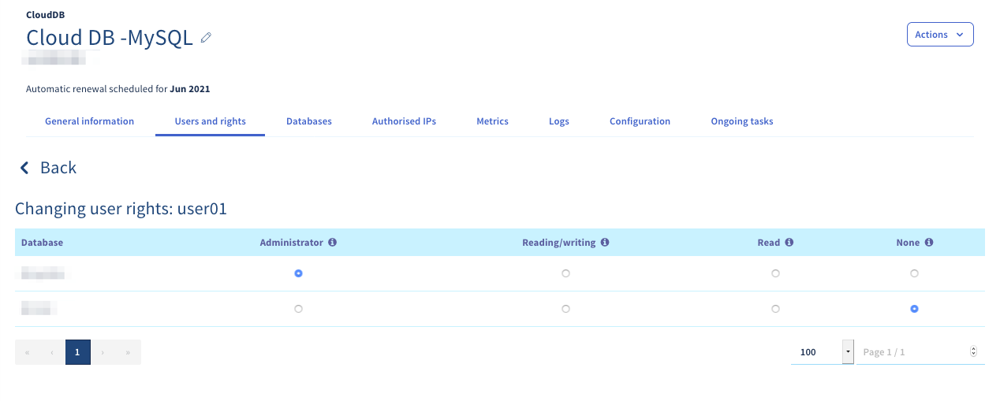
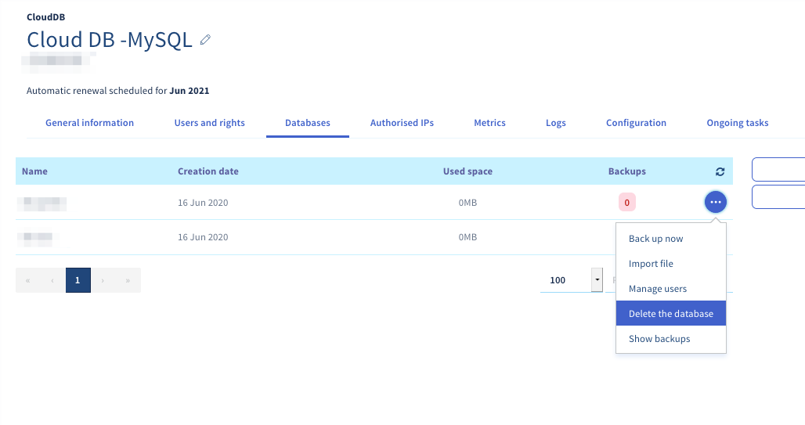

**Letzte Aktualisierung am 16.09.2020**

## Ziel

In einer Datenbank (DB) können sogenannte dynamische Elemente, wie zum Beispiel Kommentare oder Artikel, gespeichert werden. Diese Datenbanken werden heute von praktisch allen Content Management Systemen (CMS) wie WordPress oder Joomla! verwendet.

**Hier erfahren Sie, wie Sie eine Datenbank auf Ihrem Datenbankserver erstellen.**

## Voraussetzungen

- Sie verfügen über ein [SQL Private oder ](https://www.ovh.com/fr/hebergement-web/options-sql.xml){.external}Cloud Databases Hosting{.external}.
- Sie sind in Ihrem [OVHcloud Kundencenter](https://www.ovh.com/auth/?action=gotomanager){.external} angemeldet.

## In der praktischen Anwendung

### Datenbank erstellen

Begeben Sie sich in Ihr Kundencenter (Rubrik IP) Klicken Sie auf den Tab `Web` und dann `auf`{.action} Datenbank im linken Bereich. Wählen Sie den Namen Ihres Datenbankservers aus.

Gehen Sie in den Tab `Datenbanken` und dann `auf Datenbank hinzufügen`{.action}

{.thumbnail}

Geben Sie die Felder gemäß den angegebenen Kriterien ein. Sie können direkt einen Benutzer erstellen, indem Sie das Kästchen "**Benutzer _erstellen"_ ankreuzen**:

- **Name der Datenbank** (Pflichtfeld): Dies ist der Name Ihrer zukünftigen Datenbank.
- Geben Sie hier den Namen des Benutzers ein, der sich mit Ihrer Datenbank verbinden und Anfragen ausführen kann (optional, wenn in dem Feld „**Benutzer erstellen**“ kein Haken gesetzt wurde).
- **Rechte** (optional, wenn in dem Feld kein Haken gesetzt wurde): Hier handelt es sich um die Benutzerrechte, die dem Benutzer der Datenbank gewährt werden. Für eine standardmäßige Verwendung wählen Sie `Administrator`{.action} aus. Nutzerrechte können im Nachhinein verändert werden.
- **Passwort**/**Passwort bestätigen** (optional, wenn in dem Feld kein Haken gesetzt wurde): Geben Sie das gewünschte Passwort ein und bestätigen Sie es anschließend durch erneute Eingabe.

Klicken Sie dann auf `Bestätigen`{.action}.

{.thumbnail}

### Benutzer erstellen

Um einen Datenbankserver von OVHcloud zu verwenden, müssen Benutzer mit spezifischen Rechten für die Verbindung mit einer Datenbank erstellt werden. 

Begeben Sie sich in Ihr Kundencenter (Rubrik IP) Klicken Sie auf den Tab `Web` und dann `auf`{.action} Datenbank im linken Bereich. Wählen Sie den Namen Ihres Datenbankservers aus.

Gehen Sie in den Tab Benutzer `und Rechte` und klicken Sie auf `Benutzer hinzufügen`{.action}

{.thumbnail}

Geben Sie einen "Benutzernamen"und ein "Passwort"ein und klicken Sie anschließend auf `Bestätigen`{.action}. 

### Verwaltung der Benutzerrechte

Um einem Benutzer die Durchführung von Aktionen auf einer Datenbank zu ermöglichen, müssen ihm Rechte zugewiesen werden.

Um die Rechte jedes Benutzers zu verwalten, begeben Sie sich in Ihr [OVHcloud Kundencenter](https://www.ovh.com/auth/?action=gotomanager){.external}. Klicken Sie auf den Tab `Web` und dann `auf`{.action} Datenbank im linken Bereich. Wählen Sie den Namen Ihres Datenbankservers aus. Sie finden dies im Tab Benutzer und Rechte

Klicken Sie auf die Schaltfläche `(...)`{.action} rechts neben dem jeweiligen Nutzer, dann auf `Passwort ändern`{.action}.

{.thumbnail}

In der linken Spalte **"Datenbank"** finden Sie die Liste der Datenbanken Ihres Datenbankservers.

Hier die Beschreibung der 3 angebotenen Zölle:

- Freigabe von Anfragen des Typs: Select / Insert / Update / Delete / Create / Alter / Drop
- Freigabe von Anfragen des Typs: Select / Insert / Update / Delete
- Freigabe von Anfragen des Typs: Select
- Keine Rechte auf der Datenbank

> [!primary]
> 
> Die Segmentierung der oben genannten Rechte ist OVHcloud vorbehalten. So kann ein Benutzer mit den **"_Administrator_"-Rechten **DLL** (Data_Language) und **DML (Data_Language) und DML (Language_Language) **DLL (Rechte mit Leserrechten**/EcschriftlichBe"nur für DML definieren** _ _ _ _ ** ** **) Data_manipulation_Language)

{.thumbnail}

#### Eine Datenbank löschen

> [!warning]
>
> Zum Löschen einer Datenbank auf einem Datenbankserver gibt es keine
> Überprüfung des Inhalts der Datenbank. Diese wird daher auch dann gelöscht, wenn
> Es werden noch Daten gespeichert, daher wird empfohlen,
> ein Backup und Download von Ihrer Seite aus vor jeder Löschung.
> 

Begeben Sie sich in Ihr Kundencenter (Rubrik IP) Klicken Sie auf den Tab `Web` und dann `auf`{.action} Datenbank im linken Bereich. Wählen Sie den Namen Ihres Datenbankservers aus.

Um eine Datenbank auf Ihrem Datenbankserver zu löschen, gehen Sie in den Tab `Datenbanken` und klicken Sie dann auf `...`{.action} rechts neben der betreffenden Datenbank und anschließend auf `Datenbank löschen`{.action} .

{.thumbnail}

## Weiterführende Informationen

Für den Austausch mit unserer User Community gehen Sie auf <https://community.ovh.com>.
