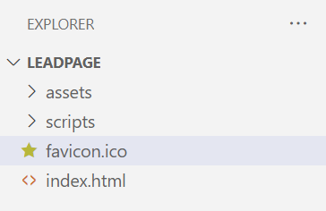
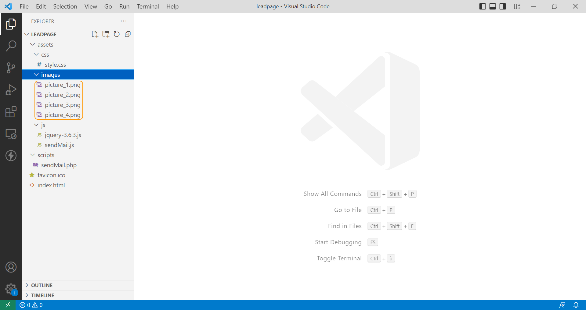

**Dernière mise à jour le 27/02/2023**

> [!warning]
>
> OVHcloud met à votre disposition des services dont la configuration, la gestion et la responsabilité vous incombent. Il vous revient de ce fait d'en assurer le bon fonctionnement.
> 
> Si vous éprouvez des difficultés à suivre les étapes de ce tutoriel, nous vous recommandons de faire appel à un [prestataire spécialisé](https://partner.ovhcloud.com/fr/) . En effet, nous ne serons pas en mesure de vous fournir une assistance. Plus d'informations dans la section [« Aller plus loin »](#go-further) de ce guide.
>

## Objectif

Ce tutoriel va vous permettre de créer une page web pour développer votre présence en ligne. Vos visiteurs pourrons vous contacter par un simple formulaire dont le contenu arrivera sur l'adresse mail de votre choix. Cette liste de prospects qualifiés sera optimale pour vos démarcharges en ligne par mail.

## Prérequis

- Disposer d'un [nom de domaine](https://www.ovhcloud.com/fr/domains/)
- Avoir souscrit à une offre d'[hébergement web OVHcloud](https://www.ovh.com/fr/hebergement-web/)
- Être en capacité d'utiliser un éditeur de texte sur votre ordinateur ou un IDE
- Avoir installé un client FTP comme [FileZilla](https://filezilla-project.org/download.php).
- Avoir quelques notions de programmation web (HTML, CSS, JavaScript et PHP)

Consultez le tutoriel [« Créer sa page web personnelle chez OVHcloud »](https://docs.ovh.com/fr/hosting/create-your-own-web-page/) pour vous familiariser avec les concepts de programmation utilisés.

## En pratique

Sur une unique page web unique seront disposés des éléments d'illustration et de texte, chacun renvoyant vers un formulaire sur le bas de page.

Ce formulaire qui permettra la récupération des données saisies et l'envoi vers l'adresse mail de votre choix via un script en PHP.

### Mise en place des fichiers

Les fichiers seront organisés de la façon suivante :

- un fichier `index.html` à la racine du site
- un répertoire `assets` qui inclura des répertoires `css` (feuilles de style), `images` (images de fond, illustrations) et `js` (librairie jQuery et script d'envoi du formulaire en AJAX)
- un répertoire `scripts` qui contiendra le code PHP qui enverra le contenu du formulaire sur l'adresse mail de votre choix.

{.thumbnail}

### Le fichier index.html

Le fichier `index.html` doit être positionné à la racine. C'est ce fichier qui sera interprété par le serveur lors des visites sur votre site.

```html
<!DOCTYPE html>
<html lang="en">
<head>
    <meta charset="UTF-8">
    <meta http-equiv="X-UA-Compatible" content="IE=edge">
    <meta name="viewport" content="width=device-width, initial-scale=1.0">
    <title>My web site</title>
</head>
<body>
    
</body>
</html>
```

### La feuille de style

Créez un fichier `style.css` qui sera placé dans le répertoire `assets/css` :

{.thumbnail}

### Les fichiers JavaScript

Le projet intégrera deux fichiers JavaScript : la librairie jQuery et le script d'envoi des données du formulaire vers le serveur.

Sur le site de [jQuery](https://jquery.com/), allez sur la page [Download jQuery](https://jquery.com/download/) et récupérez la dernière version de la librairie (clic-droit, enregistrer sous). Placez ce fichier dans le répertoire `assets/js` :

{.thumbnail}

Créez un fichier vide `sendMail.js` que vous placerez dans le même répertoire :

{.thumbnail}

### Le fichier PHP

L'envoi de mail se fait par un script PHP. Dans le répertoire `scripts`, créez un fichier `sendMail.php` :

{.thumbnail}

### Lier la feuille de style et les scripts JavaScript à la page HTML

Ajouter dans la balise `<head>` les balises `<script>`et `<link>` indiquant au navigateur quels fichiers utiliser :

```html
<!DOCTYPE html>
<html lang="en">
<head>
    <meta charset="UTF-8">
    <meta http-equiv="X-UA-Compatible" content="IE=edge">
    <meta name="viewport" content="width=device-width, initial-scale=1.0">
    <title>My web site</title>
    <link rel="stylesheet" href="assets/css/style.css" />
    <script src="assets/js/jquery-3.6.3.js"></script>
    <script src="assets/js/sendMail.js"></script>
</head>
```

### Ajouter des titres, des contenus et des images

Ajoutez un titre, un sous-titre et du contenu alternant texte et illustrations :

```html
<body>
    <main>
        <section>
            <h1>A title</h1>
            <h2>A subtile</h2>
        </section>
        <section>
            <div class="container">
                <div>
                    <p>Some content here</p>
                    <p><button><a href="#sendMessageFrom">Use the form below</a></button></p>
                </div>
                
            </div>
            <div class="container">
                
                <div>
                    <p>Some content here</p>
                    <p><button><a href="#sendMessageFrom">Contact us</a></button></p>
                </div>
            </div>
            <div class="container">
                <div>
                    <p>Some content here</p>
                    <p><button><a href="#sendMessageFrom">Use the form below</a></button></p>
                </div>
                
            </div>
            <div class="container">
                
                <div>
                    <p>Some content here</p>
                    <p><button><a href="#sendMessageFrom">Contact us</a></button></p>
                </div>
            </div>
        </section>
    </main>
</body>
```

### Favicon

Ajoutez un fichier `favicon` à la racine du site :

{.thumbnail}

Et modifiez le contenu de `<head>` en ajoutant une balise `<link>` pour lier le fichier HTML au favicon :

```html
<head>
    <meta charset="UTF-8">
    <meta http-equiv="X-UA-Compatible" content="IE=edge">
    <meta name="viewport" content="width=device-width, initial-scale=1.0">
    <title>My web site</title>
    <link rel="icon" href="favicon.ico" />
    <link rel="stylesheet" href="assets/css/style.css" />
    <script src="assets/js/jquery-3.6.3.js"></script>
    <script src="assets/js/sendMail.js"></script>
</head>
```

Disposez vos images dans le répertoire `assets/images` :

{.thumbnail}

### Formulaire de contact

Ajoutez le code HTML Bonpour le formulaire :

```html
<section id="contact">
    <h2>Contact</h2>
    <form method="post" id="sendMessageForm" action="">
        <p class="output"></p>
        <div class="form-row">
            <label for="name">Name</label>
            <input type="text" required name="name" id="name">
        </div>
        <div class="form-row">
            <label for="email">Email</label>
            <input type="email" required name="email" id="email">
        </div>
        <div class="form-row">
            <label for="message">Message</label>
            <textarea required name="message" id="message"></textarea>
        </div>
        <div class="form-row">
            <input type="submit" value="Send" />
        </div>
    </form>
</section>
```

### Le code PHP

Dans le répertoire `scripts`, créer un fichier `sendMail.php`.

Ce script en PHP a vous vocation de :

- récupérer les données envoyées depuis le formulaire HTML
- vérifier si les données sont conformes (pas de chaînes de caractères vides, e-mail conforme)
- générer un mail au format HTML reprenant les informations du formulaire
- envoyer le mail
- retourner une valeur indiquant si l'envoi a été effectué ou non.

```php
<?php

date_default_timezone_set('Europe/Paris'); // Set the local timezone

$to = "john.doe@mail.com"; // The recipient's e-mail address
$from = "noreply@mywebsite.com"; // The sender's e-mail address

$errors = []; // Empty array 

if (isset($_POST['name']) && !empty($_POST['name'])) { // Test the 'name' input
    $name = htmlentities($_POST['name']);
} else {
    $errors['name'] = 'Name is required';
}

if (isset($_POST['email']) && filter_var($_POST['email'], FILTER_VALIDATE_EMAIL)) { // Test the 'email' input
    $email = $_POST['email'];
} else {
    $errors['email'] = 'Email is required';
}

if (isset($_POST['message'])) { // Test the 'message' input
    $message = htmlentities($_POST['message'], ENT_QUOTES);
} else {
    $errors['message'] = 'Message is required';
}

if (empty($errors)) { // If the $errors array is empty

    $datetime = date("m-d-Y H:i"); // Set a timestamp
     
    $subject = "Lead page - $datetime - Contact - ". html_entity_decode($name); // Define the subject of the email

    $contenu = "<html> \n"; // email content
    $contenu .= "<head> \n";
    $contenu .= "<title>$subject</title> \n";
    $contenu .= "</head> \n";
    $contenu .= "<body> \n";
    $contenu .= "Hi!<br> \n";
    $contenu .= "<br> \n";
    $contenu .= "You just have received a message from your website.<br> \n";
    $contenu .= "<br> \n";
    $contenu .= "From: ". html_entity_decode($name);
    $contenu .= "<br> \n";
    $contenu .= "e-mail: &lt;" . $email . "&gt; <br> \n";
    $contenu .= "<br> \n";
    $contenu .= "Message:<br> \n";
    $contenu .= $message . " <br> \n";
    $contenu .= "</body> \n";
    $contenu .= "</html> \n";
     
    $headers  = "MIME-Version: 1.0 \n"; // Set the headers
    $headers .= "Content-Transfer-Encoding: 8bit \n";
    $headers .= "Content-type: text/html; charset=utf-8 \n";
    $headers .= "From: $from  \n";
   
    $sendMail = mail($to, $subject, $contenu, $headers); // Send the email and put the boolean result in a variable

    echo $sendMail ? 'success' : 'error'; // Test the variable and send back a string

} else {
    echo 'error';
}
```

Pour vous assurer que le mail que vous envoyez depuis votre serveur ne soit pas considéré comme un spam dans la boîte de destination, reportez vous au guide [« Configurer un enregistrement SPF sur son nom de domaine »](https://docs.ovh.com/gb/en/domains/web_hosting_the_spf_record/).

> [!warning]
>
> L'adresse mail de l'expéditeur doit être identique au nom de domaine sur lequel est exécuté le script d'envoi.
>

### Le fichier JavaScript

Ce fichier permet d'envoyer le contenu du formulaire en AJAX au script PHP et utilise la librairie jQuery.

```javascript
$(document).ready(function() {
    $("#sendMessageForm").on('submit', function(event) {
        event.preventDefault();
        var formData = $(this);

        $.ajax({
            method: "POST",
            url: "scripts/sendMail.php",
            data: formData.serialize(),
            success: function(result) {
                if (result == 'success') {
                    $('.output').css('display', 'block');
                    $('.output').text('Message sent!');
                } else {
                    $('.output').text('Error sending message!');
                }
            }
        });

    });
});
```

Vous pouvez remplacer ce code par le suivant qui ne fait pas appel à jQuery :

```javascript
document.addEventListener('DOMContentLoaded', function() {
  document.querySelector('#sendMessageForm').addEventListener('submit', function(event) {
    event.preventDefault();
    var formData = new FormData(this);

    fetch('scripts/sendMail.php', {
      method: 'POST',
      body: formData
    })
    .then(function(response) {
      if (response.ok) {
        return response.text();
      } else {
        throw new Error('Error sending message!');
      }
    })
    .then(function(result) {
      if (result == 'success') {
        document.querySelector('.output').style.display = 'block';
        document.querySelector('.output').textContent = 'Message sent!';
      } else {
        throw new Error('Error sending message!');
      }
    })
    .catch(function(error) {
      console.error(error);
      document.querySelector('.output').textContent = error.message;
    });
  });
});
```


## Aller plus loin <a name="go-further"></a>

Pour des prestations spécialisées (référencement, développement, etc), contactez les [partenaires OVHcloud](https://partner.ovhcloud.com/fr/).

Si vous souhaitez bénéficier d'une assistance à l'usage et à la configuration de vos solutions OVHcloud, nous vous proposons de consulter nos différentes [offres de support](https://www.ovhcloud.com/fr/support-levels/).

Échangez avec notre communauté d'utilisateurs sur <https://community.ovh.com>.