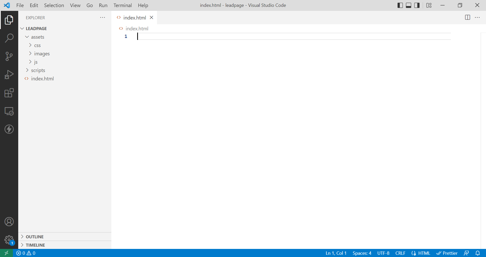
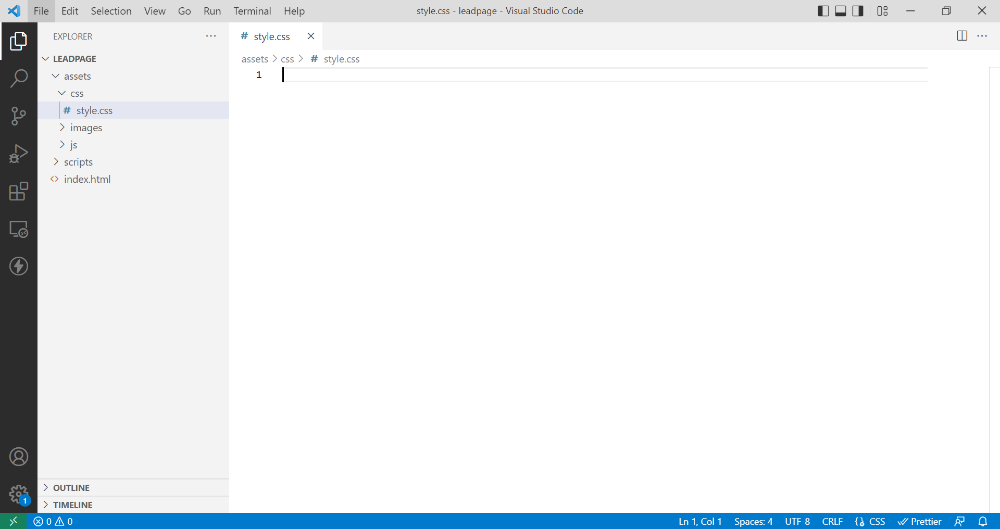
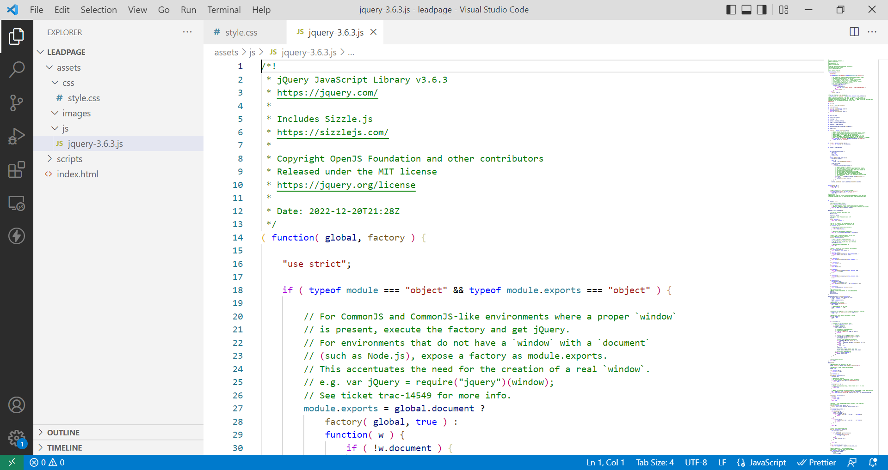
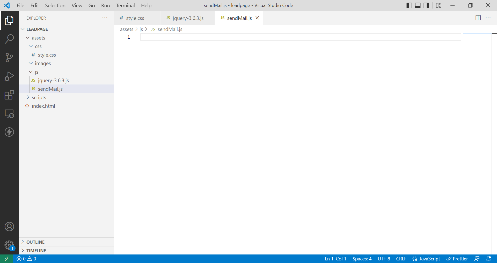
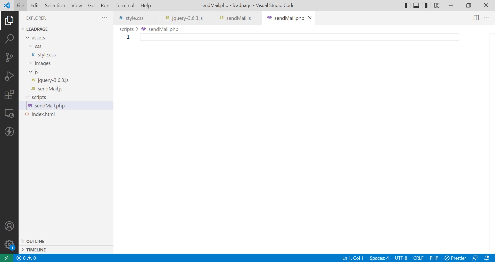

**Dernière mise à jour le 23/01/2023**

> [!warning]
>
> OVHcloud met à votre disposition des services dont la configuration, la gestion et la responsabilité vous incombent. Il vous revient de ce fait d'en assurer le bon fonctionnement.
> 
> Si vous éprouvez des difficultés à suivre les étapes de ce tutoriel, nous vous recommandons de faire appel à un [prestataire spécialisé](https://partner.ovhcloud.com/fr/) . En effet, nous ne serons pas en mesure de vous fournir une assistance. Plus d'informations dans la section [« Aller plus loin »](#go-further) de ce guide.
>

## Objectif

Ce tutoriel explique comment créer une page web professionnelle comprenant des incitations à renseigner un formulaire par les visiteurs de votre site web. Les données récupérées seront envoyées directement sur l'adresse e-mail de votre choix, adresse depuis laquelle vous pourrez leur répondre directement.

## Prérequis

- Disposer d'un [nom de domaine](https://www.ovhcloud.com/fr/domains/)
- Avoir souscrit à une offre d'[hébergement web OVHcloud](https://www.ovh.com/fr/hebergement-web/)
- Être en capacité d'utiliser un éditeur de texte sur votre ordinateur ou un IDE
- Avoir installé un client FTP comme [FileZilla](https://filezilla-project.org/download.php).
- Avoir quelques notions de programmation web (HTML, CSS et PHP)

Consultez le tutoriel [« Créer sa page web personnelle chez OVHcloud »](https://docs.ovh.com/fr/hosting/create-your-own-web-page/) pour vous familiariser avec les concepts de programmation utilisés.

## En pratique

Sur une page web unique seront disposés des éléments d'illustration et textuels, chacun renvoyant vers un formulaire sur le bas de page.

Ce formulaire qui permettra la récupération des données saisies et l'envoi vers l'adresse mail de votre choix via un script en PHP.

### Mise en place de l'architecture

Les fichiers seront organisés de la façon suivante :

- un fichier `index.html` à la racine du site
- un répertoire `assets` qui inclura des répertoires `css` (feuilles de style), `images` (images de fond, illustrations) et `js` (librairie jQuery et script d'envoi du formulaire en AJAX)
- un répertoire `scripts` qui contiendra le code PHP qui enverra le contenu du formulaire sur l'adresse mail de votre choix.

{.thumbnail}

### Le fichier index.html

Le fichier `index.html` doit être positionné à la racine. C'est ce fichier qui sera interprété par le serveur lors des visites sur votre site.

```html
<!DOCTYPE html>
<html lang="en">
<head>
    <meta charset="UTF-8">
    <meta http-equiv="X-UA-Compatible" content="IE=edge">
    <meta name="viewport" content="width=device-width, initial-scale=1.0">
    <title>My web site</title>
</head>
<body>
    
</body>
</html>
```

### La feuille de style

Créez un fichier `style.css` qui sera placé dans le répertoire `assets/css` :

{.thumbnail}

### Les fichiers JavaScript

Le projet intégrera deux fichiers JavaScript : la librairie jQuery et le script d'envoi des données du formulaire vers le serveur.

Sur le site de [jQuery](https://jquery.com/), allez sur la page [Download jQuery](https://jquery.com/download/) et récupérez la dernière version de la librairie (clic-droit, enregistrer sous). Placez ce fichier dans le répertoire `assets/js` :

{.thumbnail}

Créez un fichier vide `sendMail.js` que vous placerez dans le même répertoire :

{.thumbnail}

### Le fichier PHP

L'envoi de mail se fait par un script PHP. Dans le répertoire `scripts`, créez un fichier `sendMail.php` :

{.thumbnail}

## Aller plus loin <a name="go-further"></a>

Pour des prestations spécialisées (référencement, développement, etc), contactez les [partenaires OVHcloud](https://partner.ovhcloud.com/fr/).

Si vous souhaitez bénéficier d'une assistance à l'usage et à la configuration de vos solutions OVHcloud, nous vous proposons de consulter nos différentes [offres de support](https://www.ovhcloud.com/fr/support-levels/).

Échangez avec notre communauté d'utilisateurs sur <https://community.ovh.com>.