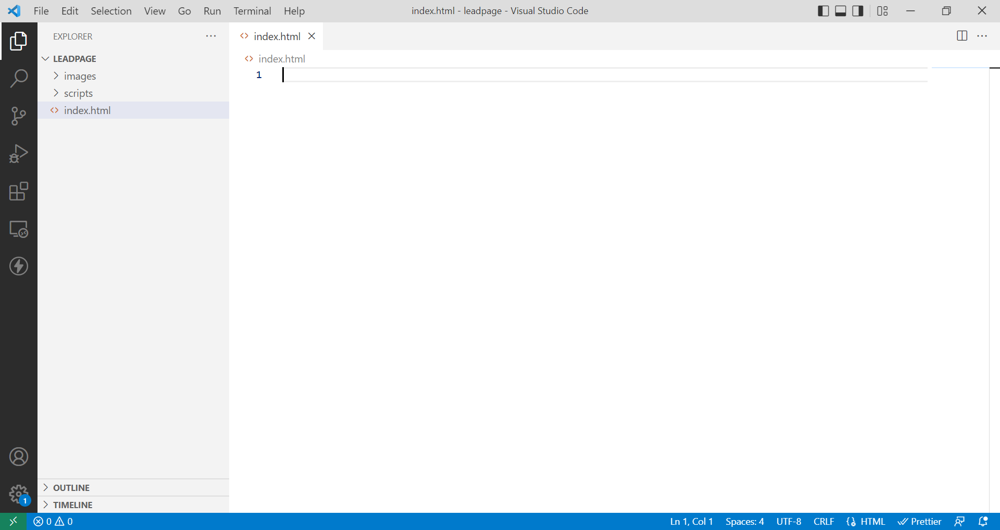
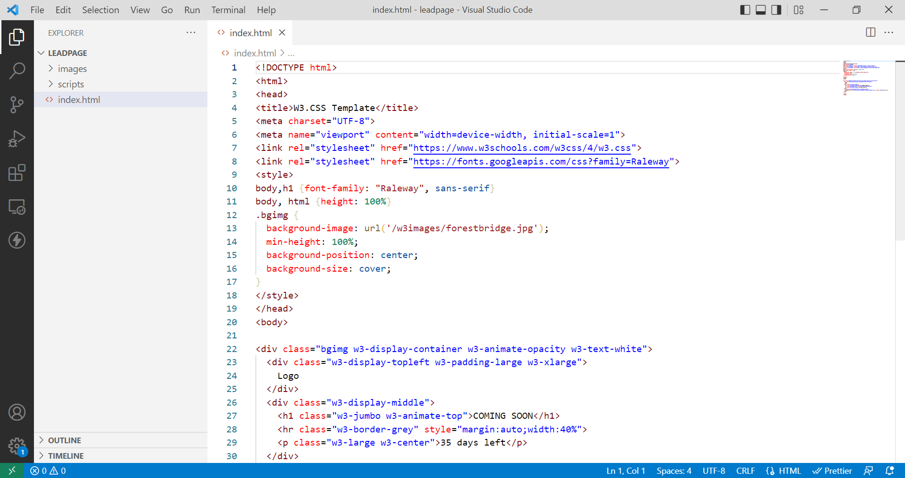
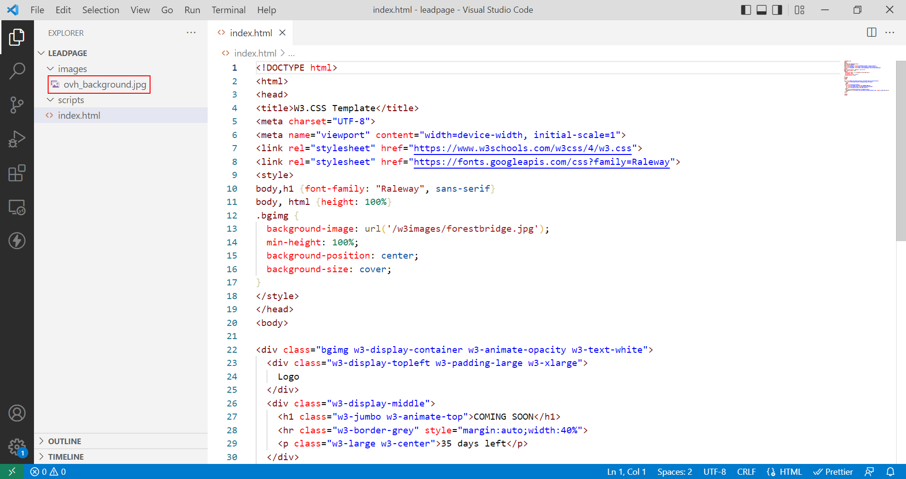

**Dernière mise à jour le 18/01/2023**

## Objectif

Ce tutoriel va vous permettre de créer une page web professionnelle comprenant un formulaire utilisable par les utilisateurs qui se rendront sur votre site. Les données récupérées vous seront envoyées directement sur l'adresse mail de votre choix, vous permettant de répondre par retour à vos interlocuteurs.

## Prérequis

Vous devez&nbsp;:

- disposer d'un [nom de domaine](https://www.ovhcloud.com/fr/domains/)
- avoir souscrit à une offre d'[hébergement web OVHcloud](https://www.ovh.com/fr/hebergement-web/)
- savoir utiliser un éditeur de texte sur votre ordinateur ou un IDE
- avoir installé un client FTP comme [FileZilla](https://filezilla-project.org/download.php).

Quelques notions de programmation web (HTML, CSS et PHP) sont nécessaires.

Vous pouvez consulter le tutoriel [«&nbsp;Créer sa page web personnelle chez OVHcloud&nbsp;»](https://docs.ovh.com/fr/hosting/create-your-own-web-page/) pour vous familiariser avec les concepts de programmation utilisés.

## En pratique

Pour simplifier l'élaboration de la page et lui assurer un rendu professionnel, nous allons utiliser un template disponible sur le site [W3Schools](https://www.w3schools.com/w3css/w3css_templates.asp), [«&nbsp;Coming Soon Template&nbsp;»](https://www.w3schools.com/w3css/tryw3css_templates_coming_soon.htm).

Nous ajouterons une formulaire qui permettra le récupération des données saisies et l'envoi vers une adresse mail de votre choix via un script en PHP.

### Mise en place des fichiers

Sur votre ordinateurs, créez un dossier `Leadpage` dans lequel se trouveront l'ensemble des fichiers. Dans ce répertoire, placez les éléments suivants&nbsp;:

- un répertoire `scripts` qui contiendra le fichier contenant le script PHP nous permettant d'envoyer le contenu du formulaire
- un répertoire `images` dans lequel seront les fichiers d'illustration pour personnaliser le site
- un fichier `index.html` qui contiendra les éléments de la page.

{.thumbnail}

### Détails du code HTML et CSS

Le code collé dans le fichier `index.html` contient les éléments suivants&nbsp;:

- une structure `HTML` classique
- des balises `<link>` faisant appel à une feuille de style et une police externes
- un balise `<style>` permettant l'affichage de l'image de fond et l'étirement du contenu
- des balises `<div>` avec du contenu textuel utilisant des classes CSS spécifiques aux templates W3schools (similaire à ce que propose Bootstrap).

### Récupération du template

Pour chaque template proposé figure un lien de démonstration et un accès au code source de la page offrant la possibilité de le modifier et de visualiser le résultat en temps réel. Cliquez sur le bouton [«&nbsp;Try it Yourself&nbsp;»](https://www.w3schools.com/w3css/tryit.asp?filename=tryw3css_templates_coming_soon&stacked=h).

Copier et coller le code dans votre fichier `index.html`&nbsp;:

{.thumbnail}

### Personnaliser l'image de fond

La balise `<style>` présente dans le template se présente de la façon suivante&nbsp;:

```html
<style>
body,h1 {font-family: "Raleway", sans-serif}
body, html {height: 100%}
.bgimg {
  background-image: url('/w3images/forestbridge.jpg');
  min-height: 100%;
  background-position: center;
  background-size: cover;
}
</style>
```

Utilisez votre propre illustration et placez le fichier dans le répetoire `images` de votre projet. À titre indicatif, les dimensions de l'image par défaut du template pris pour exemple sont de 1200×700 pixels.

Déposez votre image de fond dans le répertoire `images`&nbsp;:

{.thumbnail}

Modifiez l'URL dans la feuille de style pour charger la bonne image&nbsp;:

```html
<style>
body,h1 {font-family: "Raleway", sans-serif}
body, html {height: 100%}
.bgimg {
  background-image: url('/images/ovh_background.jpg');
  min-height: 100%;
  background-position: center;
  background-size: cover;
}
</style>
```

Vous pouvez visualiser le résultat en transférant vos fichiers sur votre serveur via un client FTP.

Pour transférer vos fichiers sur votre serveur, reportez-vous au tutoriel [«&nbsp;Utiliser FileZilla avec votre hébergement OVHcloud&nbsp;»](https://docs.ovh.com/fr/hosting/mutualise-guide-utilisation-filezilla/).

### Modifier le titre du site

Modifiez le contenu de la balise `<title>` située au début de votre fichier html&nbsp;:

```html
<title>My web site</title>
```

### Modifier le texte par défaut

Le contenu textuel se situe entre les balises `<body>`. Remplaçons le code du template&nbsp;:

```html
<body>
  <div class="bgimg w3-display-container w3-animate-opacity w3-text-white">
    <div class="w3-display-middle">
      <h1 class="w3-jumbo w3-animate-top">My web site</h1>
      <hr class="w3-border-grey" style="margin:auto;width:40%">
      <p class="w3-large w3-center">Contact us using the form below</p>
    </div>
  </div>
</body>
```

### Changer la couleur du texte

Dans la balise `<style>`, ajoutez une ligne pour modifier la couleur des titres et des paragraphes&nbsp;:

```css
h1, p {color: #333}
```

## Aller plus loin
