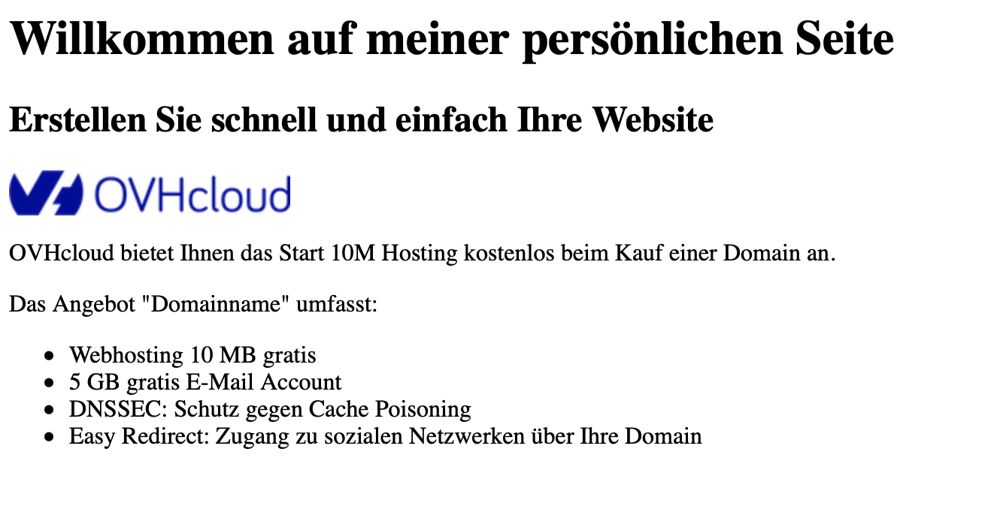

> [!primary]
> Diese Übersetzung wurde durch unseren Partner SYSTRAN automatisch erstellt. In manchen Fällen können ungenaue Formulierungen verwendet worden sein, z.B. bei der Beschriftung von Schaltflächen oder technischen Details. Bitte ziehen Sie im Zweifelsfall die englische oder französische Fassung der Anleitung zu Rate. Möchten Sie mithelfen, diese Übersetzung zu verbessern? Dann nutzen Sie dazu bitte den Button "Beitragen" auf dieser Seite.
>

**Letzte Aktualisierung am 17.02.2023**

## Ziel

Hier erfahren Sie, wie Sie die Homepage einer Website auf einem Kostenloses Hosting 100M erstellen, das Sie kostenlos zu einem Domainnamen bei OVHcloud erhalten.

> [!warning]
> OVHcloud stellt Ihnen Dienstleistungen zur Verfügung, für deren Konfiguration und Verwaltung Sie die alleinige Verantwortung tragen. Es liegt somit bei Ihnen, sicherzustellen, dass diese ordnungsgemäß funktionieren.
> 
> Diese Anleitung soll Sie bei allgemeinen Aufgaben bestmöglich unterstützen. Dennoch empfehlen wir Ihnen, falls Sie Hilfe brauchen, einen [spezialisierten Dienstleister](https://partner.ovhcloud.com/de/directory/) zu kontaktieren und/oder Ihre Fragen in der OVHcloud Community zu stellen. Leider können wir Ihnen für administrative Aufgaben keine weitergehende technische Unterstützung anbieten. Weitere Informationen finden Sie am [Ende dieser Anleitung](#go-further).
>

## Voraussetzungen

- Sie verfügen über einen [Domainnamen](https://www.ovhcloud.com/de/domains/).
- Sie haben ein [OVHcloud Webhosting](https://www.ovhcloud.com/de/web-hosting/) oder ein [Kostenloses Hosting 100M](https://www.ovhcloud.com/de/domains/free-web-hosting/).
- Sie haben einen Texteditor (Notepad, TextEdit, Notepad++, etc.).
- Sie haben einen FTP-Client ([Cyberduck](https://cyberduck.io/), [FileZilla](https://filezilla-project.org/download.php) etc.) installiert, um Dateien auf Ihren Hosting-Speicherplatz zu übertragen.

## Bevor Sie beginnen

### Woraus besteht eine Webseite?

Der Inhalt einer Web-Präsenz oder Website besteht generell aus mehreren Webseiten. Eine Webseite zeigt statische oder dynamische Inhalte an, die für die Browsernavigation gestaltet wurden. Die Seiten, die Sie in Ihrem Browser anzeigen, ergeben sich aus drei Komponenten:

- **HTML (HyperText Markup Language)**: Sprache zur Strukturierung Ihrer Seiten. "Struktur" bezeichnet die Elemente und ihre Organisation.<br>
**Beispiel**: Dokumententitel, auf den Untertitel und ein oder mehrere Absätze folgen. Die Elemente, die verwendet werden, um Ihren Inhalt zu strukturieren, werden als "Tags" bezeichnet und werden unter Verwendung von spitzen Klammern geschrieben.<br>
**Beispiel**: Die Markierung `<p>` startet einen Absatz, wobei der gleiche Absatz durch die Markierung `</p>` geschlossen wird. 

>[!warning]
>
> Für jeden öffnenden Tag muss ein schließender Tag erstellt werden. Tags überlappen sich nicht (sie schließen sich in der umgekehrten Reihenfolge ihrer Öffnung) und können nur durch HTML-Tags interpretiert werden.
>

Es sind mehr als 100 Tags verfügbar, aber Sie können Ihre Website mit einigen wenigen erstellen.

- **CSS (Cascading Style Sheet)**: Sprache, die beschreibt, wie die HTML-Elemente positioniert, dimensioniert, gefärbt oder angezeigt werden. Diese Regeln können für generische Elemente (die gleiche Farbe für alle Titel der Website oder die Schriftart, die für alle Texte verwendet wird) oder für bestimmte Elemente (Text im Footer, Verhalten über dem Navigationsmenü) gelten.

- **JavaScript**: Sprache zur Bereicherung der Interaktionen auf einer Website (oder Webanwendung). Obwohl für Web-Entwickler unentbehrlich, ist sie nicht erforderlich, um Ihre Website zu erstellen.<br>
Wenn Sie mit dem Code in den verschiedenen Sprachen nicht vertraut sind, können Sie die Codebeispiele in dieser Anleitung kopieren und einfügen. So können Sie eine lesbare Website auf Ihrem Hosting erstellen.

### Welche Werkzeuge verwenden?

Um eine Webseite zu erstellen, schreiben Sie zunächst Ihren Quellcode in einer der drei oben genannten Sprachen in eine Datei. Hier die wichtigsten Erweiterungen: *.html* (für Ihre HTML-Dateien), *.css* (für Ihre CSS-Dateien), *.js* (für Ihre JavaScript-Dateien).

Die Dateien können in Texteditoren geschrieben werden, darunter auch die standardmäßig in Ihrem Betriebssystem verfügbaren Anwendungen. Zahlreiche kostenlose Open Source Lösungen bieten zusätzliche Funktionen: [Notepad++](https://notepad-plus-plus.org/), [Brackets](https://brackets.io/), [Sublime Text](https://www.sublimetext.com/) oder [Micro](https://micro-editor.github.io/). Es ist auch möglich, eine integrierte Entwicklungsumgebung oder IDE (Integrated Development Environment) wie [Visual Studio Code](https://code.visualstudio.com/) oder [Geany](https://www.geany.org/) zu verwenden.

Verwenden Sie Ihren Webbrowser, um Ihre Seiten zu visualisieren und anzupassen, bevor Sie sie auf Ihrem Hosting ablegen. Öffnen Sie hierzu Ihre lokalen Dateien direkt in Ihrem Browser.

### **Statische** oder **dynamische** Seiten?

Eine Website wird als **statisch** bezeichnet, wenn die Seiten, die Sie mit Ihrem Browser anzeigen, immer identisch sind und keine anderen Interaktionen als Effekte (z.B. Drop-Downs), Animationen und Videos bieten.

Im Gegensatz dazu bedeutet eine **dynamische** Website, dass die Seiten, die Sie anzeigen, von dem Webserver generiert werden, der Code ausführt, auf eine Datenbank zugreift, etc. So kann die Seite Ergebnisse abhängig von Benutzeranfragen liefern (Abfragen von Unterseiten, Authentifizierung, Versand von Daten über ein Formular, Zugriff auf Bestände oder Inventare usw.).

### Was ist PHP?

PHP (*PHP Hypertext Preprocessor*) ist eine Sprache, die hauptsächlich in der Web-Entwicklung verwendet wird. Sie funktioniert ausschließlich auf Serverseite und ist daher nicht notwendig, um die sichtbaren Elemente in Ihrem Browser zu erstellen. Sie ist jedoch nützlich, um beispielsweise Nachrichten, die über ein Kontaktformular Ihrer Website gesendet werden, abzurufen.

## In der praktischen Anwendung

Mit den folgenden Schritten können Sie Ihre erste Webseite erstellen.

### Erstellen Sie den Inhalt Ihrer Seite, indem Sie diese mithilfe von HTML-Code strukturieren

Erstellen Sie ein Verzeichnis auf Ihrem Computer, um Ihre erste Webseite zu erstellen, in dem Sie alle Ihre Dateien speichern.

Benennen Sie die erste HTML-Datei `index.html`. Dies ist die erste zu erstellende Datei, da HTTP-Server so konfiguriert sind, bei Anfragen an Ihr Hosting (Domainname wird in die Adresszeile eines Browsers eingegeben) die Datei namens "index" anzuzeigen.

Öffnen Sie Ihren Texteditor und sichern Sie Ihre Arbeitsdatei. 

> [!primary]
> 
> Wir empfehlen, mehrere Kopien dieses Arbeitsverzeichnisses als Backups aufzubewahren.
> Die Website wird auf Ihrem Hosting verfügbar sein, aber es ist sicherer, eine lokale Kopie sowie Backups auf separaten, externen Speichermedien zu speichern.
>

#### Zusammensetzung einer typischen HTML-Seite

HTML-Seiten sind immer auf die gleiche Weise strukturiert:

- Eine DOCTYPE-Erklärung, in der dem Browser angezeigt wird, die folgenden Inhalte zu lesen, wobei die Standards so weit wie möglich eingehalten werden
- Ein `<html>` Tag, der alle anderen Tags des Dokuments einrahmt
- Ein `<head>` Tag, der Informationen zur Kodierung der Seite und deren Titel enthält
- Ein `<body>` Tag, der den "Körper" Ihrer HTML-Seite enthält

Sie können diesen Code in Ihre `index.html` Datei kopieren/einfügen:

```html
<!DOCTYPE html>
<html lang="de">
    <head>
        <meta charset="UTF-8">
        <meta http-equiv="X-UA-Compatible" content="IE=edge">
        <meta name="viewport" content="width=device-width, initial-scale=1.0">
        <title>Meine persönliche Seite</title>
    </head>
    <body>
         
    </body>
</html>
```

Einige Tags enthalten mehr Informationen als andere, wie zum Beispiel der Tag `<html lang="de">` des vorstehenden Beispiels.<br>
In diesem Fall wird von "Attributen" gesprochen, die es ermöglichen, bestimmte Elemente zu präzisieren. In diesem Fall ist anzugeben, welche Hauptsprache die Webseite hat. Einige dieser Attribute sind universell und können mit allen Tags verwendet werden (mit wenigen Ausnahmen), andere sind spezifisch.

Der Tag `<head>` enthält Elemente, die nicht auf dem Bildschirm angezeigt werden. Der Tag `<meta>` gibt dem Browser, aber auch Suchmaschinen Hinweise, wie zum Beispiel die Kodierung der im Dokument verwendeten Zeichen (UTF-8 im obenstehenden Beispiel) oder Informationen zur Anzeige auf Mobilgeräten ("viewport" im obenstehenden Beispiel).
Die Markierung `<title>` ist sehr wichtig. So können Sie den Titel Ihrer Seite festlegen, der auf dem Tab Ihres Browsers angezeigt wird. Es ist aber auch der Website-Name, der von Suchmaschinen indexiert wird.<br>
Dieser Titel erscheint zum Beispiel in den Suchergebnissen von Google, DuckDuckGo etc.<br>
Das Ergebnis-Ranking wird mit SEO-Maßnahmen (*Search Engine Optimization*) beeinflusst. Wir werden in diesem Tutorial nicht auf dieses Thema eingehen.

Der Tag `<body>` enthält die anderen HTML-Tags, die Ihr Dokument strukturieren.

#### Mit einem Titel, Untertitel und Inhalt vervollständigen

Wir werden nun den Textinhalt Ihrer Seite bearbeiten, stets unter Einhaltung der Standardstruktur von HTML, um einen Titel, einen Untertitel, Absätze und Textlisten hinzuzufügen.

- **Tags `<h1>` bis `<h6>`**

Die Überschriften werden zwischen Tags geschrieben (`<h>`), die wie in jedem Dokument hierarchisch geordnet sind: `<h1>`, dann `<h2>`, und `<h6>` als die kleinstmögliche. Ein `<h1>` ist daher unerlässlich, wenn Sie auch `<h2>`verwenden möchten. Wenn Sie diese Regel nicht einhalten, wird der Browser das Ergebnis dennoch fehlerfrei anzeigen.

```html
<body>
    <h1>Willkommen auf meiner persönlichen Seite</h1>
    <h2>Erstellen Sie schnell und einfach Ihre Website</h2>
</body>
```

Sie können das Ergebnis sehen, indem Sie die HTML-Datei über einen Webbrowser (Firefox, Chrome, Safari etc.) öffnen: Beide Zeichenketten werden in unterschiedlichen Größen angezeigt.

- **Tag `<p>`**

Mit diesem Tag wird Text als Abschnitt eingefügt:

```html
<body>
    <h1>Willkommen auf meiner persönlichen Seite</h1>
    <h2>Erstellen Sie schnell und einfach Ihre Website</h2>
    <p>OVHcloud bietet Ihnen das Kostenloses Hosting 100M beim Kauf einer Domain an.</p>
</body>
```

- **Tags `<ul>` und `<li>`**

Sie können im HTML-Format Listen verwenden. Wir nehmen dabei ein Beispiel für einfache, so genannte ungeordnete Listen (wie sie in einer Textverarbeitung verfügbar sind). Für die Erstellung einer Liste wird der Tag `<ul>` (*unordered list*) verwendet. Dieser Tag beinhaltet dann `<li>` Tags, die den Inhalt Ihrer Liste einrahmen:

```html
<body>
    <h1>Willkommen auf meiner persönlichen Seite</h1>
    <h2>Erstellen Sie schnell und einfach Ihre Website</h2>
    <p>
        
    </p>
    <p>OVHcloud bietet Ihnen das Kostenloses Hosting 100M beim Kauf einer Domain an.</p>
    <p>Das Angebot "Domainname" umfasst:</p>
    <ul>
        <li>Webhosting 100 MB gratis</li>
        <li>5 GB gratis E-Mail Account</li>
        <li>DNSSEC: Schutz gegen Cache Poisoning</li>
        <li>Easy Redirect: Zugang zu sozialen Netzwerken über Ihre Domain</li>
    </ul>
</body>
```

Sie können das Ergebnis in Ihrem Browser sehen: Listenelemente werden in der Regel als "Bullet"-Liste angezeigt.

#### Bilder hinzufügen, um Ihre Seite attraktiver zu machen

Das Web ist vor allem ein visuelles Medium. Wir werden in diesem Bereich erklären, wie Sie Bilder in Ihre Seiten einfügen. Das Kostenloses Hosting 100M bietet Ihnen einen Speicherplatz von 100 MB. Dies genügt für Ihre HTML und CSS Seiten, kann aber zu gering ausfallen, wenn Sie viele Bilder auf Ihrer Seite platzieren möchten. In diesem Fall empfehlen wir Ihnen, ein [OVHcloud Webhosting](https://www.ovhcloud.com/de/web-hosting/) zu bestellen, um mehr Speicherplatz zu erhalten.

Der zur Anzeige eines Bildes verwendete Tag ist ``. Im Gegensatz zu den Tags, die wir zuvor gesehen haben, gibt es kein Öffnen und Schließen dieses Elements (*self-closing* Tag). Die Attribute dieses Tags ermöglichen das Hinzufügen des Bilddatei-Pfads sowie einen beschreibenden Text.

##### **Die Bilder optimieren**

Ein großes Bild ist ein Bilddatei, die Zeit benötigt, um von Ihrem Browser geladen zu werden, insbesondere wenn Ihre Besucher ein Smartphone oder ein Tablet verwenden, das 4G oder 5G verwendet.

In der Regel sollten Sie Ihre Bilder optimieren und deren "Gewicht" reduzieren. Dieses Gewicht wird in Bytes angegeben. Üblicherweise werden Kilobyte (1 kB = 1.000 Bytes) oder Megabyte (1 kB = 1.000.000 Bytes) verwendet. Ein Image von mehr als einigen Dutzend KB wird als "schwer" eingestuft und benötigt Optimierung. 

**Beispiel**: Wenn Ihre Bilder jeweils 1 MB groß sind, sind Sie auf weniger als 100 Bilder auf Ihrem kostenlosen 100M-Hosting beschränkt. Wenn es Ihnen gelingt, ihre Größe zwischen 50 kb und 200 kb zu reduzieren, könnten Sie bis zu mehreren Tausend Bilder auf Ihrer Webseite präsentieren.

Einige Tipps, um Webseiten-Dateien so einfach wie möglich zu gestalten:

- Beschränken Sie Ihre Bilder, indem Sie diese exakt so dimensionieren, wie sie auf Ihrer Website angezeigt werden.
- Die Größe wird in Pixeln mit Breite *×* Höhe ausgedrückt (z.B. ist 300×250 Pixel eine Standardgröße für Banner).
- Ändern Sie die Auflösung (das Web verwendet eine Standardauflösung von 72 dpi).
- Bevorzugen Sie komprimierte Formate wie *JPEG*, *PNG* oder *Webp*.
- Es kann auch ein Vektorformat (*SVG*) verwendet werden.
- Vermeiden Sie unkomprimierte Formate wie *BPM* und *TIFF*.

##### **Bilder auf einem Hosting speichern**

Aus Gründen der Übersichtlichkeit sollten die Bilder in einem dedizierten Verzeichnis gespeichert werden:

{.thumbnail}

Fügen Sie Dateien zum Beispiel in das Verzeichnis "Bilder" ein:

{.thumbnail}

Wir werden nun einen neuen Absatz erstellen, in den wir ein Bild hinzufügen (in diesem Beispiel wird keine Anzeigegröße in Pixeln spezifiziert. Der Browser zeigt deshalb das Bild in der originalen Größe an.)

```html
<body>
    <h1>Willkommen auf meiner persönlichen Seite</h1>
    <h2>Erstellen Sie schnell und einfach Ihre Website</h2>
    <p>
        
    </p>
    <p>OVHcloud bietet Ihnen das Kostenloses Hosting 100M beim Kauf einer Domain an.</p>
    <p>Das Angebot "Domainname" umfasst:</p>
    <ul>
        <li>Webhosting 100 MB gratis</li>
        <li>5 GB gratis E-Mail Account</li>
        <li>DNSSEC: Schutz gegen Cache Poisoning</li>
        <li>Easy Redirect: Zugang zu sozialen Netzwerken über Ihre Domain</li>
    </ul>
</body>
```

Das Ergebnis in Ihrem Browser sollte folgendermaßen aussehen:

{.thumbnail}

### Gestalten Sie Ihren Inhalt mit CSS

Wir haben gesehen, wie Sie Ihren Inhalt in HTML strukturieren. Das Ergebnis ist minimalistisch und beschränkt sich auf Größen von Titeln und Untertiteln, die über Standards definiert sind.

Style Sheets ermöglichen es, das Aussehen und Verhalten der HTML-codierten Elemente zu individualisieren.

#### Grundsätzliches zu CSS

##### **Erstellung einer CSS-Datei**

Wie bei HTML können CSS-Dateien mit jedem beliebigen Texteditor erstellt werden. Die Dateiendung muss *.css* sein.

{.thumbnail}

Wir müssen nun diese CSS-Datei, die wir konventionell *style.css* benannt haben, mit unserer HTML-Seite verbinden. Dieser Link wird durch Hinzufügen eines `<link>` Tags innerhalb vom `<head>` der index.html Datei hergestellt:

```html
<head>
    <meta charset="UTF-8">
    <meta http-equiv="X-UA-Compatible" content="IE=edge">
    <meta name="viewport" content="width=device-width, initial-scale=1.0">
    <title>Meine persönliche Seite</title>
    <link rel="stylesheet" href="style.css">
</head>
```

Zum Testen geben wir eine andere Farbe für jedes Element auf `<h1>` unserer Webseite an. Bearbeiten Sie die Datei *style.css*, indem Sie folgende Zeilen hinzufügen:

```html
h1 {
    color: red;
}
```

Diese Instruktionen werden als "CSS Regel" bezeichnet und bedeuten: Alle HTML-Elemente `<h1>` haben die Farbe (*color*) rot (*red*).

Sie können eine andere Farbe auf dem Element `<h2>`, den Paragraphen und den Listenelementen testen:

```html
h1 {
    color: red;
}
 
h2 {
    color: blue;
}
 
p {
    color: slategray;
}
 
li {
    color: slategray;
}
```

Aktualisieren Sie die Seite Ihres Browsers mit der Taste `F5` Ihrer Tastatur. Ihr Seitentitel erscheint jetzt rot.

Browser verfügen standardmäßig über Stile, darunter spezielle Regeln für die Positionierung der Elemente. Wir werden die CSS-Datei entsprechend ändern und eine Regel festlegen, die für alle im Browser angezeigten HTML-Elemente gilt. Dabei wird ein `*` verwendet, der als universaler "Selektor" dient und am Anfang der CSS-Datei eingefügt wird:

```html
* {
    padding: 0;
    margin: 0;
}
```

Sie werden sehen, dass die Texte nun an die Ecken des Browserfensters gebunden sind.

Die Eigenschaft *padding* definiert den rotierenden Rand (Innenrand), d. h. den Raum außerhalb des Blocks, der den Text (oder irgendein Element) enthält. Das folgende Diagramm veranschaulicht die Übereinstimmung dieser Begriffe mit dem so genannten CSS-Boxmodell:

{.thumbnail}

### HTML-Struktur des Dokuments verbessern

Wir haben grundlegende Elemente im Tag `<body>` positioniert: `h1`, `h2`, `p`, `ul` und `li`.

[HTML5](https://html.spec.whatwg.org/) bietet neue Tags, die eine bessere Strukturierung und semantische Bereicherung eines Dokuments ermöglichen. Ein klassisches Dokument (auch auf einem traditionellen Datenträger) enthält visuell identifizierbare Blöcke, die als HTML wiedergegeben werden können:

- Ein Seitenkopf `<header>` (nicht zu verwechseln mit `<head>`) 
- Einen Hauptinhalt, definiert durch `<main>`
- Ein Seitenfuß, beschrieben durch das Element `<footer>`

Jedes dieser Elemente kann für bestimmte Zwecke verwendet werden:

- `header` enthält zum Beispiel das Navigationsmenü (mit einem Tag `<nav>`).
- `main` enthält alle inhaltlichen Elemente, die auch das Dokument noch genauer strukturieren können (`section`, `article`, `aside`, `div`, etc.).
- `footer` enthält allgemeinere Informationen wie Links zu sozialen Netzwerken, rechtliche Hinweise, allgemeine Nutzungsbedingungen und möglicherweise ein anderes Browsermenü.

Ihr HTML-Code wird wie folgt strukturiert:

```html
<!DOCTYPE html>
<html lang="de">
    <head>
        <meta charset="UTF-8">
        <meta http-equiv="X-UA-Compatible" content="IE=edge">
        <meta name="viewport" content="width=device-width, initial-scale=1.0">
        <title>Meine persönliche Seite</title>
        <link rel="stylesheet" href="style.css">
    </head>
    <body>
        <header>
                
        </header>
        <main>
            <h1>Willkommen auf meiner persönlichen Seite</h1>
            <h2>Erstellen Sie schnell und einfach Ihre Website</h2>
            <p>OVHcloud bietet Ihnen das Kostenloses Hosting 100M beim Kauf einer Domain an.</p>
            <p>Das Angebot "Domainname" umfasst:</p>
            <ul>
                <li>Webhosting 100 MB gratis</li>
                <li>5 GB gratis E-Mail Account</li>
                <li>DNSSEC: Schutz gegen Cache Poisoning</li>
                <li>Easy Redirect: Zugang zu sozialen Netzwerken über Ihre Domain</li>
            </ul>
        </main>
        <footer>
            <p>© 2022 Meine persönliche Seite</p>
        </footer>
    </body>
</html>
```

### Ein Element interaktiv machen

Links, die es ermöglichen, über eine Website von einer Seite zur anderen zu navigieren, sind wesentliche Elemente des Web. Zu ihrer Umsetzung ist der Tag `<a>` (*anchor*) zu verwenden. Er enthält ein interaktives Element zusammen mit einem Attribut `href`, das die Ziel-URL enthält. Im folgenden Beispiel werden wir das Logo im Tag `<header>` klickbar machen:

```html
<header> 
    <a href="index.html">
        
    </a>
</header>
```

Genau so kann der Text interaktiv gemacht werden:

```html
<p>Das Angebot <a href="https://www.ovhcloud.com/de/domains/">"Domainname"</a> beinhaltet:</p>
```

Um das Ziel des Links in einem neuen Tab anzuzeigen genügt es, das Attribut `target` folgendermaßen in Ihrem Tag `<a>` einzufügen:

```html
<p>Das Angebot <a href="https://www.ovhcloud.com/de/domains/" target="_blank">"Domainname"</a> beinhaltet:</p>
```

### Wie speichere ich Inhalte auf meinem Hosting?

Damit Ihre Seiten im Web sichtbar werden, müssen Sie sie auf Ihrem Hosting ablegen (wie in [dieser Anleitung](/pages/web/hosting/activate_start10m) beschrieben).

Der Dateitransfer erfolgt über ein dediziertes Protokoll: **FTP** (**F**ile **T**ransfer **P**rotocol). Verwenden Sie für diese Operation einen kompatiblen Client, wie [FileZilla](https://filezilla-project.org/download.php?type=client) oder [Cyberduck](https://cyberduck.io/download/).

### Website per FTP hochladen

Um Ihre Dateien auf Ihrem Hosting zu speichern, lesen Sie die Anleitung zur [Verwendung von FileZilla](/pages/web/hosting/ftp_filezilla_user_guide).

Sobald die Dateien vollständig auf Ihr Hosting übertragen wurden, können Sie das Ergebnis anzeigen lassen, indem Sie Ihren Domainnamen in die Adresszeile Ihres Browsers eingeben oder indem Sie die Taste `F5` Ihrer Tastatur drücken, um die Seite neu zu laden, wenn Sie bereits auf Ihrer Seite sind.

> [!warning]
> 
> Unsere Infrastruktur umfasst ein Cache-System, mit dem Ihre Seiten deutlich schneller angezeigt werden können. Beim Hochladen neuer Inhalte werden die Änderungen in Ihrem Browser deshalb nicht unmittelbar angezeigt. Drücken Sie `F5` und gegebenenfalls die Kombination `strg` und `R`, um die Seite neu zu laden.
> 

### Verbessern Sie Ihre Website mit einem Template

CSS und HTML sind einfach verständliche Sprachen für schnelle Ergebnisse. Allerdings haben sich diese Sprachen, insbesondere CSS, erheblich weiterentwickelt. Wenn etwa CSS mehr Funktionen bietet (Animationen, Degradation, Position der Elemente auf der Seite etc.), sind sie auch komplexer zu kodieren.

Um sich auf den Inhalt konzentrieren zu können, ohne zu viel Zeit mit der visuellen Gestaltung zu verbringen, ist es gängige Praxis, Templates zu verwenden. Sie erhalten so ein Ergebnis von grafischer und funktionaler Qualität, ohne ein Seitendesign von Grund auf neu erstellen zu müssen. (Layout, Benutzerfreundlichkeit, Lesbarkeit auf Smartphone und Tablet, etc.).

#### Was ist ein Template?

Ein *Template* ist eine Modelllösung oder eine Vorlage, die man wiederverwenden und auf Wunsch anpassen kann. Die Nutzung von Templates ermöglicht es, Websites zeitsparend zu generieren, indem bereits fertig entwickelte Elemente nur noch angepasst werden müssen. Gleichzeitig wird der Qualitätsmaßsstab einer "professionellen" Website eingehalten.

Im Internet sind kostenlose Lösungen unter Open Source verfügbar, wie [Bootstrap](https://getbootstrap.com/), [Materialize](https://materializecss.com/), [Foundation](https://get.foundation/) oder [Semantic UI](https://semantic-ui.com/). Diese Tools werden als "Framework" bezeichnet: Hierbei handelt es sich um Bibliotheken, die die Erstellung von Webseiten oder Webanwendungen erleichtern. Sie bieten standardisierte, personalisierbare Elemente zur eigenen Nutzung und die Community stellt wiederverwendbare Templates zur Verfügung.

#### Bootstrap

Bootstrap ist ein von Web-Entwicklern häufig verwendetes Werkzeug. Es wurde 2010 von Technikern bei Twitter entwickelt, um die Entwicklung interner Schnittstellen zu harmonisieren. Bootstrap ist seit 2011 unter der Open Source Lizenz verfügbar und hat sich mit der Zeit (Technologie- und Nutzungsentwicklung) kontinuierlich weiterentwickelt und ist nach wie vor relevant.

Einige Beispiele für Websites und Webanwendungen mit Bootstrap:

- [https://themes.getbootstrap.com/](https://themes.getbootstrap.com/)
- [https://bootswatch.com/](https://bootswatch.com/)
- [https://bootstrapmade.com/](https://bootstrapmade.com/)
- [https://bootstraptaste.com/](https://bootstraptaste.com/)
- [https://bootstrapthemes.co/](https://bootstrapthemes.co/).

## Weiterführende Informationen <a name=“go-further“></a>

Im Web finden Sie viele Wissensressourcen, um Ihre Praxis zu verbessern, ganze Elemente des Codes oder Teile des Codes zu kopieren oder Funktionen zu Ihrer Website hinzuzufügen, ohne Fehler oder Fehlfunktionen zu riskieren. Hier einige Beispiele:

- [Mit HTML starten](https://developer.mozilla.org/en-US/docs/Learn/HTML/Introduction_to_HTML/Getting_started)
- [HTML Tag Reference](https://developer.mozilla.org/en-US/docs/Web/HTML)
- [W3Schools HTML Tutorial](https://www.w3schools.com/html/)
- [Mozilla CSS Tutorials](https://developer.mozilla.org/en-US/docs/Web/CSS/Tutorials)
- [CSS Tutorial W3 Schools](https://www.w3schools.com/css/).

### Ihre Bilder bearbeiten

Zahlreiche kostenlose Tools erlauben es, Ihre Bilddateien zu überarbeiten:

- Windows 10/11 [Photos App](https://apps.microsoft.com/store/detail/photos-microsoft/9WZDNCRFJBH4)
- macOS [Photos App](https://support.apple.com/de-de/guide/photos/welcome/mac)
- [Paint.Net](https://www.getpaint.net/), [GIMP](https://www.gimp.org/), [darktable](https://www.darktable.org/)
- Für Android oder iOS verfügbare Apps

Online-Ressourcen:

- [Compressor](https://compressor.io/)
- [ShrinkMe](https://shrinkme.app/)
- [Free Online Image Optimiser]](https://kraken.io/web-interface)
- [TinyJPG](https://tinyjpg.com/) und [TinyPNG](https://tinypng.com/)

Kontaktieren Sie für spezialisierte Dienstleistungen (SEO, Web-Entwicklung etc.) die [OVHcloud Partner](https://partner.ovhcloud.com/de/directory/).

Wenn Sie Hilfe bei der Nutzung und Konfiguration Ihrer OVHcloud Lösungen benötigen, beachten Sie unsere [Support-Angebote](https://www.ovhcloud.com/de/support-levels/).

Für den Austausch mit unserer User Community gehen Sie auf <https://community.ovh.com/en/>.
