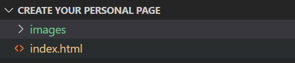
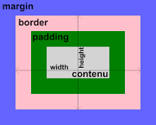

**Dernière mise à jour le 22/11/2022**

## Objectif

Découvre comment créer la première page d'un site web sur un hébergement Start 10M proposé gratuitement pour tout achat d'un nom de domaine chez OVHcloud.

## Prérequis

- Posséder un [nom de domaine](https://www.ovhcloud.com/fr/domains/)
- Disposer d'une offre d'[hébergement web OVHcloud](https://www.ovh.com/fr/hebergement-web/) ou d'un [hébergement gratuit Start 10M](https://www.ovhcloud.com/fr/domains/free-web-hosting/)
- Avoir un éditeur de texte (bloc-notes, TextEdit, Notepad++, etc.)
- Avoir installé un client FTP (tel que [Cyberduck](https://cyberduck.io/), [FileZilla](https://filezilla-project.org/download.php), etc.) pour téléverser (déposer sur l'hébergement) ses fichiers sur son espace dédié.

## Avant de commencer

### De quoi est faite une page web ?

Le contenu d'un site web est souvent constitué de plusieurs pages web. Une page web affiche un contenu, figé ou non, qui a été mis en forme pour servir une expérience de navigation. Les pages que vous visualisez sur votre navigateur sont le résultat de trois composants que nous allons détailler :

- **Le HTML (HyperText Markup Language)** : langage utilisé pour structurer vos pages. La « structure » désigne les éléments et leur organisation.<br>
**Exemple** : un titre de document sera suivi d'un sous-titre et d'un ou plusieurs paragraphes.

Les éléments utilisés pour structurer votre contenu sont appelés « balises » et s'écrivent en utilisant des chevrons ouvrant et fermant.<br>
**Exemple** : La balise `<p>` désigne celle qui débute un paragraphe, le même paragraphe étant fermé par la balise fermante `</p>`. 

>[!warning]
>
> Pour toute balise ouverte, une balise fermée doit être créée. Les balises ne se chevauchent pas (elles se ferment dans l'ordre inverse de leur ouverture) et ne peuvent pas être interprétées autrement que par des balises HTML.
>

Plus d'une centaine de balises sont disponibles mais vous pourrez parfaitement réaliser votre site avec quelques-unes d'entre elles.

- **Le CSS (Cascading Style Sheet, feuilles de style en cascade)** : langage décrivant la façon dont vont être positionnés, dimensionnés, comportemantalisés, colorisés, ou affichés les éléments HTML. Ces règles peuvent s'appliquer pour des éléments génériques (la même couleur pour tous les titres du site, ou encore la police qui sera utilisée pour l'ensemble des textes) ou pour des éléments précis (le texte contenu dans le footer, le comportement au survol du menu de navigation).

- **Le JavaScript** : langage permettant d'enrichir les interactions sur un site web (ou une application web). Bien qu'incontournable pour les développeurs web, il n'est pas obligatoire pour créer votre site web.<br>
Si vous n'êtes pas familier avec le code dans les différents langages cités, vous pouvez copier/coller les exemples de code qui sont fournis dans ce guide, ils vous permettront d'avoir un site web exploitable sur votre hébergement.

### Quels outils utiliser ?

Pour créer une page web, commencez par écrire dans un fichier votre code source à partir d'un des trois langages évoqués ci-dessus. Voici leurs principaux noms d'extension : *".html"* (pour vos fichiers HTML), *".css"* (pour vos fichiers CSS), *".js"* (pour vos fichiers JavaScript).

Les fichiers peuvent être écrits dans des éditeurs de texte, y compris ceux qui sont disponibles par défaut sur votre système d'exploitation (bloc-notes, TextEdit). De nombreuses solutions Open Source gratuites proposent des fonctionnalités supplémentaires : [Notepad++](https://notepad-plus-plus.org/), [Brackets](https://brackets.io/), [Sublime Text](https://www.sublimetext.com/) ou encore [Micro](https://micro-editor.github.io/). Il est également possible d'utiliser un IDE (Integrated Development Environment, environnement de développement intégré) tel que [Visual Studio Code](https://code.visualstudio.com/) ou [Geany](https://www.geany.org/).

Pour visualiser et ajuster vos pages avant de les déposer sur votre hébergement, utilisez votre navigateur web. Pour cela, ouvrez votre fichier depuis son emplacement local directement sur votre navigateur.

### Site **statique** ou site **dynamique** ?

Un site web est dit **statique** lorsque les pages que vous visualisez avec votre navigateur sont toujours identiques et n'offrent pas d'interactions particulières autres que les effets (menus déroulants, par exemple), animations et vidéos.

Par opposition, un site web **dynamique** sous-entend que les pages que vous visualisez sont générées par le serveur web qui exécute du code, accède à une base de données, etc. Cela permet de livrer un résultat en fonction des requêtes faites par l'utilisateur (consultation de rubriques, authentification, envoi de données via un formulaire, consultation de stocks ou d'inventaires, etc.).

### Qu'est-ce que le langage PHP ?

Le PHP (*PHP Hypertext Preprocessor*) est un langage majoritairement utilisé dans le développement web. Il fonctionne exclusivement côté serveur, il n'est donc pas nécessaire pour construire les éléments visibles sur votre navigateur. Cependant, il sera utile pour, par exemple, récupérer les messages qui vous seront envoyés via le formulaire de contact de votre site.

## En pratique

Les étapes ci-dessous vous permettront de réaliser votre première page web.

### Élaborez le contenu de votre page en le structurant à l'aide du code HTML

Pour réaliser votre première page web, créez un répertoire, n'importe où sur votre ordinateur, dans lequel vous placerez tous vos fichiers.

Nommez le premier fichier `index.html`, il contiendra du code HTML. C'est le premier fichier à créer car les serveurs HTTP sont configurés par défaut pour que la requête faite sur votre hébergement (en tapant votre nom de domaine dans la barre d'adresse d'un navigateur) affiche le fichier « index ».

Ouvrez votre éditeur de texte et sauvegardez votre fichier de travail. 

> [!primary]
> 
> Nous recommandons de conserver plusieurs copies de ce répertoire de travail pour effectuer des sauvegardes. 
> Le site sera disponible sur votre hébergement, mais il est plus sûr de garder une copie locale ainsi que des sauvegardes sur d'autres supports, tels que des disques durs externes.
>

#### Composition d'une page HTML type

Les pages HTML sont toujours structurées de la même façon :

- une déclaration DOCTYPE qui indique au navigateur de lire le contenu qui suit en respectant au maximum les standards ;
- une balise `<html>` qui va encadrer toutes les autres balises du document ;
- une balise `<head>` qui va contenir des informations sur l'encodage de la page et son titre ;
- une balise `<body>` qui va contenir le « corps » de votre page HTML.

Vous pouvez copier/coller ce code dans votre fichier `index.html` :

```html
<!DOCTYPE html>
<html lang="fr">
    <head>
        <meta charset="UTF-8">
        <meta http-equiv="X-UA-Compatible" content="IE=edge">
        <meta name="viewport" content="width=device-width, initial-scale=1.0">
        <title>Ma page personnelle</title>
    </head>
    <body>
         
    </body>
</html>
```

Certaines balises comportent plus d'informations que d'autres, comme la balise `<html lang="en">` de l'exemple ci-dessus.<br>
On parle dans ce cas d'attributs qui vont permettre de préciser certains éléments. Dans ce cas précis, il s'agit d'indiquer quelle est la langue principale de la page web. Certains de ces attributs sont universels et pourront être utilisés sur toutes les balises (à quelques exceptions près), d'autres sont spécifiques.

La balise `<head>` inclut des éléments qui ne seront pas affichés à l'écran. Les balises `<meta>` vont donner des indications au navigateur, mais aussi aux moteurs de recherche, comme l'encodage des caractères utilisés dans le document (UTF-8 dans l'exemple ci-dessus) ou des informations sur l'affichage sur mobile (« viewport » dans l'exemple ci-dessus).
La balise `<title>` est très importante. Elle vous permet de déterminer le titre de votre page qui apparaîtra sur l'onglet de votre navigateur, mais surtout qui sera indexé par les moteurs de recherche.<br>
Ce titre vous permettra, par exemple, d'apparaître dans les résultats de recherche sur Google, DuckDuckGo, etc.<br>
Se placer au plus haut dans ces résultats est un exercice défini par les règles SEO (*Search Engine Optimization*). Nous ne traiterons pas de ce sujet dans cet article.

Quant à la balise `<body>`, elle va contenir les autres balises HTML qui vont structurer votre document.

#### Compléter avec un titre, un sous-titre et du contenu

Nous allons maintenant éditer le contenu textuel de votre page, toujours en respectant la structure standard du HTML, pour y ajouter un titre, un sous-titre, des paragraphes et des listes de texte.

- **Les balises `<h1>` jusqu'à `<h6>`**

Les titres s'écrivent entre balises `<h...>`, lesquelles sont hiérarchisées comme sur n'importe quel document : d'abord `<h1>`, puis `<h2>`, etc., la dernière étant la balise `<h6>`. La balise `<h1>` est donc indispensable si vous voulez écrire une balise `<h2>`. Si toutefois vous ne respectez pas cette règle, le navigateur affichera le résultat sans erreur.

```html
<body>
    <h1>Bienvenue sur ma page personnelle</h1>
    <h2>Créez rapidement et facilement votre site web</h2>
</body>
```

Vous pouvez observer le résultat en ouvrant le fichier HTML via un navigateur Internet (Firefox, Chrome, Safari, etc.) : les deux chaînes de caractères seront affichées avec des tailles différentes.

- **La balise `<p>`**

Cette balise est utilisée pour mettre du texte (« p » pour paragraphe). Il est possible d'en positionner plusieurs :

```html
<body>
    <h1>Bienvenue sur ma page personnelle</h1>
    <h2>Créez rapidement et facilement votre site web</h2>
    <p>OVHcloud vous propose, sur son offre Start 10M, gratuitement, un hébergement pour tout achat d'un nom de domaine.</p>
</body>
```

- **Les balises `<ul>` et `<li>`**

Vous pouvez, en HTML, utiliser des listes. Nous prendrons l'exemple de listes simples, dites non ordonnées (comme celles disponibles dans un traitement de texte). Pour déclarer une liste, on utilise la balise `<ul>` (*unordered list*). Cette balise va encadrer d'autres éléments, les balises `<li>`, qui contiendront le contenu des vos listes :

```html
<body>
    <h1>Bienvenue sur ma page personnelle</h1>
    <h2>Créez rapidement et facilement votre site web</h2>
    <p>
        
    </p>
    <p>OVHcloud vous propose, sur son offre Start 10M, gratuitement, un hébergement pour tout achat d'un nom de domaine.</p>
    <p>L'offre "Nom de domaine" comprend :</p>
    <ul>
        <li>Hébergement Web 10 Mo offert</li>
        <li>Compte E-mail 5 Go offert</li>
        <li>DNSSEC : protection contre l’empoisonnement du cache (cache poisoning)</li>
        <li>Easy Redirect : accès aux réseaux sociaux depuis votre nom de domaine</li>
    </ul>
</body>
```

Vous pouvez voir le résultat dans votre navigateur : par défaut, les éléments de listes sont affichés avec des puces.

#### Ajouter des images pour rendre votre page plus attrayante

Le web est un média avant tout visuel. Nous allons voir dans cette partie comment insérer des images dans votre contenu. L'offre Start 10M vous propose un espace de stockage de 10 Mo. C'est suffisant pour vos pages HTML et CSS, mais cela peut être limité si vous souhaitez mettre beaucoup d'images sur votre site. Nous vous suggérons, dans ce cas de figure, de souscrire à une [offre d'hébergement web OVHcloud](https://www.ovhcloud.com/fr/web-hosting/) permettant de bénéficier d'un stockage plus conséquent.

La balise HTML utilisée pour afficher une image est la balise ``. Contrairement aux balises que nous avons vues précédemment, il n'y a pas d'ouverture et de fermeture de cet élément. On parlera de balise autofermante. Ce sont les attributs de cette balise qui permettront de donner le lien de l'emplacement du fichier et le texte descriptif de l'image.

##### **Optimiser ses images**

Une image de grande taille, c'est une image qui mettra du temps à être chargée par votre navigateur, particulièrement si vos visiteurs utilisent un smartphone ou une tablette connecté(e) au réseau 4 ou 5G.
En règle générale, vous devez optimiser vos images et en limiter le poids. Ce poids est exprimé en octets. Les unités généralement utilisées sont les kilo-octets (1 ko = 1.000 octets) ou le méga-octet (1 Mo = 1.000.000 octets). Une image suppérieure à quelques dizaines de ko est considérée comme lourde et mérite d'être optimisée. 

**Exemple** : si vos images pèsent chacune 1 Mo, vous serez limité à moins de 10 images sur votre hébergement Start10M. Si vous parvenez à réduire leur taille entre 50 ko et 200 ko, vous pourriez en présenter jusqu'à une centaine sur votre page web.

Quelques conseils pour que vos fichiers soient les plus légers possibles :

- limitez la définition de vos images en les redimensionnant à la taille à laquelle elles seront affichées sur votre site ;
- la taille s'exprime en pixels largeur×hauteur (par exemple, 300×250 pixels est la largeur d'une image publicitaire standard) ;
- modifiez la résolution (le « web » utilise une résolution par défaut de 72 dpi) ;
- privilégiez les formats compressés tels que *JPEG*, *PNG* ou *Webp* ;
- il est possible également d'utiliser un format vectoriel (SVG) ;
- évitez les formats non compressés *BPM* et *TIFF*.

##### **Stocker ses images sur son hébergement**

Pour des raisons de lisibilité, il convient de stocker ses images dans un répertoire dédié :

{.thumbnail}

Prenons le cas d'un fichier au format *PNG*. Placez-le dans le répertoire « images » :

{.thumbnail}

Nous allons maintenant créer un nouveau paragraphe dans lequel nous placerons l'image (dans cet exemple, nous ne précisons pas la taille d'affichage de l'image en pixels. Le navigateur l'affichera donc selon sa taille originale, sous forme de fichier).

```html
<body>
    <h1>Bienvenue sur ma page personnelle</h1>
    <h2>Créez rapidement et facilement votre site web</h2>
    <p>
        
    </p>
    <p>OVHcloud vous propose, sur son offre Start 10M, gratuitement, un hébergement pour tout achat d'un nom de domaine.</p>
    <p>L'offre "Nom de domaine" comprend :</p>
    <ul>
        <li>Hébergement Web 10 Mo offert</li>
        <li>Compte E-mail 5 Go offert</li>
        <li>DNSSEC : protection contre l’empoisonnement du cache (cache poisoning)</li>
        <li>Easy Redirect : accès aux réseaux sociaux depuis votre nom de domaine</li>
    </ul>
</body>
```

Le résultat sur votre navigateur devrait être le suivant :

{.thumbnail}

### Appliquer une mise en forme à votre contenu grâce aux styles CSS

Nous avons vu comment structurer votre contenu en HTML. Le résultat est minimaliste avec un style qui se limite à des tailles de titres et de sous-titres définis par défaut.
Les feuilles de style permettent de changer l'apparence et le comportement des éléments codés en HTML.

#### Principes

##### **Création d'un fichier CSS**

Comme pour les fichiers HTML, les fichiers CSS peuvent être créés avec n'importe quel éditeur de texte. L'extension de ces fichiers doit être en *.css*.

{.thumbnail}

Nous devons maintenant lier ce fichier CSS, que nous avons nommé par convention *style.css*, à notre page HTML. Ce lien se fait en ajoutant une balise `<link>` dans la balise `<head>` dans le fichier index.html :

```html
<head>
    <meta charset="UTF-8">
    <meta http-equiv="X-UA-Compatible" content="IE=edge">
    <meta name="viewport" content="width=device-width, initial-scale=1.0">
    <title>Ma page personnelle</title>
    <link rel="stylesheet" href="style.css">
</head>
```

Pour vérifier, nous allons déclarer dans notre feuille de style une couleur définie pour chaque élément `<h1>` de notre page web. Modifiez le fichier style.css en ajoutant ces lignes :

```html
h1 {
    color: red;
}
```

Cet ensemble d'instructions est appelé « règle CSS » et signifie : tous les éléments HTML `<h1>` auront la couleur *(color)* rouge *(red)*.

Vous pouvez tester une autre couleur sur l'élément `<h2>`, les paragraphes et les éléments de listes :

```html
h1 {
    color: red;
}
 
h2 {
    color: blue;
}
 
p {
    color: slategray;
}
 
li {
    color: slategray;
}
```

Rafraîchissez la page de votre navigateur en appuyant sur la touche `F5` de votre clavier : votre titre apparaîtra maintenant en rouge.

Les navigateurs ont des styles par défaut, notamment des règles spécifiques pour le positionnement des éléments. Nous allons modifier le fichier CSS en conséquence et préciser une règle qui s'appliquera à tous les éléments HTML affichés par le navigateur. On utilise le sélecteur `*` (étoile), appelé sélecteur universel, que l'on place au début du fichier CSS :

```html
* {
    padding: 0;
    margin: 0;
}
```

Vous constaterez que les textes sont maintenant collés aux bords du navigateur.

La propriété padding définit le bord tournant (marge intérieure), c'est à dire l'espace à l'extérieur du bloc qui contient le texte (ou n'importe quel élément). Le schéma suivant illustre la correspondance de ces termes dans ce que l'on appelle le « modèle de boîtes » en CSS :

{.thumbnail}

### Améliorer la structure HTML du document

Nous avons positionné des éléments basiques dans votre balise `<body>` : `h1`, `h2`, `p`, `ul` et `li`.

Dans sa dernière itération, le langage [HTML5](https://html.spec.whatwg.org/) propose de nouvelles balises permettant de mieux structurer un document et de l'enrichir d'un point de vue sémantique. Un document classique (y compris sur un support traditionnel) comprend des blocs visuellement identifiables que l'on peut reproduire en HTML :

- un entête, qui figurera dans une balise `<header>` (à ne pas confondre avec la balise `<head>`) ;
- un contenu principal, défini par une balise `<main>` ;
- enfin, un pied-de-page, décrit par l'élement `<footer>`.

Chacun de ces éléments pourra être utilisé pour des usages précis :

- le `header` contiendra, par exemple, le menu de navigation (lui-même encadré par une balise `<nav>`) ;
- dans le `main` figureront tous les éléments liés au contenu, lesquels peuvent également structurer encore plus précisément le document (`section`, `article`, `aside`, `div`, etc.) ;
- le `footer` contiendra des informations plus génériques, telles que les liens vers les réseaux sociaux, les mentions légales, les conditions générales d'utilisation et possiblement un autre menu de navigation.

Votre code HTML se présentera selon la structure suivante :

```html
<!DOCTYPE html>
<html lang="fr">
    <head>
        <meta charset="UTF-8">
        <meta http-equiv="X-UA-Compatible" content="IE=edge">
        <meta name="viewport" content="width=device-width, initial-scale=1.0">
        <title>Ma page personnelle</title>
        <link rel="stylesheet" href="style.css">
    </head>
    <body>
        <header>
                
        </header>
        <main>
            <h1>Bienvenue sur ma page personnelle</h1>
            <h2>Créez rapidement et facilement votre site web</h2>
            <p>OVHcloud vous propose, sur son offre Start 10M, gratuitement, un hébergement pour tout achat d'un nom de domaine.</p>
            <p>L'offre "Nom de domaine" comprend :</p>
            <ul>
                <li>Hébergement Web 10 Mo offert</li>
                <li>Compte E-mail 5 Go offert</li>
                <li>DNSSEC : protection contre l’empoisonnement du cache (cache poisoning)</li>
                <li>Easy Redirect : accès aux réseaux sociaux depuis votre nom de domaine</li>
            </ul>
        </main>
        <footer>
            <p>© 2022 Ma page personnelle</p>
        </footer>
    </body>
</html>
```

### Rendre un élément interactif

Les liens permettant de naviguer d'une page à l'autre sur un site sont des éléments essentiels du web. Pour les mettre en œuvre, il faut utiliser la balise `<a>` (_anchor_, ancre), qui rend un élément interactif, accompagné d'un attribut `href` qui contiendra l'URL vers laquelle pointer. Dans l'exemple suivant, nous allons rendre interactif le logo contenu dans la balise `<header>` :

```html
<header> 
    <a href="index.html">
        
    </a>
</header>
```

Nous pouvons le faire de la même façon pour rendre du texte interactif :

```html
<p>L'offre <a href="https://www.ovhcloud.com/fr/domains/">"Nom de domaine"</a> comprend :</p>
```

Pour afficher la cible du lien dans un nouvel onglet, il vous suffit de rajouter un attribut `target` dans votre balise `<a>` :

```html
<p>L'offre <a href="https://www.ovhcloud.com/fr/domains/" target="_blank">"Nom de domaine"</a> comprend :</p>
```

### Comment stocker du contenu sur mon hébergement ?

Pour que vos pages, et donc votre site, soient visibles pour tout le monde, vous devez les déposer sur votre hébergement (vous devez activer votre hébergement [comme indiqué dans ce guide](https://docs.ovh.com/fr/hosting/activer-start10m/)).

Le transfert des fichiers se fait via un protocole dédié : le **FTP** (pour **F**ile **T**ransfert **P**rotocole). Utilisez un logiciel dédié pour cette opération, tel que [FileZilla](https://filezilla-project.org/download.php?type=client) ou encore [Cyberduck](https://cyberduck.io/download/).

### Déployer son site en FTP

Pour déposer vos fichiers sur votre hébergement, reportez-vous au guide sur l'[utilisation de FileZilla](https://docs.ovh.com/fr/hosting/mutualise-guide-utilisation-filezilla/#connexion-avec-filezilla-en-ftp).

Une fois les fichiers totalement transférés sur votre hébergement, vous pouvez visualiser le résultat en tapant votre nom de domaine dans la barre d'adresse de votre navigateur ou en appuyant sur la touche `F5` de votre clavier pour recharger la page si vous êtes déjà sur votre site.

> [!warning]
> 
> Notre infrastructure comprend un système de cache permettant à vos pages de s'afficher avec le moins de latence possible. Lorsque vous déployez, il est possible que vous ne visualisiez pas immédiatement les modifications faites sur votre navigateur. Dans ce cas, attendez quelques secondes et n'hésitez pas à rafraîchir le cache de votre navigateur avec la combinaison de touches `Ctrl` + `F5`.
> 

### Améliorer son site avec un template

Le CSS et le HTML sont des langages faciles à appréhender pour un résultat rapide. Cependant, ces langages, et particulièrement le CSS, ont considérablement évolué. Si les feuilles de styles en cascade offrent plus de fonctionnalités (animations, dégradés, position des éléments sur la page, etc.), elles sont devenues plus complexes à coder.

Pour gagner du temps sur l'apparence de votre site et vous permettre de vous concentrer sur le contenu, et donc ce qui sera référencé, il est courant d'avoir recours à des *templates* (modèles) pour gagner du temps et avoir un résultat de qualité tant graphiquement que fonctionnellement (design, ergonomie, visibilité sur smartphone et tablette).

#### Qu'est-ce qu'un template ? Quelles solutions utiliser ?

Un *template* est un modèle ou un exemple que l'on peut réutiliser, en l'adaptant ou non. Le recours aux *templates* permet de gagner du temps sur la conception d'un site en adaptant des éléments déjà conçus, tout en offrant les qualités que l'on peut exiger d'un site « professionnel ». Le mot « thème » peut également être utilisé.

Il existe des solutions « Open Source » gratuites disponibles sur Internet, comme [Bootstrap](https://getbootstrap.com/), [Materialize](https://materializecss.com/), [Foundation](https://get.foundation/) ou encore [Semantic UI](https://semantic-ui.com/). Ces outils sont désignés sous l'appellation « framework » : il s'agit de librairies facilitant la création de sites ou d'applications web. Ils proposent des éléments standardisés, personnalisables et réutilisables et toute la communauté proposes des *templates* réutilisables.

#### Bootstrap

Parmi les outils utilisés par les développeurs web, Bootstrap est le framework le plus commun. Développé à l'origine en 2010 par des ingénieurs travaillant pour Twitter afin d'harmoniser le développement des interfaces développées en interne. Disponible sous licence Open Source depuis 2011, Bootstrap n'a cessé d'évoluer au gré des changements technologiques (évolution des technologies et des usages) et reste incontournable.

Quelques exemples de sites et d'application web réalisés avec Bootstrap :

- [https://themes.getbootstrap.com/](https://themes.getbootstrap.com/)
- [https://bootswatch.com/](https://bootswatch.com/)
- [https://bootstrapmade.com/](https://bootstrapmade.com/)
- [https://bootstraptaste.com/](https://bootstraptaste.com/)
- [https://bootstrapthemes.co/](https://bootstrapthemes.co/).

## Aller plus loin

Vous trouverez beaucoup de ressources sur le web pour apprendre et améliorer votre pratique, pour copier des éléments entiers de code ou des portions de code, pour ajouter des fonctionnalités à votre site sans risquer d'avoir des erreurs ou des dysfonctionnements. Voici quelques sites de référence :

- [Commencer avec le HTML](https://developer.mozilla.org/fr/docs/Learn/HTML/Introduction_to_HTML/Getting_started)
- [Guide de référence sur les balises HTML](https://developer.mozilla.org/fr/docs/Web/HTML)
- [Tutoriel W3Schools sur le HTML](https://www.w3schools.com/html/)
- [Tutoriels CSS Mozilla](https://developer.mozilla.org/fr/docs/Web/CSS/Tutorials)
- [CSS Tutorial W3 Schools](https://www.w3schools.com/css/).

### Retravailler vos images

De nombreux outils gratuits vous permettent de retravailler vos illustrations :

- L'application [Photos](https://apps.microsoft.com/store/detail/photos-microsoft/9WZDNCRFJBH4) Windows 10 et 11
- L'application [Photos](https://support.apple.com/fr-fr/guide/photos/welcome/mac) macOS
- [Paint.Net](https://www.getpaint.net/), [GIMP](https://www.gimp.org/), [darktable](https://www.darktable.org/)
- Pensez également aux applications de retouche photo disponibles sur vos smartphone Android ou iOS.

Vous trouverez également des ressources en ligne :

- [Compressor](https://compressor.io/)
- [ShrinkMe](https://shrinkme.app/)
- [Free Online Image Optimizer](https://kraken.io/web-interface)
- [TinyJPG](https://tinyjpg.com/) et [TinyPNG](https://tinypng.com/).

Pour des prestations spécialisées (référencement, développement, etc), contactez les [partenaires OVHcloud](https://partner.ovhcloud.com/fr/).

Si vous souhaitez bénéficier d'une assistance à l'usage et à la configuration de vos solutions OVHcloud, nous vous proposons de consulter nos différentes [offres de support](https://www.ovhcloud.com/fr/support-levels/).

Échangez avec notre communauté d'utilisateurs sur <https://community.ovh.com>.
