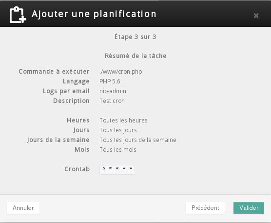
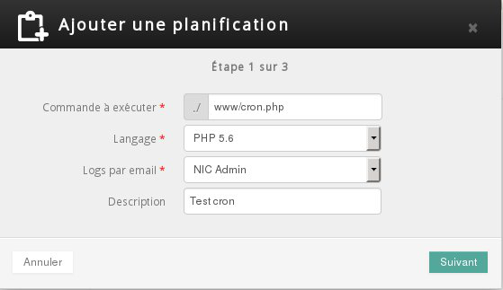
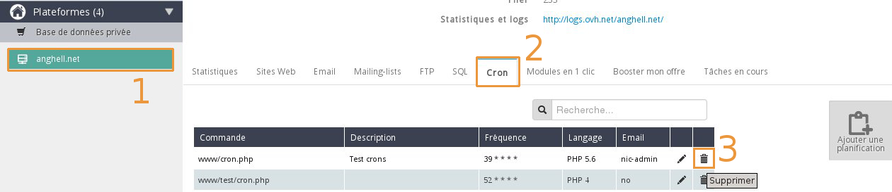
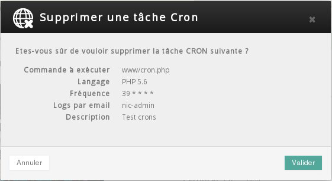

## Create an automated task
Select your platform under hosting in the left-hand column (1), then click on the "More +" tab and finally on "Scheduled tasks - Cron" (2) "Add a scheduling" (3).

{.thumbnail}
For the first stage, you have to enter the command to be executed and the programming language. You can choose to receive your Cron task execution logs via email at a predefined email address. 


- This email will only be sent to you if there is an error.


You can also provide a description for your Cron job.

{.thumbnail}
Secondly you have to set the frequency of the task.

{.thumbnail}
There are two modes: simple mode and advanced mode.

{.thumbnail}
Once you have chosen your task's settings a summary will appear. 


- If the information is correct, just click confirm.


{.thumbnail}
A message will appear to tell you that your task will be available in a few minutes.

{.thumbnail}


## Modifying an automated task
Select your platform under hosting in the left-hand column (1), click on the "More+" tab and finally on "Scheduled tasks - Cron" (2). Click on the pencil (3) corresponding to the automated task that you wish to modify.

{.thumbnail}
At this point you can modify the command to be executed and the programming language, enable email logs and add a description to your Cron job.

{.thumbnail}


## Delete an automated task
Select your platform under hosting in the left-hand column (1), click on the "More+" tab and finally on "Scheduled tasks - Cron" (2). Click on the trash icon next to the automated job which you want to delete

{.thumbnail}
A summary of what you have chosen to delete will appear. If this is correct just click confirm.

{.thumbnail}


## Test how your automated task will run with a web browser
You can test your script directly from your internet browser to see if this is causing an error. 
For example, if your Cron is in the www/cron.php directory and your domain name is test.com, you would type the URL http://test.com/cron.php.
In order to optimise the test, your version of PHP should be the same as the one you provided when creating your automated task.
If you have an error, you have to correct your script. If no error has been detected, we suggest that you check the logs linked to the execution of your Cron jobs.


## View execution logs for your automated task
Select your platform under hosting in the left-hand column then click "More +".

{.thumbnail}
Then click on the link to access "Logs" and statistics.

{.thumbnail}
If your automated tasks were executed over the day, you can view the execution logs in the OVH Speed Log (1).

-> If your task was executed over 24 hours ago, select the log file for the month that you wish to view.

{.thumbnail}
Example execution logs for an automated task:


```
[2015-06-04 10:39:03] ## OVH ## START - 2015-06-04 10:39:03.700912 executing: /usr/local/php5.6/bin/php /homez.600/loginftp/www/cron.php
[2015-06-04 10:39:03] Could not open input file: /homez.600/loginftp/www/cron.php
[2015-06-04 10:39:03]
[2015-06-04 10:39:03] ## OVH ## END - 2015-06-04 10:39:03.762685 exitcode: 1
```


In this case, the following line from the log demonstrates that my automated task has not run correctly because the path to the script is incorrect or does not exist:


```
Could not open input file: /homez.600/loginftp/www/cron.php
```


## Limitations

- In shared hosting, you cannot specify the minute that you want the task to run. In addition the task can only be executed once an hour. 

- Tasks cannot run for longer than 60 minutes

- You can only generate up to 5 MB of data  (stdin/stderr)


## Automated tasks with variables
It is not possible to set a path containing variables, for automated tasks.

Example:

```
/www/cron.php?variable=test
```


- You can however define these variables in your script.


## Use of absolute paths
To make sure that your Cron job works, you have to use absolute paths in your script not relative paths.
To get the address of the current path you can use the "_DIR_" constant:  
[PHP documentation](http://php.net/manual/en/language.constants.predefined.php)


## Execution report
Only one Cron job execution report is sent daily. This is sent in the night.


## Calling another script
If the script used by your Cron task uses other scripts, you must use an absolute path for this to work. The absolute path for your hosting begins with:


```
/home/loginFTP/
```


## If there is an execution error
If there is an error with your Cron job it will be disabled after 10 failed execution attempts.


## Example logs
Correct script execution:

```
# OVH ## START - 2014-12-23 15:34:12.680711 executing: /homez.600/loginftp/test/run.sh
I am the client and I'm printing stuff with this nice 'echo' feature.

# OVH ## END - 2014-12-23 15:34:13.056472 exitcode: 0
```


Execution script error because the file could not be found:

```
# OVH ## START - 2014-12-23 15:36:16.206693 executing: /homez.600/loginftp/test/idontexist.sh
# OVH ## ERROR command '/homez.600/loginftp/test/idontexist.sh' not found

# OVH ## END - 2014-12-23 15:36:16.546574 exitcode: 255
```


Script execution error following timeout:

```
# OVH ## START - 2014-12-23 16:05:52.233058 executing: /homez.600/loginftp/test/sleep.sh
tuesday 23 december 2014, 16:05:52 (UTC+0100)
Now sleeping 9000 sec

# OVH ## ERROR - CRON TASK INTERRUPTED BY OVH - reason: your script duration exceeded the maximum permitted (3600 seconds)
# OVH ## END - 2014-12-23 17:05:54.690413 exitcode: 0
```


Script execution error following excessive data output:

```
# OVH ## START - 2014-12-23 15:43:27.606083 executing: /homez.600/loginftp/test/echoer.sh
[...a lot of logs here...]
# OVH ## ERROR - CRON TASK INTERRUPTED BY OVH - reason: cron output (9288634 bytes) exceeds maximum permitted (5242880 bytes)
# OVH ## END - 2014-12-23 15:43:50.999934 exitcode: 255
```


Script execution error because of a permissions error (chmod) or incorrect configuration of the .ovhconfig file:

```
[2015-01-08 18:07:10]
[2015-01-08 18:07:10] ## OVH ## Your job could not be initiated for an unknown reason. Please contact customer support for more information.
[2015-01-08 18:07:10] ## OVH ## END - 2015-01-08 18:07:10.969840 exitcode: 255
```


