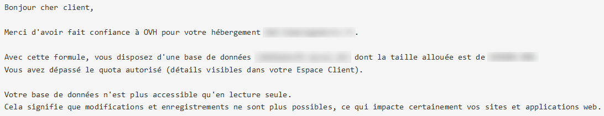
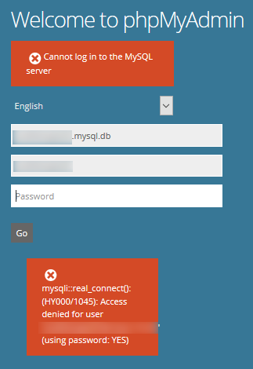

> [!primary]
> Questa traduzione è stata generata automaticamente dal nostro partner SYSTRAN. I contenuti potrebbero presentare imprecisioni, ad esempio la nomenclatura dei pulsanti o alcuni dettagli tecnici. In caso di dubbi consigliamo di fare riferimento alla versione inglese o francese della guida. Per aiutarci a migliorare questa traduzione, utilizza il pulsante "Modifica" di questa pagina.
>

**Ultimo aggiornamento: 01/03/2023**

## Obiettivo

L'utilizzo dei database può provocare alcune anomalie sul tuo sito o sul tuo [Spazio Cliente OVHcloud](https://www.ovh.com/auth/?action=gotomanager&from=https://www.ovh.it/&ovhSubsidiary=it), così come sull'interfaccia [PhpMyAdmin](https://docs.ovh.com/it/hosting/creare-database/).

**Scopri come risolvere gli errori associati ai database sugli hosting condivisi OVHcloud.**

> [!warning]
>
> OVHcloud mette a tua disposizione servizi di cui tu sei responsabile per la configurazione e la gestione. Garantirne quotidianamente il corretto funzionamento è quindi responsabilità dell’utente.
>
> Questa guida ti aiuta a eseguire le operazioni necessarie alla configurazione del tuo account. Tuttavia, in caso di difficoltà o dubbi, ti consigliamo di contattare un fornitore specializzato o l’amministratore del servizio. OVHcloud non potrà fornirti alcuna assistenza. Per maggiori informazioni consulta la sezione [Per saperne di più](#gofurther) su questa guida.
>

## Prerequisiti

- Disporre di una soluzione di [hosting Web](https://www.ovhcloud.com/it/web-hosting/) attiva
- Avere accesso allo [Spazio Cliente OVHcloud](https://www.ovh.com/auth/?action=gotomanager&from=https://www.ovh.it/&ovhSubsidiary=it)
- Utilizzare una delle nostre offerte di database: [Web Cloud](https://www.ovhcloud.com/it/web-hosting/options/start-sql/) o [Web Cloud Databases](https://www.ovh.it/cloud/cloud-databases/)
## Procedura

### "Error establishing a database connection"

#### Verifica gli incidenti in corso

Per prima cosa verifica su [https://web-cloud.status-ovhcloud.com/](https://web-cloud.status-ovhcloud.com/) che il tuo datacenter, il tuo cluster di hosting, il tuo server Web Cloud Databases o Cloud Database non sia interessato da un incidente sull'infrastruttura OVHcloud.


> [!primary]
> Per maggiori informazioni, accedi allo Spazio Cliente OVHcloud (https://www.ovh.com/auth/?action=gotomanager&from=https://www.ovh.it/&ovhSubsidiary=it), sezione `Web Cloud`{.action}:
>
> - Per recuperare la `Datacenter` del tuo hosting e la `Filer` (server di file), seleziona `Hosting`{.action} e poi l'hosting interessato. Queste informazioni sono disponibili nella scheda `Informazioni generali`{.action}.
> - Per recuperare il **cluster** di server su cui è ospitato il tuo hosting, clicca su `FTP-SSH`{.action}. Questa informazione verrà mostrata nella `Server FTP`
> - Per recuperare il nome del tuo server **Cloud Databases**, clicca su `Database`{.action} e seleziona l'offerta corrispondente. Questa informazione è disponibile nella scheda `Host`{.action}.
>

#### Verifica le credenziali di connessione al tuo database <a name="config_file"></a>

Accedi in [FTP](https://docs.ovh.com/it/hosting/accedere-spazio-storage-ftp-hosting-web/) allo spazio di archiviazione dei file sul tuo hosting e ritrova il file di configurazione del tuo sito (ad esempio, per un sito WordPress, si tratta del file **wp-config.php***, che contiene il tuo sito).

> [!warning]
>
> La scelta e la configurazione del file contenente le informazioni di connessione al database sono inerenti al mittente del contenuto (CMS) interessato e non a OVHcloud.
>
> In caso di necessità, ti consigliamo di rivolgerti all'editor del [CMS](https://docs.ovh.com/it/hosting/hosting_condiviso_guida_ai_moduli_degli_hosting_condivisi/) utilizzato per creare il tuo sito o di rivolgerti a uno specialista del settore(https://partner.ovhcloud.com/it/directory/). Non saremo in grado di fornirti assistenza al riguardo.
>

Verifica la corrispondenza **esatta** tra le credenziali di connessione a [PhpMyAdmin](https://docs.ovh.com/it/hosting/creare-database/) e quelle del file di configurazione del tuo sito.

Modifica, se necessario, la [password del tuo database](https://docs.ovh.com/it/hosting/modificare-password-database/).

##### Esempio per WordPress

Se il tuo sito visualizza un messaggio **"Errore durante la connessione al database"** e non è interessato da un [incidente](https://web-cloud.status-ovhcloud.com/), accedi al tuo hosting e apri la directory contenente il tuo sito (di default la cartella `wwww`) ...

Se il tuo sito è WordPress, apri il file `wp-config.php`.

```php
define('DB_NAME', 'my_database');
 
/** MySQL database username */
define('DB_USER', 'my_user');
 
/** MySQL database password */
define('DB_PASSWORD', 'my_password');
 
/** MySQL hostname */
define('DB_HOST', 'my_server.mysql.db:port');
```

Nello Spazio Cliente OVHcloud (https://www.ovh.com/auth/?action=gotomanager&from=https://www.ovh.it/&ovhSubsidiary=it), sezione `Hosting`{.action}, clicca su `Database`{.action} e verifica la corrispondenza tra gli elementi visualizzati e quelli presenti nel file `wp-config.php`:

- **my_database** deve corrispondere a quanto indicato in `Nome del database`
- **my_user** deve corrispondere a quanto riportato nella `Nome utente`
- **my_password** corrisponde alla [password del tuo database](https://docs.ovh.com/it/hosting/modificare-password-database/)
- **my_server.mysql.db** deve corrispondere a quanto riportato su `Indirizzo del server`.


> [!primary]
> Se queste operazioni non ti permettono di ripristinare l'accesso al tuo sito, [salva il tuo database](https://docs.ovh.com/it/hosting/web_hosting_come_esportare_un_database/) e [ripristina il database](https://docs.ovh.com/it/hosting/ripristinare-importare-database/#ripristina-e-importa-un-database-dallo-spazio-cliente) dal tuo [Spazio Cliente OVHcloud](https://www.ovh.com/auth/?action=gotomanager&from=https://www.ovh.it/&ovhSubsidiary=it).
>
> Contatta uno specialista del settore (https://partner.ovhcloud.com/it/directory/) se necessario. Non saremo in grado di fornirti assistenza al riguardo.
>

### Superamento della quota autorizzata del database

Hai ricevuto un'email dai nostri servizi che indica che la quantità di dati sul tuo database supera il limite autorizzato. Il tuo database è quindi passato in sola lettura. In questo modo il sito non può essere modificato.

{.thumbnail}

Tre metodi ti permettono di sbloccare il tuo database:

##### Metodo 1: attiva il tuo abbonamento su un'offerta superiore

Se disponi di una formula **Personale2014** o **Pro2014***, ti consigliamo di passare all'[offerta di hosting superiore](https://www.ovhcloud.com/it/web-hosting/). La modifica dell'abbonamento aumenterà la dimensione del tuo database e la riaprirà automaticamente. Si tratta del metodo più semplice e non richiede particolari competenze tecniche.

> [!warning]
>
> L'aumento della dimensione del tuo database può essere associato a malfunzionamenti nel codice interno del tuo sito.
>
> Un'anomalia può provocare un aumento permanente della dimensione del tuo database, nel qual caso la modifica dell'offerta di hosting risulterebbe inefficace.
>
> Ti consigliamo quindi di contattare immediatamente uno specialista (https://partner.ovhcloud.com/it/directory/) se riscontri un improvviso aumento nella dimensione del tuo database o se disponi di un sito di tipo "blog" normalmente a basso consumo di dati. Non saremo in grado di fornirti assistenza in merito.
>

Accedi allo [Spazio Cliente OVHcloud](https://www.ovh.com/auth/?action=gotomanager&from=https://www.ovh.it/&ovhSubsidiary=it) e clicca su `Hosting`{.action} > 'hosting interessato'. Clicca sul pulsante `...`{.action} nella sezione `Offre` sulla destra dello schermo e su `Modifica dell'offerta`{.action}.

Se utilizzi un'offerta **Performance**, consulta la sezione [metodo 2](#methode2).

#### Metodo 2: migrare i tuoi dati su un database di dimensione superiore <a name="methode2"></a>

Puoi anche migrare i tuoi dati su un nuovo database:

- Ordinare, se necessario, una [database](https://www.ovhcloud.com/it/web-hosting/options/start-sql/) di dimensione superiore e avviarne la [creazione](https://docs.ovh.com/it/hosting/creare-database/);
- Effettua un [export dei tuoi dati](https://docs.ovh.com/it/hosting/web_hosting_come_esportare_un_database/), poi [importali](https://docs.ovh.com/it/hosting/web_hosting_come_importare_un_database_mysql/) nel nuovo database;
- Inserisci gli identificativi del nuovo database nel [file di configurazione](#config_file) del tuo sito.

> [!primary]
> Se disponi di un hosting **Performance**, puoi anche [attivare gratuitamente un server Web Cloud Databases](https://docs.ovh.com/it/clouddb/iniziare-a-utilizzare-clouddb/#attiva-il-tuo-server-clouddb-incluso-con-la-tua-offerta-di-hosting-web).
>

##### Metodo 3: eliminare i dati non necessari

Dopo aver effettuato un [backup del tuo database](https://docs.ovh.com/it/hosting/web_hosting_come_esportare_un_database/), accedi alla tua interfaccia [PhpMyAdmin](https://docs.ovh.com/it/hosting/creare-database/) per eliminare i dati inutili grazie ai comandi Drop, Delete e Truncate.

Esegui il calcolo della quota utilizzando la scheda `Database`{.action} dell'hosting in questione: clicca sul pulsante `...`{.action} interessata e seleziona `Ricalcola la quota`{.action}.

> [!warning]
>
> Questa operazione richiede competenze tecniche molto elevate. In caso di necessità, ti consigliamo di rivolgerti a uno specialista del settore (https://partner.ovhcloud.com/it/directory/). Non saremo in grado di fornirvi assistenza in merito.
>

#### Metodo 4: ottimizzare il tuo database

Per ottimizzare il tuo database, segui le istruzioni della nostra guida [Configura il tuo server di database](https://docs.ovh.com/it/hosting/configurare-ottimizzare-il-tuo-database-server/#ottimizza-i-tuoi-database_1). Clicca sulla scheda `Database`{.action} del tuo hosting e poi riavvia il calcolo della quota `...`{.action} del database in questione.

> [!warning]
>
> Se i consigli forniti sull'ottimizzazione del database non sono sufficienti per sbloccare l'accesso al tuo sito, ti consigliamo di contattare la nostra [Community di utenti](https://community.ovh.com/en/) o i [partner OVHcloud](https://partner.ovhcloud.com/it/directory/). OVHcloud non potrà fornirti alcuna assistenza al riguardo.
>

Superamento della capacità della RAM

Nella sezione `Database`{.action} del tuo [Spazio Cliente OVHcloud](https://www.ovh.com/auth/?action=gotomanager&from=https://www.ovh.it/&ovhSubsidiary=it) è riportato che il tuo server [Web Cloud Databases](https://www.ovh.it/cloud/cloud-databases/) ha consumato troppe risorse sull'infrastruttura OVHcloud:

{.thumbnail}

In questa situazione è possibile aumentare la [quantità di memoria RAM](https://docs.ovh.com/it/hosting/configurare-ottimizzare-il-tuo-database-server/#monitora-la-ram-consumata) disponibile nella sezione `Database`{.action} del tuo [Spazio Cliente OVHcloud](https://www.ovh.com/auth/?action=gotomanager&from=https://www.ovh.it/&ovhSubsidiary=it). Nella scheda `Informazioni generali`{.action}, clicca sul pulsante `...`{.action} nella sezione `RAM`.

> [!warning]
>
> Per aumentare la RAM, il Web Cloud Databases non deve essere attivato tramite un hosting Performance. Per aumentare la quantità di RAM di un database incluso nelle [offerte performance](https://www.ovhcloud.com/it/web-hosting/performance-offer/){.external}, è necessario scollegarla prima.
> 
> Accedi allo [Spazio Cliente OVHcloud](https://www.ovh.com/auth/?action=gotomanager&from=https://www.ovh.it/&ovhSubsidiary=it) e seleziona `Web Cloud`{.action}. Clicca su `Hosting`{.action} e seleziona l'hosting Web su cui è attivo il Web Cloud Databases.
>
> Nella zona `Configurazione`, clicca sui `...`{.action} in corrispondenza dell'entrata della `Database Privato` e clicca su `Scollega`{.action}.
>

Per ottimizzare il tuo database, segui le istruzioni della nostra guida "[Configurare il tuo server di database](https://docs.ovh.com/it/hosting/configurare-ottimizzare-il-tuo-database-server/#ottimizza-i-tuoi-database_1)".

> [!primary]
> Se riscontri difficoltà nell'utilizzo delle risorse sul tuo server di database e non desideri aumentarle, contatta la nostra [Community di utenti](https://community.ovh.com/en/) o i [partner OVHcloud](https://partner.ovhcloud.com/it/directory/). Non saremo in grado di fornirti assistenza al riguardo.
>

### Errori di importazione di database

#### "Access denied for user to database"

>
> **"#1044 - Access denied for user to database"**
>

Per prima cosa, assicurati che il database sia vuoto dalla scheda `Database`{.action} dell'hosting interessato (clicca sul pulsante `...`{.action} in questione e su `Ricalcola la quota`{.action}) per [salvare i dati presenti](https://docs.ovh.com/it/hosting/web_hosting_come_esportare_un_database/).

Seleziona la casella `Svuota il database attuale`{.action} immediatamente prima di [avviare l'importazione](https://docs.ovh.com/it/hosting/ripristinare-importare-database/):

{.thumbnail}

Questo messaggio di errore significa che il database che stai cercando di importare contiene elementi non autorizzati sull'infrastruttura condivisa OVHcloud. Contatta, se necessario, la nostra [Community di utenti](https://community.ovh.com/en/) o un [provider specializzato](https://partner.ovhcloud.com/it/directory/). Non saremo in grado di fornirti assistenza sulla correzione di questa anomalia.

> [!success]
>
> Avere un "**trigger**" nello script di importazione del tuo database non è autorizzato sui server di hosting condiviso OVHcloud. importa il tuo database su un server [Web Cloud Databases](https://www.ovh.it/cloud/cloud-databases/).
>

Inoltre, la seguente richiesta non è autorizzata:

```mysql
CREATE DATABASE IF NOT EXISTS `Database-Name` DEFAULT CHARACTER SET latin1 COLLATE latin1_swedish_ci; 
```

Sostituiscila con:

```mysql
USE `Database-Name`;
```

(`Database-Name`: inserisci il nome del database indicato nel tuo [Spazio Cliente OVHcloud](https://www.ovh.com/auth/?action=gotomanager&from=https://www.ovh.it/&ovhSubsidiary=it).)

##### "MySQL server has gone away"

>
> **"404 ERROR MySQL server has gone away"**
>

Questo messaggio di errore compare durante l'[importazione di un database](https://docs.ovh.com/it/hosting/ripristinare-importare-database/#importa-un-backup-locale) su un server [Web Cloud Databases](https://docs.ovh.com/it/clouddb/iniziare-a-utilizzare-clouddb/). È legato per la maggior parte del tempo alla quantità troppo elevata di dati da importare o alla mancanza di ottimizzazione delle richieste SQL nello script di importazione.

Per risolvere questa anomalia, puoi:

- Aumentare la [quantità di RAM](https://docs.ovh.com/it/hosting/configurare-ottimizzare-il-tuo-database-server/#monitora-la-ram-consumata). accedendo alla sezione `Database` del tuo [Spazio Cliente OVHcloud](https://www.ovh.com/auth/?action=gotomanager&from=https://www.ovh.it/&ovhSubsidiary=it). Clicca sul pulsante `...`{.action} nella sezione `RAM` e clicca su `Modifica la quantità di RAM`{.action}.

- Per importare il tuo database in più operazioni anziché in una sola pagina (per maggiori informazioni sulle operazioni da effettuare, contatta la nostra [Community di utenti](https://community.ovh.com/en/) o i [partner OVHcloud](https://partner.ovhcloud.com/it/directory/) OVHcloud non potrà fornirti alcuna assistenza al riguardo).

- [Ottimizza il tuo database](https://docs.ovh.com/it/hosting/configurare-ottimizzare-il-tuo-database-server/) e ripeti le operazioni di esportazione/importazione.

### Impossibile accedere a PhpMyAdmin

##### "Access denied for user"

>
> **"mysqli::real_connect(): (HY000/1045): Access denied for user"**
>

Questo messaggio di errore può comparire durante la connessione al tuo database da [PhpMyAdmin](https://docs.ovh.com/it/hosting/creare-database/). Essa indica che gli identificativi indicati sono errati.

{.thumbnail}

In questa situazione, [verifica le credenziali inserite](https://docs.ovh.com/it/hosting/connessione-database-server-bdd/) e, se necessario, modifica la [password del tuo database](https://docs.ovh.com/it/hosting/modificare-password-database/).

#### "Too many connections"

>
> **"mysqli_real_connect(): (HY000/1040): Too many connections"**
>

Il numero massimo di connessioni attive per i database consegnati con hosting condivisi ([StartSQL](https://www.ovhcloud.com/it/web-hosting/options/start-sql/) è di **30**.

Questo numero è di **200** per i database dei server [Web Cloud Databases](https://docs.ovh.com/it/clouddb/iniziare-a-utilizzare-clouddb/). (Questo parametro è modificabile nella sezione `Configuration`{.action} del tuo server database).

Questo messaggio compare durante la [connessione a PhpMyAdmin](https://docs.ovh.com/it/hosting/creare-database/) quando viene superato il numero massimo di connessioni.

Per ridurre il numero di connessioni attive, è necessario [ottimizzare i tuoi database](https://docs.ovh.com/it/hosting/configurare-ottimizzare-il-tuo-database-server/).

> [!warning]
>
> Per maggiori informazioni sulle operazioni da effettuare per ridurre il numero di connessioni attive sul database, contatta la nostra [Community di utenti](https://community.ovh.com/en/) o i [partner OVHcloud](https://partner.ovhcloud.com/it/directory/). OVHcloud non potrà fornirti alcuna assistenza al riguardo.
>

#### "Name or service not known"

>
> **"mysqli::real_connect(): (HY000/2002): php_network_getaddresses: getaddrinfo failed: Name or service not known"**
>

Questo messaggio di errore compare durante la [connessione a PhpMyAdmin](https://docs.ovh.com/it/hosting/connessione-database-server-bdd/) quando il nome del server inserito non è corretto.

{.thumbnail}

Verifica il nome del server da iscrivere nel tuo [Spazio Cliente OVHcloud](https://www.ovh.com/auth/?action=gotomanager&from=https://www.ovh.it/&ovhSubsidiary=it).

> [!success]
>
> Se il database a cui vuoi connetterti compare nella scheda `Database`{.action} della sezione `Hosting`{.action} del tuo [Spazio Cliente OVHcloud](https://www.ovh.com/auth/?action=gotomanager&from=https://www.ovh.it/&ovhSubsidiary=it), il nome da inserire è indicato nella colonna `Indirizzo del server`.
>
> Se vuoi connetterti a un database su un server [Web Cloud Databases](https://docs.ovh.com/it/clouddb/iniziare-a-utilizzare-clouddb/) il nome del server da inserire è iscritto nella scheda `Informazioni generali`{.action}, `Informazioni di connessione`{.action}, `SQL`{.action} e nella sezione `Nome host`{.action}.
>


## Per saperne di più <a name="gofurther"></a>

[Iniziare a utilizzare il servizio Web Cloud Databases](https://docs.ovh.com/it/clouddb/iniziare-a-utilizzare-clouddb/)

Per prestazioni specializzate (referenziamento, sviluppo, ecc...), contatta i [partner OVHcloud](https://partner.ovhcloud.com/it/directory/).

Contatta la nostra Community di utenti all’indirizzo <https://community.ovh.com/en/>.
