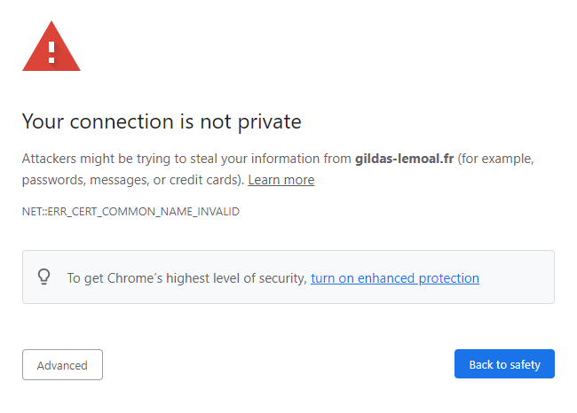
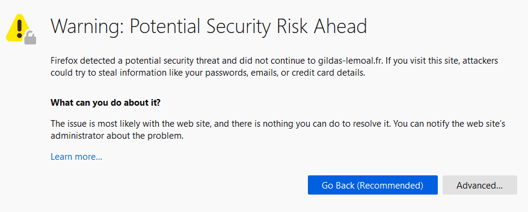
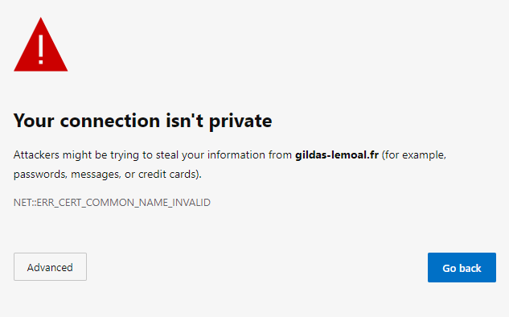
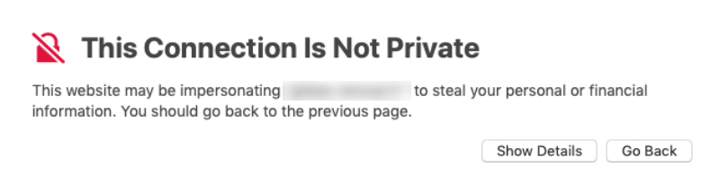
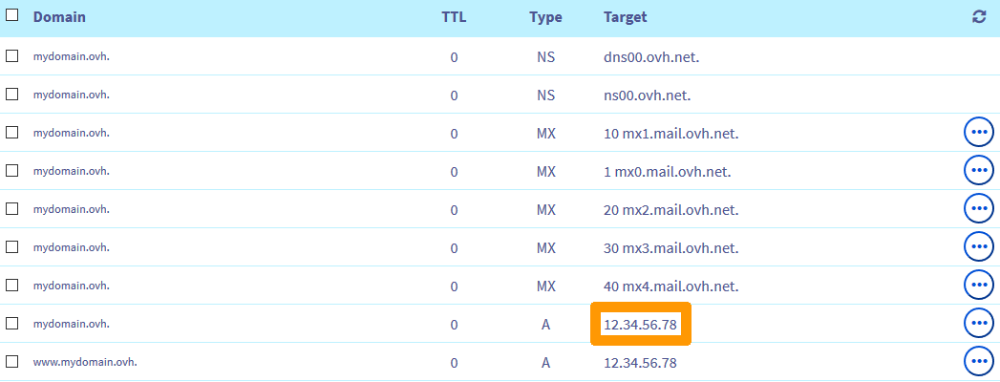
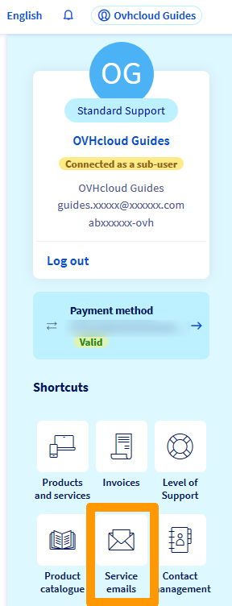

**Last updated 8th July 2021**
 
## Objective 

Several error messages may appear if your website is inaccessible. The examples below indicate that your Web Hosting plan does not contain any [SSL certificate](../ssl-certificates-on-web-hosting-plans/) (if your website does not display one of the anomalies described in this guide, please refer to the "[Go further](#gofurther)" section): 

|Browser|Error message concerned|
|-|---|
|Chrome: "Your connection is not private"|{.thumbnail}|
|Firefox: "Warning: Potential Security Risk Ahead"|{.thumbnail}|
|Edge: "Your connection isn't private"|{.thumbnail}|
|Safari: "This Connection is Not Private"|{.thumbnail}|

**Find out how to solve SSL-related error messages on your website.**

> [!warning]
> OVHcloud is providing you with services for which you are responsible, with regard to their configuration and management. You are therefore responsible for ensuring they function correctly.
>
> This guide is designed to assist you in common tasks as much as possible. Nevertheless, we recommend that you contact a [specialist service provider](https://partner.ovhcloud.com/en-gb/directory/) and/or discuss the issue with our community on if you have difficulties or doubts. You can find more information in the [Go further](#gofurther) section of this guide.
>

## Requirements

- control over your domain name’s servers and [DNS zone](../../domains/web_hosting_how_to_edit_my_dns_zone/#understanding-dns)
- access to the [OVHcloud Control Panel](https://www.ovh.com/auth/?action=gotomanager&from=https://www.ovh.co.uk/&ovhSubsidiary=GB)

## Instructions

To solve this issue, you will need to:

1. determine the hosting plan to which your domain name is linked, in order to intervene on the correct server;
2. create, activate or renew a [SSL certificate](../ssl-certificates-on-web-hosting-plans/) for your domain name on the concerned hosting plan.

### Step 1: check the hosting plan attached to your domain name

#### Check the hosting IP address

The error messages mentioned [above](#objective) do not necessarily mean that your website is hosted on one of our [Web Cloud offers](https://www.ovhcloud.com/en-gb/web-hosting/). For this reason, you will need to check the IP address of the server your [domain name](https://www.ovhcloud.com/en-gb/domains/) is attached to.

To find the IP address of your [OVHcloud hosting plan](https://www.ovhcloud.com/en-gb/web-hosting/), click on `Web Cloud`{.action} in the top of your [OVHcloud Control Panel](https://www.ovh.com/auth/?action=gotomanager&from=https://www.ovh.co.uk/&ovhSubsidiary=GB), then on `Hosting plans`{.action}.

In the `General information`{.action} tab, note the IPv4 and/or IPv6 address of your web hosting.

{.thumbnail}

#### Check the IP address in the DNS zone

You now need to check that the IP address listed in the [DNS zone](../../domains/web_hosting_how_to_edit_my_dns_zone/) corresponds to the one of your [OVHcloud Web Hosting plan](https://www.ovhcloud.com/en-gb/web-hosting/).

Click on `Domain names`{.action} of your [OVHcloud Control Panel](https://www.ovh.com/auth/?action=gotomanager&from=https://www.ovh.co.uk/&ovhSubsidiary=GB) and select your website’s domain name.

Select the `DNS zone`{.action} tab and note the target of the `A` record for your domain name:

{.thumbnail}

#### Perform the necessary actions

|Scenario|What to do|
|---|---|
|The IP address listed in the [DNS Zone](../../domains/web_hosting_how_to_edit_my_dns_zone/) corresponds to your Web Hosting plan’s IP address.|Proceed to [Step 2](#step2).|
|The IP address listed in the zone does not concern any of the Web Hosting plans within your [OVHcloud account](https://www.ovh.com/auth/?action=gotomanager&from=https://www.ovh.co.uk/&ovhSubsidiary=GB), but appears in the [list of our Web Cloud servers](../list-of-ip-addresses-of-web-hosting-clusters/).|Check that you do not have a hosting plan with this IP address within one of your other [OVHcloud customer accounts](https://www.ovh.com/auth/?action=gotomanager&from=https://www.ovh.co.uk/&ovhSubsidiary=GB), if you have several of them. Contact your webmaster or the [OVHcloud partners](https://partner.ovhcloud.com/en-gb/directory/) for further information.|
|The IP address entered in the zone is not your hosting plan’s one, nor does it appear on the [list of our Web Cloud servers](../list-of-ip-addresses-of-web-hosting-clusters/).|Contact your webmaster or the [OVHcloud partners](https://partner.ovhcloud.com/en-gb/directory/) for further information.|
|In the `DNS Zone`{.action} tab, a warning indicates that your domain name uses other [DNS](../../domains/web_hosting_how_to_edit_my_dns_zone/#understanding-dns) servers. These appear as "ns **?** .ovh.net" or "dns **?** .ovh.net" (replace the "**?**" with the relevant DNS server number):  {.thumbnail}|You must modify your domain's DNS servers to match the `NS` records of the DNS zone. To perform this operation, follow the instructions of [this guide](../../domains/web_hosting_general_information_about_dns_servers/#modifying-dns-servers).|
|In the `DNS Zone`{.action} tab, a message indicates that your domain uses other [DNS](../../domains/web_hosting_how_to_edit_my_dns_zone/#understanding-dns) servers and these do not appear as "ns **?** .ovh.net" or "dns **?**.ovh.net" :  {.thumbnail}|Contact your webmaster or the [OVHcloud partners](https://partner.ovhcloud.com/en-gb/directory/) for further information.|
|Your domain name does not appear in the `Domain names`{.action} section of your [OVHcloud Control Panel](https://www.ovh.com/auth/?action=gotomanager&from=https://www.ovh.co.uk/&ovhSubsidiary=GB).  Or your domain's `DNS Zone`{.action} tab appears as follows:  {.thumbnail}|It means that your domain name is not managed from your [OVHcloud Control Panel](https://www.ovh.com/auth/?action=gotomanager&from=https://www.ovh.co.uk/&ovhSubsidiary=GB).  Check if it is managed from one of your other [OVHcloud customer accounts](https://www.ovh.com/auth/?action=gotomanager&from=https://www.ovh.co.uk/&ovhSubsidiary=GB), if you have created more than one of them.  You can also check the registrar of your domain name and its actual DNS servers with our [WHOIS tool](https://www.ovh.co.uk/support/tools/check_whois.pl).  If necessary, contact your webmaster or the [OVHcloud partners](https://partner.ovhcloud.com/en-gb/directory/) about this.|

### Step 2: check your Web Hosting plan’s SSL certificate 

In the `General information`{.action} tab of the concerned hosting plan within your [OVHcloud Control Panel](https://www.ovh.com/auth/?action=gotomanager&from=https://www.ovh.co.uk/&ovhSubsidiary=GB), check the `SSL certificate` section:

{.thumbnail}

#### Scenario 1: your Web Hosting plan does not contain any SSL certificate

Activate an [SSL certificate](https://www.ovhcloud.com/en-gb/web-hosting/options/ssl/) on your Web Hosting plan by following the instructions in this [guide](../ssl-certificates-on-web-hosting-plans/).

#### Scenario 2: the SSL certificate on your Web Hosting plan does not work

If you have **generated a Let's Encrypt SSL certificate**, click on the `Multisite`{.action} tab and follow the instructions of this [guide](../ssl-certificates-on-web-hosting-plans/#enabling-ssl-on-a-multisite) to activate and/or regenerate the SSL option.

If you **ordered a SSL certificate** of our partner [SECTIGO](https://sectigo.com/){.external}, check if you have received an email offering to renew it.
 If necessary, contact the [SECTIGO support team](https://sectigo.com/support){.external} for more information.

If you have **imported a SSL certificate** from another provider, contact the appropriate support team.

> [!primary]
>
> To check all the emails sent by OVHcloud teams, click on the top right-hand corner of your [OVHcloud Control Panel](https://www.ovh.com/auth/?action=gotomanager&from=https://www.ovh.co.uk/&ovhSubsidiary=GB), then on `Service emails`{.action}:
>
>{.thumbnail}
>

## Go further 

[Managing SSL certificates on a Web Hosting plan](../ssl-certificates-on-web-hosting-plans/)

[Activating HTTPS on your website with an SSL certificate](../activate-https-website-ssl/)

[Resolving a “Site not installed” error](../web_hosting_error_-_website_not_installed/)

[Fixing the 500 Internal Server Error](../web_hosting_how_to_fix_the_500_internal_server_error/)

[Resolving the most common 1-click module errors](../error-frequently-1-click-modules/)
 
For specialised services (SEO, development, etc.), contact the [OVHcloud partners](https://partner.ovhcloud.com/en-gb/directory/).

If you would like assistance using and configuring your OVHcloud solutions, please refer to our [support offers](https://www.ovhcloud.com/en-gb/support-levels/).

Join our community of users on <https://community.ovh.com/en/>.
