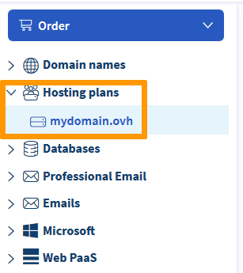

**Dernière mise à jour le 30/06/2021**
 
## Objectif 

Plusieurs messages d'erreurs peuvent apparaître en cas d'inaccessibilité de votre site. Les exemples ci-dessous indiquent que votre hébergement web ne contient pas de [certificat SSL](../les-certificats-ssl-sur-les-hebergements-web/) (si votre site n'affiche pas l'une des anomalies décrites dans ce guide, consultez la section [Aller plus loin](#aller-plus-loin)) : 

|Navigateur|Erreur concernée|
|-|---|
|Sur Chrome : « Votre connexion n'est pas privée »|{.thumbnail}|
|Sur Firefox : « Attention : risque probable de sécurité »|{.thumbnail}|
|Sur Edge : « Votre connexion n’est pas privée »|{.thumbnail}|
|Sur Safari : « Cette connexion n'est pas privée »|{.thumbnail}|

**Découvez comment résoudre les erreurs du type « Votre connexion n'est pas privée »**

> [!warning]
>
> OVHcloud met à votre disposition des services dont la configuration, la gestion et la responsabilité vous incombent. Il vous revient de ce fait d'en assurer le bon fonctionnement.
>
> Nous mettons à votre disposition ce guide afin de vous accompagner au mieux sur des tâches courantes. Néanmoins, nous vous recommandons de faire appel à un prestataire spécialisé et/ou de contacter l'éditeur du service si vous éprouvez des difficultés. En effet, nous ne serons pas en mesure de vous fournir une assistance. Plus d'informations dans la section [Aller plus loin](#aller-plus-loin) de ce guide.
>

## Prérequis

- Avoir la gestion des serveurs et de la zone [DNS](../../domains/editer-ma-zone-dns/#comprendre-la-notion-de-dns) de votre domaine
- Héberger votre site sur une offre d'[hébergement mutualisé OVHcloud](https://www.ovh.com/fr/hebergement-web/)
- Être connecté à votre [espace client OVHcloud](https://www.ovh.com/auth/?action=gotomanager&from=https://www.ovh.com/fr/&ovhSubsidiary=fr)
 
## En pratique

Afin de résoudre cette anomalie, vous devrez : 

1. Déterminer l'hébergement auquel est relié votre nom de domaine, afin d'être certain d'intervenir sur le bon serveur.
2. Créer, activer ou renouveler un [certificat SSL](../les-certificats-ssl-sur-les-hebergements-web/) pour votre domaine sur l'hébergement concerné.

### Étape 1 : vérifier l'hébergement auquel est relié votre nom de domaine

#### Vérifier l'adresse IP dans la zone DNS

Les messages d'erreur indiqués dans la partie [Objectif](#objectif) de ce guide ne sont pas caractéristiques d'un [hébergement mutualisé OVHcloud](https://www.ovh.com/fr/hebergement-web/). Vous devez donc vérifier, dans un premier temps, le serveur auquel est relié votre [nom de domaine](https://www.ovh.com/world/domains/).

Pour retrouver l'adresse IP de l'hébergement auquel votre nom de domaine est lié, cliquez en haut à gauche de votre [espace client OVHcloud](https://www.ovh.com/auth/?action=gotomanager&from=https://www.ovh.com/fr/&ovhSubsidiary=fr) sur **« Web Cloud »** puis sur `Noms de domaines`{.action} dans la barre de services à gauche. Sélectionnez le domaine de votre site. : 

{.thumbnail}

Cliquez ensuite sur l'onglet `Serveurs DNS`{.action} et notez les serveurs indiqués :

{.thumbnail}

Puis ciquez sur l'onglet `Zone DNS`{.action} et notez la cible de l'entrée de type `A` pour votre domaine :

{.thumbnail}

> [!warning]
>
> Si l'onglet `Serveurs DNS`{.action} n'apparaît pas dans cette partie de votre [espace client OVHcloud](https://www.ovh.com/auth/?action=gotomanager&from=https://www.ovh.com/fr/&ovhSubsidiary=fr) et que votre domaine s'y affiche de la façon suivante : 
>
> {.thumbnail}
>
> Cela signifie que votre domaine n'est pas géré depuis votre [espace client OVHcloud](https://www.ovh.com/auth/?action=gotomanager&from=https://www.ovh.com/fr/&ovhSubsidiary=fr). Dans ce cas de figure, contactez votre webmaster ou ou les [partenaires OVHcloud](https://partner.ovhcloud.com/fr/), afin de retrouver l'adresse IP contenue dans la `Zone DNS`{.action} active de votre domaine.

#### Vérifier l'adresse IP de l'hébergement

Il vous faut maintenant vérifier que l'adresse IP indiquée dans la [Zone DNS](../../domains/editer-ma-zone-dns/#comprendre-la-notion-de-dns) est bien identique à celle de l'hébergement de votre site.

Deux situations sont possibles : 

1. Votre site est hébergé en dehors de l'infrastructure OVHcloud ou par une tierce personne. Dans ce cas, contactez le support de l'hébergeur ou le prestataire concernés, afin d'obtenir l'adresse IP du serveur hébergeant votre site.

2. Votre site est hébergé sur l'une de vos offres mutualisées OVHcloud : cliquez sur l'onglet `Hébergements`{.action} à gauche de votre écran, puis sur l'hébergement concerné.

{.thumbnail}

Dans l'onglet `Informations générales`{.action}, notez l'adresse IPV4 et/ou IPV6 de votre domaine, 

{.thumbnail}

> [!primary]
>
> Si vous souhaitez relier votre domaine à cet hébergement, reportez-la dans la [Zone DNS](../../domains/editer-ma-zone-dns/#editer-la-zone-dns-ovhcloud-de-votre-nom-domaine_1) de votre domaine, en modifiant ou créant une entrée de type `A`.
>

#### effectuer les actions nécessaires

Plusieurs cas sont possibles :

|Scénario|Action à entreprendre|
|---|---|
|Les `Serveurs DNS`{.action} n'apparaissent pas sous la forme **« nsX.ovh.net »** ou **« dnsX.ovh.net »**. Cela signifie que la `Zone DNS`{.action} active de votre domaine ne se trouve pas sur votre [espace client OVHcloud](https://www.ovh.com/auth/?action=gotomanager&from=https://www.ovh.com/fr/&ovhSubsidiary=fr) :{.thumbnail}|Contactez votre webmaster ou les [partenaires OVHcloud](https://partner.ovhcloud.com/fr/) à ce sujet.|
|La cible de l'entrée de type `A` pour votre domaine dans sa `Zone DNS`{.action} n'apparaît pas dans la [liste des hébergements mutualisés OVHcloud](../liste-des-adresses-ip-des-clusters-et-hebergements-web/)|Contactez votre webmaster ou les [partenaires OVHcloud](https://partner.ovhcloud.com/fr/) à ce sujet.|
|La cible de l'entrée de type `A` pour votre domaine dans sa `Zone DNS`{.action} apparaît dans la [liste des hébergements mutualisés OVHcloud](../liste-des-adresses-ip-des-clusters-et-hebergements-web/), mais aucun de vos hébergements ne possède cette adresse IP|Vérifiez que vous ne possédez pas un hébergement possédant cette adresse IP dans l'un de vos autres [comptes OVHcloud](https://www.ovh.com/auth/?action=gotomanager&from=https://www.ovh.com/fr/&ovhSubsidiary=fr) si vous en avez créé plusieurs. Si besoin, contactez votre webmaster ou les [partenaires OVHcloud](https://partner.ovhcloud.com/fr/) à ce sujet.|
|L'adresse IP indiquée dans la zone DNS active de votre domaine correspond à celle de votre hébergement mutualisé.|Passez à [l'étape 2](#etape2).|

### Étape 2 : Vérifiez le certificat SSL de votre hébergement 

Dans l'onglet `Informations générales`{.action} de votre hébergement, vérifiez la partie `Certificat SSL` :

{.thumbnail}

#### Scénario 1 : Votre hébergement ne contient pas de certificat SSL

Activez un [certificat SSL](https://www.ovh.com/fr/ssl/) sur votre hébergement en suivant les instructions de ce [guide](../les-certificats-ssl-sur-les-hebergements-web/).

#### Scénario 2 : Le certificat SSL de votre hébergement ne fonctionne pas

Si vous avez généré un **certificat SSL « Let's Encrypt »**, activez l'option SSL dans le `Multisite`{.action} de votre hébergement selon ce [document](../les-certificats-ssl-sur-les-hebergements-web/#activer-un-certificat-ssl-sur-un-multisite).

Si vous disposez d'un **certificat SSL importé** et que celui-ci ne fonctionne pas, contactez son fournisseur.

Si vous avez commandé l'un des **certificats SSL payants** de notre partenaire [SECTIGO](https://sectigo.com/){.external}, vérifiez que vous n'avez pas reçu un e-mail vous proposant de le renouveler. Si besoin, contactez le [support de SECTIGO](https://sectigo.com/support){.external} à ce sujet.

> [!primary]
>
> Pour retrouver l'ensemble des e-mails envoyés par nos services, cliquez en haut à droite de votre [espace client OVHcloud](https://www.ovh.com/auth/?action=gotomanager&from=https://www.ovh.com/fr/&ovhSubsidiary=fr), puis sur `E-mails de service`{.action}) :
>
>{.thumbnail}
>

## Aller plus loin 

[Gérer un certificat SSL sur son hébergement web](../les-certificats-ssl-sur-les-hebergements-web/)

[Passer son site internet en HTTPS grâce au SSL](../passer-site-internet-https-ssl/)

[Résoudre l’erreur « Site non installé »](../erreur-site-non-installe/)

[Comment diagnostiquer une page blanche ?](../comment-diagnostiquer-page-blanche/)

[Que faire en cas d’erreur 500 Internal Server Error ?](../erreur-500-internal-server-error/)

[Résoudre les erreurs les plus fréquentes liées aux modules en 1 clic](../erreurs-frequentes-modules-en-1-clic/)
 
Pour des prestations spécialisées (référencement, développement, etc), contactez les [partenaires OVHcloud](https://partner.ovhcloud.com/fr/).

Si vous souhaitez bénéficier d'une assistance à l'usage et à la configuration de vos solutions OVHcloud, nous vous proposons de consulter nos différentes [offres de support](https://www.ovhcloud.com/fr/support-levels/).

Échangez avec notre communauté d'utilisateurs sur <https://community.ovh.com>.