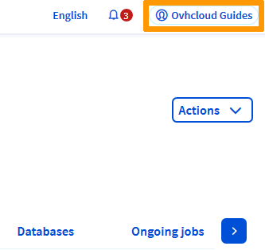
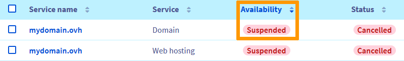
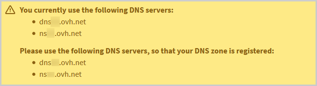

**Dernière mise à jour le 18/06/2021**
 
## Objectif

Plusieurs messages d'erreurs peuvent apparaître en cas d'inaccessibilité de votre site. Les exemples ci-dessous indiquent une configuration erronée de vos DNS ou un domaine suspendu (si votre site n'affiche pas l'une des anomalies décrites ici, consultez la section [Aller plus loin](#aller-plus-loin)) : 

|Navigateur|Action à entreprendre|
|-|---|
|Sur Chrome : « Ce site est inaccessible »|{.thumbnail}|
|Sur Firefox : « Hum, nous ne parvenons pas à trouver ce site. »|{.thumbnail}|
|Sur Edge : « Désolé, impossible d’accéder à cette page. »|{.thumbnail}|
|Sur Safari : « Safari ne parvient pas à trouver le serveur »|{.thumbnail}|

**Découvez comment résoudre les erreurs du type "Ce site est inaccessible"**

> [!warning]
>
> OVHcloud met à votre disposition des services dont la configuration, la gestion et la responsabilité vous incombent. Il vous revient de ce fait d'en assurer le bon fonctionnement.
>
> Nous mettons à votre disposition ce guide afin de vous accompagner au mieux sur des tâches courantes. Néanmoins, nous vous recommandons de faire appel à un prestataire spécialisé et/ou de contacter l'éditeur du service si vous éprouvez des difficultés. En effet, nous ne serons pas en mesure de vous fournir une assistance. Plus d'informations dans la section [Aller plus loin](#aller-plus-loin) de ce guide.
>

## Prérequis

- Disposer d'un [nom de domaine](https://www.ovh.com/fr/domaines/)
- Avoir la gestion de ses serveurs et de sa zone [DNS](../../domains/editer-ma-zone-dns/#comprendre-la-notion-de-dns)
- Être connecté à votre [espace client OVHcloud](https://www.ovh.com/auth/?action=gotomanager&from=https://www.ovh.com/fr/&ovhSubsidiary=fr)
 
## En pratique

### Étape 1 : Vérifiez la validité de votre nom de domaine

Pour vérifier la validité de l'abonnement concernant votre domaine, cliquez en haut à droite sur votre nom et prénom, afin de faire apparaître le menu de droite.

{.thumbnail}

Puis cliquez sur `Produits et services`{.action}.

{.thumbnail}|

Vérifiez la `Disponibilité`{.action} de votre nom de domaine.

{.thumbnail}

Renouvelez-le si nécessaire, via le bouton `...`{.action} à droite de l'écran, puis `Renouveler`{.action}.

{.thumbnail}

> [!warning]
>
> Le renouvellement de vos services est sous votre entière responsabilité. OVHcloud, en tant qu'hébergeur, a l'obligation de supprimer définitivement les domaines et services qui n'ont pas été renouvelés à temps, ainsi que l'ensemble des données qu'ils contiennent.
>
> De ce fait, nous vous recommandons fortement d'activer le [renouvellement automatique](../../billing/renouvellement-automatique-ovh/#en-pratique) sur l'ensemble de vos abonnements OVHcloud.

### Étape 2 : Vérifiez les serveurs DNS

Pour vérifier la validité de vos [serveurs DNS](../../domains/generalites-serveurs-dns/), cliquez en haut à droite de votre [espace client OVHcloud](https://www.ovh.com/auth/?action=gotomanager&from=https://www.ovh.com/fr/&ovhSubsidiary=fr) sur `Noms de domaine`{.action}, puis sur le domaine de votre site : 

{.thumbnail}

Cliquez ensuite sur l'onglet `Zone DNS`{.action}, puis `Serveurs DNS`{.action} : 

### Scénario 1 : Les serveurs DNS sont corrects

Les serveurs DNS indiqués sont identiques aux cibles des entrées de type `NS` dans la zone de votre domaine : 

{.thumbnail}	

Passez à [l'étape 3](#etape3).

|Un avertissement dans l'onglet `Zone DNS`{.action} indique que les serveurs DNS utilisés par votre domaine ne sont pas ceux indiqués dans la zone.|Modifiez les serveurs indiqués dans l'onglet `Serveurs DNS`{.action} en conséquence.|
|Aucun serveur DNS n'est renseigné dans l'onglet `Serveurs DNS`{.action}.|Dans l'onglet `Serveurs DNS`{.action}, [ajoutez les cibles]((https://docs.ovh.com/fr/domains/generalites-serveurs-dns/#modifier-les-serveurs-dns)) des entrées de type `NS` dans votre `Zone DNS`{.action}, puis patientez 48 heures au maximum (délai technique maximum de propagation des changements de serveurs DNS).|
|Les serveurs DNS qui apparaissent ne sont pas gérés par OVHcloud.|Contactez leur hébergeur.|

### Scénario 2 : Un avertissement apparaît au-dessus de la Zone DNS

Un avertissement dans l'onglet `Zone DNS`{.action} indique que les serveurs DNS utilisés par votre domaine ne sont pas ceux indiqués dans la zone :

{.thumbnail}

Modifiez les serveurs indiqués dans l'onglet `Serveurs DNS`{.action} [en conséquence](../../domains/generalites-serveurs-dns/#modifier-les-serveurs-dns).

### Scénario 3

Aucun serveur DNS n'est renseigné dans l'onglet `Serveurs DNS`{.action} :

{.thumbnail}	

Dans l'onglet `Serveurs DNS`{.action}, [ajoutez les cibles]((https://docs.ovh.com/fr/domains/generalites-serveurs-dns/#modifier-les-serveurs-dns)) des entrées de type `NS` dans votre `Zone DNS`{.action}, puis patientez 48 heures au maximum (délai technique maximum de propagation des changements de serveurs DNS).

### Scénario 4

Les serveurs DNS qui apparaissent ne sont pas gérés par OVHcloud : 

{.thumbnail}

Contactez leur hébergeur.

### Étape 3 : Vérifiez la zone DNS 

Dans cette étape, vous allez vérifier l'adresse IP de votre hébergement, puis l'ajouter à votre `Zone DNS`{.action}.

Si votre site est hébergé en dehors de l'infrastructure OVHcloud ou par une tierce personne, contactez le support de l'hébergeur ou le prestataire concerné.

Si votre site est hébergé sur l'une de vos offres mutualisées OVHcloud, cliquez sur l'onglet `Hébergements`{.action} à gauche de votre écran, puis sur l'hébergement concerné.

Dans l'onglet `Informations générales`{.action}, copiez l'adresse IPV4 et/ou IPV6 de votre domaine, puis reportez-là dans la [Zone DNS](../../domains/editer-ma-zone-dns/#editer-la-zone-dns-ovhcloud-de-votre-nom-domaine_1) de votre domaine, en modifiant ou créant une ou plusieurs entrées de type `A`. Patientez enfin 24 heures au maximum (délai technique maximum de propagation des modifications dans la `Zone DNS`{.action}).

## Aller plus loin 

[Résoudre l’erreur « Site non installé »](../erreur-site-non-installe/)

[Comment diagnostiquer une page blanche ?](../comment-diagnostiquer-page-blanche/)

[Que faire en cas d’erreur 500 Internal Server Error ?](../erreur-500-internal-server-error/)

[Résoudre les erreurs les plus fréquentes liées aux modules en 1 clic](../erreurs-frequentes-modules-en-1-clic/)
 
Pour des prestations spécialisées (référencement, développement, etc), contactez les [partenaires OVHcloud](https://partner.ovhcloud.com/fr/).

Si vous souhaitez bénéficier d'une assistance à l'usage et à la configuration de vos solutions OVHcloud, nous vous proposons de consulter nos différentes [offres de support](https://www.ovhcloud.com/fr/support-levels/).

Échangez avec notre communauté d'utilisateurs sur <https://community.ovh.com>.