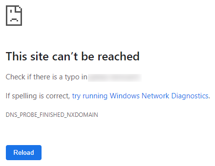
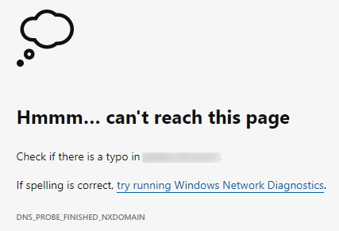
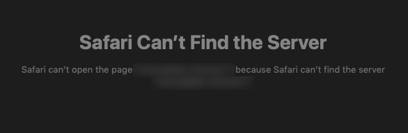
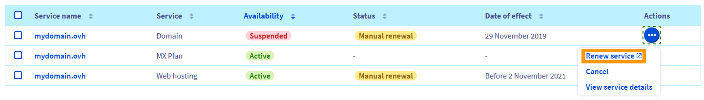

> [!primary]
> Questa traduzione è stata generata automaticamente dal nostro partner SYSTRAN. I contenuti potrebbero presentare imprecisioni, ad esempio la nomenclatura dei pulsanti o alcuni dettagli tecnici. In caso di dubbi consigliamo di fare riferimento alla versione inglese o francese della guida. Per aiutarci a migliorare questa traduzione, utilizza il pulsante "Modifica" di questa pagina.
>

**Ultimo aggiornamento: 16/07/2021**

## Obiettivo

In caso di inaccessibilità del sito, sul browser potrebbero comparire diversi errori. Gli esempi che seguono indicano una configurazione errata dei tuoi [DNS](../../domains/web_hosting_gestisci_il_tuo_server_dns/#capire-il-concetto-di-dns) o un dominio sospeso (se il tuo sito non mostra uno dei messaggi di errore descritti qui, consulta la sezione [Per saperne di più](#gofurther)):

|Browser|Messaggio di errore|
|--|--|
|Chrome: "Impossibile raggiungere il sito"|{.thumbnail}|
|Firefox : "Uhm… non riusciamo a trovare questo sito."|{.thumbnail}|
|Edge: "Impossibile raggiungere questa pagina"|{.thumbnail}|
|Safari : "Safari non trova il server"|{.thumbnail}|

**Scopri come risolvere gli errori del tipo "Impossibile raggiungere il sito"**

> [!warning]
>
> OVHcloud mette a tua disposizione servizi di cui tu sei responsabile per la configurazione e la gestione. Garantirne quotidianamente il corretto funzionamento è quindi responsabilità dell’utente.
>
> Questa guida ti aiuta a eseguire le operazioni necessarie alla configurazione del tuo account. Tuttavia, in caso di difficoltà o dubbi, ti consigliamo di contattare un fornitore specializzato o l’amministratore del servizio. OVHcloud non potrà fornirti alcuna assistenza. Per maggiori informazioni consulta la sezione [Per saperne di più](#gofurther) su questa guida.
>

## Prerequisiti

- Avere la gestione dei server e della [zona DNS](../../domains/web_hosting_modifica_la_tua_zona_dns/#capire-il-concetto-di-dns) del dominio
- Avere accesso allo [Spazio Cliente OVHcloud](https://www.ovh.com/auth/?action=gotomanager&from=https://www.ovh.it/&ovhSubsidiary=it)

## Procedura

### Step 1: verifica la validità del tuo dominio

> [!warning]
>
> Il rinnovo delle tue offerte è sotto la tua completa responsabilità. 
> OVHcloud, in qualità di hosting provider, ha l'obbligo di eliminare definitivamente i servizi (domini, hosting, email, ecc.) che non sono stati rinnovati in tempo utile e tutti i dati che contengono.
>
> Per questo motivo, ti consigliamo di attivare il [rinnovo automatico](../../billing/imposta_il_rinnovo_automatico_dei_tuoi_servizi_ovh/#procedura) su tutti gli abbonamenti OVHcloud.
>

Per verificare la validità dell'abbonamento relativo al tuo dominio, clicca sul tuo nome in alto a destra del tuo Spazio Cliente e poi su `Prodotti e servizi`{.action}.

{.thumbnail}|

Rinnova il tuo dominio se necessario cliccando `...`{.action} a destra dello schermo e poi `Rinnova il servizio`{.action}.

{.thumbnail}

Una volta terminato il rinnovo dell'offerta, il tuo sito Web sarà disponibile entro 48 ore.

### Step 2: verifica i server DNS

Per verificare la validità dei tuoi [server DNS](../../domains/web_hosting_gestisci_il_tuo_server_dns/), clicca in tuo [Spazio Cliente OVHcloud](https://www.ovh.com/auth/?action=gotomanager&from=https://www.ovh.it/&ovhSubsidiary=it) sui `Domini`{.action} e poi sul dominio del tuo sito.

#### Scenario 1: nessuna anomalia sui server DNS

Verifica i server indicati nella scheda `Server DNS`{.action}:

{.thumbnail}

Se sono identici agli obiettivi degli record di tipo `NS` nella `Zona DNS`{.action}, passa allo [Step 3](#step3):

{.thumbnail}

#### Scenario 2: sulla zona DNS compare un avviso

Un avviso nella scheda `Zona DNS`{.action} indica che i server DNS utilizzati dal tuo dominio non sono quelli indicati nella tua zona. Sono possibili due scenari:

- Sotto la frase "Al momento utilizzi questi server DNS:", i server indicati sono del tipo "ns **?** .ovh.net" e "DNS **?** .ovh.net" (sostituisci "**?**" da qualsiasi numero):

{.thumbnail}

Modificare i server DNS seguendo le istruzioni di [questa guida](../../domains/web_hosting_gestisci_il_tuo_server_dns/#modifica-i-server-dns) in modo che siano identici agli obiettivi di record di tipo `NS` nella `Zona DNS`{.action}.

Il tuo sito Web sarà disponibile entro 48 ore.

- Sotto la frase "Al momento utilizzi questi server DNS:", i server indicati non sono del tipo "ns **?** .ovh.net" e "DNS **?** .ovh.net".

{.thumbnail}

> [!warning]
>
> In questo caso, contatta l'hosting provider della tua Zona DNS, il tuo webmaster o i [partner OVHcloud](https://partner.ovhcloud.com/it/directory/) prima di effettuare qualsiasi operazione.
>
> È possibile che i server DNS utilizzati dal tuo dominio siano funzionali e che il problema di accesso al tuo sito sia legato ad un ingresso mancante o errato nella [zona DNS](../../domains/web_hosting_modifica_la_tua_zona_dns/#capire-il-concetto-di-dns). Qualsiasi modifica dei server DNS in questa situazione può rendere indisponibili i tuoi indirizzi email o altre applicazioni online.
>

#### Scenario 3: nella zona DNS non sono presenti record di tipo NS

La `Zona DNS`{.action} del tuo dominio non contiene alcun accesso di tipo `NS`:

{.thumbnail}

Per eseguire un backup dell'area corrente, clicca sul pulsante `Utilizza l'editor di testo`{.action} a destra dello schermo:

{.thumbnail}

Copia/incolla il contenuto della tua `Zona DNS`{.action} in un documento di testo. Salva questo documento localmente.

Clicca su `Reinizializza la zona DNS`{.action} e seleziona `No, ma voglio reinizializzare la mia zona DNS`{.action}, indica i tuoi server di posta e di hosting e clicca su `Conferma`{.action}.

{.thumbnail}

Il tuo sito Web sarà disponibile entro 24 ore.

### Step 3: verifica la zona DNS 

In questo step, visualizzerai l'indirizzo IP del tuo hosting e lo aggiungerai alla tua `Zona DNS`{.action}.

Se il tuo sito non è ospitato sull'infrastruttura OVHcloud o se è gestito da un altro provider, contatta il supporto interessati.

Se il tuo sito è ospitato su una delle nostre [offerte Web Cloud](https://www.ovhcloud.com/it/web-hosting/), clicca sulla scheda `Hosting`{.action} e poi sull'offerta corrispondente.

Nella scheda `Informazioni generali`{.action}, copia l'indirizzo IPV4 e/o IPV6 del tuo dominio.

{.thumbnail}

E riportala nella [Zona DNS](../../domains/web_hosting_modifica_la_tua_zona_dns/#modifica-la-zona-dns-ovhcloud-del-dominio_1) del tuo dominio, modificandola o creando uno o più record di tipo `A`.

{.thumbnail}

Il tuo sito Web sarà disponibile entro 24 ore.

## Per saperne di più 

[Risolvere l'errore "Sito non installato"](../errore-sito-non-installato/)

[Web hosting come fai a diagnosticare una pagina bianca?](../web_hosting_come_fai_a_diagnosticare_una_pagina_bianca/)

[Cosa fare in caso di errore 500 Internal Server Error?](../errore-500-internal-server-error/)

[Risolvere gli errori più frequenti associati ai moduli in 1 click](../errori-frequenti-moduli-in-1-click/)

Per prestazioni specializzate (referenziamento, sviluppo, etc ...), contatta i [partner OVHcloud](https://partner.ovhcloud.com/it/).

Per usufruire di un supporto per l'utilizzo e la configurazione delle soluzioni OVHcloud, è possibile consultare le diverse [offerte di supporto](https://www.ovhcloud.com/it/support-levels/).

Contatta la nostra Community di utenti all’indirizzo <https://community.ovh.com/en/>.
