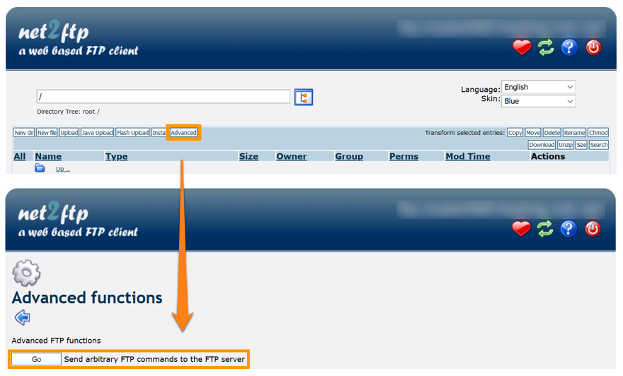

> [!primary]
> Diese Übersetzung wurde durch unseren Partner SYSTRAN automatisch erstellt. In manchen Fällen können ungenaue Formulierungen verwendet worden sein, z.B. bei der Beschriftung von Schaltflächen oder technischen Details. Bitte ziehen Sie beim geringsten Zweifel die englische oder französische Fassung der Anleitung zu Rate. Möchten Sie mithelfen, diese Übersetzung zu verbessern? Dann nutzen Sie dazu bitte den Button “Mitmachen“ auf dieser Seite.
>

**Letzte Aktualisierung am 16.06.2022**

## Ziel 

Änderungen der Zugriffsrechte auf Ihre Website-Dateien, die Bearbeitung der **.htaccess** Datei oder die Installation einer Sicherheitserweiterung können unter Umständen in einer "**403 forbidden**" Seite resultieren.

Es kann auch vorkommen, dass unsere Sicherheitsbots nach der Erkennung von sicherheitsrelanten Anomalien den Zugriff auf die Dateien Ihres Hostings vorübergehend blockiert haben. Diese automatische Sperrung soll verhindern, dass Schadcode weiter verbreitet wird, und Sie rechtlich schützen.

{.thumbnail}

**Diese Anleitung erklärt, wie Sie im Fall einer Anzeige von “403 forbidden“ den Zugang zu Ihrer Seite entsperren.**

> [!warning]
> OVHcloud stellt Ihnen Dienstleistungen zur Verfügung, für deren Konfiguration und Verwaltung Sie die alleinige Verantwortung tragen. Es liegt somit bei Ihnen, sicherzustellen, dass diese ordnungsgemäß funktionieren.
> 
> Diese Anleitung soll Sie bei allgemeinen Aufgaben bestmöglich unterstützen. Dennoch empfehlen wir Ihnen, falls Sie Hilfe brauchen, einen [spezialisierten Dienstleister](https://partner.ovhcloud.com/de/directory/) zu kontaktieren und/oder Ihre Fragen in der OVHcloud Community zu stellen. Leider können wir Ihnen für administrative Aufgaben keine weitergehende technische Unterstützung anbieten. Weitere Informationen finden Sie am [Ende dieser Anleitung](#gofurther).
>

## Voraussetzungen

- Sie haben ein [OVHcloud Webhosting](https://www.ovhcloud.com/de/web-hosting/) in Ihrem Kunden-Account.
- Sie verfügen über die [Login-Daten](../verbindung-ftp-speicher-webhosting/#schritt-1-erforderliche-verbindungsinformationen-abrufen) für den Speicherplatz Ihres Hostings.
- Sie haben Zugriff auf Ihr [OVHcloud Kundencenter](https://www.ovh.com/auth/?action=gotomanager&from=https://www.ovh.de/&ovhSubsidiary=de)

## In der praktischen Anwendung

### Schritt 1: Die Situation analysieren

Wenn die Seite "**403 forbidden**" aufgrund einer fehlerhaften Änderung Ihrer Website auftaucht, setzen Sie den [Speicherplatz Ihres Hostings zu einem früheren Zeitpunkt zurück](../webhosting-speicherplatz-wiederherstellen/).

Wenn Sie mit den verfügbaren Backups den Zugang zu Ihrer Website nicht wiederherstellen können, kontaktieren Sie einen [[spezialisierten Dienstleister](https://partner.ovhcloud.com/de/directory/)](https://partner.ovhcloud.com/de/directory/).

Wenn "**403 forbidden**" ohne Änderung Ihrer Website angezeigt wird, überprüfen Sie Ihren E-Mail-Posteingang. Wenn Sie eine E-Mail von unsere System erhalten haben, die eine Schließung Ihres Hostings aus Sicherheitsgründen meldet, gehen Sie zu [Schritt 2](#step2).

Wenn "**403 forbidden**" ohne Aktion Ihrerseits erschienen ist und Sie diesbezüglich **keine** Benachrichtigung seitens unserer Hosting-Dienste erhalten haben, kontaktieren Sie einen [[spezialisierten Dienstleister](https://partner.ovhcloud.com/de/directory/)](https://partner.ovhcloud.com/de/directory/).

### Schritt 2: Sicherheitsmaßnahmen auf Ihrer Seite durchführen <a name="step2"></a>

Überprüfen Sie zunächst die Sicherheit Ihrer Geräte und Dienste:

- Wenden Sie Sicherheitsupdates an;
- Überprüfen Sie, ob ein Antivirus-Dienst installiert ist, aktualisieren Sie ihn und starten Sie einen vollständigen Scan. Wenn Sie keine solche Software besitzen, konsultieren Sie vor der Installation einen spezialisierten [Dienstleister](https://partner.ovhcloud.com/de/directory/);
- Ändern Sie alle Ihre persönlichen Passwörter, insbesondere Ihrer E-Mail-Accounts, und halten Sie sich dabei an diese [bewährten Vorgehensweisen](https://docs.ovh.com/de/customer/Passwort-verwalten/#ein-adaquates-passwort-erstellen);
- Ändern Sie die Passwörter Ihres OVHcloud Webhostings, um die Zugänge zu [Ihrem FTP-Speicherplatz](../ftp-benutzer-passwort-aendern/), sowie der [Datenbanken](../datenbank-passwort-aendern/) abzusichern.

> [!warning]
>
> Bevor Sie Datenbankpasswörter Ihrer Website über Ihr [OVHcloud Kundencenter](https://www.ovh.com/auth/?action=gotomanager&from=https://www.ovh.de/&ovhSubsidiary=de) ändern, aktualisieren Sie die Konfigurationsdatei Ihrer Website, damit sie weiterhin auf die Datenbank zugreifen kann.
>
> Bleibt diese Aktualisierung aus, führt die Änderung des Passworts Ihrer Datenbank dazu, dass die Website und jegliche Dienste mit Datenbankzugriff blockiert werden.
>
> Sollten Sie Hilfe bei den durchzuführenden Maßnahmen benötigen, wenden Sie sich an die [OVHcloud Partner](https://partner.ovhcloud.com/de/directory/).
>

### Schritt 3: Ihr Hosting bearbeiten

Beachten Sie zunächst das Datum des Versands der E-Mail von OVHcloud, in der die Deaktivierung Ihres Hostings mitgeteilt wurde, sowie die Liste der Ordner, die auffällige Dateien enthalten.

#### Fall 1: Ihr Hosting wurde vor weniger als zwei Wochen deaktiviert

Wenn Ihr Hosting vor weniger als zwei Wochen geschlossen wurde und nur eine Website enthält, stellen Sie Ihren Speicherplatz gemäß den Anweisungen in dieser [Anleitung](../webhosting-speicherplatz-wiederherstellen/#speicherplatz-uber-das-kundencenter-wiederherstellen) wieder her.

Wenn Ihr Hosting vor weniger als zwei Wochen geschlossen wurde und mehrere Websites enthält, stellen Sie nur die Dateien mit den verdächtigen Dateien gemäß den Anweisungen in dieser [Anleitung](../webhosting-speicherplatz-wiederherstellen/#datei-mithilfe-einer-software-oder-uber-ein-interface-wiederherstellen) wieder her.

> [!warning]
>
> Die Wiederherstellung Ihres Speicherplatzes allein reicht nicht aus, um potenzielle Sicherheitslücken zu beheben, die bereits auf Ihrer Website vorhanden sind.
>
> Um diese Sicherheitslücken zu identifizieren, können Sie die [Web-Logs](https://docs.ovh.com/de/hosting/webhosting_die_statistiken_und_logs_meiner_website_einsehen/#logs) Ihres Hostings analysieren oder einen [spezialisierten Dienstleister](https://partner.ovhcloud.com/de/directory/) kontaktieren, um eine Sicherheitsüberprüfung Ihrer Lösungen durchzuführen.
>

#### Fall 2: Ihr Hosting wurde vor mehr als zwei Wochen deaktiviert

Wenn Ihr Hosting vor mehr als zwei Wochen geschlossen wurde, kontaktieren Sie einen [[spezialisierten Dienstleister](https://partner.ovhcloud.com/de/directory/)](https://partner.ovhcloud.com/de/directory/), um eine Sicherheitsüberprüfung Ihrer Lösungen durchzuführen. 

### Schritt 4: Webhosting wieder aktivieren

> [!warning]
>
> Wir empfehlen, unbedingt eine Sicherheitsüberprüfung durchzuführen, **bevor** Ihr Hosting reaktiviert wird. Sie können auch ohne Vorsatz rechtlich verantwortlich gemacht werden, wenn schädlicher Code von Ihrem Webhosting aus verbreitet wird.
>

#### Ihr Webhosting mit FileZilla reaktivieren

> [!primary]
>
> Wenn Sie die Anwendung **FileZilla** installieren möchten, um die Dateien Ihrer Website zu bearbeiten, folgen Sie den Anweisungen in dieser [Anleitung](../webhosting_hilfe_zur_verwendung_von_filezilla/).
>

Öffnen Sie FileZilla und verbinden Sie sich mit Ihrem Speicherplatz. Klicken Sie dann im Menü auf `Server`{.action} und dann auf `Benutzerdefinierten Befehl eingeben`{.action}. (Je nach der Version von FileZilla kann die Bezeichnung variieren.)

{.thumbnail}

Geben Sie im angezeigten Fenster folgenden Befehl ein und bestätigen Sie:

```
SITE CHMOD 705 /
```

{.thumbnail}

Die Antwort "**200 Permissions changed on /**" bestätigt, dass die Änderung erfolgreich durchgeführt wurde. Um dies zu überprüfen, versuchen Sie erneut, auf Ihre Website zuzugreifen.

#### Ihr Hosting mit dem FTP-Explorer (“net2ftp“) reaktivieren

Gehen Sie in Ihrem [OVHcloud Kundencenter](https://www.ovh.com/auth/?action=gotomanager&from=https://www.ovh.de/&ovhSubsidiary=de) in den Bereich `Web Cloud`{.action} und öffnen Sie `Hosting-Pakete`{.action} im linken Menü. Wechseln Sie zum Tab `FTP-SSH`{.action} des betroffenen Hostings.

Klicken Sie anschließend auf den Button `FTP-Explorer`{.action} und loggen Sie sich entsprechend den [hier beschriebenen Anweisungen](../verbindung-ftp-speicher-webhosting/#1-via-ftp-explorer-verbinden) in Ihrem FTP-Speicherplatz ein. Klicken Sie auf `Erweitert`{.action} und dann auf den Button `Weiter`{.action} neben "**Sende benutzerdefinierte FTP-Kommandos zum FTP-Server**".

{.thumbnail}

Geben Sie im oberen Bereich der Seite den Befehl `SITE CHMOD 705 /` ein und klicken Sie dann auf den grünen "Haken".

{.thumbnail}

Die Antwort "**200 Permissions changed on /**" bestätigt, dass die Änderung erfolgreich durchgeführt wurde. Um dies zu überprüfen, versuchen Sie erneut, auf Ihre Website zuzugreifen.

## Weiterführende Informationen <a name="gofurther"></a>

[Was tun, wenn Ihre WordPress Seite gehackt wurde?](../was_tun_wenn_ihre_wordpress_seite_gehackt_wurde/)

[Aktivieren der Web Application Firewall](../webhosting_aktivieren_der_web_application_firewall/)

[PHP-Version Ihres Webhostings ändern](../konfiguration_von_php_fur_ein_ovh_webhosting_2014/)

Kontaktieren Sie für spezialisierte Dienstleistungen (SEO, Web-Entwicklung etc.) die [OVHcloud Partner](https://partner.ovhcloud.com/de/directory/).

Wenn Sie Hilfe bei der Nutzung und Konfiguration Ihrer OVHcloud Lösungen benötigen, beachten Sie unsere [Support-Angebote](https://www.ovhcloud.com/de/support-levels/).

Für den Austausch mit unserer User Community gehen Sie auf <https://community.ovh.com/en/>.
