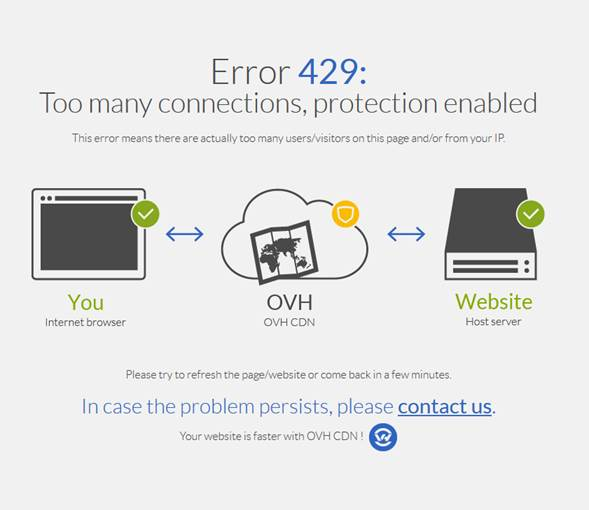
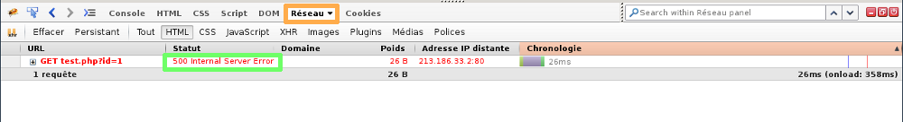
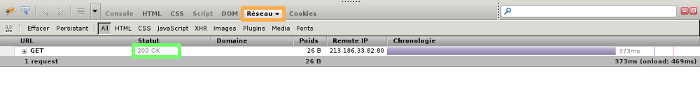

## Erreur page blanche ?

### Généralité
**Pourquoi une page blanche apparaît sur mon site ?**

Contrairement à ce que l'on pourrait penser, la page blanche a son utilité.

- Elle permet de masquer les erreurs générées par votre site web. Cela évite ainsi de donner des informations importantes à un hacker à propos de votre site.
- Comme expliqué précédemment, la page blanche sert à masquer les erreurs de votre site web. Il faut donc dans un premier temps afficher les erreurs pour les corriger par la suite.
- Essayez de vous souvenir à quel moment la page blanche est apparue : est-ce lié à l'installation ou la mise à jour d'un plugin ou d'un thème, à la mise à jour de votre site Internet.


## Diagnostic applicable

### Activer les erreurs PHP
Dans les fichiers de votre site ajoutez cette ligne de code :


```bash
ini_set('display_errors',1);
```

*Il est généralement intéressant d'ajouter cette ligne dans le fichier "**index.php**", ou dans un fichier appelé couramment par votre site, comme par exemple le fichier de configuration du site.*

Attention cette ligne de commande doit être ajoutée après la balise d'ouverture de PHP :


```php
1. <?php
```

*De cette manière, votre site affichera l'erreur que vous devrez corriger, la page blanche ne s'affichera plus.* Autre point qui devra être réalisé afin d'afficher correctement les erreurs :

- Mettre votre fichier " .ovhconfig " en mode développement :

Ce fichier ".ovhconfig" devra contenir le code :


```bash
app.engine=php
app.engine.version=5.4
http.firewall=none
environment=development
```

*Un guide est disponible concernant la mise en place de phpfpm :* []({legacy}1175){.ref}


{.thumbnail}


> [!success]
>
> Astuce
> - Pour un site fonctionnant sous WordPress , pensez à modifier la ligne
> de commande define('WP_DEBUG', false); en changeant la variable
> false à true présent dans le fichier wp-config.php .
>

### Verifier les erreurs liees au cache
Afin de vérifier si la page blanche est encore visible sans utiliser le cache du serveur :

- À la fin de l'url de votre site web, ajoutez un accès via un port spécifique :82

Géocache".

*Il vous est possible de le faire avec les ports de 81 à 85.*


{.thumbnail}


### Utilisation Firebug - Erreur 429 - 500 - 200
*Nous vous conseillons d'utiliser* **FireBug** *afin de récupérer des informations complémentaires sur la page blanche rencontrée.* Même face à une page blanche, FireBug permet de trouver des erreurs intéressantes.

*Exemple: vérifiez si l'erreur* **429** *est présente dans l'onglet réseaux.*

L'erreur  **429**  correspond à un nombre de requêtes trop important sur votre site web.

- L'activation de phpfpm peut aider à résoudre le souci :
- Si l'activation de PHP-FPM ne résout pas le souci, l'upgrade de votre offre peut aussi être envisagée.


{.thumbnail}

Un page blanche est actuellement visible sur le site.

Après utilisation de FireBug sur cette page, on retrouve une erreur  **500** dans la partie réseau.

En l'état, il est impossible d'identifier d'où proviens le souci, vous devez donc activer les erreurs comme indiqué [précédemment](#diagnostic_applicable_activer_les_erreurs_php){.external}.

*Il vous faudra ensuite corriger l'erreur rencontrée.*


{.thumbnail}

Un page blanche est actuellement visible sur le site.

Après utilisation de FireBug sur cette page, on récupère comme retour  **"200 OK"**  dans la partie réseau.

Le retour  **200 ok**  n'est pas vraiment un message d'erreur.

*Il indique que la page a été chargée correctement, mais pourtant on observe une page blanche.*

- Dans ce cas, l'activation des messages d'erreurs sera inutile, car aucune erreur n'est retournée.


{.thumbnail}