**Dernière mise à jour le 07/11/2022**

## Objectif

Si certains pré-requis ne sont pas remplis, la création d'un [Module en 1 clic](../modules-en-1-clic/) en mode simple ou avancé peut occasionner différentes anomalies.

**Découvrez comment diagnostiquer les cas les plus courants d'erreurs liées aux créations de modules en 1 clic**

> [!warning]
>
> OVHcloud met à votre disposition des services dont la configuration, la gestion et la responsabilité vous incombent. Il vous revient de ce fait d'en assurer le bon fonctionnement.
>
> Nous mettons à votre disposition ce guide afin de vous accompagner au mieux sur des tâches courantes. Néanmoins, nous vous recommandons de faire appel à un [prestataire spécialisé](https://partner.ovhcloud.com/fr/) et/ou de contacter l'éditeur du service si vous éprouvez des difficultés. En effet, nous ne serons pas en mesure de vous fournir une assistance. Plus d'informations dans la section [Aller plus loin](#aller-plus-loin) de ce guide.
>

## Prérequis

- Disposer d'une offre d'[hébergement web](https://www.ovhcloud.com/fr/web-hosting/) compatible.
- Être connecté à l'[espace client OVHcloud](https://www.ovh.com/auth/?action=gotomanager&from=https://www.ovh.com/fr/&ovhSubsidiary=fr).
- Avoir utilisé la fonctionnalité [Module en 1 clic](../modules-en-1-clic/), afin de créer un nouveau site.

## En pratique

> [!primary]
>
> Nous indiquons ici les erreurs les plus courantes. Si vous rencontrez une autre anomalie, consultez notre [FAQ sur les hébergements Web](https://docs.ovh.com/fr/hosting/faq-hebergement/).
>

### « Une erreur s'est produite lors du chargement des informations (You need at least one free database) »

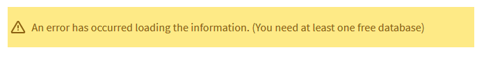{.thumbnail}

Si ce message apparaît quand vous lancez l'installation de votre module, c'est qu'il n'est pas possible de créer une nouvelle base de données sur votre hébergement.

#### Solution n°1 : modifier votre offre d'hébergement

> [!primary]
>
> Retrouvez le comparatif de nos différentes [offres d'hébergement](https://www.ovhcloud.com/fr/web-hosting/).
>

Dans votre [espace client OVHcloud](https://www.ovh.com/auth/?action=gotomanager&from=https://www.ovh.com/fr/&ovhSubsidiary=fr), cliquez sur `Web Cloud`{.action}, puis sur `Hébergements`{.action}. Choisissez l'hébergement concerné puis cliquez sur `Changer d'offre` dans la partie `Abonnement` - `Offre` :

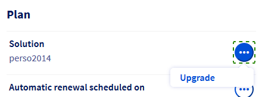{.thumbnail}

Les offres [Pro](https://www.ovhcloud.com/fr/web-hosting/professional-offer/) et [Performance](https://www.ovhcloud.com/fr/web-hosting/performance-offer/) vous permettront de créer jusqu'à trois modules en 1 clic supplémentaires. Les offres **Performance** vous permettront aussi d'activer gratuitement un [serveur CloudDB](https://www.ovh.com/fr/cloud/cloud-databases/).

#### Solution n°2 : supprimer une base de données non utilisée 

> [!warning]
>
> L'opération de suppression d'une base de données est définitive. Elle entraîne également la suppression des sauvegardes de la base concernée. Si vous n'êtes pas certain des manipulations à effectuer, contactez votre webmaster ou l'un de nos [partenaires](https://partner.ovhcloud.com/fr/directory/).
>

Pour supprimer une base de données, dans votre [espace client OVHcloud](https://www.ovh.com/auth/?action=gotomanager&from=https://www.ovh.com/fr/&ovhSubsidiary=fr), cliquez sur `Web Cloud`{.action}, puis sur `Hébergements`{.action} et enfin sur l'onglet `Bases de données`{.action}. Supprimez la base de données souhaitée :

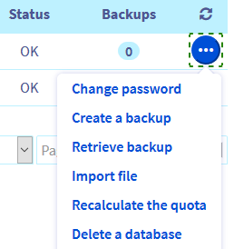{.thumbnail}

#### Solution n°3 : commander de nouvelles bases de données

Dans votre [espace client OVHcloud](https://www.ovh.com/auth/?action=gotomanager&from=https://www.ovh.com/fr/&ovhSubsidiary=fr), cliquez sur `Web Cloud`{.action}, puis sur `Hébergements`{.action}. Dans `Bases de données`{.action}, cliquez sur `Actions`{.action} :

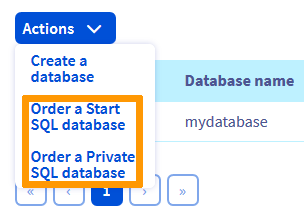{.thumbnail}

> [!primary]
>
> Retrouvez le comparatif de nos différentes [offres de bases de données](https://www.ovhcloud.com/fr/web-hosting/options/start-sql/)
>

#### Solution n°4 : installer votre module sur une base de données déjà utilisée

Pour installer votre module sur une base de données déjà utilisée, vous devrez utiliser le [mode avancé](../modules-en-1-clic/#installation-avancee-dun-module) d'installation d'un nouveau **Module en 1 clic**.

Pour retrouver les identifiants de votre base de données, consultez ce [guide](../modules-en-1-clic/#configurer-le-module).

> [!primary]
>
> Vous pourrez sauvegarder les données d'un seul site dans cette situation en utilisant un [script PHP ou une commande SSH](../exportation-bases-donnees/#recuperer-une-sauvegarde-depuis-linterface-web-phpmyadmin_1).
>
> Pour toute question sur les manipulations à réaliser, contactez la [communauté OVHcloud](https://community.ovh.com) ou l'un de nos [partenaires](https://partner.ovhcloud.com/fr/directory/). 
> Nous ne serons pas en mesure de vous apporter une assistance sur ce sujet.
>

### « Le répertoire d'installation n'est pas vide »

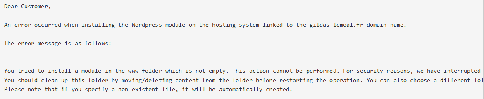{.thumbnail}

Après avoir lancé la création de votre module, vous avez reçu un e-mail indiquant que le répertoire d'installation de votre module n'est pas vide.

Ce message signifie que le **Dossier racine** auquel est lié votre domaine contient un ou plusieurs fichiers ou dossiers.

Pour relier votre domaine à un autre répertoire, cliquez sur `Modifier le domaine`{.action} dans l'onglet `Multisite`{.action} puis indiquez le nom d'un nouveau **Dossier racine** (un répertoire vide sera créé automatiquement sur votre hébergement).

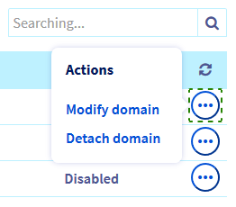{.thumbnail}

Vous pouvez également vous connecter à votre hébergement via [FTP](../connexion-espace-stockage-ftp-hebergement-web/), puis supprimer ou déplacer le contenu du dossier, après l'avoir sauvegardé.

### « Une erreur s'est produite lors du chargement des informations (There is not enough space on your hosting (you need at least xxx MB)) »

{.thumbnail}

Ce message indique que l'[espace de stockage](../connexion-espace-stockage-ftp-hebergement-web/) de votre hébergement comporte un volume de données trop important. Vous devez donc en supprimer ou en déplacer avant de pouvoir installer un nouveau [module en 1 clic](../modules-en-1-clic/).

Dans cette situation, [connectez-vous en FTP](../connexion-espace-stockage-ftp-hebergement-web/) à votre hébergement, [sauvegardez localement](../mutualise-guide-utilisation-filezilla/#transfert-des-fichiers) vos données puis supprimez les fichiers qui ne sont pas nécessaires au fonctionnement de votre site.

> [!primary]
>
> Pour toute question sur les données à supprimer afin de dimininuer la quantité de données sur votre hébergement, contactez notre [communauté d'utilisateurs](https://community.ovh.com) ou les [partenaires OVHcloud](https://partner.ovhcloud.com/fr/). 
> Nous ne serons pas en mesure de vous apporter une assistance sur ce sujet.
>

### « Impossible de se connecter à la base de données » 

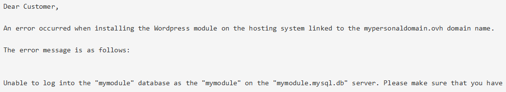{.thumbnail}

Après avoir lancé l'installation de votre module en mode avancé, vous avez reçu un e-mail indiquant que votre module ne peut pas se connecter à la base de données indiquée.

Vous devez donc vérifier les identifiants de votre base de données. Pour les retrouver, consultez ce [guide](../modules-en-1-clic/#configurer-le-module).

Supprimez ensuite votre module via l'onglet `Modules en 1 clic`{.action} :

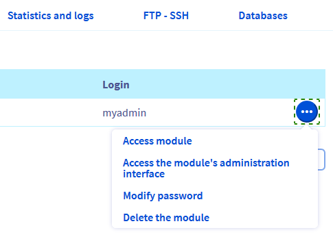{.thumbnail}

Puis relancez l'installation d'un nouveau module.

### « You have insufficient rights on this database. »

{.thumbnail}

Votre base de données ne peut plus être modifiée car la quantité de données qu'elle contient dépasse la limite autorisée. Ce message apparaît lors de l'installation d'un module en [mode avancé](../modules-en-1-clic/#installation-avancee-dun-module).

Dans cette situation, installez votre module en passant par le [mode « simple »](../modules-en-1-clic/#installation-simple-dun-module) ou choisissez une autre base de données lors de son installation en mode avancé. Si besoin, commandez une [offre de bases de données](https://www.ovhcloud.com/fr/web-hosting/options/start-sql/) complémentaire.

Si vous ne disposez pas d'autres bases de données et que vous ne souhaitez pas commander une offre complémentaire, [importez localement une copie de votre base](../exportation-bases-donnees/#en-pratique) puis supprimez les données inutiles.

> [!warning]
>
> **Supprimer des éléments dans votre base de données peut entraîner une coupure de votre site.**
>
> Pour toute question complémentaire, contactez notre [communauté d'utilisateurs](https://community.ovh.com) ou les [partenaires OVHcloud](https://partner.ovhcloud.com/fr/). 
> Nous ne serons pas en mesure de vous apporter une assistance sur ce sujet.
>

### « Can't connect to database 'xxxxxxxx' at 'xxxxxx-xxx.eu.clouddb.ovh.net'. The error is: Access denied for user 'xxxx'@'xxxxxxxx' (using password: YES) »

{.thumbnail}

Vous avez lancé l'installation d'un module en 1 clic en [mode avancé](../modules-en-1-clic/#installation-avancee-dun-module) sur une base de données située sur un [serveur CloudDB](https://docs.ovh.com/fr/clouddb/debuter-avec-clouddb/). Vous avez reçu ce message d'erreur par e-mail. Il signifie que l'utilisateur noté lors de l'installation ne possède pas les droits suffisants sur la base de données ou que les identifiants indiqués sont incorrects.

Dans cette situation, modifiez tout d'abord les [droits de l'utilisateur](../creer-bases-de-donnees-et-utilisateurs/#gerer-les-droits-des-utilisateurs) concerné, afin qu'il dispose des droits **Administrateur** ou en **Lecture/écriture** sur la base de données.

Vérifiez également ses identifiants en vous [connectant directement](../connexion-base-de-donnees-serveur-bdd/#en-pratique) à votre serveur de bases de données puis relancez l'installation de votre module.

### « Can't connect to database 'xxxxxxxx' at 'xxxxxxxx.mysql.db'. The error is: Unknown MySQL server host 'xxxxxxxx.mysql.db' »

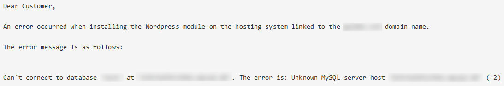{.thumbnail}

Vous avez lancé l'installation d'un module en 1 clic en [mode avancé](../modules-en-1-clic/#installation-avancee-dun-module) sur une base de données située sur un [serveur CloudDB](https://docs.ovh.com/fr/clouddb/debuter-avec-clouddb/). Vous avez reçu ce message d'erreur par e-mail. Il signifie que le nom de serveur de bases de données que vous avez indiqué est incorrect.

Cliquez sur la partie `Web cloud`{.action} de votre [espace client OVHcloud](https://www.ovh.com/auth/?action=gotomanager&from=https://www.ovh.com/fr/&ovhSubsidiary=fr) puis sur l'onglet `Bases de données`{.action}.

Cliquez ensuite sur l'offre concernée : le nom du serveur à utiliser est indiqué sous la mention `Nom d'hôte` dans la sous-partie `SQL` de `Informations de connexion`.

### Votre nom de domaine n'est pas proposé lors de la création du module

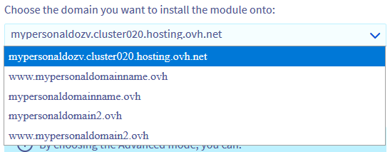{.thumbnail}

Cliquez sur l’onglet `Multisite`{.action} puis effectuez les vérifications suivantes :

|Scénario|Action à entreprendre|
|---|---|
|Le domaine ou le sous-domaine lié au site que vous souhaitez créer n'apparaît pas dans le `Multisite`{.action}.|Ajoutez votre domaine en suivant [ces indications](../multisites-configurer-un-multisite-sur-mon-hebergement-web/#etape-2-ajouter-un-domaine-ou-un-sous-domaine).|
|Le nom de domaine a été supprimé du multisite sans action de votre part.|Si votre domaine ou sa [Zone DNS](../../domains/editer-ma-zone-dns/#comprendre-la-notion-de-dns) ne sont pas gérés depuis votre compte OVHcloud, ajoutez votre domaine au `Multisite`{.action} en suivant [ce guide](../multisites-configurer-un-multisite-sur-mon-hebergement-web/#etape-22-ajouter-un-nom-de-domaine-externe).|

### Votre module s'affiche sur une adresse web de type « xxxxx.cluster0xx.hosting.ovh.net »

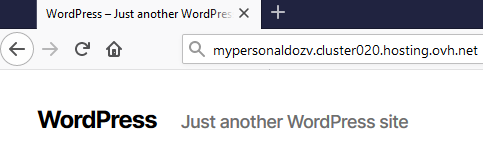{.thumbnail}

Après avoir réalisé toutes les sauvegardes nécessaires, [supprimez votre module](#supprimer-le-module) puis sa [base de données](#supprimer-la-base). Relancez ensuite son installation sur le nom de domaine souhaité.

### Votre ancien site continue de s'afficher

Cette anomalie peut avoir plusieurs causes :

- Vous avez effectué récemment un changement dans votre zone ou vos serveurs [DNS](../../domains/editer-ma-zone-dns/#comprendre-la-notion-de-dns) ou un [transfert de nom de domaine](../../domains/transferer-mon-domaine-generique/). Patientez jusqu'à ce que ces opérations soient finalisées (48 heures pour des changements dans vos DNS). Pensez également à redémarrer vos appareils (PC, smartphone, box, etc.) et à vider le cache de votre navigateur.

- Votre nom de domaine est toujours relié à votre ancien hébergement. Modifiez dans ce cas votre [Zone DNS](../../domains/editer-ma-zone-dns/#editer-la-zone-dns-ovhcloud-de-votre-nom-domaine_1) ou vos [serveurs DNS](../../domains/generalites-serveurs-dns/#modifier-les-serveurs-dns) ou contactez votre ancien hébergeur à ce sujet.

### Le mot de passe « Administrateur » d'accès au « back-office » de votre module en 1 clic ne fonctionne plus 

En cas de rejet de votre mot de passe actuel d'accès à l’interface d’administration de votre CMS, consultez le paragraphe « Modifier le mot de passe de votre module » de notre documentation sur la [gestion de votre module en 1 clic](https://docs.ovh.com/fr/hosting/1-click-module-management/#password-change).

## Aller plus loin 

[Installer son site avec les modules en 1 clic](../modules-en-1-clic/)

[Les problemes recurrents lors de l’utilisation d’un logiciel FTP](../mutualise-les-problemes-ftp-recurrents/)

Pour des prestations spécialisées (référencement, développement, etc), contactez les [partenaires OVHcloud](https://partner.ovhcloud.com/fr/)

Si vous souhaitez bénéficier d'une assistance à l'usage et à la configuration de vos solutions OVHcloud, nous vous proposons de consulter nos différentes [offres de support](https://www.ovhcloud.com/fr/support-levels/).

Échangez avec notre communauté d'utilisateurs sur <https://community.ovh.com>.
