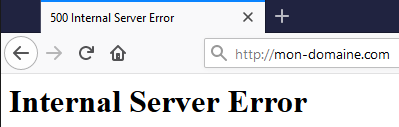

**Last updated 21st July 2022**

## Objective

The "500 Internal Server Error" can affect your entire website or only parts of it. It can be permanent, appear sporadically, or result in a blank page.

{.thumbnail}

These errors may also come from updates carried out **automatically** by components of your website and therefore occur without any action taken on your side.

**Learn how to diagnose the most common cases of "500" type errors.**

> [!warning]
>
> OVHcloud provides services which you are responsible for with regard to their configuration and management. You are therefore responsible for ensuring they function correctly.
>
> We have provided you with this guide in order to help you with common tasks. Nevertheless, we recommend contacting a specialist provider and/or the service’s software publisher if you encounter any difficulties. We will not be able to assist you ourselves. You can find more information in the [Go further](#gofurther) section of this guide.
>

## Requirements

- an [OVHcloud Web Hosting plan](https://www.ovhcloud.com/en-au/web-hosting/)
- access to the [OVHcloud Control Panel](https://ca.ovh.com/auth/?action=gotomanager&from=https://www.ovh.com.au/&ovhSubsidiary=au)
- being up-to-date in the [payments](https://docs.ovh.com/au/en/billing/manage-ovh-bills/#pay-bills) and [renewals](https://docs.ovh.com/au/en/billing/how-to-use-automatic-renewal-at-ovh/#renewal-management) of related services (domain name and web hosting plan)

## Instructions

Before you continue, check your website on different devices and browsers. If the error does not appear in some cases (e.g. on a different browser), your OVHcloud services are working fine. Restart your local devices and contact an IT professional if necessary.

A website consists of a **source code** (most of the time, .php files connected to a database) and additional data. We strongly advise you to create backups of your data before taking any further measures:

- Follow [this guide](../web_hosting_filezilla_user_guide/) to retrieve a copy of all your website's files.
- If your website uses a database, you can additionally refer to [this guide](../web_hosting_database_export_guide/) on how to retrieve a copy of it.

In order to solve a 500 error, you can [restore](#restore) your website. However, we recommend to first investigate the causes of this error through the following steps:

### Check your hosting logs

First, please check your logs with this [guide](../shared_view_my_websites_logs_and_statistics/).

### Put your website in development mode

To reveal any PHP errors, switch your web hosting to `development` mode with these [instructions](../modify_your_web_hosting_systems_runtime_environment/#step-2-check-your-web-hosting-plans-configuration).

### Test the .htaccess file

A 500 error can be caused by a defect of the `.htaccess` file of your website, which is usually located on the first level of its root folder within your hosting's FTP storage space.

To check this, [log in to your hosting plan via FTP](../log-in-to-storage-ftp-web-hosting/).

Then rename this file to `.htaccess.old` and refresh the page in your browser.

If your website is online again, it means the `.htaccess` file should be corrected. If you need help to make the necessary operations, you may consider contacting an OVHcloud [partner](https://partner.ovhcloud.com/en-au/directory/).

### Check folder and file permissions

Each file and each folder of your source code has a certain level of read, write and execute permissions within your web hosting's file system. This is meant to protect them from any malicious or improper manipulation.

An incorrect level of access rights on a folder or a file may create a 500 error.

To access these files, log on your [FTP server](../log-in-to-storage-ftp-web-hosting/).

The [FileZilla guide](../web_hosting_filezilla_user_guide/#file-and-folder-permissions) will then help you check the following points:

- The **root** of your hosting plan (this is the directory marked `/` or `.` on Filezilla) must have 705 access rights (these are the default permissions). Do not change this level of permissions.
- Folders must have 705 access rights.
- Files must have 604 access rights.

### Access error details on your scripts

For security reasons, your website hides all technical details about the error 500.

To verify these details, you can use a [SSH connection](../web_hosting_ssh_on_web_hosting_packages/). (SSH is only available with a hosting plan of the [Business or Developer range](https://www.ovhcloud.com/en-au/web-hosting/).)

### Restore your website to its previous state 

If the 500 error appeared after modifying the PHP configuration of your web hosting, return to the previous one by following our guide [Changing a Web Hosting plan’s PHP version](../how_to_configure_php_on_your_ovh_web_hosting_package_2014/).

> [!warning]
>
> Executing database or FTP restore operations replaces all data contained in your FTP server or database by a backup. As a result, you will not be able to recover any changes made or data stored **after** the timestamp of the backup used.
>
> Restoring your website’s source code will affect all websites on your OVHcloud web hosting.
>

To restore your website’s source code, read our guide [Restoring your Web Hosting plan’s storage space](../restoring-ftp-filezilla-control-panel/). Keep in mind that this operation alone is not a permanent solution.

If your website uses a database, read our guide [Importing a backup into a Web Hosting plan database](../web_hosting_guide_to_importing_a_mysql_database/#restore-a-backup-from-the-control-panel).

## Go further 

For specialised services (SEO, development, etc.), contact [OVHcloud partners](https://partner.ovhcloud.com/en-au/directory/)

Join our community of users on <https://community.ovh.com/en/>
