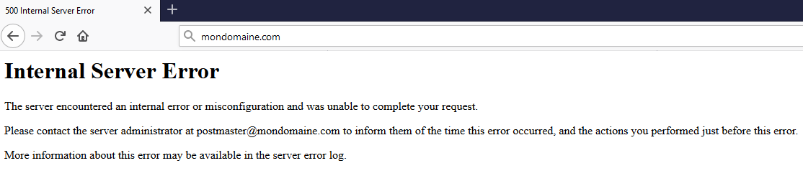

**Dernière mise à jour le 05/02/2021**

## Objectif

Les erreurs 500 « Internal Server Error » peuvent concerner tout ou partie de votre site, être aléatoires ou permanentes. Elles peuvent aussi apparaître sous la forme d'une page blanche.

Elles proviennent aussi parfois d'une mise à jour effectuée **automatiquement** par un composant de votre site et donc survenir sans action de votre part.

**Découvrez comment diagnostiquer les cas les plus courants d'erreurs 500.**

> OVHcloud met à votre disposition des services dont la configuration, la gestion et la responsabilité vous incombent. Il vous revient de ce fait d'en assurer le bon fonctionnement.
> 
> Nous mettons à votre disposition ce guide afin de vous accompagner au mieux sur des tâches courantes. Néanmoins, nous vous recommandons de faire appel à un prestataire spécialisé et/ou de contacter l'éditeur du service si vous éprouvez des difficultés. En effet, nous ne serons pas en mesure de vous fournir une assistance. Plus d'informations dans la section [Aller plus loin](../erreur-500-internal-server-error/#aller-plus-loin_1) de ce guide.

## Prérequis

- Vous disposez d'une [offre d'hébergement mutualisé](https://www.ovh.com/fr/hebergement-web/)
- Vous êtes connecté à votre [espace client OVHcloud](https://www.ovh.com/auth/)

## En pratique

Avant de poursuivre, vérifiez votre site sur plusieurs appareils et navigateurs. Si l'erreur 500 n'apparaît que dans certains cas, c'est qu'elle n'est pas liée à vos services OVHcloud. Redémarrez vos appareils puis contactez si besoin un réparateur informatique proche de votre domicile.

Dans le cas d'une erreur 500, effectuer une [restauration](../erreur-500-internal-server-error/#restaurer-son-site) de votre site est tout à fait possible. Il reste toutefois préférable de réaliser un diagnostic approfondi, afin de déterminer l'origine précise de l'erreur 500.

### Vérifiez les logs de votre hébergement

Consultez tout d'abord ce [guide](../mutualise-consulter-les-statistiques-et-les-logs-de-mon-site/), afin de rechercher dans les logs de votre hébergement la cause de l'erreur 500.

### Passez votre site en mode développement

Passez ensuite votre hébergement en mode `développement`, afin de faire apparaître d'éventuelles erreurs PHP, en suivant ces [indications](../modifier-lenvironnement-dexecution-de-mon-hebergement-web/#etape-2-modifier-la-configuration-de-lhebergement-web).

### Testez le fichier .htaccess

Une erreur 500 peut aussi être liée à une erreur dans le fichier `.htaccess`. 

Pour le vérifier, [connectez-vous en FTP](../connexion-espace-stockage-ftp-hebergement-web/) à votre hébergement.

Puis renommez ce fichier en `.htaccess.old` et retestez votre site. 

Si ce dernier est de nouveau accessible alors le `.htaccess` est en cause. Il devra donc être modifié. Si vous le souhaitez, contactez l'un de nos [partenaires](https://marketplace.ovhcloud.com/) à ce sujet.

### Vérifiez les permissions sur les dossiers et les fichiers

Une erreur 500 peut également être liée à une erreur au niveau des droits accordés à certains dossiers ou fichiers composant votre site.

Pour accéder à ces fichiers, connectez-vous en FTP à votre hébergement selon ce [document](../connexion-espace-stockage-ftp-hebergement-web/).

Le guide [Utilisation logiciel FileZilla avec votre hébergement](../mutualise-guide-utilisation-filezilla/#droits-des-fichiers-dossiers) vous aidera ensuite à effectuer les vérifications suivantes : 

-	La **racine** de votre hébergement (Il s’agit du répertoire noté `/` ou `.` dans votre logiciel FTP) doit être obligatoirement en droits 705 (Ce sont les permissions par défaut). Nous vous conseillons de ne pas modifier ce niveau de droits.
-	Les répertoires de votre hébergement doivent être en droits 705.
-	Les fichiers doivent tous être en droits 604.

### Accédez aux détails des erreurs sur vos scripts

Pour des raisons de sécurité, votre site masque les détails éventuels sur l'origine de l'erreur 500 à toute personne s'y connectant par un navigateur web.

Si vous ou votre développeur souhaitez avoir accès à ces détails, il vous est possible, à partir de la formule d’hébergement [pro2014](https://www.ovh.com/fr/hebergement-web/hebergement-pro.xml), de vous connecter à votre site via une [connexion ssh](../mutualise-le-ssh-sur-les-hebergements-mutualises/).

### Restaurez votre site à son état antérieur

> Un site est constitué d'un **code source** (les fichiers en .php ou .html par exemple de votre hébergement OVHcloud), auquel s'ajoutent souvent une **base de données**. Vous pouvez restaurer l'un ou l'autre indépendamment.
> 
> La restauration du code source concernera l'ensemble des sites de votre hébergement OVHcloud.
> 
> Lors de ces opérations, le code source de votre hébergement, comme le contenu de votre base de données, seront remplacés par une sauvegarde. Les données présentes avant la restauration ne seront pas récupérables.

Pour restaurer le code source de votre site, consultez [Restaurer l’espace de stockage son hébergement web](../restauration-ftp-filezilla-espace-client/). 

Si votre site comporte une base de données, consultez [Restaurer une sauvegarde de votre base de données](../mutualise-guide-importation-dune-base-de-donnees-mysql/#restaurer-une-sauvegarde-depuis-lespace-client), afin de la restaurer à une date antérieure.

Si l'erreur 500 est apparue enfin suite à une mise à jour de la version PHP de votre hébergement [Configurer le PHP sur son hébergement](../configurer-le-php-sur-son-hebergement-web-mutu-2014/) pour revenir à la configuration précédente.

## Aller plus loin

[Tout sur le fichier .htaccess](https://docs.ovh.com/fr/hosting/mutualise-tout-sur-le-fichier-htaccess/)

[Comment diagnostiquer une page blanche ?](https://docs.ovh.com/fr/hosting/comment-diagnostiquer-page-blanche/)

[Les codes de reponse d’un serveur HTTP](https://docs.ovh.com/fr/hosting/mutualise-les-codes-de-reponse-dun-serveur-http/)

Échangez avec notre communauté d'utilisateurs sur <https://community.ovh.com>.
