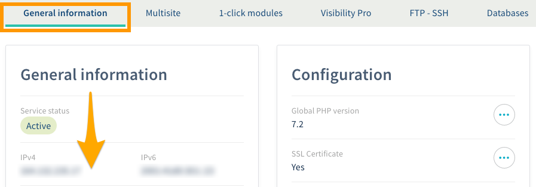
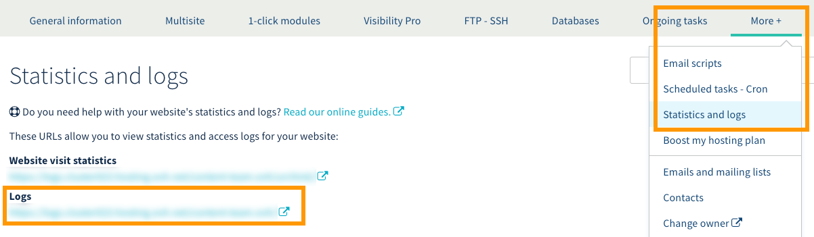
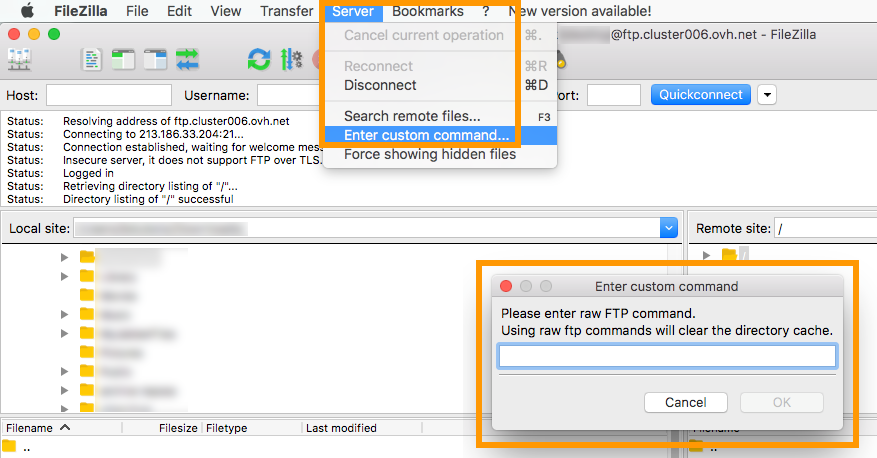
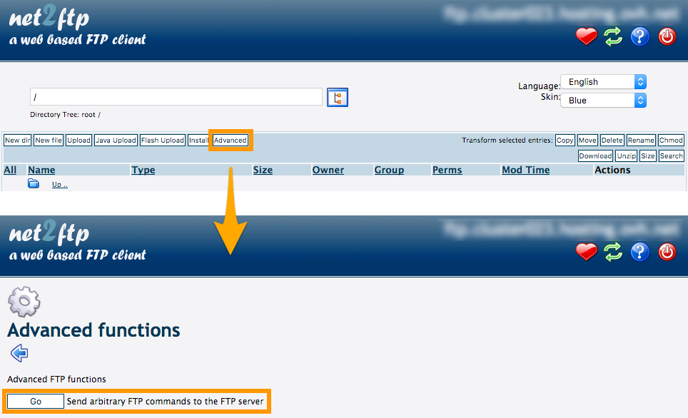
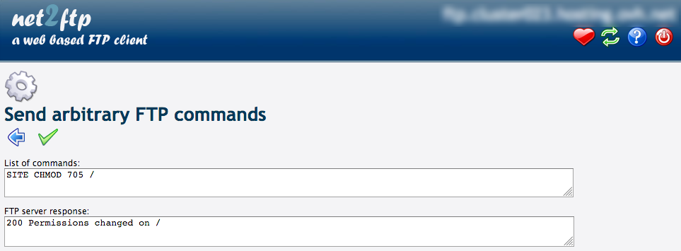

**Last updated 18th Febuary 2019 **

## Objective

Your Web Hosting plan allows you to upload one or more websites. You may have received a message from OVH informing you that a security action had just been taken on your service. This could render your websites inaccessible, or limit some of their features. However, this action is performed only in the event that a suspicious, and usually malicious, activity has occurred on your Web Hosting plan. 

**Understand common security practices and learn how to react if your hosting is disabled.**

## Requirements

- an [OVH Web Hosting plan](https://www.ovh.co.uk/web-hosting/){.external}
- the permissions necessary to connect to your hosting plan’s storage space
- access to the [OVH Control Panel](https://www.ovh.com/auth/?action=gotomanager){.external}

## Instructions

There is a wide range of websites online today. Whether based on a turnkey solution (e.g. a CMS, such as WordPress) or on a structure that you have customised (i.e. coded by yourself or by someone else), the technologies used in them evolve over time. 

**A website must therefore be periodically updated**, which will have the effect of changing its code. These changes may contain new features and stability improvements, but also security patches, in order to avoid potential vulnerabilities.

A website can have one or more security vulnerabilities. Unfortunately, there are many ways in which this can occur. These breaches do not allow hackers to access servers, but they can compromise hosted data and, in turn, compromise the stability of your infrastructure, in the event of a massive exploitation.

When this happens, a hacker can use your hosting for malicious purposes, such as sending a large number of spam emails, or hosting a fraudulent site. Even though such actions are not authorised by you, they can still take place if your website has a security breach. 

As a result, for your security and that of all our customers, your hosting or some of its features may be temporarily disabled. When this happens, several actions must be undertaken to resolve this situation. Although there is no universal procedure to follow, this documentation will guide you through a typical process. 

> [!warning]
>
> This guide does not replace the support of a professional, such as a webmaster. We recommend enlisting the services of a specialist provider and/or contacting your solution’s software publisher if you encounter any difficulties. We will not be able to assist you ourselves.
>

### Step 1: Assess the situation

Before you start modifying anything on your website, make sure you understand what happened. To achieve this, you will find below several steps to help you in your analysis. 

#### 1.1 Take note of OVH’s message

You should have received a message from OVH, informing you that an action related to the security of your hosting has been undertaken. Then take note of the information set out here. Its content will vary, depending on the specifics of your case. It is not possible to reference every possibility in this documentation. However, these elements will tell you:

- exactly when the deactivation took place
- the reason the deactivation was undertaken

This information may help you in your future research and modifications.

#### 1.2 Assess the security of your site

Whether you use a website based on a turnkey solution or a structure that you have customised, **it must be regularly updated**. 

This is especially true for CMSs (like WordPress), since these are highly customisable, with various themes, add-ons, and plugins. Even if these have a practical side, they can modify or add code to your site, the origin and security level of which you do not know.

So, ask yourself the following questions: 

- **Have you recently updated your website?** 

This may involve updating the site itself (by yourself or your webmaster), a theme, or an add-on. If this is not the case, your site may have a security vulnerability, which could be solved by an update you have not installed yet. 

With this in mind, it is advisable to check if your site and the additional elements installed on it are up to date, and apply any necessary upgrades.

- **Have you recently added a new theme or add-on to your website?**

If this is the case, it is possible that it has a known security vulnerability that has already been exploited by hackers. Bear in mind that this is simply a possibility: the newly-installed element will not necessarily be the cause.

However, it is still advisable to ensure, in the next step, that the various additional elements on your site are secure, and have a good overall online reputation.

#### 1.3 Check hosting activity and access logs

This provides you with full visibility of your service and sites’ activities. The goal is to analyse what happened when the deactivation of your hosting took place.

To view your hosting activity and logs, log in to the [OVH Control Panel](https://www.ovh.com/auth/?action=gotomanager){.external}, and open the `Web`{.action} section. Click `Web Hosting`{.action} in the services bar on the left-hand side, then choose the Web Hosting plan concerned. There are two options here, depending on the specific information you want to collect.

- **View your hosting activity**

You can view your service’s activity, broken down by days, weeks or months. This way, you can see if any unusual activity has taken place, and take action before OVH detects it and disables your hosting. 

To access to it, go to the `General Information`{.action} tab, then scroll down the page to the `Hosting Activity` section.

{.thumbnail}

- **View your hosting logs**

You can access your service’s detailed logs, including any web requests initiated on it. This can help you identify the file(s) that allowed a hacker to use your hosting for malicious purposes. This analysis is often very difficult, since it is quite technical in nature. Get help from a webmaster, if necessary.

To access the logs, click on the `More +`{.action} tab, and then on `Statistics and logs`{.action}. Use the information displayed to connect to your hosting plan’s log site. 

{.thumbnail}

Then check the "web" logs on the relevant date (either when the deactivation took place, or when the unusual activity started).

Start at either of these times, then gradually widen the search field to earlier schedules. The goal is to identify any unusual or anomalous activities, which usually come from "POST" requests. As before, this analysis can be very difficult because of its complexity. Get help from a webmaster, if necessary.

### Step 2: Make the necessary changes on your website

Once you have more information about what happened, you should be able to make the necessary changes on your website or, at a minimum, have a clearer idea of what to do. 

This step involves two complementary changes:

- **Fixing the security breach(s)**. This will prevent anyone from being able to exploit them again.

- **The removal of any malicious code**. A hacker could use a security breach to file code, such as a backdoor, on your website without your knowledge. This gives them hidden access to your site and your hosting. You must check if malicious code has been added, and delete it if necessary.

> [!warning]
>
> Both these changes are complementary.
> 
> If you fix the security vulnerability without removing the malicious code on your hosting, the hacker will still have hidden access to it. They means they can always exploit it for criminal purposes.
>
> Similarly, if you remove the malicious code without fixing the security breach, the hacker could exploit it to replace the malicious code on your hosting. They could even create a new backdoor.
>

There is no universal procedure to follow for implementing these changes, as each case is different. You will find below several actions that may prove effective. Use and adapt them to suit your specific case. As a reminder, we recommend enlisting the services of a specialist provider and/or contacting your service’s software publisher if you encounter any difficulties. 

#### 2.1 Restore your website, using a backup

This allows you to revert your site to its state when a backup was created. You must therefore have created a backup that does not already contain malicious code, which would render the process ineffective. 

> [!warning]
>
> Restoration only allows you to remove any malicious code added to your hosting  without your knowledge. **It will not fix any security breaches**.
>

There are several ways to restore your site:

- **If you have a personal copy of your website**: 

All you have to do is restore it on your hosting, replacing the contents of the storage space and the database with that of the backup. Our guide to [Importing a backup into a Web Hosting Plan database](../web_hosting_guide_to_importing_a_mysql_database/){.external} explains more about this process.

- **If OVH has a copy of your website (storage space and database)**:

Depending on the date you want to revert your site to, OVH may be able to provide you with a backup. Refer to our guides to [Restoring your Web Hosting plan’s storage space](../restoring-ftp-filezilla-control-panel/){.external}, [Retrieving the backup of a Web Hosting plan database](https://docs.ovh.com/gb/en/hosting/web_hosting_database_export_guide/){.external}, and [Importing a backup into a Web Hosting plan database](../web_hosting_guide_to_importing_a_mysql_database/){.external} if you require assistance with this process. Also, make sure that (wherever possible) you match the dates of the selected backups.

- **If neither you or OVH has a copy of your website**: 

In this case, you will have to make the necessary corrections [by manually changing the code of your site](./#23-manually-fix-your-sites-code){.external}. 

#### 2.2 Update your website

This process may seem simple, but there are still some technical elements are to be considered. Before making any updates, make sure you have access to your website. 

> [!primary]
>
> If the action taken by OVH has rendered your site inaccessible, you will not be able to update it immediately. If this is the case, first complete step 3, [Reactivate your Web Hosting plan](./#step-3-reactivate-your-web-hosting-plan_1){.external}, to regain access to your site. Once this is done, you will be able to carry out the updates.
>

Log in to your website’s administration interface (not the OVH Control Panel). Use this to check if:

- your website is up-to-date
- every theme and add-on/plugin installed is up-to-date

If this is not the case, you will need to update them. To do this, follow the instructions in your site’s administration interface. 

> [!warning]
>
> **Before beginning this process, we strongly suggest that you read any recommendations regarding the update that you are about to make**. These recommendations come directly from the software publisher and/or creator of the website, themes and add-ons that you use.
>

These can highlight elements that may block the update that you are about to make. For example:

- Make sure that the current version of your CMS (WordPress, for example) is compatible with the PHP version set up on your hosting. If you need to change it, refer to our guide to [Changing a Web Hosting Plan’s PHP version](../how_to_configure_php_on_your_ovh_web_hosting_package_2014/){.external}
- Make sure your themes and add-ons are compatible with the current version of your CMS. If this is not the case, you will no longer be able to use them and will have to find suitable alternatives.

#### 2.3 Manually fix your site’s code

If you do not use a turnkey solution-based site (such as a CMS as WordPress), or if you do not have a backup copy of it, you will need to make the necessary corrections manually. **As this process is extremely technical, we recommend that you seek the assistance of a specialist.** 

There is no universal procedure to follow, as each case is different. You can, however, use your hosting’s logs to more easily locate infected file(s) that will require action.

### Step 3: Reactivate your Web Hosting plan

In order to reactivate your Web Hosting plan, you have to make changes to your storage space. To do so, you must change the permissions (or rights) for "705" of the root (considered to be the "/") of your storage space.

> [!primary]
>
> If the message you have received from OVH explicitly states that you do not have the option of reactivating your hosting yourself, follow the instructions in this guide.
>

If you are able to reactivate your Web Hosting plan yourself, please have ready the information needed to connect to your storage space (i.e. FTP server, FTP user and password).

To retrieve them, log in to the [OVH Control Panel](https://www.ovh.com/auth/?action=gotomanager){.external}, and click `Hosting Plans`{.action} in the services bar on the left-hand side. Select the name of the hosting plan concerned, and click on the `FTP - SSH`{.action} tab. On this page, you can [change the password of the FTP user](../modify-ftp-user-password/){.external}, if necessary.

{.thumbnail}

As soon as you have the required information, you have several options, depending on the software or web interface you want to use.

#### 3.1 Reactivate  your hosting with FileZilla

Open your FileZilla software, and log in to your storage space. Then click `Server`{.action} in the menu bar, and then click `Enter custom command`{.action} (the title may be slightly different depending on which version of FileZilla you are using). In the window that opens, enter and validate the command below:

```
SITE CHMOD 705 /
```

An "ok" answer should confirm that the change was successful. To check, try to access your website. If you need to update it, return to the [2.2 Update Your Website](./#22-update-your-website){.external} section of this guide.

{.thumbnail}

#### 3.2 Reopen your hosting with FTP Explorer (net2ftp")

In the `FTP - SSH`{.action} tab of the OVH Control Panel, click the `FTP Explorer`{.action} button and connect to your storage space. Click the `Advanced`{.action} button, then the `Go`{.action} button, next to "Send arbitrary FTP commands to the FTP server".

{.thumbnail}

At the top of the page, enter the command below and click on the green "v" button: 

```
SITE CHMOD 705 /
```

You should receive confirmation that the change has been successful. To check, try to access your website. If you need to update it, return to the [2.2 Update Your Website](./#22-update-your-website){.external} section of this guide.

{.thumbnail}

#### 3.3 Reactivate your hosting in SSH

Log in to your storage space via an SSH connection. Enter and validate the command below:

```
chmod 705 .
```

You can verify that the rights are now correct with the following command:

```
ls -la
```

You can also try to access your website. If you need to update it, return to the [2.2 Update Your Website](./#22-update-your-website){.external} section of this guide.

### Step 4: Ensure the security of your site

Now that your website no longer has a security vulnerability or malicious code, it's important to ensure it stays safe. To do this, we recommend:

- applying regular updates (including themes and add-ons)
- installing trusted content. The more you customise a site by installing themes and add-ons, the more you edit or add code to it. Be attentive to any rating or reputation systems, which can include feedback from users.

Ultimately, the goal is to be more vigilant about what you install on your site, and ensure it is regularly updated.

## Go further

Join our community of users on <https://community.ovh.com/en/>.