## Systeme anti-hack OVH

### Généralités
Il faut que vous sachiez que si votre site a été fermé, ce n'est nullement dans le but de vous punir, mais plutôt dans celui de vous protéger, car vous êtes également une victime.

*Si une faille non-critique est repérée, un délai vous est accordé pour corriger la faille de sécurité avant que votre site soit fermé. Certaines fonctionnalités de votre site pourront être désactivées. Par exemple l'envoi d'emails, ou les connexions sortantes de votre site web.*

On peut penser qu'il nous suffirait de couper le programme ou le script infecté pour que le problème soit réglé... L'expérience montre que lorsqu'une faille est trouvée sur un site web, les hacks se font plus fréquents et généralement plus agressifs. Notre système surveille régulièrement l'état du serveur, cependant il peut suffire de quelques secondes à un pirate(Hacker) ou un robot(Bot) pour causer des dommages importants sur votre site ou sur les serveurs.

Par conséquent, il vous est demandé de [trouver la faille et de la corriger avant toute réouverture](#corrections_reperer_et_corriger_la_faille_de_securite){.external}.

*Notre système coupe tous les programmes apparentés à des hacks ainsi que si le hacker a laissé une* [backdoor*](#information_utile_lexique){.external} *lui permettant de se reconnecter très facilement. Nous empêchons ainsi le hacker/bot de poursuivre ses opérations.*


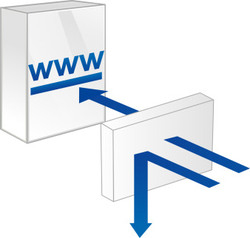{.thumbnail}

Dans ce genre d'attaque, le pirate n'a pas récupéré votre mot de passe et ne s'est pas introduit sur nos serveurs.

Il a simplement profité d'une faille au niveau du code de votre site pour exécuter du code en passant par celui-ci. Aucune mesure de sécurité à notre niveau ne permet de bloquer directement ce genre d'attaque.

*Nous pourrions, il est vrai, limiter les possibilités offertes aux scripts hébergés sur nos serveurs afin de rendre ce genre de choses impossibles, mais ce genre de mesures auraient un effet secondaire : cela vous empêcherait d'utiliser certaines possibilités très intéressantes offertes par des langages tels : PHP, perl et python et compliquerait de façon générale la création de vos sites.*

Par conséquent, nous avons choisi de vous offrir le plus de liberté possible et de contrôler en aval les problèmes éventuels afin de garantir la sécurité de votre site et de couper court aux tentatives de piratage.


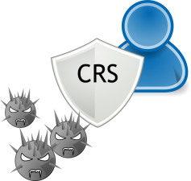{.thumbnail}

- Blocage de mon site par Okiller.

Un robot de surveillance nommé Okiller vérifie les commandes apparentées à du hack.

*Vous êtes notifié par email lorsqu'une commande réalisée sur votre serveur mutualisé est apparentée à du hack.*

Un horodatage est disponible afin de vérifier vos logs. Okiller bloque habituellement votre site en chmod 700.

- Blocage ou désactivation de mon site par la team Abuse.

Une équipe au sein d'OVH s'occupe exclusivement de garantir la sécurité de notre infrastructure.

*Elle peut être amenée à bloquer ou désactiver votre site en cas de hack, si du phishing ou du spam ont été réalisés avec votre hébergement à votre insu par exemple.*


## Corrections

### Reperer et corriger la faille de securite
- Si vous utilisez un système populaire comme WordPress, Joomla!, PrestaShop.

Sur ce type de systèmes très populaires, les concepteurs font régulièrement des mises à jour comblant des failles de sécurité repérées par les utilisateurs.

Mettez donc votre système à jour sur la dernière version et veillez à vous tenir informé des futures mises à jour en vous abonnant à la mailing-list du site officiel par exemple.

Si vous utilisez déjà la dernière version, n'hésitez pas à aller sur les forums officiels pour faire part de cette intrusion et la signaler ainsi aux concepteurs qui ne manqueront pas de proposer rapidement un correctif que vous pourrez appliquer.

Les plugins, thèmes ou modules ajoutés au CMS peuvent aussi présenter des failles de sécurité. Il est important de réaliser les mises à jour de ces différents outils afin de vous assurer d'une sécurité optimale pour votre site.


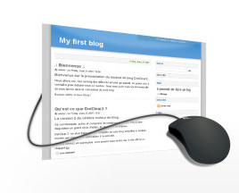{.thumbnail}

- Recherche de la faille de sécurité dans vos logs

Il n'est pas possible de faire une procédure détaillée permettant de localiser à coup sûr l'origine de toute intrusion, mais voici comment procéder de façon générale, en s'appuyant sur le fait que l'attaque a pour origine la faille d'un script et donc que le pirate est passé par une requête HTTP.

Toutes les requêtes HTTP sont disponibles dans vos logs.

Pour y accéder, rendez-vous sur votre espace client, cliquez sur votre  **hébergement**  à gauche dans la partie  **Hébergement** . Dans les infos générales de votre hébergement, cliquez sur l'onglet " **Plus +** ", puis sur cliquez sur " **Statistiques et logs** ".


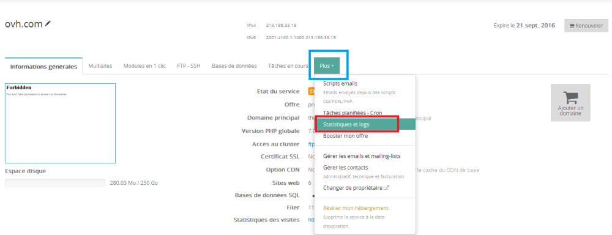{.thumbnail}

Cliquez ensuite sur le  **deuxième lien** .


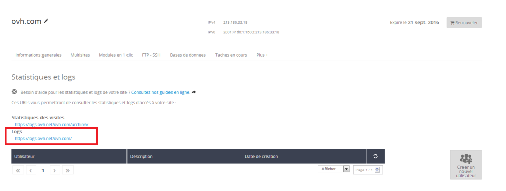{.thumbnail}

*Un guide est disponible concernant l'accès aux logs :* []({legacy}1344){.ref}

- 1 Relevez la date et l'heure du mail d'alerte que vous avez reçu ;
- 2 Consultez vos logs en partant de cet horaire et en élargissant progressivement le champ de recherche sur des horaires antérieurs jusqu'à repérer une entrée incorrecte (étrange, différente des autres, etc.). Cela peut demander un peu de pratique ou de connaissance du format des requêtes suivant les cas. Prêtez plutôt attention aux requêtes de type POST, qui sont la principale source de hack ;
- 3 Relevez le script attaqué par cette requête ;
- 4 Étudiez le script pour y localiser la faille ;
- 5 Corrigez la faille.


{.thumbnail}

**Important** :


> [!alert]
>
> Pour cela il faut vous rapprocher d'un professionnel WebMaster.
> Nous vous invitons à consulter la liste de nos partenaires : https://partners.ovh.com/.
> 


## Reouverture de l'hebergement

### Généralité
Il existe plusieurs cas pour un site hack :

- Passage en état Désactivé associé au CHMOD 700.
- Passage en état Bloqué lié au CHMOD 000.

Dans les deux cas il est demandé de corriger la faille de sécurité et pas simplement de supprimer le code malveillant qui aurait été ajouté par le hacker.


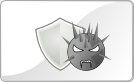{.thumbnail}

**Important** :


> [!alert]
>
> Pour cela il faut vous rapprocher d'un professionnel WebMaster.
> Nous vous invitons à consulter la liste de nos partenaires : https://partners.ovh.com/.
> 


### Reouverture suite passage en etat Desactive
Les étapes liées au passage en état hack :

- 1 Notre robot Okiller repère une commande non autorisée sur l'hébergement, ou une personne de la team abuse traite un abus lié à l'hébergement ;
- 2 Un email est envoyé afin de vous prévenir qu'un blocage va être réalisé ;
- 3 Modification de l'état de l'hébergement réalisée après quelques heures en fonction de la raison du blocage ;
- 4 Vous devez supprimer les fichiers malveillants et corriger la faille de sécurité ;
- 5 Il vous est possible de rouvrir directement l'hébergement (suivez les indications renseignés [en fin de ce
guide](#informations_utiles_reouverture_via_filezilla){.external} ).


{.thumbnail}


> [!success]
>
> - Si aucune correction n'est réalisée et que l'hébergement est rouvert
> manuellement, il sera de nouveau clôturé sous quelques heures et
> pourra être basculé en état désactivé.
> - Il est conseillé de répondre à l'email reçu dans la section
> assistance de votre espace client afin de préciser les modifications
> réalisées pour corriger le problème.
>
<a name="Reopen"></a>

### Reouverture suite passage en etat Bloque
Les étapes liées au passage en état hack :

- 1 Une personne de la team abuse traite un abus lié à l'hébergement ;
- 2 Un email est envoyé afin de vous prévenir qu'un blocage va être réalisé ;
- 3 Modification de l'état de l'hébergement réalisé après quelques heures en fonction de la raison du blocage ;
- 4 Vous devez obligatoirement contacter notre support en répondant sur l'email ouvert afin de demander à débloquer l'hébergement et expliquer les modifications qui vont être réalisées ;
- 5 Suite à votre retour sur l'email, notre support peut modifier l'état de votre hébergement en état hack s'il estime que les modifications que vous allez apporter sont suffisantes ;
- 6 Vous devez supprimer les fichiers malveillants et corriger la faille de sécurité ;
- 7 Il vous est possible de rouvrir ensuite l'hébergement (suivez les indications renseignées [en fin de ce
guide](#informations_utiles_reouverture_via_filezilla){.external} ) il reste préférable de répondre sur l'email afin que les administrateurs s'assurent que la modification réalisées soit suffisantes.


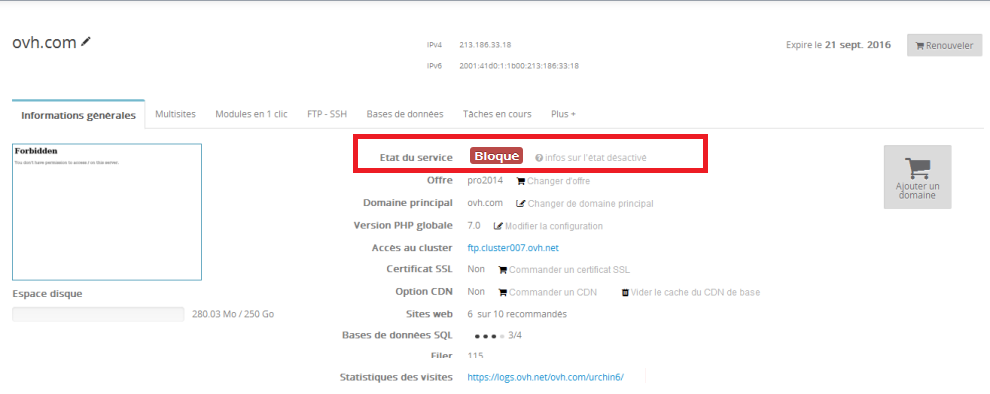{.thumbnail}


> [!success]
>
> - Il est obligatoire de répondre à l'email ouvert et de préciser les
> modifications qui seront réalisées afin que l'état de votre
> hébergement soit modifié et que vous puissiez effectuer la correction
> de votre site web.
>

### Attention
**Une fois les droits passés en 705, il vous faudra patienter maximum 3 heures.**  En effet, nos robots passent toutes les 3 heures pour vérifier les changements d'état. En fonction du moment où la manipulation sera faite, le rétablissement de l'affichage de votre site pourra donc être plus ou moins rapide.

Si le délai des 3 heures est passé et que votre site n'est toujours pas en ligne, veuillez contacter notre support.


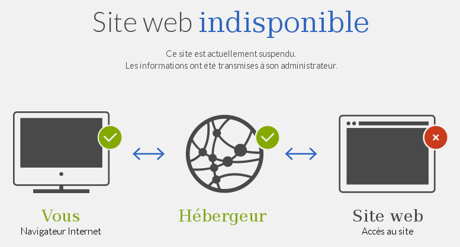{.thumbnail}

<a name="Information"></a>

## Informations utiles

### Precautions a prendre
Voici quelques précautions à prendre afin d'éviter au maximum les attaques : 1-  Quand vous installez votre blog, boutique en ligne, le login par défaut est "admin". Dans la mesure du possible, changez "admin" par autre login. Mais attention, il faut être sûr que cela n'impacte pas votre site. Posez la question sur le forum de l'éditeur de votre cms.

2- Ne jamais utiliser le même mot de passe pour le FTP, base SQL, email, interface d'administration du site web. Utiliser un mot de passe contenant : chiffre, lettre et des majuscules/minuscules.

3- Penser à réaliser régulièrement vos propres sauvegardes FTP et SQL.

4- Effectuer les mises à jour de l'éditeur de votre cms (Wordpress, Joomla!, Prestashop).


### Bloquer une IP
Suggestion pour améliorer la sécurité :

Une première solution peut être de bloquer l'IP de l'attaque, mais il s'agit d'une solution temporaire, étant donné qu'un autre attaquant pourrait profiter de la même faille.

Pour savoir comment bloquer une IP sur votre site : [.htaccess Protection IP](http://guides.ovh.com/HtaccessProtectIP){.external}. Interdiction à l'aide d'un fichier .htaccess

Exemple:


```bash
SetEnvIf GEOIP_COUNTRY_CODE DE BlockCountry
SetEnvIf GEOIP_COUNTRY_CODE RU BlockCountry
# ... place more countries here
Deny from env=BlockCountry
```

Cet exemple vous permet de bloquer les visiteurs en provenance d'Allemagne et de Russie.


### Reouverture via FileZilla
Votre site a été fermé pour une opération répréhensible, hack ou phishing.

Vous avez toujours accès à votre FTP pour que vous puissiez corriger les problèmes.

Vous pouvez par exemple rendre inactives les pages mises en causes (mettez-les en droits/permissions "700" via FTP pour ce faire) le temps d'intervenir.

Une fois la source du problème corrigée, remettez les bons droits/chmod en 705 sur la racine du FTP pour rétablir l'accès.

- Récupérez votre identifiant et le mot de passe FTP qui vous permettent de vous connecter sur l'hébergement web.
- Avoir un logiciel ftp ou client ftp, par exemple FileZilla

[]({legacy}1380){.ref} Ouvrez FileZilla, cliquez sur "Serveur" puis sélectionnez "Entrez une commande FTP".

*Dans FileZilla à la place de "Entrez une commande FTP" il est possible d'avoir "Saisir une commande personnalisée".*


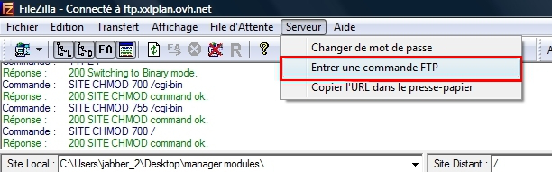{.thumbnail}

Dans la nouvelle fenêtre qui apparait, renseignez la commande :


```bash
SITE CHMOD 705 /
```

Si vous obtenez l'erreur suivante :

**550 would not chance perms on /. not such file or directory**

Il vous faut dans ce cas utiliser la commande :


```bash
SITE CHMOD 705 .
```

*Pour vérifier que la réouverture est bien effective, testez tout simplement votre site depuis un navigateur internet.*


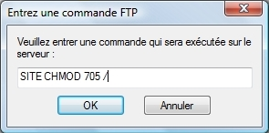{.thumbnail}


> [!alert]
>
> Pour rappel, veillez à tester l'affichage après 3 heures maximum. En effet,
> nos robots passent toutes les 3 heures pour vérifier les changements d'état.
> En fonction du moment où la manipulation ci-dessus sera réalisée, le
> rétablissement de l'affichage de votre site pourra donc être plus ou moins
> rapide.
> Si le délai des 3 heures est passé et que votre site n'est toujours pas en
> ligne, veuillez contacter notre support.
> 


### Reouverture via Net2Ftp
Il vous est aussi possible d'utiliser l'explorateur FTP intégré dans l'espace client " **Net2Ftp** ".

Vous avez un accès à votre FTP pour que vous puissiez corriger les problèmes de votre site web.

Une fois la source du problème corrigée, remettez les bons droits/chmod en 705 sur la racine du FTP pour rétablir l'accès.

- Récupérez votre identifiant et le mot de passe FTP qui vous permettent de vous connecter sur l'hébergement web.

Connectez-vous dans l'espace client, sélectionnez votre plateforme, puis rendez-vous dans "FTP" puis cliquez sur "FTP Explorer". Vous arrivez ensuite sur l'interface de connexion de " **Net2ftp** ".

Dans le champ "Nom d'utilisateur" renseignez votre login FTP.

Dans le champ "Mot de passe" le mot de passe défini dans votre espace client.

Cliquez ensuite sur "Soumettre" pour vous connecter en FTP à l'hébergement web.


{.thumbnail}

Rendez-vous ensuite dans "Avancé".


{.thumbnail}

Sélectionnez "Go" pour entrer une commande FTP personnalisée.


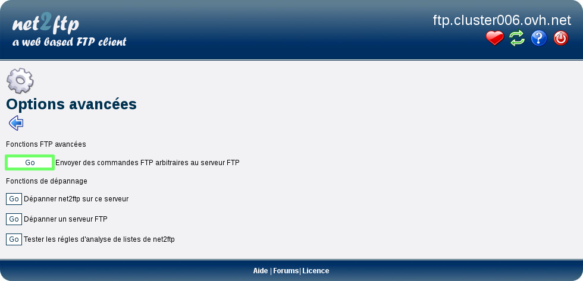{.thumbnail}

Vous devez renseigner le code suivant dans *liste des commandes* :


```bash
SITE CHMOD 705 /
```

Validez en cliquant sur l'icône pour exécuter votre commande FTP.

*Pour vérifier que la réouverture est bien effective, testez tout simplement votre site depuis un navigateur internet.*


{.thumbnail}


> [!alert]
>
> Pour rappel, veillez à tester l'affichage après 3 heures maximum. En effet,
> nos robots passent toutes les 3 heures pour vérifier les changements d'état.
> En fonction du moment où la manipulation ci-dessus sera réalisée, le
> rétablissement de l'affichage de votre site pourra donc être plus ou moins
> rapide.
> Si le délai des 3 heures est passé et que votre site n'est toujours pas en
> ligne, veuillez contacter notre support.
> 


### Reouverture via SSH
- Récupérez votre identifiant et le mot de passe FTP qui vous permettent de vous connecter sur l'hébergement web.
- Avoir une offre permettant l'accès via SSH ( [voir les
caractéristiques de nos
offres](https://www.ovh.com/fr/hebergement-web/){.external} )
- [Connexion ssh mutualisé](http://guide.ovh.net/SshMutualise){.external}

Dans un premier temps vérifiez que votre site est bien fermé avec la commande :


```bash
ls -la
```


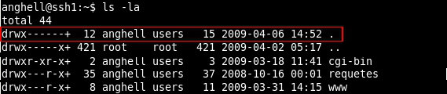{.thumbnail}

Pour procéder à la réouverture, tapez la commande :


```bash
chmod 705 .
```


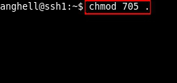{.thumbnail}

Pour vérifier que les droits sont corrects tapez la commande :


```bash
ls -la
```


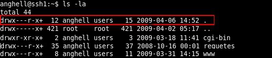{.thumbnail}


> [!alert]
>
> Pour rappel, veillez à tester l'affichage après 3 heures maximum. En effet,
> nos robots passent toutes les 3 heures pour vérifier les changements d'état.
> En fonction du moment où la manipulation ci-dessus sera réalisée, le
> rétablissement de l'affichage de votre site pourra donc être plus ou moins
> rapide.
> Si le délai des 3 heures est passé et que votre site n'est toujours pas en
> ligne, veuillez contacter notre support.
> 


### Lexique
Backdoor* : *une porte dérobée (backdoor en anglais) est une fonctionnalité ajoutée à l'insu du développeur du site web, qui donne un accès masqué au site, ainsi qu'à l'hébergement. Il est généralement ajouté par un hacker après avoir repéré une faille de sécurité sur votre site.*