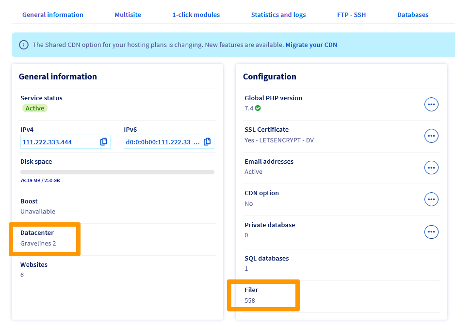
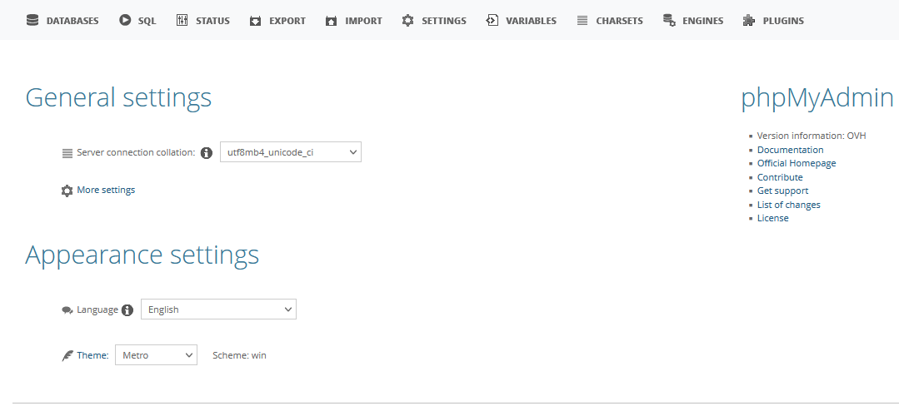

**Last updated 17th November 2022**

## Objective

A slowdown on your site results from an excessively long load to display all or certain parts of your site. 

If the load is too long, the request made from your browser can then reach the maximum execution time allowed by the server where your hosting is located. In this case, the server returns the code **504 Gateway Timeout** to notify the visitor that the variable max_execution_time has been reached, which also stops the execution of the requested request.

The slowness has mainly two origins:

- an overload on the shared infrastructure on which your website is hosted
- a request too long or too heavy to execute on the shared infrastructure where your site is hosted. 

The vast majority of delays are actually caused by the website and not its shared hosting. We have created this guide to help you in this situation.

In rare cases, the slow display may also be caused by your Internet service provider or by low Internet connection speeds. Check your network connectivity **before** you continue with your diagnostics.

**Find out how to diagnose the cause of your website's slowdowns, and take appropriate action.**

> [!primary]
>
> **Once you have completed all of the diagnostics listed in this guide**, if it turns out that the downtime has come from our hosting infrastructure, we remind you that it is shared between several users.
>
> Users share the resources of the shared hosting infrastructure to make their websites work. If one of them overloads the shared infrastructure, this can have consequences for the other hosting services on the same infrastructure.
>
> Our shared hosting plans do not have a Service Level Agreement (SLA). 
>
> If you need a service with an SLA availability rate higher than 99%, we recommend that you consider using a [Virtual Private Server (VPS)](https://www.ovhcloud.com/fr/vps/) or [Dedicated Server](https://www.ovhcloud.com/fr/bare-metal/).
>
> Furthermore, the performance of OVHcloud's shared hosting infrastructure is monitored 24/7. This is to guarantee you high availability, and where applicable, quick recovery of your services in the event of a proven overload.
>

## Requirements

- Have a website hosted on one of our [OVHcloud shared hosting] offers(https://www.ovhcloud.com/fr/web-hosting/)
- Log in to your [OVHcloud Control Panel](https://www.ovh.com/auth/?action=gotomanager&from=https://www.ovh.com/fr/&ovhSubsidiary=fr)

## Instructions

> [!warning]
>
> OVHcloud provides services that you are responsible for with regard to their configuration and management. It is therefore your responsibility to ensure that they function properly.
> 
> This guide is designed to help you with common tasks. Nevertheless, we recommend contacting a [specialist provider](https://partner.ovhcloud.com/fr/) if you encounter any difficulties. We will not be able to provide you with assistance **as long as it is not the infrastructure where your shared hosting offer is present**. You can find more information in the ["Go further"](#go-further) section of this guide.
>

> [!success]
>
> We recommend noting your diagnostic results as you progress in this guide. Indeed, these results will prove very useful for solving your situation, whatever the cause of the slowness.
>

### Understand the notion of Time To First Byte (TTFB)

*Time To First Byte* (TTFB) is the time it takes for your Web Hosting plan to send the first byte of data back to your browser, following a request made by your browser to display your website.

When there is no overload on the shared hosting infrastructure and your website is optimised to the maximum, the TTFB does not exceed 800ms.

**A high TTFB does not automatically mean that your latency comes from your shared hosting.**

For Content Management Systems (CMS) such as WordPress, Joomla!, PrestaShop or Drupal, the page you call from your internet browser can generate additional requests internally on your hosting. Your web hosting plan will not send anything back to your browser until these internal requests are finalised.

> **Example**:
>
> From your Internet browser, you ask to display the home page of your website. The request will therefore call your website’s "**index.php**" file by default.
>
> Once the request has been placed in the "**index.php**" file, the request is then executed by the web server of your hosting plan. 
>
When it is run, the "**index.php**" file must retrieve information from the other files that make up your website, or even from elements in your database. 
>
>Each of these information requests generates an internal query about your hosting service. 
>
The file "**index.php**" will wait to receive the result of all internal requests it has made **before** returning the first byte of data to your web browser.
>
>If your "**index.php**" file generates slow or heavy queries, the TTFB will be high and your site will take several seconds to display. This does not affect the performance of your hosting plan.

Online diagnostic tools allow you to retrieve the TTFB of your hosting. However, most of them function as internet browsers and their results should therefore be relativized.<br>
These tools are not able to take into account the internal requests requested by the file you have called via your browser, as in the example above with the file "**index.php**".

### Step 1 - Determine if the delays are due to hosting or your website

In this first step, you can determine whether the delays are caused by:

- your website, either by its internal functioning
- the shared hosting infrastructure where your website is located.

All diagnostics in step 1 must be performed **without exception** to determine whether the slowdowns are caused by your web hosting services or the website you are hosting on them.

#### 1.1 - Check the status of your OVHcloud services

To ensure that your services (shared hosting **and** database) are not undergoing maintenance or an incident, retrieve the cluster information and filter it from your shared hosting as well as the general information relating to your database. You can then check their status at [status.ovhcloud.com](https://web-cloud.status-ovhcloud.com/).

To find out which cluster and filer your shared hosting is located in, log in to your [OVHcloud Control Panel](https://www.ovh.com/auth/?action=gotomanager&from=https://www.ovh.com/fr/&ovhSubsidiary=fr), go to the `Web Cloud`{.action} section, click on `Hosting`{.action} then select the web hosting plan concerned. In the `General information`{.action} tab, locate your web hosting plan's `datacentre` and his `filer`.

{.thumbnail}

Then click on the `Multisites`{.action} tab to retrieve the cluster number where your shared hosting is located.

{.thumbnail}

> [!success]
>
> If an incident or maintenance is reported on the infrastructure on which your shared hosting is located, follow them until they are resolved by our administrators. **No further action is required at your level**.
>
> You can subscribe to the incident or maintenance declaration with your email address, in order to receive an email notification of the progress of the operations.
>
> Once the incident or maintenance status has been marked as **resolved**, the accumulated load stabilisation may require a maximum of **3 hours** after the resolution notification to fully resolve.
>

If no incidents or maintenance are reported, continue with your diagnostic.

#### 1.2 - Test the website on multiple devices

Test your website from another device/computer, then from another internet access point. Each time you try to do so, your browser cache will be emptied, so that your website loads directly from your web hosting plan.

#### 1.3 - Test hosting with a file independent from your website

Place a file called phpinfo.php at the root of your website in the [FTP storage space on your shared hosting](https://docs.ovh.com/fr/hosting/connexion-espace-stockage-ftp-hebergement-web/).

In this file, insert the following code:

```bash
<?php
phpinfo();
?>
```

> [!warning]
>
> In some cases, the "**.htaccess**" files in the upstream directories/folders or at the same level as where you placed your "**phpinfo.php**" file may affect the display of the **phpinfo.php** in an Internet browser. 
>
> Changes to a "**.htaccess**" file may affect your website’s display. Contact a [specialist provider](https://partner.ovhcloud.com/fr/) if you have difficulty in doing the following.
>
> If it does not appear and **only for informed users**, rename your files "**.htaccess**" to "**.htaccess_OLD**" so that the server does not run them for your test. Rename them correctly after your diagnostic.
>

**Example**: if your website’s domain name is “domain.tld” and the file “**phpinfo.php**” has been placed in the root directory of your website, you can access it via the following URL: `http://domain.tld/phpinfo.php` (or `https://domain.tld/phpinfo.php`).

> [!primary]
>
> If the call to the file **phpinfo.php*** displays a **instantly** configuration table, this means that the slowdowns do not come from the shared hosting where your website is located. Otherwise, this file will appear as slowly as your other pages. 
>
> In other words, if the delays are only present on some pages or content of your website, this means that the shared hosting **is not the cause of the delays** encountered on your website.
>

#### 1.4 - Test your database connectivity:

Log in to your database by following **step 3** in our guide to [creating a shared database](https://docs.ovh.com/fr/hosting/creer-base-de-donnees/).

If the connection is successful, you will land on the following interface:

{.thumbnail}

> [!warning]
>
> If you encounter an error, please refer to our documentation on [common errors encountered with a database](https://docs.ovh.com/fr/hosting/erreurs-frequentes-bases-de-donnees/). Then use the guide above to correct your situation, and try connecting to your database again.
>

#### 1.5 - Interpretation of diagnostics performed

**Case 1**

The following statements apply **all** to your situation:

- at least one page, script, or file (including the "**phpinfo.php**" file) loaded quickly during the tests in step 1
- the connection to your database was successful during the tests in step 1.

> This means that the delays you encounter come directly from the scripts that make up your website. You can skip directly to [step 2](#step2) to follow the optimisation tips to resolve your situation.

**Case 2**

The following statements apply **all** to your situation:

- **no incidents or maintenance** are reported, or have been reported as **resolved** less than three hours ago, for your web hosting services on our website [status-ovhcloud.com](https://web-cloud.status-ovhcloud.com/);
- the **case n°1** detailed above does not match your configuration.

> OVHcloud investigations will be necessary. Contact our Web Solutions Support Services to confirm with you the cause of the slowdowns you are experiencing.

### Step 2 - identify the source(s) that are causing the delays at your website <a name="step2"></a>

At this point, you now know that slowdowns are generated by the pages/scripts/files that make up your website.

> [!warning]
>
> If you have any difficulties taking the following actions, you can contact one of our [specialised service providers](https://partner.ovhcloud.com/fr/). OVHcloud cannot assist with developing and/or optimising the content on your website.
>

Below, you will find the actions you need to take to identify the source(s) of the slowdowns, and optimise your website.

#### 2.1 - Check your web hosting plan’s configuration

Check the PHP engine, PHP version and runtime environment used on your Web Hosting plan, using our guide to [configuring your Web Hosting plan](https://docs.ovh.com/fr/hosting/modifier-lenvironnement-dexecution-de-mon-hebergement-web/).

If you are using an outdated PHP version on your web hosting plan, the "**PHP CGI**" engine and/or the "**legacy**" environment, and **if your website is compatible**, you should use the "**PHP**" engine (PHP FPM), the "**stable**" environment, or "**stable64**" with the most recent PHP version possible.

To compare the available PHP versions depending on the runtime environment you are using, see **Step 2** in the guide on [configuring the PHP version on your hosting system](https://docs.ovh.com/fr/hosting/configurer-le-php-sur-son-hebergement-web-mutu-2014/).

Using a recent PHP version, the "**stable**" or "**stable64**" runtime environment with the "**PHP**" engine (PHP FPM) makes your website much smoother and faster. As a guide, the "**PHP**" engine (PHP FPM) can be up to 50 times more efficient than the "**PHP CGI**" engine to perform its tasks.

#### 2.2 - Analyse outgoing connections / TCP connections made by your web hosting plan

Outgoing connections are very resource intensive. When these connections are numerous, when they don’t execute correctly or when they stay active too long, they monopolise so many resources in your web hosting plan that there aren’t enough left to keep the rest of your website running normally. 

This results in slowdowns or even 504 gateway timeout codes.

To analyse outgoing connections to your hosting plan, please read its **OUT** logs. You can use our documentation on [your hosting system logs retrieval](https://docs.ovh.com/fr/hosting/mutualise-consulter-les-statistiques-et-les-logs-de-mon-site/).

If you notice that there are a lot of outgoing connections on your hosting, compare your **OUT** logs with your **WEB** logs by using their timestamps. This will help you identify the script(s) responsible for this situation.

If you are using a Content Management System (CMS) such as WordPress, Joomla!, PrestaShop or Drupal, identify the plugin(s) and/or theme generating this outgoing connection stream.

#### 2.3 - Analyse the flow of HTTP requests made to your web hosting plan:

To do this, please refer to your web hosting plan’s **WEB** logs using our guide on [how to view your hosting plan’s logs](https://docs.ovh.com/fr/hosting/mutualise-consulter-les-statistiques-et-les-logs-de-mon-site/).

The most resource-intensive requests are HTTP requests like **POST**, then HTTP requests like **PUT**. These files make changes and inserts, respectively.

HTTP requests like **GET** only retrieve elements from the hosting plan, and display them in your web browser. They are generally not resource intensive. However, they can cause slowdowns if several hundred are requested every second over a period of several minutes.

If you see any of the following in your logs:

- **POST** or **PUT** requests are made several times per minute and permanently;
- **POST** or **PUT** requests are executed several times per minute on the same file.

Identify and optimise the script/file in question to reduce the flow of HTTP requests.

The lower the number of requests, the less resources will be required for your shared hosting plan.

> [!success]
>
> To identify the long items to load on one of the pages of your website, for example, you can perform a network analysis using the **Firefox** browser. 
>
> To do this, press the `F12` key while you are on your Firefox browser and then select the `Network` tab. Reload your web page with the `Ctrl + Shift + R` keys so that the tool will show you the queries that were executed to load your page. Identify the longest elements to load and then optimise them.
>
>{.thumbnail}
>

To reduce the flow of requests each time your pages load, you can also set up a Content Delivery Network (CDN). This will cache the static content of your website. Your web hosting plan will receive fewer requests, and more resources for handling the rest of the requests that cannot be cached.

> [!primary]
>
> OVHcloud offers several [CDN offers](https://www.ovhcloud.com/fr/web-hosting/options/). If you would like to use or activate one for your web hosting plan, log in to your [OVHcloud Control Panel](https://www.ovh.com/auth/?action=gotomanager&from=https://www.ovh.com/fr/&ovhSubsidiary=fr) then read our guide on [Using the OVHcloud CDN](https://docs.ovh.com/fr/hosting/accelerer-mon-site-web-en-utilisant-le-cdn/).
>

#### 2.4 - optimise your database

> [!warning]
>
> The actions you carry out in your database can have irreversible consequences if they are not carried out methodically and correctly. Contact a [specialist provider](https://partner.ovhcloud.com/fr/) if you are unsure about what you need to do. 
>

Check to see if a significant number of queries are made to your database.<br>
This situation can lead to over-solicitation and slowdowns, or even 504 Gateway Timeout codes.

Also check the size of your tables in your database.<br>
If a table is called regularly and it is large, loading the table can be slower and result in slow queries.<br>
The accumulation of these slow requests can result in slow access to the site, or even a 504 Gateway Timeout code.

If you have large tables or large database query flows, optimise your tables and implement solutions to reduce query flows to your database.

If you find that your database contains unused or obsolete data, clean the database to improve daily performance.

#### 2.5 - Optimise your images

For example, if an image is present on your website in 1000x2000 resolution, and it is displayed in a maximum of 100x200 pixels on your website's page, this generates a resource consumption on the hosting side that can be optimised.

The server will need to resize the image, then display it at the requested size on the website.

If your website contains a lot of images, this may represent a significant resource consumption in terms of the resources allocated to your hosting.

Resize all of your images to minimise resource consumption.

#### 2.6 - Optimise the rest of your website

See our guide on [optimising performance for your website](https://docs.ovh.com/fr/hosting/optimisation-performances-site/).

You can find optimisation tracks for your site by analysing it at [gtmetrix.com](https://gtmetrix.com){.external} (this site is not affiliated with OVHcloud).

> [!success]
>
> Regardless of the slowness, the more optimised your website will be, the more it will improve its organic SEO ranking in search engines.

### Conclusion

If your web hosting plan and your **database are not affected** and your website continues to be slow, despite completing **all of the steps** in this guide, this probably means that the solution you are using to host your website is not or is no longer adapted to your needs. 

You might consider a higher [shared hosting offer](https://www.ovhcloud.com/fr/web-hosting/) or dedicated infrastructure such as a [Virtual Private Server (VPS)](https://www.ovhcloud.com/fr/vps/) or [Dedicated Server](https://www.ovhcloud.com/fr/bare-metal/). 

## Go further <a name="go-further"></a>

For specialised services (SEO, development, etc.), contact [OVHcloud partners](https://partner.ovhcloud.com/en-ca/).

If you would like assistance using and configuring your OVHcloud solutions, please refer to our [support offers](https://www.ovhcloud.com/en-ca/support-levels/).

Join our community of users on <https://community.ovh.com/en/>.