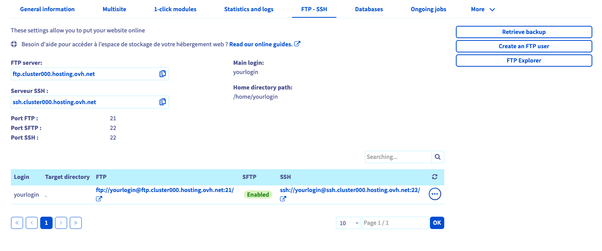
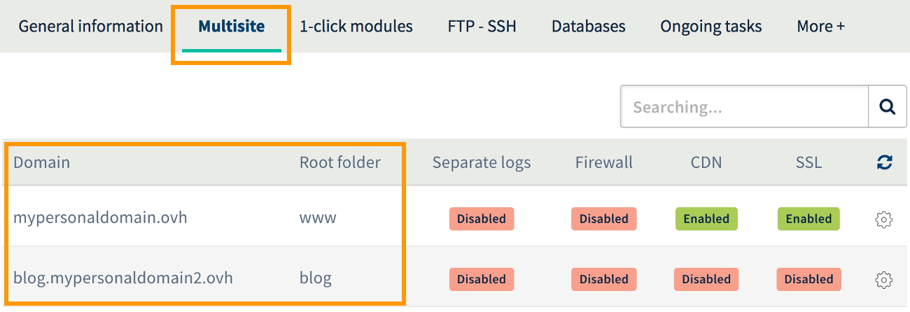
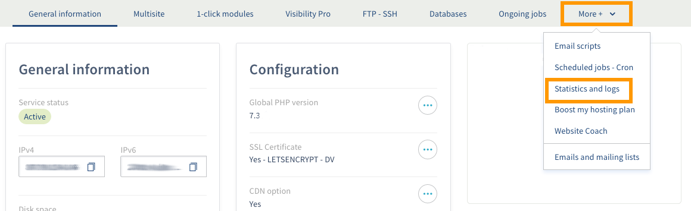

**Dernière mise à jour le 05/05/2020**

## Objectif

Ce guide vous présente les étapes pour exporter l’ensemble des éléments de votre site web au format standard, depuis un [hébergement web OVHcloud]({ovh_www}/hebergement-web/){.external}.

**Découvrez comment exporter votre site web OVHcloud.**

## Prérequis

- Disposer d'une [offre d'hébergement web OVHcloud]({ovh_www}/hebergement-web/){.external}.
- Être connecté à votre [espace client OVHcloud](https://ca.ovh.com/auth/?action=gotomanager){.external}.

## En pratique

### Étape 1 : récupération des fichiers de votre espace de stockage FTP

#### 1.1 Se connecter à l'espace de stockage.

Pour vous connecter à votre espace de stockage, vous devez être en possession des éléments suivants :

- l'utilisateur FTP ou SSH actif.
- le mot de passe associé à cet utilisateur FTP ou SSH.
- l’adresse du serveur.
- le port de connexion au serveur.

Ces éléments vous ont été communiqués dans l’e-mail vous notifiant l’installation de votre hébergement web. Si vous n’êtes pas en possession de ces derniers, connectez-vous à votre [espace client OVHcloud](https://ca.ovh.com/auth/?action=gotomanager){.external} dans la partie « Web », puis cliquez sur `Hébergements`{.action} dans la barre de services à gauche. Choisissez alors le nom de l'hébergement concerné, puis positionnez-vous sur l'onglet `FTP - SSH`{.action}. 

{.thumbnail}

Les informations liées à votre espace de stockage apparaissent alors. Vous devriez pouvoir retrouver les éléments requis pour vous connecter à celui-ci. Si nécessaire, nous vous invitons à consulter notre guide : [« Se connecter à l’espace de stockage de son hébergement web »](../connexion-espace-stockage-ftp-hebergement-web/){.external}. Si vous n'êtes plus en possession du mot de passe, reportez-vous aux instructions décrites dans notre documentation [« Modifier le mot de passe d’un utilisateur FTP »](../modifier-mot-de-passe-utilisateur-ftp/){.external}.

Une fois tous les éléments en votre possession, la récupération de vos fichiers sur l'espace de stockage peut s'effectuer de deux manières différentes :

- **utiliser un logiciel compatible avec le protocole FTP ou SFTP** : vous devrez installer un logiciel compatible sur votre ordinateur, comme [ FileZilla ](../mutualise-guide-utilisation-filezilla/). Nous vous invitons à vous rapprocher de l'éditeur du logiciel installé si vous souhaitez obtenir de l'aide sur son utilisation, OVHcloud n'ayant pas créé celui-ci ;

- **utiliser un accès SSH** : vous devrez utiliser des commandes depuis un terminal pour interagir avec votre espace de stockage. Des connaissances plus avancées, ainsi qu'une [offre d'hébergement web OVHcloud]({ovh_www}/hebergement-web/){.external} spécifique sont nécessaires pour utiliser ce type d'accès. Pour plus d'informations, vous pouvez consulter notre guide  [« Utiliser l’accès SSH de son hébergement web»](../mutualise-le-ssh-sur-les-hebergements-mutualises/){.external}. 

#### 1.2 Télécharger les fichiers depuis votre espace de stockage.

Une fois connecté à votre espace de stockage, il ne vous reste plus qu’à télécharger les fichiers de votre site. **Nous vous invitons à être particulièrement attentifs quant au répertoire sur lequel vous avez installé votre site.** Dans un cas d'utilisation classique, le site doit être téléchargé dans le dossier « www ». Cependant, si vous utilisez votre hébergement pour héberger plusieurs sites internet, vous avez sûrement déclaré plusieurs **Multisite**.

Pour vérifier le dossier dans lequel votre site internet est stocké, positionnez-vous sur l'onglet `Multisite`{.action} depuis votre espace client OVHcloud. Dans le tableau qui s'affiche, pour le domaine souhaité, regardez le `Dossier racine`{.action} qui s'affiche.

{.thumbnail}

### Étape 2 : récupérer la sauvegarde de votre base de données (facultative)

> [!primary]
>
> Cette étape est facultative si votre site web n’utilise pas de base de données.
>

Pour récupérer une sauvegarde de votre base de données, consultez notre guide :
[« Récupérer la sauvegarde de la base de données d’un hébergement web »](../exportation-bases-donnees/){.external}.

Si vous utilisez une base de données **SQL privé** pour votre site Web, consultez la section dédiée à la sauvegarde sur notre guide :
[« Tout sur le SQL privé »](../tout-sur-le-sql-prive/#sauvegarde-restauration-et-importation-depuis-lespace-client_1){.external}.

### Étape 3 : récupérer les logs de votre hébergement OVHcloud

Si vous souhaitez conserver l'historique des logs de votre site, un accès à ces derniers est disponible avec votre hébergement.

Cliquez sur `Hébergements`{.action} dans la barre de services située à gauche et sélectionnez l'offre concernée. Cliquez sur l'onglet `Plus +`{.action} puis sur`Statistiques et logs`{.action}.

{.thumbnail}

Cliquez ensuite sur le lien sous la mention **Logs** :

{.thumbnail}

Une fenêtre apparait avec les différents types de logs à disposition. Ils sont classés par mois :

| Type  	| Description                                                                                                                                                                                         	|
|-------	|-----------------------------------------------------------------------------------------------------------------------------------------------------------------------------------------------------	|
| Web   	| Trouvez ici les différents logs de consultation de votre site, ainsi que les différentes actions réalisées à partir de votre site. Cela vous permet par exemple de repérer des tentatives de hacks. 	|
| FTP   	| les différentes connexions FTP seront enregistrées et conservées dans ces logs.                                                                                                                     	|
| Error 	| les différentes erreurs générées par votre site.                                                                                                                                                    	|
| CGI   	| les différents appels aux scripts cgi.bin qui ont été réalisés.                                                                                                                                     	|
| out   	| les statistiques de votre hébergement sur les différents appels externes réalisés.                                                                                                                  	|
| ssh   	| ces logs indiquent les différentes connexions réalisées avec le protocole SSH.                                                                                                                      	|
| cron  	| le résultat de l’exécution de vos tâches planifiées.                                                                                                                                                	|

{.thumbnail}

Lorsque vous avez sélectionné le type de logs sur le mois qui vous intéresse, ces derniers sont archivés par jour :

{.thumbnail}

## Aller plus loin

[Se connecter à l’espace de stockage de son hébergement web](../connexion-espace-stockage-ftp-hebergement-web/){.external}.

[Modifier le mot de passe d’un utilisateur FTP](../modifier-mot-de-passe-utilisateur-ftp/){.external}.

[Utilisation logiciel FileZilla avec votre hebergement](../mutualise-guide-utilisation-filezilla/){.external}.

[Utiliser l’accès SSH de son hébergement web](../mutualise-le-ssh-sur-les-hebergements-mutualises/){.external}. 

[Récupérer la sauvegarde de la base de données d’un hébergement web](../exportation-bases-donnees/){.external}.

[Tout sur le SQL privé](../tout-sur-le-sql-prive/#sauvegarde-restauration-et-importation-depuis-lespace-client_1){.external}.

Échangez avec notre communauté d'utilisateurs sur <https://community.ovh.com>.
