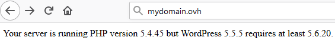
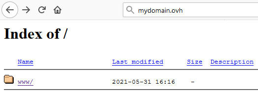
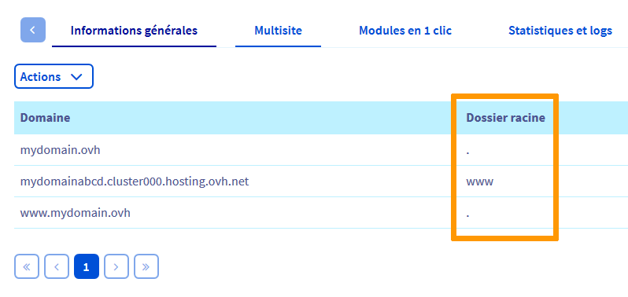

**Dernière mise à jour le 05/06/2021**

## FAQ hébergements web OVHcloud

### Configuration

#### Comment configurer mon hébergement ? 

Pour configurer votre hébergement, connectez-vous tout d'abord à votre [espace client OVHcloud](https://www.ovh.com/auth/?action=gotomanager&from=https://www.ovh.com/fr/&ovhSubsidiary=fr){.external}. Depuis la rubrique `Hébergement` vous pourrez notamment gérer vos certificats SSL, vos versions PHP, vos CDN, vos multisites, vos bases de données, ...

**Trucs et Astuces** : Pour vous aider à configurer votre hébergement, nous vous invitons à prendre connaissance de la rubrique   « Premiers pas » que vous retrouverez [ici](../).

#### Comment créer ou supprimer un élément sur mon produit/service (compte e-mail, base de données, ….) ?

Pour créer ou supprimer un élément, connectez-vous à votre [espace client OVHcloud](https://www.ovh.com/auth/?action=gotomanager&from=https://www.ovh.com/fr/&ovhSubsidiary=fr){.external} puis sélectionnez le produit concerné   (`E-mail`, `Base de données`, `Modules`). Vous pourrez ainsi faire évoluer votre produit à votre convenance.

**Trucs et Astuces** : depuis votre [espace client OVHcloud](https://www.ovh.com/auth/?action=gotomanager&from=https://www.ovh.com/fr/&ovhSubsidiary=fr){.external}, vous avez la possibilité de réaliser des sauvegardes régulières de vos bases de données.

#### Comment gérer mes mots de passe ? 

Pour gérer vos mots de passe, vous devez tout d'abord vous connecter à votre [espace client OVHcloud](https://www.ovh.com/auth/?action=gotomanager&from=https://www.ovh.com/fr/&ovhSubsidiary=fr){.external}. En cas d'oubli de votre identifiant ou de votre mot de passe, cliquez sur `Identifiant ou mot de passe oublié`{.action} sous la fenêtre de connexion. Un e-mail vous sera envoyé avec une procédure de réinitialisation. 
Vous pouvez également consulter le guide [Définir et gérer le mot de passe de votre compte](https://docs.ovh.com/fr/customer/gerer-son-mot-de-passe/){.external}.

Une fois connecté à votre espace client, vous pourrez gérer vos différents accès tels que : 

* l'accès à votre serveur FTP et aux bases de données. Pour ce faire, accédez à la rubrique `Hébergement` de votre [espace client OVHcloud](https://www.ovh.com/auth/?action=gotomanager&from=https://www.ovh.com/fr/&ovhSubsidiary=fr){.external} et sélectionnez le produit/service concerné .
* l'accès à vos e-mails, depuis votre [espace client OVHcloud](https://www.ovh.com/auth/?action=gotomanager&from=https://www.ovh.com/fr/&ovhSubsidiary=fr){.external}, rubrique `E-mail`.

**Trucs et Astuces** : Dans le cas d'une offre E-mail Pro ou Exchange, vous pouvez également gérer vos accès depuis les webmails respectifs de ces offres.

#### Comment mettre en ligne mon site ? 

Pour mettre en ligne votre site chez OVHcloud, vous devez disposer d'un nom de domaine, qui correspondra à l'adresse depuis laquelle votre site sera accessible (exemple : ovh.com). Vous devez également disposer d'un hébergement web sur lequel vous allez mettre en place votre site. Vous pouvez également consulter ce guide : [Mettre en ligne un site internet sur son hébergement web](../mettre-mon-site-en-ligne)

**Trucs et Astuces** : Pour vous aider à créer votre site internet, OVHcloud met à votre disposition des modules en 1 clic tels que Wordpress, Prestashop, Joomla ou encore Drupal. Retrouvez-les [ici](https://www.ovh.com/fr/hebergement-web/site/).external}. Vous pouvez également vous aider de [notre documentation](../modules-en-1-clic/).

#### Comment migrer mon site internet et mes e-mails vers OVHcloud ? 

Pour migrer votre site internet et vos e-mails vers OVHcloud, vous devez disposer d'une [offre d'hébergement Web](https://www.ovh.com/fr/hebergement-web/){.external} ainsi que d'une [offre e-mail OVHcloud](https://www.ovh.com/fr/emails/){.external}. Vous pourrez ensuite vous connecter au serveur FTP de votre hébergement afin d'y transférer les fichiers de votre site. Si vous disposez actuellement d'une base de données, pensez également à réaliser une sauvegarde de celle-ci. 

Pour migrer les e-mails, vous devrez recréer vos comptes chez OVHcloud, puis utiliser notre outil de migration [OMM (OVH Mail Migrator)](https://omm.ovh.net/) que vous trouverez [ici](https://omm.ovh.net/). 

Une fois ces étapes réalisées, vous pourrez modifier la zone DNS de votre domaine afin qu'elle puisse sous 1 à 24 heures pointer sur notre infrastructure. Si vous souhaitez des informations complémentaires, n'hésitez pas à consulter le guide [Migrer mon site chez OVHcloud](../migrer-mon-site-chez-ovh/).

**Trucs et Astuces** : Pour le transfert de vos fichiers, vous pouvez utiliser un logiciel tel que Filezilla ou Cyberduck en vous appuyant sur [notre documentation](../mutualise-guide-utilisation-filezilla/).

#### Comment héberger plusieurs sites web sur un même hébergement mutualisé ?

Pour les utilisateurs experts, vous pouvez héberger plusieurs sites internet sur le même hébergement mutualisé. Pour cela, vous devez attacher un autre nom de domaine ou attacher un sous-domaine à cet hébergement. La procédure pour attacher ou détacher un domaine est expliquée dans [ce guide](../multisites-configurer-un-multisite-sur-mon-hebergement-web/).

#### Comment faire évoluer mon offre d'hébergement web ?

Si vous souhaitez changer votre offre actuelle pour une offre supérieure, rendez-vous dans votre [espace client OVHcloud](https://www.ovh.com/auth/?action=gotomanager&from=https://www.ovh.com/fr/&ovhSubsidiary=fr){.external}, dans la rubrique `Web Cloud`{.action}. Cliquez sur `Hébergements`{.action} dans la barre de services située à gauche et sélectionnez l'offre concernée.

Depuis l'onglet `Informations générales`, dans le cadre `Abonnement`, cliquez sur le bouton `...`{.action} devant « Offre » puis cliquez sur  `Changer d'offre`{.action}. Suivez les instructions suivantes pour finaliser votre commande. Un prorata du temps restant de votre offre actuelle est rajouté sur la nouvelle offre.

### Diagnostic

#### Que faire si mon site web dysfonctionne ? 

Plusieurs raisons peuvent expliquer le dysfonctionnement de votre site Internet. Pour en identifier la cause, commencez par vérifier que tous vos services sont bien renouvelés et actifs, en vous connectant à votre [espace client OVHcloud](https://www.ovh.com/auth/?action=gotomanager&from=https://www.ovh.com/fr/&ovhSubsidiary=fr){.external}. Une fois cette vérification faite, consultez les [tâches travaux en cours](http://travaux.ovh.net/){.external}. Si tous vos services sont actifs et qu'aucune tâche travaux n'impacte votre site, nous vous invitons à réaliser un diagnostic plus approfondi à l'aide des questions qui suivent.

**Trucs et Astuces** : Si votre site est soudainement indisponible suite à une manipulation de votre part, vous pouvez restaurer son contenu depuis votre [espace client OVHcloud](https://www.ovh.com/auth/?action=gotomanager&from=https://www.ovh.com/fr/&ovhSubsidiary=fr){.external}. Pour cela, dirigez-vous sur l'onglet `FTP - SSH` de votre hébergement et cliquez sur le bouton `Restaurer une sauvegarde`{.action}, situé à droite de votre écran. Vous pouvez également vous appuyer sur la documentation suivante : [Restaurer l’espace de stockage de son hébergement web](../restauration-ftp-filezilla-espace-client/).

#### Que faire si après publication de mon site, la page « Félicitations » d'OVHcloud reste affichée ?

À l'installation de votre hébergement, OVHcloud met en place cette page d'attente, sous la forme d'un fichier **index.html** contenu dans le dossier **www** de votre serveur FTP.

Ce fichier est automatiquement désactivé lors de la création de votre [module en 1 clic](../modules-en-1-clic/#etape-3-ajouter-un-module).

Si vous avez choisi d'installer [votre site manuellement](../mutualise-installer-manuellement-mon-cms/), [connectez-vous à votre hébergement en FTP](../connexion-espace-stockage-ftp-hebergement-web/), afin de le renommer en **index.html.old**. 

**Autre information utile** : Afin d'être pris en compte, les fichiers de votre site doivent être [téléchargés en FTP](../connexion-espace-stockage-ftp-hebergement-web/) sur votre hébergement. Le répertoire dans lequel vous mettrez ces fichiers devra correspondre au `Dossier racine`, auquel est lié votre domaine dans le multisite.

#### Que faire si mon site affiche une erreur "403 forbidden" ?

{.thumbnail}

Consultez le guide [Réagir en cas de désactivation pour sécurité d’un hébergement](../site-ferme-pour-hack/)

#### Que faire si mon site affiche une erreur indiquant que la version PHP de mon hébergement est insuffisante ?

{.thumbnail}

(501 method not implemented ? > Antoine)

Consultez le guide [Changer la version de PHP de son hébergement web](../configurer-le-php-sur-son-hebergement-web-mutu-2014/)

#### Que faire si mon site affiche une page "Index of" ?

{.thumbnail}

Votre nom de domaine est relié par le multisite de votre hébergement à un répertoire (`Dossier racine`) dans votre serveur FTP.

Cette anomalie indique que le répertoire concerné ne contient pas de fichier **index.php** ou **index.html**.

Pour résoudre l'anomalie "index of", vous devrez donc lier votre domaine au dossier racine qui contient le fichiet **index.php** ou **index.html** de votre site.

Exemple : Vous avez importé les fichiers de votre site **mydomain.ovh** dans le dossier `www` de votre hébergement par FTP. Hors, votre nom de domaine n'est pas relié à ce dossier dans la colonne `Dossier racine` de votre `Multisite".

{.thumbnail}

Modifiez le `Dossier racine` en cliquant sur le bouton `...` à droite du tableau, puis `Modifier le domaine` :

{.thumbnail}

Vous obtiendrez, ensuite, le résultat suivant : 

{.thumbnail}

### Que faire si mon site s'affiche sur un domaine "cluster" ? (ou notation IDN)

{.thumbnail}

#### Que faire si mon site redirige vers le webmail OVHcloud ?

{.thumbnail}

#### Que faire si mon site redirige vers un site inconnu ?

#### Que faire si mon site affiche une page "Site non installé" ?

{.thumbnail}

https://docs.ovh.com/fr/hosting/erreur-site-non-installe/

#### Que faire si mon site affiche une page "Error establishing database connection" ?

### Que faire si mon site affiche une erreur "Too many redirect" ?

### Que faire si mon site affiche une erreur "Serveurs inaccessibles" ?

### Que faire si mon site affiche une erreur "500 Internet Server Error" ?

https://docs.ovh.com/fr/hosting/erreur-500-internal-server-error/

### Que faire si mon site rencontre des lenteurs ?

https://docs.ovh.com/fr/hosting/optimisation-performances-site/

### Que faire si mon site affiche une page blanche ?

https://docs.ovh.com/fr/hosting/comment-diagnostiquer-page-blanche/

### Que faire si ma base de données est pleine ?

## Aller plus loin 

[Partager son hébergement entre plusieurs sites](../multisites-configurer-un-multisite-sur-mon-hebergement-web/)

Si vous souhaitez bénéficier d'une assistance à l'usage et à la configuration de vos solutions OVHcloud, nous vous proposons de consulter nos différentes [offres de support]( https://www.ovhcloud.com/fr/support-levels/)

Échangez avec notre communauté d'utilisateurs sur <https://community.ovh.com>.
